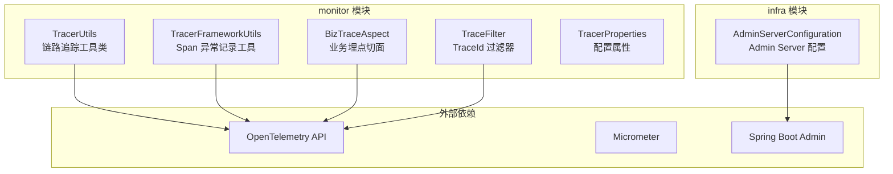
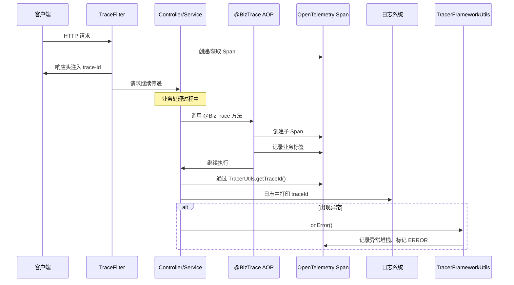
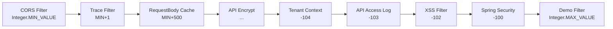
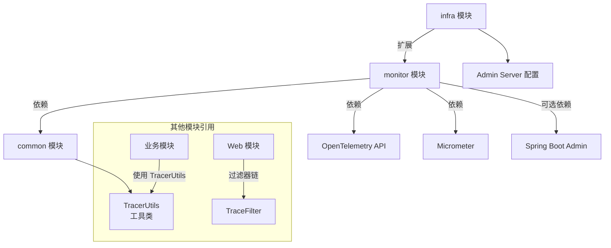

# 监控模块 (Monitor)

## 概述

监控模块（Monitor）是 Yudao 框架中负责**链路追踪（Tracing）** 和 **指标监控（Metrics）** 的核心模块。该模块基于业界标准的 **OpenTelemetry** 和 **Micrometer** 技术体系构建，提供分布式的链路追踪能力、业务埋点切面以及应用性能监控（APM）功能。

通过该模块，开发者可以：
- 在请求处理链路中获取唯一的 Trace ID（链路追踪编号），方便日志串联
- 通过 `@BizTrace` 注解实现业务级别的链路埋点
- 利用 Micrometer 将应用指标暴露给 Prometheus、Graphite 等监控系统
- 集成 Spring Boot Admin，实现应用健康状态的可视化管理

## 模块结构



## 核心组件说明

### 1. TracerUtils（链路追踪工具类）

**文件位置**: `yudao-framework/yudao-common/src/main/java/cn/iocoder/yudao/framework/common/util/monitor/TracerUtils.java`

该工具类提供了获取当前请求链路追踪编号（TraceId）的静态方法。基于 OpenTelemetry 实现，所有模块都可以通过它获取当前 Span 的 Trace ID，用于日志串联、异常排查等场景。

| 方法 | 描述 |
|------|------|
| `getTraceId()` | 获取当前链路的 Trace ID，如果不存在则返回空字符串 |

**典型用法**:
```java
// 记录日志时打印 TraceId
log.info("[操作] 开始处理业务逻辑, traceId={}", TracerUtils.getTraceId());
```

### 2. TracerFrameworkUtils（Span 异常记录工具）

**文件位置**: `yudao-framework/yudao-spring-boot-starter-monitor/src/main/java/cn/iocoder/yudao/framework/tracer/core/util/TracerFrameworkUtils.java`

提供将异常信息记录到 OpenTelemetry Span 中的工具方法，便于在 APM 系统中查看错误详情。

| 方法 | 描述 |
|------|------|
| `onError(Throwable, Span)` | 将异常堆栈、错误消息等记录到 Span 中，标记 Span 状态为 ERROR |

### 3. YudaoTracerAutoConfiguration（链路追踪自动配置）

**文件位置**: `yudao-framework/yudao-spring-boot-starter-monitor/src/main/java/cn/iocoder/yudao/framework/tracer/config/YudaoTracerAutoConfiguration.java`

条件激活：当 classpath 中存在 `io.opentelemetry.api.trace.Tracer` 和 `jakarta.servlet.Filter` 时自动生效。

通过 `yudao.tracer.enable=true`（默认启用）控制开关。

**主要 Bean**:
| Bean | 说明 |
|------|------|
| `Tracer` | OpenTelemetry 的 Tracer 实例，以 `spring.application.name` 为名称 |
| `BizTraceAspect` | 业务埋点切面，拦截带有 `@BizTrace` 注解的方法，自动创建 Span |
| `TraceFilter` | Servlet 过滤器，在 HTTP 响应头中注入 `trace-id` 字段 |

### 4. YudaoMetricsAutoConfiguration（指标监控自动配置）

**文件位置**: `yudao-framework/yudao-spring-boot-starter-monitor/src/main/java/cn/iocoder/yudao/framework/tracer/config/YudaoMetricsAutoConfiguration.java`

条件激活：当 classpath 中存在 `MeterRegistryCustomizer` 时自动生效。

通过 `yudao.metrics.enable=true`（默认启用）控制开关。

**功能**:
- 为所有 Micrometer 指标添加 `application` 标签（值为 `spring.application.name`）
- 支持将应用指标暴露给 Prometheus、Graphite、InfluxDB 等后端存储

### 5. TracerProperties（配置属性）

**文件位置**: `yudao-framework/yudao-spring-boot-starter-monitor/src/main/java/cn/iocoder/yudao/framework/tracer/config/TracerProperties.java`

绑定前缀为 `yudao.tracer` 的配置项。当前作为配置开关的占位符使用，可通过 `yudao.tracer.enable` 控制链路追踪是否启用。

### 6. AdminServerConfiguration（Admin Server 服务端配置）

**文件位置**: `yudao-module-infra/src/main/java/cn/iocoder/yudao/module/infra/framework/monitor/config/AdminServerConfiguration.java`

> 该组件位于 infra 模块，属于监控模块的扩展实现。详细文档可参考 [infra](infra.md)

条件激活：当 classpath 中存在 `de.codecentric.boot.admin.server.config.AdminServerProperties` 时自动生效。

**功能**:
- 启用 Spring Boot Admin Server
- 配置独立的用户认证体系（内存用户）
- 设置 Admin UI 的 SecurityFilterChain
- 通过 `spring.boot.admin.context-path` 配置访问路径

## 核心流程

### 链路追踪数据流



### 过滤器顺序

TraceFilter 在过滤器链中的优先级如下（值越小优先级越高）：



> 详细过滤器枚举定义见 [WebFilterOrderEnum](enums.md#WebFilterOrderEnum)（位于 `enums` 模块）

## 配置说明

### application.yml 配置示例

```yaml
spring:
  application:
    name: yudao-server

yudao:
  tracer:
    enable: true              # 是否启用链路追踪，默认 true
  metrics:
    enable: true              # 是否启用指标监控，默认 true

spring:
  boot:
    admin:
      context-path: /admin    # Admin Server 上下文路径
      client:
        username: admin       # Admin Server 登录用户名
        password: admin       # Admin Server 登录密码
```

### OpenTelemetry Agent 配置（推荐）

建议在生产环境中配合 OpenTelemetry Java Agent 使用：

```bash
java -javaagent:opentelemetry-javaagent.jar \
     -Dotel.service.name=yudao-server \
     -Dotel.exporter.otlp.endpoint=http://localhost:4317 \
     -jar yudao-server.jar
```

## 依赖关系



## 与相关模块的交互

| 模块 | 关系 | 说明 |
|------|------|------|
| [common](common.md) | 依赖 | TracerUtils 位于 common 模块中，供全系统使用 |
| [infra](infra.md) | 扩展 | AdminServerConfiguration 提供了 Spring Boot Admin 服务端能力 |
| [enums](enums.md) | 引用 | WebFilterOrderEnum 定义了 TraceFilter 的优先级 |
| [web](web.md) | 交互 | TraceFilter 是 Web 过滤器链的一部分 |

## 最佳实践

1. **日志中打印 TraceId**：在关键业务逻辑中调用 `TracerUtils.getTraceId()`，方便全链路追踪
2. **异常记录**：在自定义异常处理器中使用 `TracerFrameworkUtils.onError()` 将异常记录到 Span
3. **业务埋点**：使用 `@BizTrace` 注解标记关键业务方法，自动创建子 Span
4. **生产环境**：配合 OpenTelemetry Collector 和 Jaeger/Zipkin 实现分布式追踪
5. **指标监控**：使用 Micrometer 的 `@Timed` 等注解暴露自定义指标

## 常见问题

**Q: TraceId 无法获取？**
A: 请确保引入了 `opentelemetry-api` 依赖，并且请求经过了 TraceFilter 过滤器。

**Q: 如何禁用链路追踪？**
A: 配置 `yudao.tracer.enable=false` 即可关闭。
