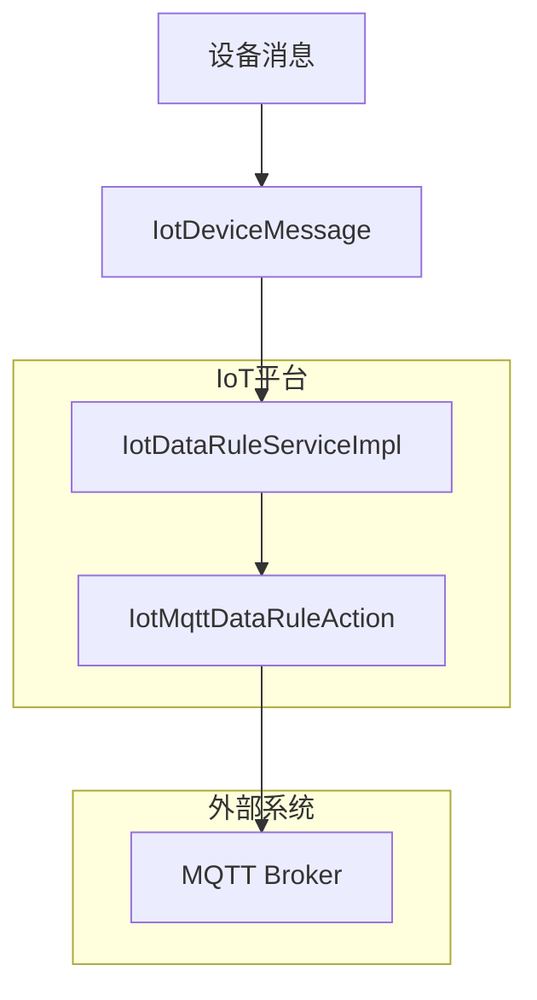
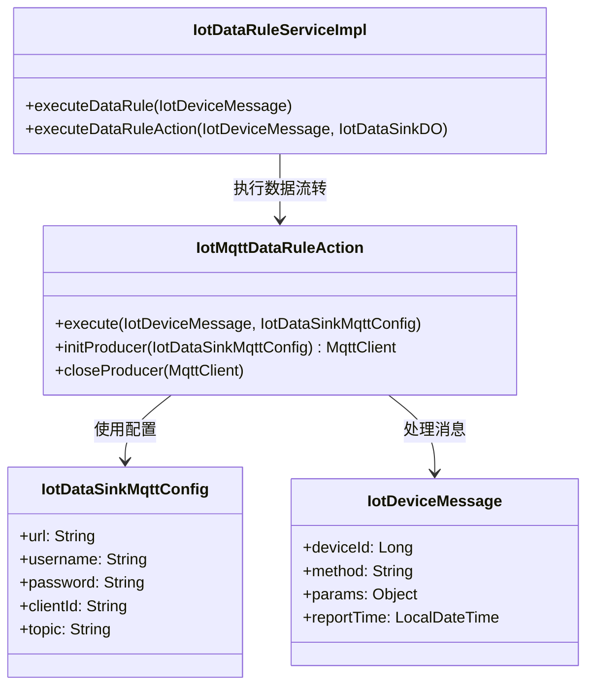
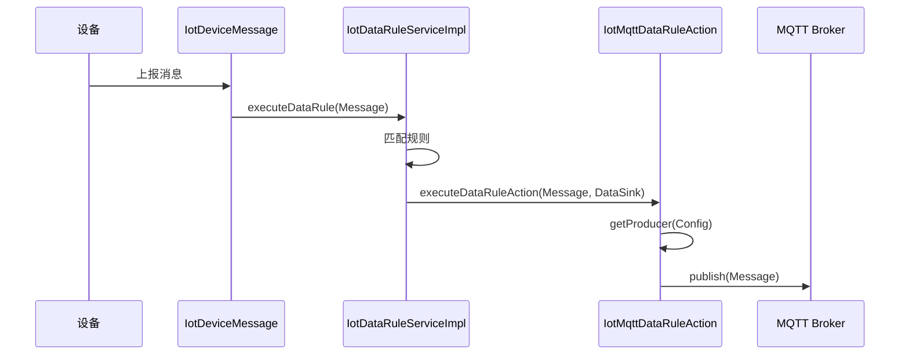

# MQTT 数据流转动作 (IotMqttDataRuleAction) 模块文档

## 模块概述

MQTT 数据流转动作 (`IotMqttDataRuleAction`) 是物联网(IoT)平台中的一个核心组件，用于将设备上报的消息通过 MQTT 协议发送到指定的 MQTT Broker。该组件实现了数据流转规则的执行逻辑，是 IoT 数据流转系统的重要组成部分之一。

### 主要功能

- 将设备消息通过 MQTT 协议发送到指定的 Broker
- 管理 MQTT 客户端的连接和生命周期
- 支持 MQTT 消息的 QoS 等级控制
- 实现连接状态检测和自动重连机制
- 缓存 MQTT 客户端以提高性能和资源利用率

### 核心特性

- **连接管理**: 自动管理 MQTT 客户端的连接和断开
- **消息可靠性**: 支持 QoS 1 级别的消息发送，确保消息至少被传递一次
- **资源优化**: 通过缓存机制减少频繁创建和销毁客户端的开销
- **错误处理**: 完善的错误处理和日志记录机制

## 架构设计

### 系统架构图



### 组件关系图



## 核心类说明

### 1. IotMqttDataRuleAction

MQTT 数据流转动作的核心实现类，继承自 `IotDataRuleCacheableAction` 抽象类，实现了具体的 MQTT 消息发送逻辑。

#### 主要方法

- `execute(IotDeviceMessage message, IotDataSinkMqttConfig config)`: 执行消息发送
- `initProducer(IotDataSinkMqttConfig config)`: 初始化 MQTT 客户端
- `closeProducer(MqttClient producer)`: 关闭 MQTT 客户端
- `buildConnectOptions(IotDataSinkMqttConfig config)`: 构建 MQTT 连接选项

#### 代码示例

```java
@ConditionalOnClass(name = "org.eclipse.paho.client.mqttv3.MqttClient")
@Component
@Slf4j
public class IotMqttDataRuleAction extends IotDataRuleCacheableAction<IotDataSinkMqttConfig, MqttClient> {
    
    private static final int DEFAULT_QOS = 1;
    
    @Override
    public Integer getType() {
        return IotDataSinkTypeEnum.MQTT.getType();
    }
    
    @Override
    public void execute(IotDeviceMessage message, IotDataSinkMqttConfig config) throws Exception {
        try {
            // 1. 获取或创建 MqttClient
            MqttClient mqttClient = getProducer(config);
            
            // 2.1 检查连接状态，如果断开则踢出缓存并重新创建
            if (!mqttClient.isConnected()) {
                log.warn("[execute][MQTT 连接已断开，重新创建客户端，服务器: {}]", config.getUrl());
                invalidateProducer(config);
                mqttClient = getProducer(config);
            }
            
            // 2.2 构建并发送消息
            MqttMessage mqttMessage = new MqttMessage(JsonUtils.toJsonString(message).getBytes(StandardCharsets.UTF_8));
            mqttMessage.setQos(DEFAULT_QOS);
            mqttClient.publish(config.getTopic(), mqttMessage);
            log.info("[execute][message({}) 发送成功，MQTT 服务器: {}，topic: {}]",
                    message.getId(), config.getUrl(), config.getTopic());
        } catch (Exception e) {
            log.error("[execute][message({}) 发送失败，MQTT 服务器: {}]",
                    message.getId(), config.getUrl(), e);
            throw e;
        }
    }
    
    @Override
    protected MqttClient initProducer(IotDataSinkMqttConfig config) throws Exception {
        // 1. 创建 MqttClient，使用内存持久化
        String clientId = config.getClientId() + "_" + System.currentTimeMillis();
        MqttClient mqttClient = new MqttClient(config.getUrl(), clientId, new MemoryPersistence());
        
        // 2. 连接到 MQTT Broker
        mqttClient.connect(buildConnectOptions(config));
        log.info("[initProducer][MQTT 客户端创建并连接成功，服务器: {}，clientId: {}]",
                config.getUrl(), clientId);
        return mqttClient;
    }
    
    @Override
    protected void closeProducer(MqttClient producer) throws Exception {
        if (producer.isConnected()) {
            producer.disconnect();
        }
        producer.close();
    }
    
    private MqttConnectOptions buildConnectOptions(IotDataSinkMqttConfig config) {
        MqttConnectOptions options = new MqttConnectOptions();
        options.setCleanSession(true);
        options.setConnectionTimeout(10);
        options.setKeepAliveInterval(20);
        if (config.getUsername() != null) {
            options.setUserName(config.getUsername());
        }
        if (config.getPassword() != null) {
            options.setPassword(config.getPassword().toCharArray());
        }
        return options;
    }
}
```

### 2. IotDataRuleCacheableAction

抽象基类，提供了生产者缓存和管理的基础功能。

#### 主要特性

- **缓存管理**: 使用 Guava Cache 缓存 MQTT 客户端，避免频繁创建和销毁
- **连接状态检测**: 在执行消息发送前检查连接状态
- **自动重连**: 当检测到连接断开时，自动重新创建客户端
- **资源清理**: 通过移除监听器自动关闭断开的连接

#### 缓存机制

```java
private final LoadingCache<Config, Producer> PRODUCER_CACHE = CacheBuilder.newBuilder()
    .expireAfterAccess(Duration.ofMinutes(30)) // 30 分钟未访问就提前过期
    .removalListener((RemovalListener<Config, Producer>) notification -> {
        Producer producer = notification.getValue();
        try {
            closeProducer(producer);
            log.info("[PRODUCER_CACHE][配置({}) 对应的 producer 已关闭]", notification.getKey());
        } catch (Exception e) {
            log.error("[PRODUCER_CACHE][配置({}) 对应的 producer 关闭失败]", notification.getKey(), e);
        }
    })
    .build(new CacheLoader<Config, Producer>() {
        @Override
        public Producer load(Config config) throws Exception {
            try {
                Producer producer = initProducer(config);
                log.info("[PRODUCER_CACHE][配置({}) 对应的 producer 已创建并启动]", config);
                return producer;
            } catch (Exception e) {
                log.error("[PRODUCER_CACHE][配置({}) 对应的 producer 创建启动失败]", config, e);
                throw e;
            }
        }
    });
```

### 3. IotDataSinkMqttConfig

MQTT 数据流转目的的配置类，包含了连接 MQTT Broker 所需的所有参数。

#### 配置字段

```java
@Data
public class IotDataSinkMqttConfig extends IotAbstractDataSinkConfig {
    
    /**
     * MQTT 服务器地址
     */
    private String url;
    
    /**
     * 用户名
     */
    private String username;
    
    /**
     * 密码
     */
    private String password;
    
    /**
     * 客户端编号
     */
    private String clientId;
    
    /**
     * 主题
     */
    private String topic;
}
```

### 4. IotDataRuleServiceImpl

数据流转规则服务的核心实现，负责匹配规则并执行数据流转动作。

#### 主要功能

- 规则匹配: 根据设备消息匹配对应的数据流转规则
- 规则执行: 执行匹配到的规则，将消息发送到指定的数据目的
- 缓存管理: 缓存规则列表以提高性能

#### 执行流程



## 数据流转流程

### 完整流程图

```mermaid
flowchart TD
    A[设备上报消息] --> B{消息类型判断}
    B -->|属性上报| C[提取属性标识符集合]
    B -->|其他消息| D[提取单一标识符]
    C]
    C
    C --> E[匹配数据流转规则] --> F[执行匹配到的规则]
    F --> G[获取数据目的配置]
    G --> H{数据目的状态检查}
    H -->|禁用| I[跳过执行]
    H -->|启用| J[执行数据流转动作]
    J --> K[IotMqttDataRuleAction.execute()]
    K --> L[获取或创建 MQTT 客户端]
    L --> M{连接状态检查}
    M -->|断开| N[重新创建客户端]
    M -->|连接| O[发送 MQTT 消息]
    O --> P[记录日志]
    N --> O
```

### 详细步骤说明

1. **消息接收**: 设备通过 IoT Gateway 上报消息到 IoT Biz 服务
2. **规则匹配**: 
   - 对于属性上报消息，提取所有属性标识符，分别匹配规则
   - 对于其他消息，提取单一标识符匹配规则
3. **规则执行**: 执行匹配到的规则，获取数据目的配置
4. **状态检查**: 检查数据目的状态，如果禁用则跳过执行
5. **动作执行**: 执行具体的数据流转动作（MQTT 消息发送）
6. **连接管理**: 
   - 获取或创建 MQTT 客户端
   - 检查连接状态，如果断开则重新创建
7. **消息发送**: 将消息发送到指定的 MQTT Broker
8. **日志记录**: 记录执行结果和错误信息

## 配置说明

### MQTT 连接配置

#### 连接参数

| 参数 | 类型 | 必需 | 说明 |
|------|------|------|------|
| url | String | 是 | MQTT Broker 地址，格式: `tcp://host:port` 或 `ssl://host:port` |
| username | String | 否 | 连接用户名 |
| password | String | 否 | 连接密码 |
| clientId | String | 是 | 客户端 ID，建议包含时间戳后缀避免冲突 |
| topic | String | 是 | 发布消息的主题 |

#### 连接选项

- **Clean Session**: 设置为 `true`，每次连接时清除会话状态
- **Connection Timeout**: 10 秒，连接超时时间
- **Keep Alive Interval**: 20 秒，心跳间隔
- **QoS Level**: 1，消息质量等级（至少一次）

### 示例配置

```json
{
  "url": "tcp://mqtt.example.com:1883",
  "username": "iot_user",
  "password": "iot_password",
  "clientId": "iot_client_123",
  "topic": "iot/device/messages"
}
```

## 使用示例

### 1. 创建数据流转规则

```java
// 创建数据流转规则请求
IotDataRuleSaveReqVO reqVO = new IotDataRuleSaveReqVO();
reqVO.setName("设备消息转发规则");
reqVO.setStatus(CommonStatusEnum.ENABLE.getStatus());

// 设置数据源配置
List<IotDataRuleDO.SourceConfig> sourceConfigs = new ArrayList<>();
IotDataRuleDO.SourceConfig sourceConfig = new IotDataRuleDO.SourceConfig();
sourceConfig.setProductId(1L);
sourceConfig.setDeviceId(1001L);
sourceConfig.setMethod("thing.property.post");
sourceConfigs.add(sourceConfig);
reqVO.setSourceConfigs(sourceConfigs);

// 设置数据目的 ID
reqVO.setSinkIds(Collections.singletonList(1L));

// 调用服务创建规则
iotDataRuleService.createDataRule(reqVO);
```

### 2. 创建 MQTT 数据目的

```java
// 创建 MQTT 数据目的请求
IotDataSinkSaveReqVO reqVO = new IotDataSinkSaveReqVO();
reqVO.setName("MQTT 转发目的");
reqVO.setType(IotDataSinkTypeEnum.MQTT.getType());

// 设置 MQTT 配置
IotDataSinkMqttConfig mqttConfig = new IotDataSinkMqttConfig();
mqttConfig.setUrl("tcp://mqtt.example.com:1883");
mqttConfig.setUsername("iot_user");
mqttConfig.setPassword("iot_password");
mqttConfig.setClientId("iot_client_" + System.currentTimeMillis());
mqttConfig.setTopic("iot/device/messages");

reqVO.setConfig(mqttConfig);

// 调用服务创建数据目的
iotDataSinkService.createDataSink(reqVO);
```

### 3. 设备消息处理

```java
// 创建设备消息
IotDeviceMessage message = IotDeviceMessage.requestOf(
    1001L,  // 设备 ID
    1L,      // 租户 ID
    "server1", // 服务标识
    "thing.property.post", // 消息方法
    Collections.singletonMap("temperature", 25.5) // 消息参数
);

// 执行数据流转
iotDataRuleService.executeDataRule(message);
```

## 错误处理和重试机制

### 错误处理

- **连接异常**: 当 MQTT 连接断开时，自动重新创建客户端
- **发送异常**: 记录错误日志，但不影响其他规则的执行
- **配置异常**: 在规则创建时进行配置校验，避免无效配置

### 重试机制

- **自动重连**: 通过 `IotDataRuleCacheableAction` 的缓存机制自动重连
- **手动重试**: 当检测到连接断开时，手动调用 `invalidateProducer()` 使缓存失效，下次调用时自动重新创建

### 日志记录

- 连接创建和关闭: 记录客户端创建、连接、断开和关闭的详细信息
- 消息发送: 记录消息发送成功和失败的信息
- 错误处理: 记录所有异常信息，便于问题排查

## 性能优化

### 连接池管理

- **缓存策略**: 使用 Guava Cache 缓存 MQTT 客户端，避免频繁创建和销毁
- **连接复用**: 同一配置的客户端在 30 分钟内未访问时自动过期
- **自动清理**: 通过移除监听器自动关闭断开的连接

### 资源优化

- **QoS 控制**: 使用 QoS 1 级别，平衡消息可靠性和性能
- **心跳机制**: 设置合理的心跳间隔（20 秒）保持连接活跃
- **连接超时**: 设置合理的连接超时时间（10 秒）避免长时间阻塞

## 安全考虑

### 连接安全

- **认证支持**: 支持用户名/密码认证
- **SSL/TLS**: 支持通过 `ssl://` 协议连接，确保数据传输安全
- **客户端 ID**: 建议包含时间戳后缀避免冲突

### 消息安全

- **主题隔离**: 使用不同的主题隔离不同类型的消息
- **消息格式**: 使用 JSON 格式序列化消息，便于解析和处理
- **错误处理**: 对发送失败的消息进行详细的错误记录

## 监控和日志

### 监控指标

- **连接状态**: 监控 MQTT 客户端的连接状态
- **消息发送**: 监控消息发送成功率和失败率
- **错误日志**: 记录所有异常信息

### 日志格式

```
[execute][message({messageId}) 发送成功，MQTT 服务器: {url}，topic: {topic}]
[execute][message({messageId}) 发送失败，MQTT 服务器: {url}]
[initProducer][MQTT 客户端创建并连接成功，服务器: {url}，clientId: {clientId}]
[PRODUCER_CACHE][配置({config}) 对应的 producer 已关闭]
```

## 依赖关系

### 直接依赖

- **Paho MQTT Client**: `org.eclipse.paho:org.eclipse.paho.client.mqttv3`
- **Guava Cache**: `com.google.guava:guava`
- **Spring Framework**: `org.springframework.boot:spring-boot-starter`

### 间接依赖

- **IoT Core**: 提供设备消息模型和基础设施
- **IoT Gateway**: 设备消息接收和转发
- **Redis**: 缓存管理

## API 接口

### IotDataRuleService

| 方法 | 描述 |
|------|------|
| `createDataRule(IotDataRuleSaveReqVO)` | 创建数据流转规则 |
| `updateDataRule(IotDataRuleSaveReqVO)` | 更新数据流转规则 |
| `deleteDataRule(Long)` | 删除数据流转规则 |
| `getDataRule(Long)` | 获取数据流转规则 |
| `getDataRulePage(IotDataRulePageReqVO)` | 分页查询数据流转规则 |
| `executeDataRule(IotDeviceMessage)` | 执行数据流转规则 |

### IotDataSinkService

| 方法 | 描述 |
|------|------|
| `createDataSink(IotDataSinkSaveReqVO)` | 创建数据流转目的 |
| `updateDataSink(IotDataSinkSaveReqVO)` | 更新数据流转目的 |
| `deleteDataSink(Long)` | 删除数据流转目的 |
| `getDataSink(Long)` | 获取数据流转目的 |
| `getDataSinkPage(IotDataSinkPageReqVO)` | 分页查询数据流转目的 |

## 最佳实践

### 1. 客户端 ID 命名

建议在客户端 ID 中包含时间戳后缀，避免多个规则指向同一 Broker 时 clientId 冲突：

```java
String clientId = config.getClientId() + "_" + System.currentTimeMillis();
```

### 2. QoS 级别选择

根据业务需求选择合适的 QoS 级别：
- **QoS 0**: 最多一次，适合不重要的消息
- **QoS 1**: 至少一次，适合大多数场景
- **QoS 2**: 恰好一次，适合对消息可靠性要求极高的场景

### 3. 连接参数优化

根据网络环境和业务需求调整连接参数：
- **Connection Timeout**: 网络延迟较高时适当增加
- **Keep Alive Interval**: 网络不稳定时适当减小
- **Clean Session**: 根据业务需求选择是否清除会话

### 4. 错误处理

实现完善的错误处理机制：
- 记录详细的错误日志
- 实现自动重连机制
- 设置合理的重试策略

### 5. 监控和告警

建立完善的监控和告警机制：
- 监控连接状态和消息发送成功率
- 设置合理的告警阈值
- 及时处理异常情况

## 常见问题和解决方案

### 1. 连接断开问题

**问题**: MQTT 连接频繁断开

**解决方案**:
- 检查网络连接稳定性
- 调整心跳间隔（Keep Alive Interval）
- 检查 Broker 服务器状态
- 增加连接超时时间（Connection Timeout）

### 2. 消息发送失败

**问题**: 消息发送失败，但没有异常抛出

**解决方案**:
- 检查主题（topic）是否正确
- 验证消息格式是否正确
- 检查 Broker 服务器是否正常运行
- 检查认证信息是否正确

### 3. 客户端 ID 冲突

**问题**: 多个规则使用相同的 clientId 导致连接冲突

**解决方案**:
- 在 clientId 中包含时间戳后缀
- 使用唯一的标识符作为 clientId
- 检查配置是否正确

### 4. 性能问题

**问题**: MQTT 客户端创建和销毁频繁，影响性能

**解决方案**:
- 使用缓存机制复用客户端
- 调整缓存过期时间
- 检查规则配置是否合理

## 扩展性考虑

### 1. 协议扩展

当前实现了 MQTT 协议，可以很容易地扩展支持其他协议：
- 实现新的 `IotDataRuleAction` 接口
- 添加新的数据目的类型
- 扩展配置类

### 2. 功能扩展

可以扩展以下功能：
- **消息转换**: 在发送前对消息进行转换或处理
- **消息过滤**: 根据条件过滤消息
- **批量发送**: 支持批量发送消息
- **消息压缩**: 支持消息压缩以减少传输量

### 3. 性能优化

可以进一步优化性能：
- **连接池**: 实现更高级的连接池管理
- **异步发送**: 支持异步消息发送
- **批量处理**: 支持批量处理消息
- **本地缓存**: 实现更智能的本地缓存策略

## 总结

MQTT 数据流转动作 (`IotMqttDataRuleAction`) 是 IoT 平台中一个重要的组件，它实现了将设备消息通过 MQTT 协议发送到指定 Broker 的功能。通过使用缓存机制、连接状态检测和自动重连等技术，该组件提供了高可靠性和高性能的消息传输能力。

在实际应用中，建议根据业务需求合理配置连接参数，实现完善的错误处理和监控机制，并遵循最佳实践以确保系统的稳定性和可靠性。