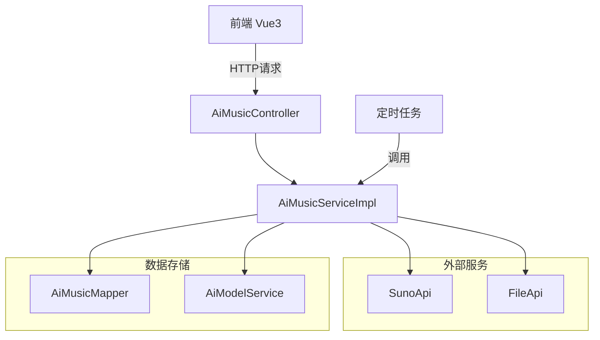
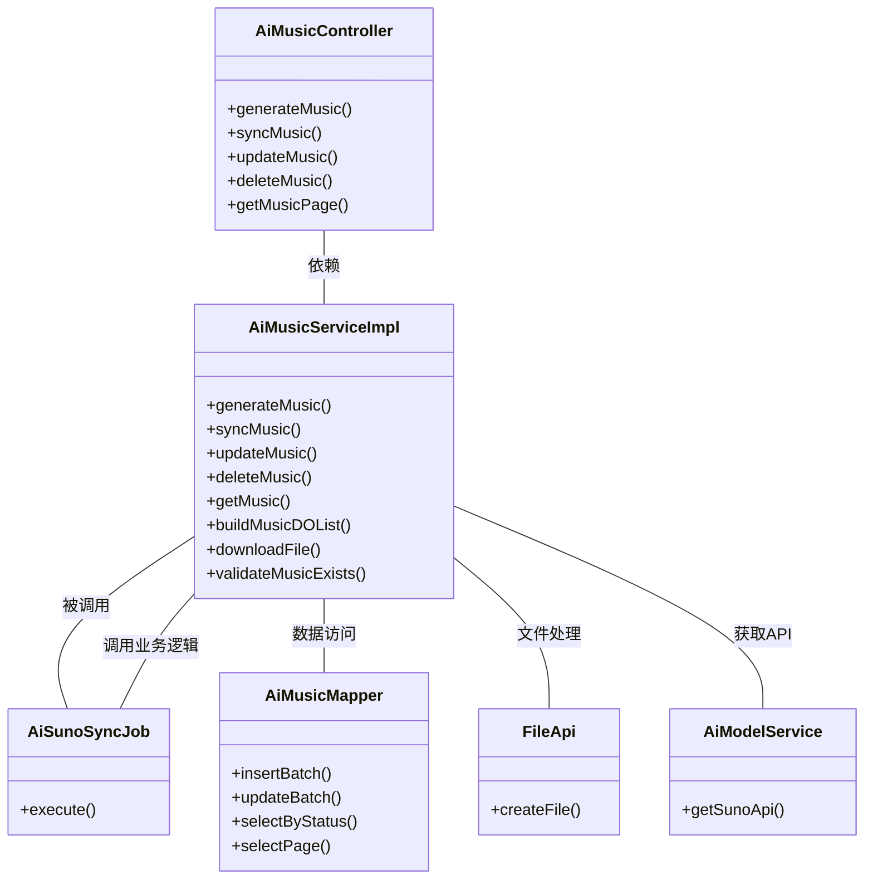
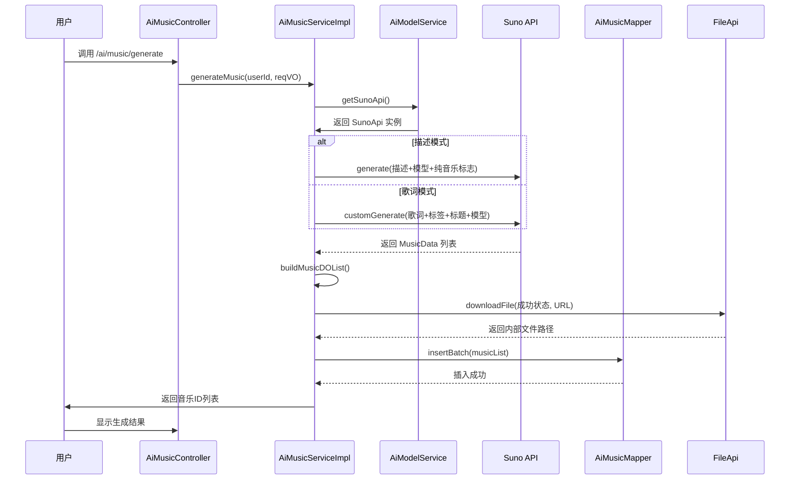
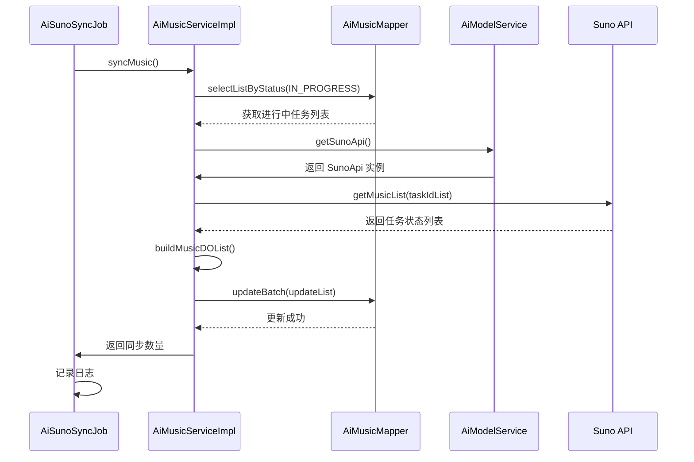

# AI 音乐模块 (music_3) 文档

## 1. 概述

AI 音乐模块是 Yudao 框架中 AI 功能模块的重要组成部分，主要提供基于 Suno API 的 AI 音乐生成功能。该模块支持用户通过描述或歌词生成音乐，并管理生成的音乐资源，包括音乐的查询、更新、删除等操作。

### 核心功能
- **音乐生成**：支持两种生成模式（描述模式和歌词模式），调用 Suno API 生成 AI 音乐
- **音乐同步**：定时任务同步 Suno 平台上的音乐生成状态和结果
- **音乐管理**：对生成的音乐进行增删改查操作，支持分页查询
- **文件存储**：将生成的音频、视频、图片文件上传至文件服务器

## 2. 架构设计

### 2.1 系统架构图

### 2.2 组件关系图

## 3. 核心组件说明

### 3.1 AiMusicController - 控制器层

负责接收前端请求，调用 Service 层处理业务逻辑，返回响应结果。

**主要接口：**

| 接口路径 | 方法 | 描述 | 权限要求 |
|---------|------|------|---------|
| `/ai/music/generate` | POST | 生成音乐 | 无 |
| `/ai/music/my-page` | GET | 获取我的音乐分页 | 无 |
| `/ai/music/get-my` | GET | 获取我的音乐 | 无 |
| `/ai/music/update-my` | PUT | 修改我的音乐（仅标题） | 无 |
| `/ai/music/delete-my` | DELETE | 删除我的音乐 | 无 |
| `/ai/music/page` | GET | 获取音乐分页 | `ai:music:query` |
| `/ai/music/update` | PUT | 更新音乐 | `ai:music:update` |
| `/ai/music/delete` | DELETE | 删除音乐 | `ai:music:delete` |

### 3.2 AiMusicServiceImpl - 业务服务层

实现音乐生成的核心业务逻辑，包括调用 Suno API、数据处理、文件下载等。

**核心方法：**

1. **`generateMusic(Long userId, AiSunoGenerateReqVO reqVO)`**
   - 功能：根据用户输入生成音乐
   - 流程：
     1. 根据生成模式（描述/歌词）构造 Suno 请求参数
     2. 调用 Suno API 生成音乐
     3. 将生成的音乐数据转换为 AiMusicDO 对象
     4. 保存到数据库
     5. 返回音乐 ID 列表

2. **`syncMusic()`**
   - 功能：同步 Suno 平台上正在进行的音乐任务状态
   - 流程：
     1. 查询状态为 IN_PROGRESS 的音乐记录
     2. 分批调用 Suno API 获取任务状态
     3. 更新数据库中的音乐信息（状态、URL、错误信息等）
     4. 返回同步的任务数量

3. **`updateMusic(AiMusicUpdateReqVO updateReqVO)`**
   - 功能：更新音乐的发布状态
   - 校验音乐是否存在后更新 publicStatus 字段

4. **`updateMyMusic(AiMusicUpdateMyReqVO updateReqVO, Long userId)`**
   - 功能：用户更新自己的音乐标题
   - 校验归属权后更新 title 字段

5. **`buildMusicDOList(List<SunoApi.MusicData> musicList)`**
   - 功能：将 Suno API 返回的音乐数据转换为 AiMusicDO 实体
   - 处理状态映射、文件下载等操作

6. **`downloadFile(Integer status, String url)`**
   - 功能：当音乐生成成功后，下载音频/视频/图片文件到本地文件服务器
   - 失败时保留原始 URL

### 3.3 AiSunoSyncJob - 定时同步任务

使用 Quartz 定时任务，定期调用 `AiMusicService.syncMusic()` 方法同步 Suno 平台的音乐生成状态。

**执行方式：** 通过 JobHandler 接口实现，可配置 Cron 表达式定时触发。

### 3.4 AiMusicMapper - 数据访问层

提供对 AiMusicDO 数据的 CRUD 操作：

- `insertBatch(List<AiMusicDO>)`：批量插入音乐记录
- `updateBatch(List<AiMusicDO>)`：批量更新音乐记录
- `selectByStatus(Integer status)`：按状态查询音乐记录
- `selectPage(AiMusicPageReqVO)`：分页查询音乐记录
- `selectPageByMy(AiMusicPageReqVO, Long userId)`：用户专属分页查询

### 3.5 AiMusicDO - 数据对象

存储音乐信息的数据库实体，包含以下关键字段：

| 字段名 | 类型 | 描述 |
|--------|------|------|
| id | Long | 主键 |
| userId | Long | 用户ID |
| taskId | String | Suno任务ID |
| platform | String | 平台名称（如 Suno） |
| model | String | 模型名称 |
| generateMode | Integer | 生成模式（1-描述，2-歌词） |
| title | String | 音乐标题 |
| description | String | 描述词 |
| prompt | String | 提示词 |
| lyric | String | 歌词 |
| tags | List<String> | 标签列表 |
| duration | Double | 时长（秒） |
| status | Integer | 状态（进行中/成功/失败） |
| errorMessage | String | 错误信息 |
| audioUrl | String | 音频URL |
| videoUrl | String | 视频URL |
| imageUrl | String | 图片URL |
| publicStatus | Boolean | 是否发布 |
| createTime | LocalDateTime | 创建时间 |

### 3.6 VO（视图对象）

#### AiSunoGenerateReqVO - 音乐生成请求

| 字段 | 类型 | 必填 | 描述 |
|------|------|------|------|
| platform | String | 是 | 平台名称 |
| generateMode | Integer | 是 | 生成模式（1-描述，2-歌词） |
| prompt | String | 是 | 提示词/歌词 |
| makeInstrumental | Boolean | 否 | 是否为纯音乐 |
| model | String | 是 | 模型名称 |
| tags | List<String> | 否 | 风格标签 |
| title | String | 否 | 音乐标题 |

#### AiMusicRespVO - 音乐响应

包含 AiMusicDO 的所有字段，用于前端展示。

#### AiMusicPageReqVO - 分页查询请求

支持按用户ID、标题、状态、生成模式、发布时间、创建时间范围等条件查询。

#### AiMusicUpdateReqVO - 更新请求

仅包含 `id` 和 `publicStatus` 字段，用于修改音乐的发布状态。

#### AiMusicUpdateMyReqVO - 我的音乐更新请求

包含 `id` 和 `title` 字段，用于用户修改自己音乐的标题。

## 4. 数据流程图

### 4.1 音乐生成流程

### 4.2 音乐同步流程

## 5. 枚举定义

### 5.1 AiMusicGenerateModeEnum - 生成模式

| 常量 | 值 | 描述 |
|------|-----|------|
| DESCRIPTION | 1 | 描述模式：根据文本描述生成音乐 |
| LYRIC | 2 | 歌词模式：根据歌词生成音乐 |

### 5.2 AiMusicStatusEnum - 音乐状态

| 常量 | 值 | 描述 |
|------|-----|------|
| IN_PROGRESS | 10 | 进行中 |
| SUCCESS | 20 | 成功 |
| FAIL | 30 | 失败 |

## 6. 依赖关系

### 6.1 模块依赖

- **yudao-module-ai**（当前模块）依赖于：
  - yudao-framework-common：基础工具类、分页结果等
  - yudao-module-ai：模型服务（AiModelService）
  - yudao-module-infra：文件服务（FileApi）
  - yudao-module-quartz：定时任务支持

### 6.2 外部服务依赖

- **Suno API**：AI 音乐生成服务，通过 AiModelService 获取实例
- **文件存储服务**：用于保存生成的音频、视频、图片文件

## 7. 异常处理

模块中使用统一的异常处理方式：

- `MUSIC_NOT_EXISTS`：音乐不存在时抛出
- `IMAGE_NOT_EXISTS`：图片不存在时抛出（在 deleteMusicMy 方法中使用）
- 所有 Service 方法均使用 `@Transactional` 注解保证事务一致性

## 8. 安全控制

- **权限控制**：管理后台接口使用 `@PreAuthorize` 注解进行权限校验
  - `ai:music:query`：查询权限
  - `ai:music:update`：更新权限
  - `ai:music:delete`：删除权限
- **归属校验**：用户只能操作自己的音乐（deleteMusicMy、updateMyMusic 方法中校验 userId）

## 9. 前端对接

前端 API 文件位置：`yudao-ui/yudao-ui-admin-vue3/src/api/ai/music/index.ts`

**对接的 VO：**
- `MusicVO`：音乐响应对象
- `AiSunoGenerateReqVO`：音乐生成请求参数

## 10. 扩展点

1. **多平台支持**：当前仅支持 Suno 平台，可通过 AiModelService 扩展其他 AI 音乐平台
2. **生成模式扩展**：可通过 AiMusicGenerateModeEnum 扩展更多生成模式
3. **文件存储扩展**：通过 FileApi 接口可扩展不同的文件存储方案（OSS、MinIO 等）

## 11. 参考文档

- [AI 模块整体架构](ai.md)
- [模型管理服务](model.md)
- [文件存储服务](infra_file.md)
- [定时任务框架](quartz.md)
