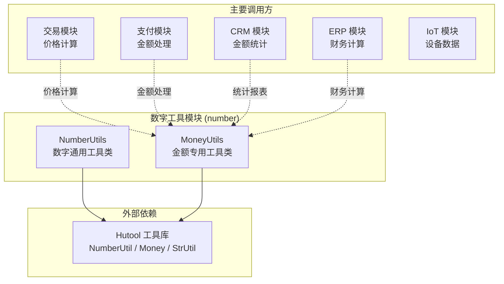
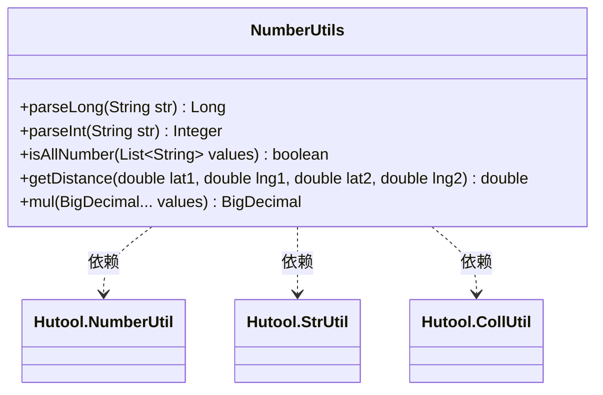
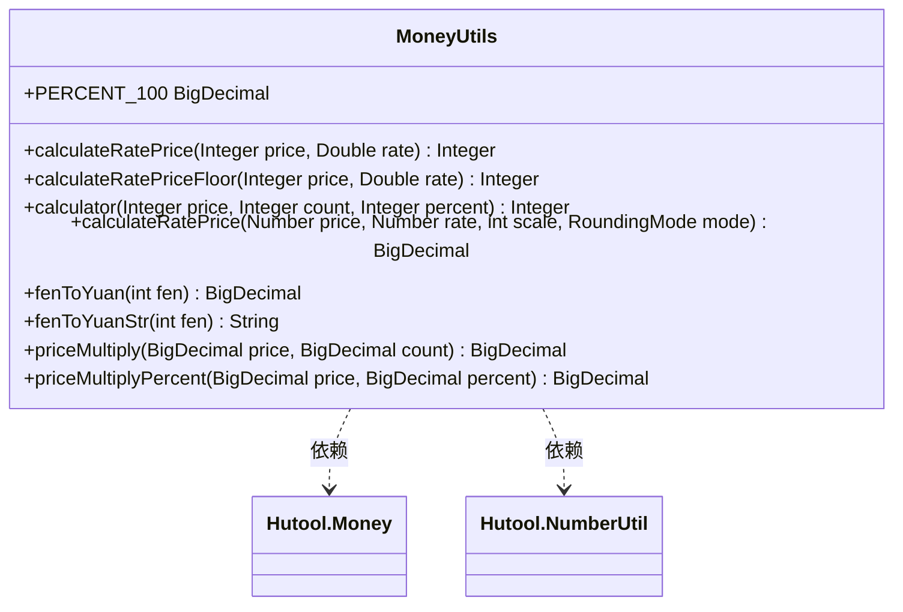
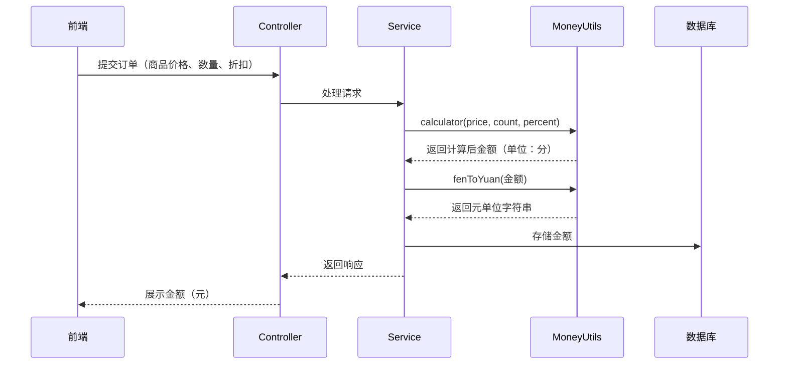
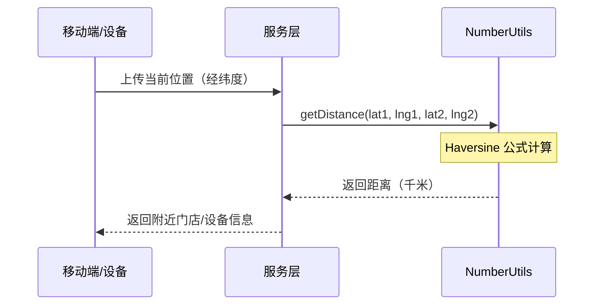

# 数字工具模块 (number)

## 概述

数字工具模块 (`number`) 是 Yudao 框架中负责数字处理与金额计算的通用工具模块。它提供了对 `Long`、`Integer` 类型的解析、数字有效性校验、经纬度距离计算、精确乘法运算以及金额的百分比计算、单位换算（分转元）等核心能力。

该模块是框架基础工具类的一部分，被**业务模块**（如交易、支付、CRM、ERP 等）广泛依赖，用于处理价格计算、金额格式化、地理距离测算等场景。

---

## 模块架构



---

## 核心组件

### 1. NumberUtils —— 数字通用工具类

**文件：** `NumberUtils.java`

#### 类图



#### 方法说明

| 方法 | 返回类型 | 说明 |
|------|----------|------|
| `parseLong(String)` | `Long` | 安全地将字符串解析为 `Long`，空字符串返回 `null` |
| `parseInt(String)` | `Integer` | 安全地将字符串解析为 `Integer`，空字符串返回 `null` |
| `isAllNumber(List<String>)` | `boolean` | 判断字符串列表中的所有元素是否均为合法数字 |
| `getDistance(lat1, lng1, lat2, lng2)` | `double` | 通过经纬度计算地球上两点之间的距离（单位：千米），基于 Haversine 公式 |
| `mul(BigDecimal...)` | `BigDecimal` | 提供精确的乘法运算，与 Hutool 的区别是：若任一参数为 `null` 则返回 `null` |

#### 使用场景

- **`parseLong` / `parseInt`**：用于从请求参数或配置项中安全提取数值，避免 `NumberFormatException`
- **`isAllNumber`**：批量校验输入参数是否为数字，常用于数据导入时的字段校验
- **`getDistance`**：地理位置服务，如计算用户与门店之间的距离、IoT 设备位置定位
- **`mul`**：需要避免 `null` 传播的精确乘法场景（金融计算中需严格控制 `null` 值）

---

### 2. MoneyUtils —— 金额专用工具类

**文件：** `MoneyUtils.java`

#### 类图



#### 方法说明

| 方法 | 返回类型 | 说明 |
|------|----------|------|
| `calculateRatePrice(Integer, Double)` | `Integer` | 计算百分比金额（四舍五入），例如 `价格 × 税率百分比 ÷ 100` |
| `calculateRatePriceFloor(Integer, Double)` | `Integer` | 计算百分比金额（向下取整），适用于优惠分摊等需舍弃零头的场景 |
| `calculator(Integer, Integer, Integer)` | `Integer` | 计算商品总价：`price × count × (percent / 100)`，`percent` 为折扣分（如 60.2% 传入 6020） |
| `calculateRatePrice(Number, Number, int, RoundingMode)` | `BigDecimal` | 通用的百分比金额计算，支持自定义精度和舍入模式 |
| `fenToYuan(int)` | `BigDecimal` | 分转元（返回 `BigDecimal`），如 `1分 → 0.01` 元 |
| `fenToYuanStr(int)` | `String` | 分转元（返回字符串），如 `1分 → "0.01"` |
| `priceMultiply(BigDecimal, BigDecimal)` | `BigDecimal` | 金额相乘，保留 2 位小数，四舍五入 |
| `priceMultiplyPercent(BigDecimal, BigDecimal)` | `BigDecimal` | 金额乘以百分比（除以 100），保留 2 位小数，四舍五入 |

#### 使用场景

- **价格计算**：在交易订单中计算商品总价、优惠分摊、税费计算
- **金额格式化**：将数据库存储的"分"单位金额转为前端展示的"元"单位
- **折扣计算**：秒杀、拼团、优惠券等营销活动的折扣金额计算
- **财务报表**：ERP 系统的财务模块中对金额进行精确乘除运算

---

## 数据流图

### 金额处理流程



### 地理距离计算流程



---

## 依赖关系矩阵

| 工具方法 | 主要依赖 | 可能调用的模块 |
|----------|----------|---------------|
| `NumberUtils.parseLong` | Hutool `StrUtil` | system、infra、所有模块 |
| `NumberUtils.parseInt` | Hutool `StrUtil` | 所有模块 |
| `NumberUtils.isAllNumber` | Hutool `CollUtil`、`NumberUtil` | 数据导入、批量校验 |
| `NumberUtils.getDistance` | `Math` | CRM（门店距离）、IoT（设备定位） |
| `NumberUtils.mul` | Hutool `NumberUtil` | 财务计算 |
| `MoneyUtils.calculateRatePrice` | Hutool `NumberUtil` | trade（交易价格）、promotion（营销） |
| `MoneyUtils.calculateRatePriceFloor` | Hutool `NumberUtil` | trade（优惠分摊） |
| `MoneyUtils.calculator` | Hutool `NumberUtil` | trade（商品总价） |
| `MoneyUtils.fenToYuan` | Hutool `Money` | pay（支付金额展示）、trade（订单金额） |
| `MoneyUtils.priceMultiply` | - | trade（金额相乘） |
| `MoneyUtils.priceMultiplyPercent` | - | trade（百分比金额） |

---

## 与其他模块的关联

本模块作为框架的基础工具模块，被多个业务模块引用：

| 相关模块 | 关联文件/链接 | 说明 |
|----------|--------------|------|
| [交易模块](trade.md) | `MoneyUtils` 用于订单价格计算、优惠分摊 | 订单金额计算 |
| [支付模块](pay.md) | `fenToYuan` / `fenToYuanStr` 用于金额展示 | 金额单位转换 |
| [CRM 模块](crm.md) | `getDistance` 用于门店距离计算 | 地理位置服务 |
| [ERP 模块](erp.md) | `mul`、`calculateRatePrice` 用于财务计算 | 精确财务运算 |
| [通用工具模块](util.md) | Hutool 工具库 | 底层依赖 |
| [数据校验模块](validation.md) | `isAllNumber` 用于批量数字校验 | 数据导入校验 |

> **提示：** 本模块不涉及任何数据库或缓存操作，为纯计算工具类，可在任何 Java 环境中直接使用。

---

## 使用示例

### 1. 安全字符串解析

```java
// 从请求参数中安全获取数值
String param = request.getParameter("userId");
Long userId = NumberUtils.parseLong(param); // 若 param 为空或 null，返回 null 而非异常

// 批量校验数字
List<String> values = Arrays.asList("100", "200", "abc");
boolean allNumber = NumberUtils.isAllNumber(values); // false
```

### 2. 金额计算

```java
// 计算商品总价：单价 100 元（10000 分），数量 2，折扣 80%
Integer total = MoneyUtils.calculator(10000, 2, 8000); // 16000 分 = 160 元

// 分转元展示
String yuan = MoneyUtils.fenToYuanStr(16000); // "160.00"

// 百分比金额计算（四舍五入）
Integer tax = MoneyUtils.calculateRatePrice(10000, 13.0); // 1300 分 = 13 元（13% 税率）

// 精确金额相乘
BigDecimal result = MoneyUtils.priceMultiply(new BigDecimal("99.99"), new BigDecimal("3"));
// 结果: 299.97
```

### 3. 地理距离计算

```java
// 计算北京到上海的距离
double distance = NumberUtils.getDistance(39.9042, 116.4074, 31.2304, 121.4737);
// 结果约为 1068.23 千米
```
