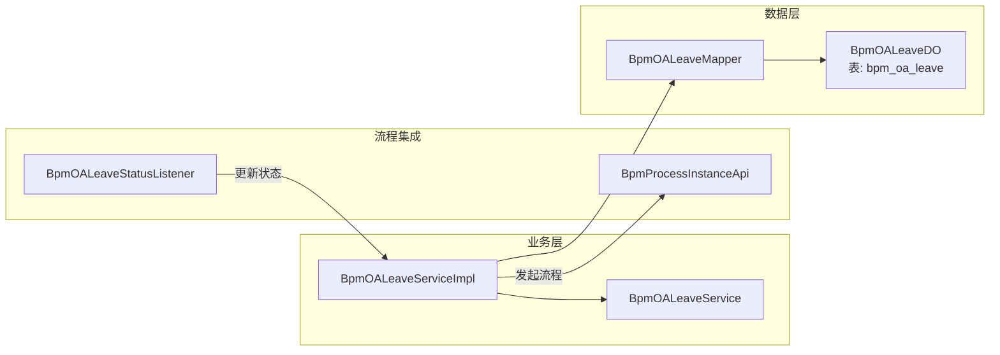
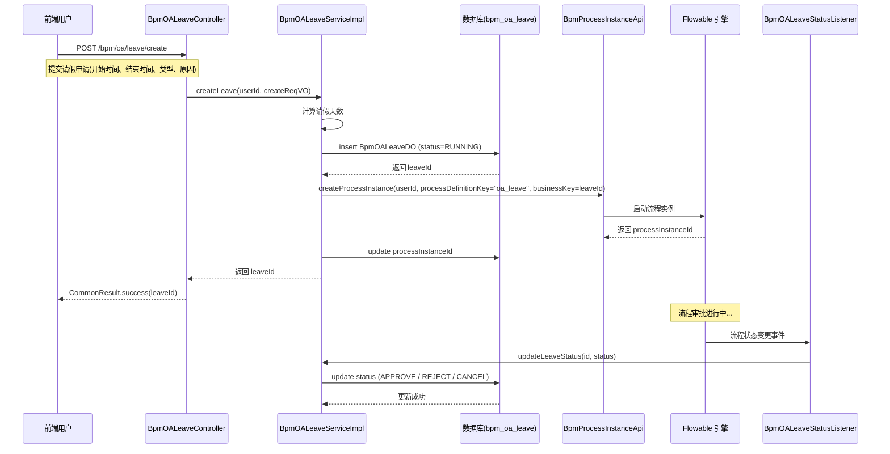
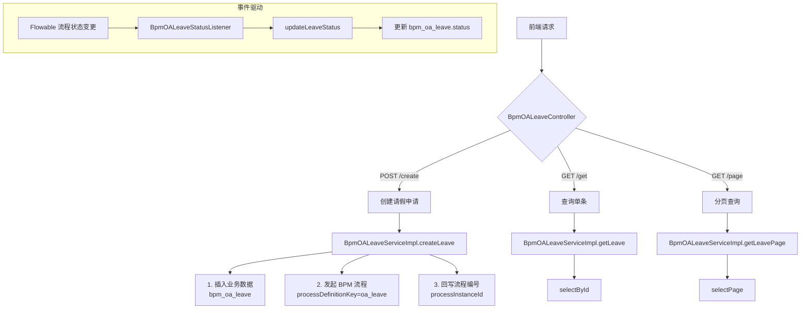
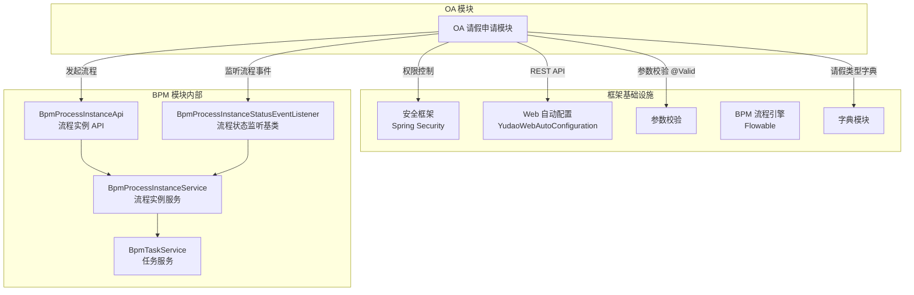

# OA 请假申请模块

## 概述

OA（Office Automation）请假申请模块是 `yudao-module-bpm`（工作流模块）中的一个子模块，用于演示**如何将自定义业务数据与 Flowable 工作流引擎集成**。该模块以请假申请为典型案例，展示了标准的"业务数据 + 审批流程"开发模式。

通过本模块，开发者可以学习到：

-   如何创建关联工作流的业务表单
-   如何发起 BPM 流程并关联业务数据
-   如何通过流程事件监听器同步流程状态与业务状态

---

## 架构设计

### 模块分层结构

```mermaid
graph TD
    subgraph Controller 层
        BpmOALeaveController
    end

    subgraph Service 层
        BpmOALeaveService[接口: BpmOALeaveService]
        BpmOALeaveServiceImpl[实现: BpmOALeaveServiceImpl]
    end

    subgraph 流程监听层
        BpmOALeaveStatusListener
    end

    subgraph 数据访问层
        BpmOALeaveMapper
        BpmOALeaveDO
    end

    subgraph VO / DTO
        BpmOALeaveCreateReqVO
        BpmOALeaveRespVO
        BpmOALeavePageReqVO
    end

    subgraph 外部依赖
        BpmProcessInstanceApi
        FlowableEngine[Flowable 工作流引擎]
    end

    BpmOALeaveController --> BpmOALeaveService
    BpmOALeaveServiceImpl --> BpmOALeaveMapper
    BpmOALeaveServiceImpl --> BpmProcessInstanceApi
    BpmOALeaveServiceImpl .->|业务流程编排| FlowableEngine
    BpmOALeaveStatusListener --> BpmOALeaveService
    BpmOALeaveStatusListener .->|监听流程事件| FlowableEngine
    BpmOALeaveMapper --> BpmOALeaveDO
    BpmOALeaveController ..> BpmOALeaveCreateReqVO
    BpmOALeaveController ..> BpmOALeaveRespVO
    BpmOALeaveController ..> BpmOALeavePageReqVO
```

### 核心组件依赖关系



---

## 核心流程说明

### 请假申请完整流程



### 模块内数据流



---

## 详细组件说明

### 1. BpmOALeaveController

**位置**: `yudao-module-bpm/.../controller/admin/oa/BpmOALeaveController.java`

**功能**: 提供 OA 请假申请的 RESTful API 接口，所有接口均需 `bpm:oa-leave` 相关权限。

| 端点 | 方法 | 权限 | 说明 |
|------|------|------|------|
| `POST /bpm/oa/leave/create` | `createLeave` | `bpm:oa-leave:create` | 创建请假申请 |
| `GET /bpm/oa/leave/get` | `getLeave` | `bpm:oa-leave:query` | 根据 ID 获取详情 |
| `GET /bpm/oa/leave/page` | `getLeavePage` | `bpm:oa-leave:query` | 分页查询当前用户的申请 |

### 2. BpmOALeaveService / BpmOALeaveServiceImpl

**位置**: `yudao-module-bpm/.../service/oa/`

**核心逻辑** (`createLeave`)：

1.  计算请假天数：`day = between(startTime, endTime).toDays()`
2.  插入业务数据：将 `BpmOALeaveCreateReqVO` 转为 `BpmOALeaveDO`，设置初始状态为 `RUNNING`
3.  发起 BPM 流程：调用 `BpmProcessInstanceApi.createProcessInstance()`
    -   流程定义 Key：`oa_leave`
    -   业务 Key：请假单 ID (`businessKey = leaveId`)
    -   流程变量：`day`（请假天数）
4.  回写流程编号：将返回的 `processInstanceId` 更新到请假记录中

**其他方法**：

-   `updateLeaveStatus(id, status)`：更新审批状态（由监听器触发）
-   `getLeave(id)`：查询单条记录
-   `getLeavePage(userId, pageReqVO)`：分页查询当前用户的请假记录

### 3. BpmOALeaveDO

**位置**: `yudao-module-bpm/.../dal/dataobject/oa/BpmOALeaveDO.java`

**数据库表**: `bpm_oa_leave`

| 字段 | 类型 | 说明 |
|------|------|------|
| `id` | Long | 主键（自增） |
| `userId` | Long | 申请人用户编号，关联 `AdminUserDO.id` |
| `type` | Integer | 请假类型，参见 `bpm_oa_type` 字典 |
| `reason` | String | 请假原因 |
| `startTime` | LocalDateTime | 开始时间 |
| `endTime` | LocalDateTime | 结束时间 |
| `day` | Long | 请假天数（自动计算） |
| `status` | Integer | 审批状态，复用 `BpmProcessInstanceStatusEnum` |
| `processInstanceId` | String | 关联的 Flowable 流程实例 ID |
| `createTime` | LocalDateTime | 创建时间（继承 BaseDO） |
| `updateTime` | LocalDateTime | 更新时间（继承 BaseDO） |

> **注意**：该类标注了 `@KeySequence("bpm_oa_leave_seq")`，用于支持 Oracle、PostgreSQL 等数据库的主键自增。

### 4. BpmOALeaveStatusListener

**位置**: `yudao-module-bpm/.../service/oa/listener/BpmOALeaveStatusListener.java`

**功能**: 监听 `oa_leave` 流程定义的状态变更事件，当流程审批通过、驳回或取消时，自动更新业务表中的 `status` 字段。

```java
@Component
public class BpmOALeaveStatusListener extends BpmProcessInstanceStatusEventListener {

    @Override
    protected String getProcessDefinitionKey() {
        return BpmOALeaveServiceImpl.PROCESS_KEY; // "oa_leave"
    }

    @Override
    protected void onEvent(BpmProcessInstanceStatusEvent event) {
        leaveService.updateLeaveStatus(
            Long.parseLong(event.getBusinessKey()),
            event.getStatus()
        );
    }
}
```

---

## 与框架组件的集成关系



---

## 配置与部署

### 流程定义要求

使用本模块前，需在 Flowable 中部署 Key 为 `oa_leave` 的流程定义（BPMN 文件）。该流程定义应包含：

-   至少一个**开始事件**
-   审批节点（如部门经理审批、HR 审批等）
-   一个**结束事件**
-   流程变量 `day`（Long 类型），用于条件判断

### 权限配置

在系统管理后台中，需为角色分配以下权限：

| 权限标识 | 说明 |
|----------|------|
| `bpm:oa-leave:create` | 创建请假申请 |
| `bpm:oa-leave:query` | 查询请假申请 |

### 字典配置

| 字典类型 | 说明 |
|----------|------|
| `bpm_oa_type` | 请假类型（如：年假、事假、病假等） |

---

## 扩展指南

### 如何创建新的 OA 业务模块

参考 OA 请假申请模块，接入工作流的步骤：

1.  **定义数据对象**：创建 `XxxDO` 继承 `BaseDO`，包含业务字段和 `processInstanceId`、`status`
2.  **创建 Mapper**：继承 `BaseMapperX` 提供 CRUD 操作
3.  **编写 Service**：
    -   创建方法插入业务数据并调用 `BpmProcessInstanceApi.createProcessInstance()`
    -   流程变量通过 `variables` 参数传递
4.  **创建流程监听器**：继承 `BpmProcessInstanceStatusEventListener`，在 `onEvent()` 中更新业务状态
5.  **实现 Controller**：提供标准的 REST 接口
6.  **部署 BPMN 流程定义**：Key 与 Service 中定义的 `PROCESS_KEY` 一致

### 核心代码参考

```java
// Service 中发起流程
String processInstanceId = processInstanceApi.createProcessInstance(userId,
    new BpmProcessInstanceCreateReqDTO()
        .setProcessDefinitionKey(PROCESS_KEY)
        .setBusinessKey(String.valueOf(businessId))
        .setVariables(variables));
```

---

## 相关模块文档

> 以下文档位于同一目录，可点击跳转：

-   **[工作流核心模块](bpm.md)** — BPM 流程引擎的核心配置与服务
-   **[流程任务管理](bpm_task.md)** — 流程实例与任务的管理接口
-   **[数据权限](data_permission.md)** — 数据权限控制方案
-   **[租户模块](tenant.md)** — 多租户功能支持
