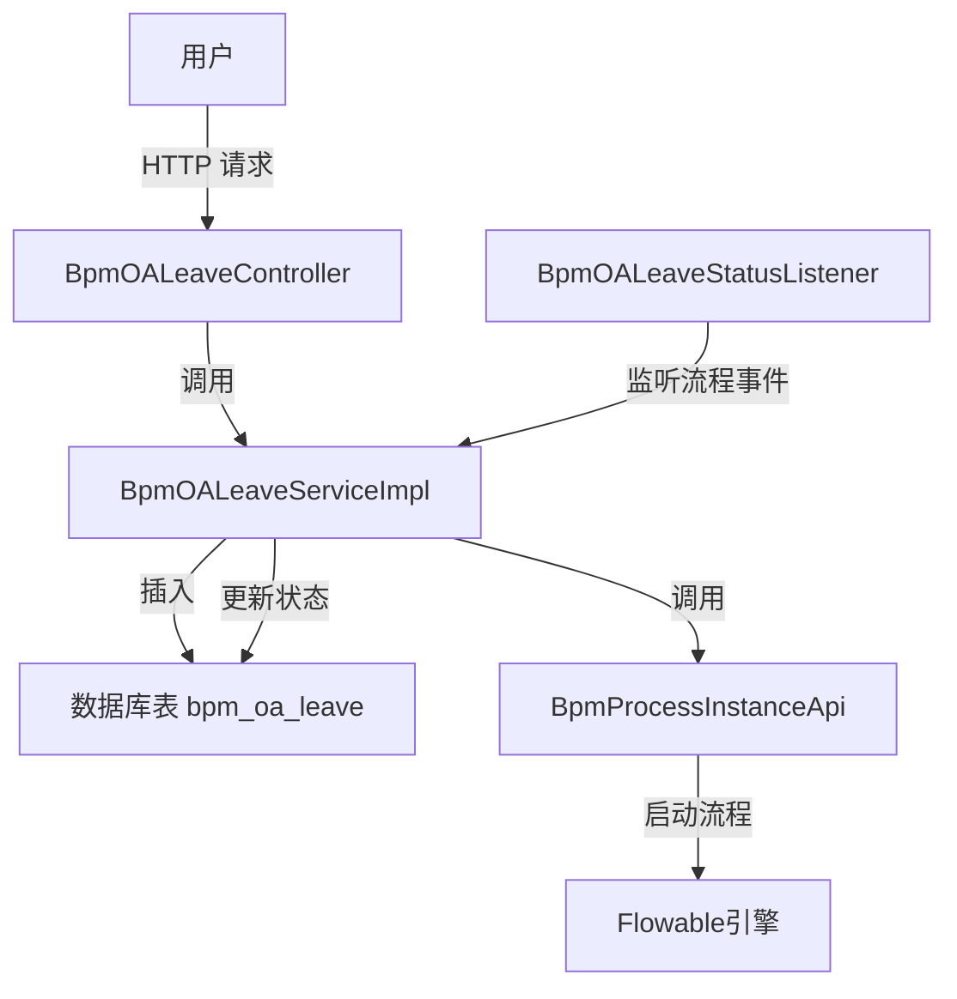
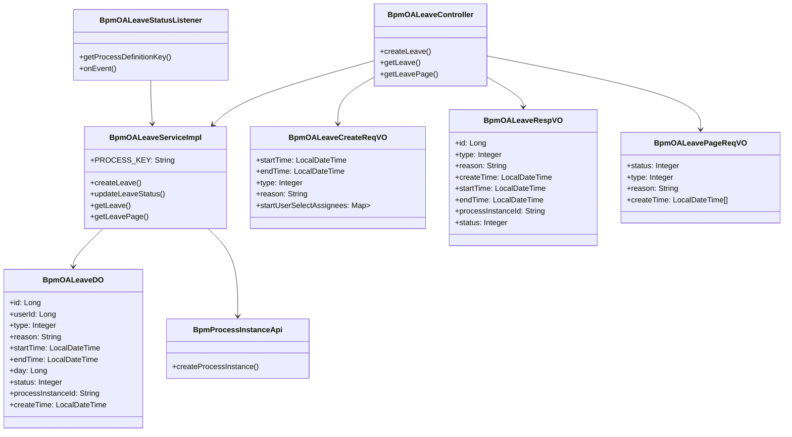
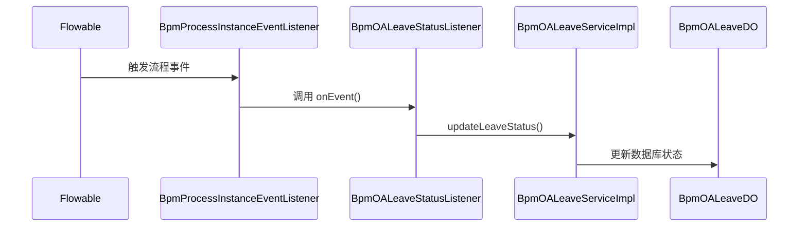
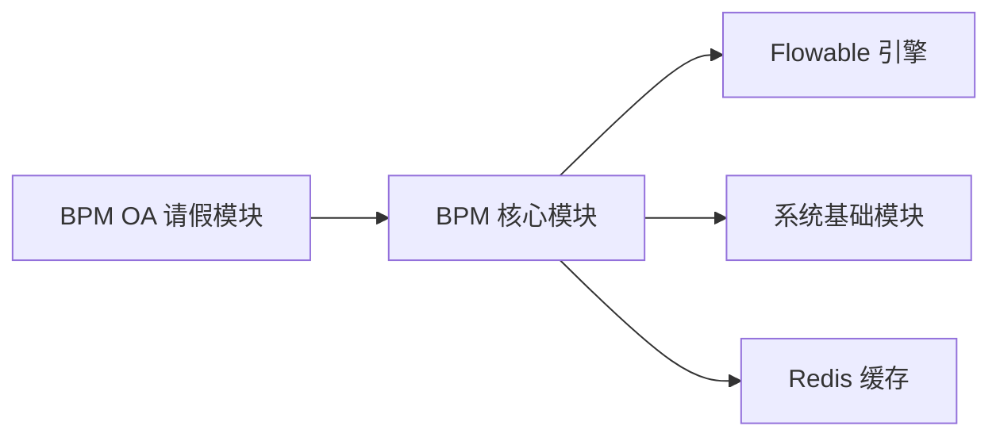
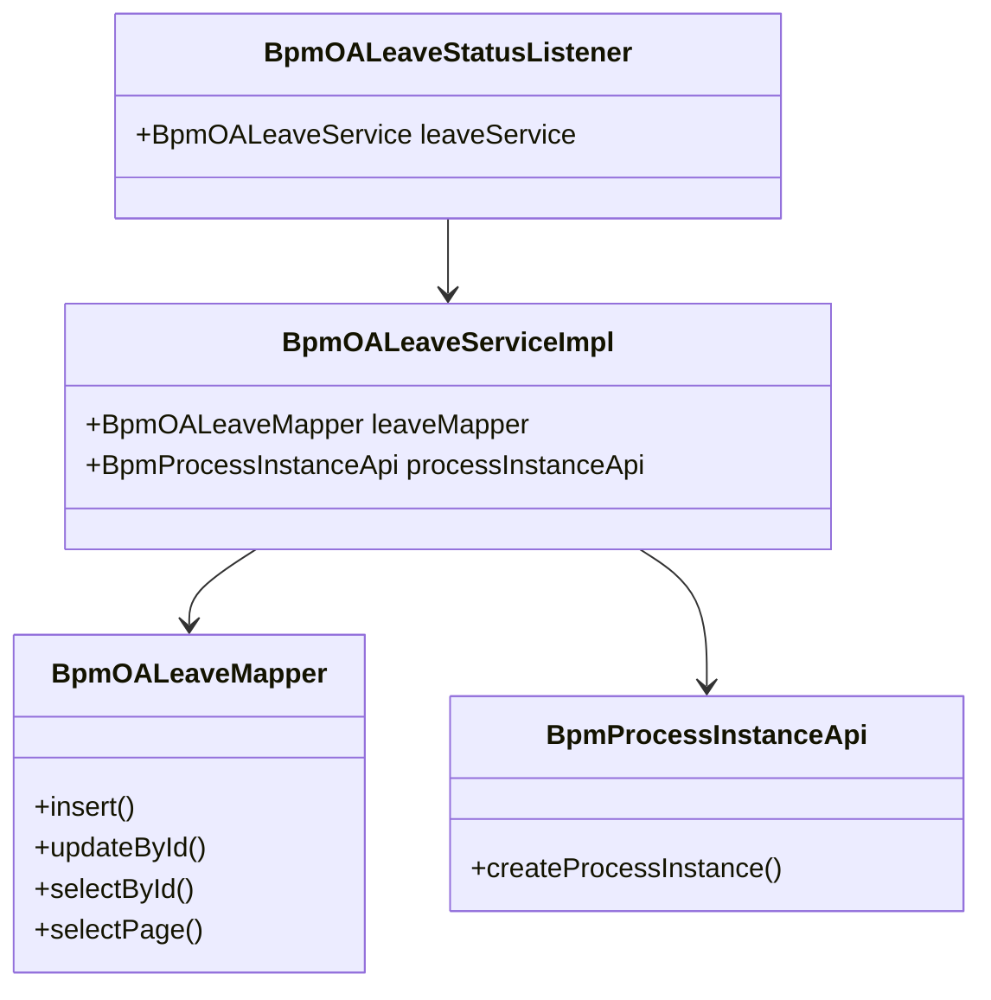

# OA 请假申请模块文档 (oa_2)

## 1. 模块概述

`oa_2` 模块是 BPM（业务流程管理）系统中的 OA（办公自动化）请假申请子模块，负责处理员工请假申请的创建、查询、状态管理等业务逻辑，并与 Flowable 工作流引擎集成，实现请假审批流程的自动化管理。

该模块的核心功能包括：
- 创建请假申请并启动对应的 BPM 流程
- 查询请假申请列表和详情
- 根据流程状态更新请假单状态
- 监听流程事件并同步状态

## 2. 架构设计

### 2.1 整体架构



### 2.2 组件关系图



## 3. 核心组件说明

### 3.1 BpmOALeaveServiceImpl（服务实现类）

**文件路径**: `yudao-module-bpm/src/main/java/cn/iocoder/yudao/module/bpm/service/oa/BpmOALeaveServiceImpl.java`

**功能描述**: 请假申请的核心业务逻辑实现类，负责请假单的 CRUD 操作以及与 BPM 流程引擎的交互。

**关键方法**:

| 方法名 | 描述 | 事务 |
|--------|------|------|
| `createLeave` | 创建请假申请并启动 BPM 流程 | @Transactional |
| `updateLeaveStatus` | 更新请假单状态 | 无 |
| `getLeave` | 根据 ID 获取请假单 | 无 |
| `getLeavePage` | 分页查询请假申请 | 无 |

**核心逻辑**:
1. 计算请假天数（`startTime` 到 `endTime` 的天数差）
2. 插入 `BpmOALeaveDO` 记录，状态初始化为 `RUNNING`（进行中）
3. 调用 `BpmProcessInstanceApi` 启动 Flowable 流程，设置：
   - 流程定义键（`PROCESS_KEY = "oa_leave"`）
   - 流程变量（请假天数）
   - 业务键（请假单 ID）
   - 自选审批人
4. 更新请假单的 `processInstanceId`

### 3.2 BpmOALeaveStatusListener（事件监听器）

**文件路径**: `yudao-module-bpm/src/main/java/cn/iocoder/yudao/module/bpm/service/oa/listener/BpmOALeaveStatusListener.java`

**功能描述**: 监听 Flowable 流程实例的状态变化，当请假流程完成、取消或结束时，自动更新对应的请假单状态。

**继承关系**: 继承自 `BpmProcessInstanceStatusEventListener`

**关键方法**:
- `getProcessDefinitionKey()`: 返回 `"oa_leave"`，标识监听的是请假流程
- `onEvent()`: 当流程状态变更时，调用 `leaveService.updateLeaveStatus()` 更新请假单状态

### 3.3 BpmOALeaveController（控制器）

**文件路径**: `yudao-module-bpm/src/main/java/cn/iocoder/yudao/module/bpm/controller/admin/oa/BpmOALeaveController.java`

**功能描述**: 提供 RESTful API 接口，供前端调用。

**API 端点**:

| 请求方法 | 端点 | 描述 | 权限 |
|----------|------|------|------|
| POST | `/bpm/oa/leave/create` | 创建请假申请 | `bpm:oa-leave:create` |
| GET | `/bpm/oa/leave/get` | 获取请假申请详情 | `bpm:oa-leave:query` |
| GET | `/bpm/oa/leave/page` | 分页查询请假申请 | `bpm:oa-leave:query` |

### 3.4 VO（视图对象）

#### BpmOALeaveCreateReqVO（创建请求）

**文件路径**: `yudao-module-bpm/src/main/java/cn/iocoder/yudao/module/bpm/controller/admin/oa/vo/BpmOALeaveCreateReqVO.java`

**字段说明**:

| 字段名 | 类型 | 描述 | 必填 |
|--------|------|------|------|
| startTime | LocalDateTime | 请假开始时间 | 是 |
| endTime | LocalDateTime | 请假结束时间 | 是 |
| type | Integer | 请假类型（参见 bpm_oa_type 枚举） | 是 |
| reason | String | 请假原因 | 是 |
| startUserSelectAssignees | Map<String, List<Long>> | 发起人自选审批人 Map | 否 |

**校验规则**:
- `@AssertTrue`: 结束时间必须在开始时间之后

#### BpmOALeaveRespVO（响应）

**文件路径**: `yudao-module-bpm/src/main/java/cn/iocoder/yudao/module/bpm/controller/admin/oa/vo/BpmOALeaveRespVO.java`

**字段说明**:

| 字段名 | 类型 | 描述 |
|--------|------|------|
| id | Long | 请假单主键 |
| type | Integer | 请假类型 |
| reason | String | 请假原因 |
| createTime | LocalDateTime | 申请时间 |
| startTime | LocalDateTime | 开始时间 |
| endTime | LocalDateTime | 结束时间 |
| processInstanceId | String | 流程实例编号 |
| status | Integer | 审批结果（参见 BpmProcessInstanceStatusEnum 枚举） |

#### BpmOALeavePageReqVO（分页查询）

**文件路径**: `yudao-module-bpm/src/main/java/cn/iocoder/yudao/module/bpm/controller/admin/oa/vo/BpmOALeavePageReqVO.java`

**字段说明**:

| 字段名 | 类型 | 描述 |
|--------|------|------|
| status | Integer | 状态 |
| type | Integer | 请假类型 |
| reason | String | 原因（模糊匹配） |
| createTime | LocalDateTime[] | 申请时间范围 |

## 4. 数据模型

### 4.1 BpmOALeaveDO（数据对象）

**数据库表**: `bpm_oa_leave`

**字段说明**:

| 字段名 | 类型 | 描述 |
|--------|------|------|
| id | BIGINT | 主键 |
| user_id | BIGINT | 用户 ID |
| type | INT | 请假类型 |
| reason | VARCHAR(500) | 请假原因 |
| start_time | DATETIME | 开始时间 |
| end_time | DATETIME | 结束时间 |
| day | BIGINT | 请假天数 |
| status | INT | 状态（1-进行中, 2-已取消, 3-已批准, 4-已拒绝） |
| process_instance_id | VARCHAR(64) | 流程实例 ID |
| create_time | DATETIME | 创建时间 |

### 4.2 状态码说明

请假单状态与 Flowable 流程状态对应关系：

| 状态码 | 含义 | 对应 Flowable 状态 |
|--------|------|-------------------|
| 1 | RUNNING | 流程进行中 |
| 2 | CANCELLED | 流程已取消 |
| 3 | APPROVED | 流程已批准 |
| 4 | REJECTED | 流程已拒绝 |

## 5. 流程集成

### 5.1 流程定义键

```java
public static final String PROCESS_KEY = "oa_leave";
```

该键值用于标识请假流程的定义，在 Flowable 引擎中对应一个特定的 BPMN 流程定义。

### 5.2 流程变量

创建流程时设置的变量：

| 变量名 | 类型 | 描述 |
|--------|------|------|
| day | Long | 请假天数 |

### 5.3 业务键（Business Key）

```
业务键 = 请假单 ID
```

用于在流程中唯一标识该请假申请，便于后续查询和关联。

## 6. 事件监听机制

### 6.1 监听器继承关系

```
BpmOALeaveStatusListener
    └── BpmProcessInstanceStatusEventListener
        └── BpmProcessInstanceEventListener
            └── AbstractFlowableEngineEventListener
```

### 6.2 监听的事件类型

监听 Flowable 引擎的事件：
- `PROCESS_CREATED`: 流程创建
- `PROCESS_COMPLETED`: 流程完成
- `PROCESS_CANCELLED`: 流程取消

### 6.3 事件处理流程



## 7. 依赖关系

### 7.1 模块依赖



### 7.2 类依赖



## 8. 使用示例

### 8.1 创建请假申请

**请求**:
```http
POST /bpm/oa/leave/create
Content-Type: application/json

{
  "startTime": "2024-01-15T09:00:00",
  "endTime": "2024-01-17T18:00:00",
  "type": 1,
  "reason": "因事请假",
  "startUserSelectAssignees": {
    "assignee": [1001, 1002]
  }
}
```

**响应**:
```json
{
  "code": 0,
  "message": "成功",
  "data": 123
}
```

### 8.2 查询请假申请列表

**请求**:
```http
GET /bpm/oa/leave/page?page=1&size=10&status=1&type=1
```

**响应**:
```json
{
  "code": 0,
  "message": "成功",
  "data": {
    "list": [...],
    "total": 100,
    "page": 1,
    "size": 10,
    "totalPages": 10
  }
}
```

## 9. 扩展点

### 9.1 自定义审批人策略

通过 `startUserSelectAssignees` 参数，发起人可以自选审批人，Map 的 key 为任务键（task key），value 为审批人用户 ID 列表。

### 9.2 流程扩展

通过继承 `BpmProcessInstanceStatusEventListener`，可以监听其他流程的事件并执行自定义业务逻辑。

### 9.3 状态扩展

可以在 `BpmOALeaveServiceImpl` 中扩展新的状态处理逻辑，与 Flowable 的状态变化保持同步。

## 10. 相关模块参考

- [bpm.md](bpm.md) - BPM 核心模块文档
- [system.md](system.md) - 系统基础模块文档
- [flowable.md](flowable.md) - Flowable 引擎集成文档
