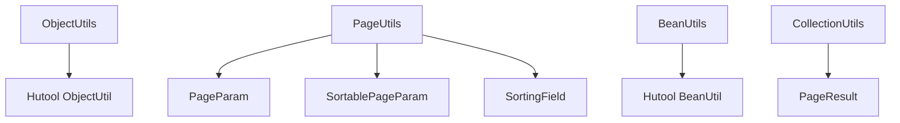
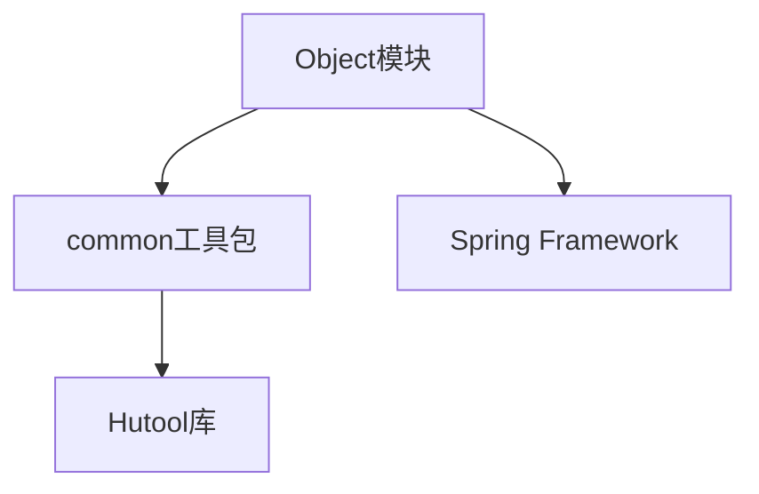

# Object 模块文档

## 1. 概述

Object 模块是 Yudao Framework 中的一个核心工具模块，提供了对象操作、分页处理、Bean 转换等常用功能。该模块主要包含以下三个核心工具类：

- **ObjectUtils**: 对象工具类，提供对象复制、比较、空值处理等功能
- **PageUtils**: 分页工具类，提供分页参数处理和排序字段构建功能
- **BeanUtils**: Bean 工具类，提供 Bean 对象之间的转换功能

这些工具类基于 Hutool 库进行封装，简化了常见的对象操作任务，提高了代码的可维护性和可读性。

## 2. 架构设计

### 2.1 模块结构



### 2.2 核心组件关系

- **ObjectUtils**: 主要依赖 Hutool 的 `ObjectUtil` 类，提供对象操作功能
- **PageUtils**: 依赖 `PageParam`、`SortablePageParam`、`SortingField` 等分页相关类，提供分页处理功能
- **BeanUtils**: 主要依赖 Hutool 的 `BeanUtil` 类，提供 Bean 转换功能
- **CollectionUtils**: 与 `PageResult` 类协作，提供集合操作和分页结果转换功能

### 2.3 模块依赖



## 3. 核心功能详解

### 3.1 ObjectUtils

`ObjectUtils` 是对象操作工具类，提供以下主要功能：

#### 3.1.1 对象复制

```java
/**
 * 复制对象，并忽略 Id 编号
 *
 * @param object 被复制对象
 * @param consumer 消费者，可以二次编辑被复制对象
 * @return 复制后的对象
 */
public static <T> T cloneIgnoreId(T object, Consumer<T> consumer)
```

**使用场景**:
- 复制对象时需要忽略 ID 字段
- 需要对复制后的对象进行二次编辑

**示例**:
```java
User user = new User();
user.setId(1L);
user.setName("张三");

User copiedUser = ObjectUtils.cloneIgnoreId(user, u -> u.setName("李四"));
// copiedUser 的 ID 为 null，Name 为 "李四"
```

#### 3.1.2 比较操作

```java
/**
 * 返回两个对象中较大的一个
 *
 * @param obj1 对象1
 * @param obj2 对象2
 * @param <T> Comparable 类型
 * @return 较大的对象
 */
public static <T extends Comparable<T>> T max(T obj1, T obj2)
```

**使用场景**:
- 需要比较两个对象的大小
- 例如比较日期、数字等可比较对象

#### 3.1.3 空值处理

```java
/**
 * 返回数组中第一个非空的元素
 *
 * @param array 元素数组
 * @param <T> 元素类型
 * @return 第一个非空元素，如果都为空则返回 null
 */
@SafeVarargs
public static <T> T defaultIfNull(T... array)

/**
 * 检查对象是否在给定的数组中
 *
 * @param obj 对象
 * @param array 数组
 * @param <T> 元素类型
 * @return 如果对象在数组中则返回 true
 */
@SafeVarargs
public static <T> boolean equalsAny(T obj, T... array)

/**
 * 检查对象是否不在给定的数组中
 *
 * @param obj 对象
 * @param array 数组
 * @param <T> 元素类型
 * @return 如果对象不在数组中则返回 true
 */
@SafeVarargs
public static <T> boolean notEqualsAny(T obj, T... array)

/**
 * 检查所有对象是否不为空
 *
 * @param objs 对象数组
 * @return 如果所有对象都不为空则返回 true
 */
public static boolean isNotAllEmpty(Object... objs)
```

**使用场景**:
- 处理可能为空的对象
- 检查对象是否在特定集合中
- 判断多个对象是否都不为空

### 3.2 PageUtils

`PageUtils` 是分页处理工具类，提供以下主要功能：

#### 3.2.1 分页参数处理

```java
/**
 * 获取分页查询的起始位置
 *
 * @param pageParam 分页参数
 * @return 起始位置
 */
public static int getStart(PageParam pageParam)
```

**使用场景**:
- 计算数据库分页查询的起始位置
- 例如 MyBatis 的 `RowBounds` 或自定义分页查询

#### 3.2.2 排序字段构建

```java
/**
 * 构建排序字段（默认倒序）
 *
 * @param func 排序字段的 Lambda 表达式
 * @param <T> 排序字段所属的类型
 * @return 排序字段
 */
public static <T> SortingField buildSortingField(Func1<T, ?> func)

/**
 * 构建排序字段
 *
 * @param func 排序字段的 Lambda 表达式
 * @param order 排序类型 {@link SortingField#ORDER_ASC} {@link SortingField#ORDER_DESC}
 * @param <T> 排序字段所属的类型
 * @return 排序字段
 */
public static <T> SortingField buildSortingField(Func1<T, ?> func, String order)

/**
 * 构建默认的排序字段
 * 如果排序字段为空，则设置排序字段；否则忽略
 *
 * @param sortablePageParam 排序分页查询参数
 * @param func 排序字段的 Lambda 表达式
 * @param <T> 排序字段所属的类型
 */
public static <T> void buildDefaultSortingField(SortablePageParam sortablePageParam, Func1<T, ?> func)
```

**使用场景**:
- 构建动态排序字段
- 为查询接口提供排序功能
- 设置默认排序字段

**示例**:
```java
// 构建默认排序字段（倒序）
PageUtils.buildDefaultSortingField(pageParam, User::getCreateTime);

// 构建指定排序字段（升序）
SortingField sortingField = PageUtils.buildSortingField(User::getName, SortingField.ORDER_ASC);
```

### 3.3 BeanUtils

`BeanUtils` 是 Bean 转换工具类，提供以下主要功能：

#### 3.3.1 单个对象转换

```java
/**
 * 将源对象转换为目标类型对象
 *
 * @param source 源对象
 * @param targetClass 目标类类型
 * @param <T> 目标类型
 * @return 转换后的对象
 */
public static <T> T toBean(Object source, Class<T> targetClass)

/**
 * 将源对象转换为目标类型对象，并对转换后的对象进行二次编辑
 *
 * @param source 源对象
 * @param targetClass 目标类类型
 * @param peek 消费者，对转换后的对象进行二次编辑
 * @param <T> 目标类型
 * @return 转换后的对象
 */
public static <T> T toBean(Object source, Class<T> targetClass, Consumer<T> peek)
```

#### 3.3.2 集合对象转换

```java
/**
 * 将源集合转换为目标类型的集合
 *
 * @param source 源集合
 * @param targetType 目标类类型
 * @param <S> 源类型
 * @param <T> 目标类型
 * @return 转换后的集合
 */
public static <S, T> List<T> toBean(List<S> source, Class<T> targetType)

/**
 * 将源集合转换为目标类型的集合，并对转换后的对象进行二次编辑
 *
 * @param source 源集合
 * @param targetType 目标类类型
 * @param peek 消费者，对转换后的对象进行二次编辑
 * @param <S> 源类型
 * @param <T> 目标类型
 * @return 转换后的集合
 */
public static <S, T> List<T> toBean(List<S> source, Class<T> targetType, Consumer<T> peek)
```

#### 3.3.3 分页结果转换

```java
/**
 * 将源分页结果转换为目标类型的分页结果
 *
 * @param source 源分页结果
 * @param targetType 目标类类型
 * @param <S> 源类型
 * @param <T> 目标类型
 * @return 转换后的分页结果
 */
public static <S, T> PageResult<T> toBean(PageResult<S> source, Class<T> targetType)

/**
 * 将源分页结果转换为目标类型的分页结果，并对转换后的对象进行二次编辑
 *
 * @param source 源分页结果
 * @param targetType 目标类类型
 * @param peek 消费者，对转换后的对象进行二次编辑
 * @param <S> 源类型
 * @param <T> 目标类型
 * @return 转换后的分页结果
 */
public static <S, T> PageResult<T> toBean(PageResult<S> source, Class<T> targetType, Consumer<T> peek)
```

#### 3.3.4 属性复制

```java
/**
 * 复制源对象的属性到目标对象
 *
 * @param source 源对象
 * @param target 目标对象
 */
public static void copyProperties(Object source, Object target)
```

**使用场景**:
- DTO 和 DO 之间的转换
- 视图对象和实体对象之间的转换
- 对象之间的属性复制

**示例**:
```java
// 单个对象转换
UserDTO userDTO = BeanUtils.toBean(userDO, UserDTO.class);

// 集合对象转换
List<UserDTO> userDTOs = BeanUtils.toBean(userDOs, UserDTO.class);

// 分页结果转换
PageResult<UserDTO> userDTOPage = BeanUtils.toBean(userDOPage, UserDTO.class);

// 属性复制
BeanUtils.copyProperties(userDTO, userDO);
```

## 4. 相关类说明

### 4.1 PageParam

分页参数类，用于封装分页查询的基本参数。

**主要属性**:
- `pageNo`: 页码，从 1 开始
- `pageSize`: 每页条数，最大值为 200

**特殊值**:
- `PAGE_SIZE_NONE = -1`: 表示不分页，查询所有数据

### 4.2 SortablePageParam

可排序的分页参数类，继承自 `PageParam`，增加了排序字段。

**主要属性**:
- `sortingFields`: 排序字段列表

### 4.3 SortingField

排序字段类，用于描述排序的字段和顺序。

**主要属性**:
- `field`: 字段名
- `order`: 排序顺序，可选值为 `ORDER_ASC`（升序）和 `ORDER_DESC`（降序）

### 4.4 PageResult

分页结果类，用于封装分页查询的结果。

**主要属性**:
- `total`: 总记录数
- `list`: 当前页的数据列表

**工厂方法**:
- `empty()`: 创建一个空的分页结果
- `empty(Long total)`: 创建一个指定总记录数的空分页结果

### 4.5 CollectionUtils

集合工具类，提供了丰富的集合操作方法。

**主要功能**:
- 集合转换
- 集合过滤
- 集合去重
- 集合查找
- 集合比较
- 集合求和

## 5. 使用示例

### 5.1 对象复制示例

```java
// 复制对象并忽略 ID
User user = new User();
user.setId(1L);
user.setName("张三");
user.setEmail("zhangsan@example.com");

User copiedUser = ObjectUtils.cloneIgnoreId(user, u -> {
    u.setName("李四");
    u.setEmail("lisi@example.com");
});

// copiedUser 的 ID 为 null，Name 为 "李四"，Email 为 "lisi@example.com"
```

### 5.2 分页查询示例

```java
// 创建分页参数
PageParam pageParam = new PageParam();
pageParam.setPageNo(1);
pageParam.setPageSize(10);

// 构建排序字段
SortingField sortingField = PageUtils.buildSortingField(User::getCreateTime, SortingField.ORDER_DESC);

// 创建可排序的分页参数
SortablePageParam sortablePageParam = new SortablePageParam();
sortablePageParam.setPageNo(pageParam.getPageNo());
sortablePageParam.setPageSize(pageParam.getPageSize());
sortablePageParam.setSortingFields(Collections.singletonList(sortingField));

// 获取分页查询的起始位置
int start = PageUtils.getStart(pageParam);
```

### 5.3 Bean 转换示例

```java
// 单个对象转换
UserDO userDO = userMapper.selectById(1L);
UserDTO userDTO = BeanUtils.toBean(userDO, UserDTO.class);

// 集合对象转换
List<UserDO> userDOs = userMapper.selectList(null);
List<UserDTO> userDTOs = BeanUtils.toBean(userDOs, UserDTO.class);

// 分页结果转换
PageResult<UserDO> userDOPage = userMapper.selectPage(pageParam, queryWrapper);
PageResult<UserDTO> userDTOPage = BeanUtils.toBean(userDOPage, UserDTO.class);

// 属性复制
UserDTO userDTO = new UserDTO();
BeanUtils.copyProperties(userDO, userDTO);
```

## 6. 最佳实践

### 6.1 对象复制

1. **使用 `cloneIgnoreId` 方法复制对象时，确保对象有无参构造方法**
2. **对于复杂对象，建议使用 MapStruct 或其他映射框架**
3. **在复制对象时，可以通过 Consumer 参数对复制后的对象进行二次编辑**

### 6.2 分页查询

1. **设置合理的分页大小**，避免一次性查询过多数据
2. **使用 `SortablePageParam` 时，确保排序字段的有效性**
3. **对于导出接口，可以设置 `pageSize` 为 `PAGE_SIZE_NONE` 来查询所有数据**

### 6.3 Bean 转换

1. **对于简单的对象转换，可以直接使用 `BeanUtils.toBean` 方法**
2. **对于复杂的对象转换，建议使用 MapStruct 或手动转换**
3. **在转换时，可以通过 Consumer 参数对转换后的对象进行二次编辑**
4. **对于分页结果转换，可以使用 `BeanUtils.toBean` 方法**

## 7. 性能考虑

1. **对象复制**: 使用 Hutool 的 `ObjectUtil.clone` 方法，性能较好
2. **Bean 转换**: 使用 Hutool 的 `BeanUtil.toBean` 方法，性能较好
3. **分页处理**: 使用 `PageUtils.getStart` 方法计算起始位置，避免重复计算

## 8. 扩展性

1. **可以基于现有工具类进行扩展，添加新的功能**
2. **对于复杂的对象转换，可以考虑使用 MapStruct 或其他映射框架**
3. **可以根据实际需求，自定义分页参数和排序字段**

## 9. 常见问题

### 9.1 对象复制时属性不匹配

**问题**: 使用 `cloneIgnoreId` 方法复制对象时，发现有些属性没有被复制。

**解决方案**: 确保源对象和目标对象的属性名一致，或者使用 `BeanUtils.copyProperties` 方法进行属性复制。

### 9.2 分页查询时数据不正确

**问题**: 使用 `PageUtils.getStart` 方法计算起始位置时，发现数据不正确。

**解决方案**: 确保 `pageNo` 和 `pageSize` 参数正确，并且数据库查询时使用了正确的起始位置和页大小。

### 9.3 Bean 转换时出现异常

**问题**: 使用 `BeanUtils.toBean` 方法转换对象时，出现异常。

**解决方案**: 确保源对象和目标对象的属性类型兼容，或者使用手动转换。

## 10. 总结

Object 模块提供了对象操作、分页处理、Bean 转换等常用功能，简化了开发过程，提高了代码的可维护性和可读性。通过合理使用这些工具类，可以减少重复代码，提高开发效率。

在实际开发中，建议根据具体需求，灵活运用这些工具类，并结合其他框架和库，构建高质量的应用程序。