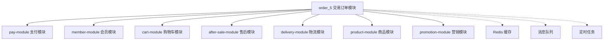
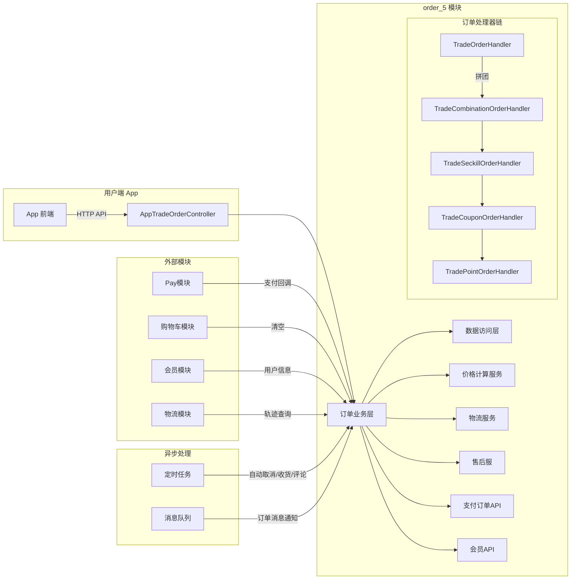
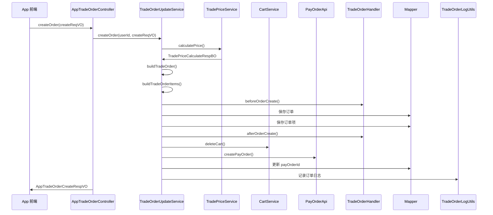
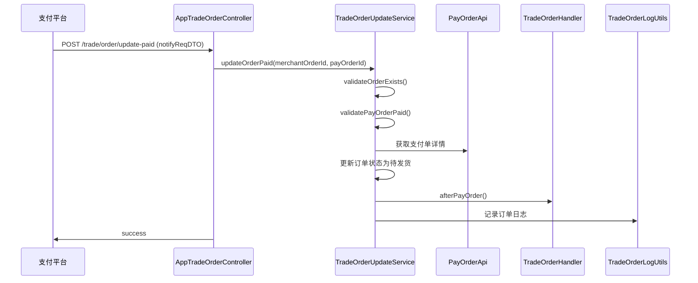
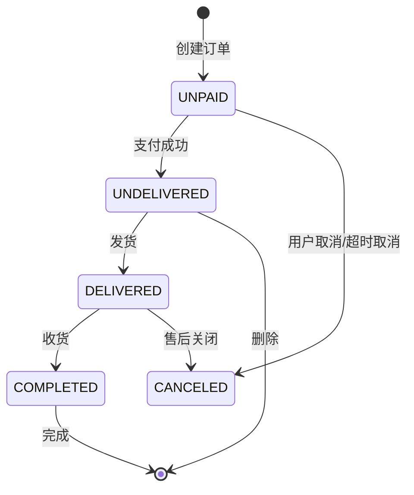

# 交易订单模块 (order_5) 文档

## 1. 模块概述

**order_5** 模块是 Yudao 商城系统中的核心交易订单模块，负责处理用户从商品结算、订单创建、支付回调到订单状态管理的全生命周期。该模块与支付模块(Pay)、会员模块(Member)、购物车模块(Cart)、售后模块(AfterSale)等多个模块紧密集成，构成了完整的电商交易闭环。

模块主要功能包括：
- 订单结算与价格计算
- 订单创建与管理
- 支付状态同步
- 订单物流跟踪
- 订单状态流转（待付款→待发货→待收货→已完成）
- 订单取消与删除
- 订单项管理（评价、售后关联）

## 2. 架构设计

### 2.1 模块依赖关系



### 2.2 系统架构图



## 3. 核心组件

### 3.1 AppTradeOrderController

**路径**: `yudao-module-mall/yudao-module-trade/src/main/java/cn/iocoder/yudao/module/trade/controller/app/order/AppTradeOrderController.java`

**描述**: 交易订单的 App 端控制器，提供用户端订单相关的所有 RESTful API。

**API 接口列表**:

| HTTP 方法 | 路径 | 描述 |
|-----------|------|------|
| GET | `/trade/order/settlement` | 获得订单结算信息 |
| GET | `/trade/order/settlement-product` | 获得商品结算信息 |
| POST | `/trade/order/create` | 创建订单 |
| POST | `/trade/order/update-paid` | 更新订单为已支付（支付回调） |
| GET | `/trade/order/get-detail` | 获得交易订单详情 |
| GET | `/trade/order/get-express-track-list` | 获得交易订单的物流轨迹 |
| GET | `/trade/order/page` | 获得交易订单分页 |
| GET | `/trade/order/get-count` | 获得交易订单数量统计 |
| PUT | `/trade/order/receive` | 确认交易订单收货 |
| DELETE | `/trade/order/cancel` | 取消交易订单 |
| DELETE | `/trade/order/delete` | 删除交易订单 |
| GET | `/trade/order/item/get` | 获得交易订单项 |
| POST | `/trade/order/item/create-comment` | 创建交易订单项的评价 |

### 3.2 订单服务层

#### TradeOrderQueryService

**描述**: 订单查询服务，提供订单的读取操作。

**核心方法**:
- `getOrder(Long id)` / `getOrder(Long userId, Long id)` - 查询订单
- `getOrderPage(TradeOrderPageReqVO reqVO)` - 分页查询订单
- `getOrderCount(Long userId, Integer status, Boolean commentStatus)` - 统计订单数量
- `getExpressTrackList(Long id)` - 获取物流轨迹（带 Redis 缓存）

#### TradeOrderUpdateService

**描述**: 订单更新服务，提供订单的创建、修改、状态变更等操作。

**核心方法**:
- `createOrder(Long userId, AppTradeOrderCreateReqVO createReqVO)` - 创建订单
- `updateOrderPaid(Long id, Long payOrderId)` - 更新订单为已支付（支付回调）
- `receiveOrderByMember(Long userId, Long id)` - 用户确认收货
- `cancelOrderByMember(Long userId, Long id)` - 用户取消订单
- `deleteOrder(Long userId, Long id)` - 删除订单
- `createOrderItemCommentByMember(Long userId, AppTradeOrderItemCommentCreateReqVO createReqVO)` - 创建订单项评价

### 3.3 订单实体

#### TradeOrderDO

**路径**: `yudao-module-mall/yudao-module-trade/src/main/java/cn/iocoder/yudao/module/trade/dal/dataobject/order/TradeOrderDO.java`

**描述**: 交易订单数据对象，对应数据库表 `trade_order`。

**核心字段**:

| 字段 | 类型 | 描述 |
|------|------|------|
| id | Long | 订单主键 |
| no | String | 订单流水号 |
| type | Integer | 订单类型（普通、拼团、秒杀等） |
| terminal | Integer | 订单来源（APP、小程序等） |
| userId | Long | 用户编号 |
| status | Integer | 订单状态（待付款、待发货、待收货、已完成、已取消） |
| payOrderId | Long | 支付订单编号 |
| payStatus | Boolean | 是否已支付 |
| payPrice | Integer | 应付金额（单位：分） |
| totalPrice | Integer | 商品原价（单位：分） |
| discountPrice | Integer | 优惠金额（单位：分） |
| deliveryPrice | Integer | 运费金额（单位：分） |
| adjustPrice | Integer | 订单调价（单位：分） |
| logisticsId | Long | 物流公司编号 |
| logisticsNo | String | 物流单号 |
| receiverName | String | 收件人姓名 |
| receiverMobile | String | 收件人手机 |
| receiverDetailAddress | String | 收件人详细地址 |
| refundStatus | Integer | 售后状态（无退款、部分退款、全部退款） |
| commentStatus | Boolean | 是否已评价 |

#### TradeOrderItemDO

**路径**: `yudao-module-mall/yudao-module-trade/src/main/java/cn/iocoder/yudao/module/trade/dal/dataobject/order/TradeOrderItemDO.java`

**描述**: 订单项数据对象，对应数据库表 `trade_order_item`。

**核心字段**:

| 字段 | 类型 | 描述 |
|------|------|------|
| id | Long | 订单项主键 |
| orderId | Long | 订单编号 |
| userId | Long | 用户编号 |
| spuId | Long | 商品 SPU 编号 |
| skuId | Long | 商品 SKU 编号 |
| spuName | String | 商品 SPU 名称（冗余） |
| picUrl | String | 商品图片 |
| count | Integer | 购买数量 |
| price | Integer | 商品单价（单位：分） |
| payPrice | Integer | 订单项应付金额（单位：分） |
| afterSaleStatus | Integer | 售后状态 |
| commentStatus | Boolean | 是否已评价 |

### 3.4 订单处理器链 (TradeOrderHandler)

**描述**: 订单处理策略模式，通过 `List<TradeOrderHandler>` 实现订单生命周期中的各种扩展逻辑。

**接口定义**:

```java
public interface TradeOrderHandler {
    void beforeOrderCreate(TradeOrderDO order, List<TradeOrderItemDO> orderItems);  // 订单创建前
    void afterOrderCreate(TradeOrderDO order, List<TradeOrderItemDO> orderItems);   // 订单创建后
    void afterPayOrder(TradeOrderDO order, List<TradeOrderItemDO> orderItems);      // 支付后
    void afterCancelOrder(TradeOrderDO order, List<TradeOrderItemDO> orderItems);   // 取消后
    void afterDeliveryOrder(TradeOrderDO order);                                  // 发货后
    void afterReceiveOrder(TradeOrderDO order);                                   // 收货后
}
```

**典型实现**:
- `TradeCombinationOrderHandler` - 拼团订单处理
- `TradeSeckillOrderHandler` - 秒杀订单处理
- `TradeCouponOrderHandler` - 优惠券订单处理
- `TradePointOrderHandler` - 积分订单处理
- `TradeBrokerageOrderHandler` - 分销订单处理

### 3.5 订单配置

#### TradeOrderProperties

**路径**: `yudao-module-mall/yudao-module-trade/src/main/java/cn/iocoder/yudao/module/trade/framework/order/config/TradeOrderProperties.java`

**描述**: 订单相关配置，通过 `@ConfigurationProperties(prefix = "yudao.trade.order")` 绑定配置。

**配置项**:

| 配置项 | 默认值 | 描述 |
|--------|--------|------|
| payAppKey | "mall" | 支付应用标识 |
| payExpireTime | - | 支付超时时间 |
| receiveExpireTime | - | 收货超时时间 |
| commentExpireTime | - | 评论超时时间 |
| statusSyncToWxaEnable | false | 是否同步订单状态到微信小程序 |

## 4. 核心流程

### 4.1 订单创建流程



### 4.2 支付回调流程



### 4.3 订单状态流转



**状态枚举**:
- `UNPAID` - 待付款
- `UNDELIVERED` - 待发货
- `DELIVERED` - 待收货
- `COMPLETED` - 已完成
- `CANCELED` - 已取消

## 5. API 说明

### 5.1 订单结算

**请求**: `GET /trade/order/settlement`

**请求参数**:
```json
{
  "addressId": 1,
  "items": [
    {
      "cartId": 1,
      "skuId": 1,
      "count": 2
    }
  ]
}
```

**响应**:
```json
{
  "code": 200,
  "data": {
    "payPrice": 199,  // 应付金额（分）
    "totalPrice": 200, // 商品总价
    "deliveryPrice": 0, // 运费
    "couponPrice": 1,  // 优惠券减免
    "pointPrice": 0,   // 积分抵扣
    "items": [
      {
        "spuId": 1,
        "spuName": "示例商品",
        "skuId": 1,
        "price": 100,
        "count": 2,
        "payPrice": 200
      }
    ]
  }
}
```

### 5.2 创建订单

**请求**: `POST /trade/order/create`

**请求参数**:
```json
{
  "addressId": 1,
  "deliveryType": 1, // 1=快递，2=自提
  "items": [
    {
      "cartId": 1,
      "skuId": 1,
      "count": 2
    }
  ]
}
```

**响应**:
```json
{
  "code": 200,
  "data": {
    "id": 1,           // 订单编号
    "payOrderId": 1    // 支付订单编号
  }
}
```

### 5.3 获取订单详情

**请求**: `GET /trade/order/get-detail?id=1&sync=true`

**参数**:
- `id`: 订单编号
- `sync`: 是否同步支付状态（仅在未支付时有效）

**响应**:
```json
{
  "code": 200,
  "data": {
    "id": 1,
    "no": "20240101123456789",
    "status": 1, // 待付款
    "payStatus": false,
    "payPrice": 199,
    "items": [
      {
        "id": 1,
        "spuName": "示例商品",
        "skuName": "红色/大号",
        "count": 2,
        "payPrice": 199,
        "commentStatus": false
      }
    ],
    "express": {
      "id": 1,
      "name": "顺丰速运",
      "code": "SF"
    }
  }
}
```

### 5.4 订单分页查询

**请求**: `GET /trade/order/page`

**请求参数**:
```json
{
  "status": 1,
  "pageNum": 1,
  "pageSize": 10
}
```

**响应**:
```json
{
  "code": 200,
  "data": {
    "list": [
      {
        "id": 1,
        "no": "20240101123456789",
        "status": 1,
        "payPrice": 199,
        "createTime": "2024-01-01 12:00:00"
      }
    ],
    "total": 100,
    "pageNum": 1,
    "pageSize": 10,
    "pages": 10
  }
}
```

### 5.5 订单数量统计

**请求**: `GET /trade/order/get-count`

**响应**:
```json
{
  "code": 200,
  "data": {
    "allCount": 100,
    "unpaidCount": 10,
    "undeliveredCount": 5,
    "deliveredCount": 80,
    "uncommentedCount": 5,
    "afterSaleCount": 3
  }
}
```

### 5.6 确认收货

**请求**: `PUT /trade/order/receive?id=1`

**响应**:
```json
{
  "code": 200,
  "data": true
}
```

### 5.7 取消订单

**请求**: `DELETE /trade/order/cancel?id=1`

**响应**:
```json
{
  "code": 200,
  "data": true
}
```

## 6. 定时任务

order_5 模块包含多个定时任务，用于处理订单的自动状态变更：

| 任务类 | 描述 |
|--------|------|
| `TradeOrderAutoCancelJob` | 自动取消超时未支付的订单 |
| `TradeOrderAutoReceiveJob` | 自动确认收货（超过收货超时时间） |
| `TradeOrderAutoCommentJob` | 自动提醒用户评价（超过评论超时时间） |

## 7. 与其他模块的集成

### 7.1 与支付模块 (pay-module) 集成

- 通过 `PayOrderApi` 创建支付单
- 接收支付回调（`/trade/order/update-paid`）
- 同步支付状态

### 7.2 与会员模块 (member-module) 集成

- 通过 `MemberUserApi` 获取用户信息
- 通过 `MemberAddressApi` 获取收货地址
- 积分扣减与赠送

### 7.3 与购物车模块 (cart-module) 集成

- 创建订单后清空购物车
- 购物车结算时获取商品数据

### 7.4 与售后模块 (after-sale-module) 集成

- 售后订单关联订单项
- 售后成功后更新订单退款状态

### 7.5 与物流模块 (delivery-module) 集成

- 查询物流公司列表
- 获取物流轨迹（带 Redis 缓存）

## 8. 配置示例

```yaml
# application.yml 配置示例
yudao:
  trade:
    order:
      pay-app-key: mall
      pay-expire-time: 30m    # 支付超时30分钟
      receive-expire-time: 7d # 收货超时7天
      comment-expire-time: 15d # 评论超时15天
      status-sync-to-wxa-enable: true # 同步订单状态到微信小程序
```

## 9. 参考文档

- [支付模块 (pay) 文档](pay.md)
- [会员模块 (member) 文档](member.md)
- [购物车模块 (cart) 文档](cart.md)
- [售后模块 (after-sale) 文档](after_sale.md)
- [物流模块 (delivery) 文档](delivery.md)
