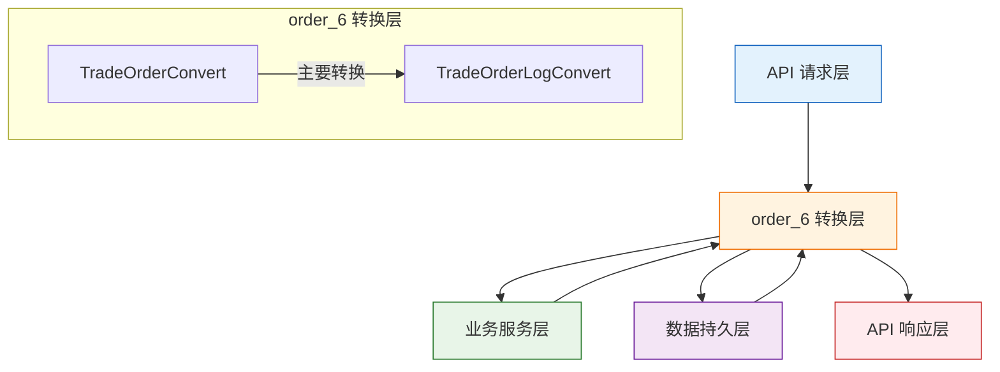
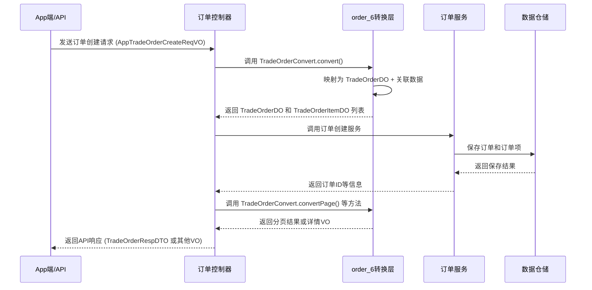

# order_6 模块文档

## 模块概述

order_6 模块是 yudao-module-trade 模块的一部分，位于 `yudao-module-mall/yudao-module-trade/src/main/java/cn/iocoder/yudao/module/trade/convert/order/` 目录下。该模块主要负责交易订单相关数据的转换映射，使用 MapStruct 框架实现不同层次数据对象之间的相互转换。

## 架构概述

order_6 模块作为交易系统的数据转换层，主要作用是在以下几种数据表示形式之间进行映射转换：

1. API 请求对象 (Request VO/DTO)
2. 内部业务对象 (Business Object)
3. 数据持久化对象 (Data Object)
4. API 响应对象 (Response VO/DTO)

通过这种转换层，可以有效地解耦不同层次的数据模型，提高系统的可维护性和扩展性。

### 组件关系图



## 核心功能

order_6 模块包含两个核心组件，负责订单数据的各种转换需求：

### 1. TradeOrderConvert

TradeOrderConvert 是模块的主要转换组件，提供了订单相关数据的全方位映射功能。它使用 MapStruct 注解定义了多种转换方法，支持以下主要转换场景：

#### 主要转换功能

- **订单创建转换**：将 App 端订单创建请求 (AppTradeOrderCreateReqVO) 转换为内部订单数据对象 (TradeOrderDO)
- **订单响应转换**：将内部订单数据对象 (TradeOrderDO) 转换为 API 响应对象 (TradeOrderRespDTO)
- **订单项处理**：将价格计算结果 (TradePriceCalculateRespBO) 转换为订单项数据对象 (TradeOrderItemDO)
- **库存更新**：将订单项列表转换为商品SKU库存更新请求 (ProductSkuUpdateStockReqDTO)
- **支付请求构建**：将订单信息转换为支付统一请求 (PayOrderCreateReqDTO)
- **分页结果转换**：将订单数据分页结果转换为前端展示所需的分页响应 (PageResult<TradeOrderPageItemRespVO>)
- **订单详情构建**：构建包含订单、订单项、订单日志、用户信息的完整订单详情响应
- **App端订单处理**：专门处理App端订单的各种转换需求
- **佣金计算**：根据订单项信息构建佣金添加请求 (BrokerageAddReqBO)
- **组合活动转换**：将订单信息转换为组合活动记录创建请求 (CombinationRecordCreateReqDTO)

#### 关键特性

- 使用 MapStruct 框架实现类型安全的属性映射
- 支持复杂对象的深度转换和列表转换
- 提供默认实现方法处理常见转换场景
- 支持自定义映射规则通过 @Mapping 注解
- 集成了区域工具类 (AreaUtils) 处理地理位置信息
- 集成了字典框架工具 (DictFrameworkUtils) 处理字典标签解析

### 2. TradeOrderLogConvert

TradeOrderLogConvert 是一个简单的转换组件，专门处理订单日志数据的转换：

- 将订单日志创建请求对象 (TradeOrderLogCreateReqBO) 转换为订单日志数据对象 (TradeOrderLogDO)

## 与其他模块的关系

order_6 模块主要与以下模块进行交互：

1. **交易服务层** (trade service)：提供订单业务逻辑处理的基础数据转换
2. **会员服务** (member module)：通过 MemberUserRespDTO 获取用户信息
3. **产品服务** (product module)：通过各种产品相关 DTO 获取商品信息
4. **促销服务** (promotion module)：处理促销活动相关的订单数据转换
5. **支付服务** (pay module)：构建支付请求和处理支付结果
6. **物流服务** (delivery framework)：处理物流信息的转换
7. **字典服务** (framework dict)：通过 DictFrameworkUtils 处理字典数据
8. **区域服务** (framework ip)：通过 AreaUtils 处理地区信息

## 数据流示例

以下是一个典型的订单创建流程中 order_6 模块的作用示例：



## 使用指南

### 在服务层中的典型使用

```java
@Service
public class TradeOrderServiceImpl implements TradeOrderService {
    
    @Autowired
    private TradeOrderConvert orderConvert;
    
    @Autowired
    private TradeOrderRepository orderRepository;
    
    public TradeOrderRespDTO createOrder(AppTradeOrderCreateReqVO createReqVO, 
                                       TradePriceCalculateRespBO calculateRespBO) {
        // 1. 转换请求为内部对象
        TradeOrderDO orderDO = orderConvert.convert(
            getCurrentUserId(), createReqVO, calculateRespBO);
        
        // 2. 转换订单项
        List<TradeOrderItemDO> orderItems = orderConvert.convertList(orderDO, calculateRespBO);
        
        // 3. 保存订单和订单项
        orderRepository.insert(orderDO);
        orderItemRepository.insertBatch(orderItems);
        
        // 4. 构建库存更新请求
        ProductSkuUpdateStockReqDTO stockReq = orderConvert.convert(orderItems);
        // 调用库存服务更新库存...
        
        // 5. 构建支付请求
        PayOrderCreateReqDTO payReq = orderConvert.convert(
            orderDO, orderItems, tradeOrderProperties);
        // 调用支付服务发起支付...
        
        // 6. 返回响应
        return orderConvert.convert(orderDO);
    }
}
```

### 在控制器层中的典型使用

```java
@RestController
@RequestMapping("/trade/order")
public class TradeOrderController {
    
    @Autowired
    private TradeOrderConvert orderConvert;
    
    @Autowired
    private TradeOrderService orderService;
    
    @GetMapping("/page")
    public CommonResult<PageResult<TradeOrderPageItemRespVO>> getOrderPage(
            @Valid TradeOrderPageReqVO pageReqVO) {
        PageResult<TradeOrderDO> pageResult = orderService.getOrderPage(pageReqVO);
        PageResult<TradeOrderPageItemRespVO> convertPage = orderConvert.convertPage(
            pageResult, /* orderItems */, /* memberUserMap */);
        return CommonResult.success(convertPage);
    }
}
```

## 设计考虑

1. **解耦设计**：通过转换层有效解耦了API层、服务层和数据层的数据模型
2. **性能优化**：MapStruct在编译时生成映射代码，运行时性能优于反射-based映射
3. **类型安全**：编译时检查确保映射的正确性，减少运行时错误
4. **可维护性**：集中管理数据转换逻辑，便于统一修改和维护
5. **扩展性**：易于添加新的转换方法而不影响现有代码

## 依赖说明

order_6 模块依赖以下关键组件和服务：

- MapStruct 框架：用于生成类型安全的映射实现
- Hutool 工具库：提供集合操作、字符串处理等实用功能
- 框架核心模块：包括字典框架、区域工具等
- 业务模块DTO：来自会员、产品、促销、支付等模块的数据传输对象
- 内部数据对象：TradeOrderDO、TradeOrderItemDO、TradeOrderLogDO 等

## 接口详情

### TradeOrderConvert 接口方法摘要

| 方法名称 | 参数 | 返回值 | 说明 |
|---------|------|--------|------|
| convert | userId, createReqVO, calculateRespBO | TradeOrderDO | 将App端订单创建请求转换为订单DO |
| convert | orderDO | TradeOrderRespDTO | 将订单DO转换为订单响应DTO |
| convertList | tradeOrderDO, calculateRespBO | List<TradeOrderItemDO> | 将价格计算结果转换为订单项DO列表 |
| convert | item | TradeOrderItemDO | 将价格计算结果的单个订单项转换为订单项DO |
| convert | list | ProductSkuUpdateStockReqDTO | 将订单项列表转换为商品SKU库存增加请求 |
| convertNegative | list | ProductSkuUpdateStockReqDTO | 将订单项列表转换为商品SKU库存减少请求（用于退货） |
| convert | order, orderItems, orderProperties | PayOrderCreateReqDTO | 构建支付统一请求 |
| convertPage | pageResult, orderItems, memberUserMap | PageResult<TradeOrderPageItemRespVO> | 转换订单分页结果为前端展示分页VO |
| convertUser | memberUserRespDTO | MemberUserRespVO | 转换会员用户DTO为VO |
| convert | order, items | TradeOrderPageItemRespVO | 转换单个订单及其订单项为分页列表VO |
| convert | bean | ProductPropertyValueDetailRespVO | 转换产品属性值详情DTO为VO |
| convert | order, orderItems, orderLogs, user, brokerageUser | TradeOrderDetailRespVO | 构建完整的订单详情响应 |
| convertList03 | orderLogs | List<TradeOrderDetailRespVO.OrderLog> | 转换订单日志DO列表为VO列表 |
| convert2 | order, items | TradeOrderDetailRespVO | 转换订单及订单项为详情VO（不含日志和用户信息） |
| convert | bean | MemberUserRespVO | 转换会员用户DTO为VO |
| convertPage02 | pageResult, orderItems | PageResult<AppTradeOrderPageItemRespVO> | 转换订单分页结果为App端展示分页VO |
| convert02 | order, items | AppTradeOrderPageItemRespVO | 转换单个订单及其订单项为App端分页列表VO |
| convert02 | bean | AppProductPropertyValueDetailRespVO | 转换产品属性值详情DTO为App端VO |
| convert02 | order, orderItems, tradeOrderProperties, express | AppTradeOrderDetailRespVO | 构建App端订单详情响应 |
| convert3 | order, items | AppTradeOrderDetailRespVO | 转换订单及订单项为App端详情VO |
| convert03 | bean | AppTradeOrderItemRespVO | 转换订单项DO为App端订单项VO |
| convert04 | createReqVO, tradeOrderItemDO | ProductCommentCreateReqDTO | 转换App端订单项评论创建请求为产品评论创建DTO |
| convert | settlementReqVO | TradePriceCalculateReqBO | 将App端订单结算请求转换为价格计算请求 |
| convert | userId, settlementReqVO, cartList | TradePriceCalculateReqBO | 将App端订单结算请求、用户ID和购物车列表转换为价格计算请求 |
| convert | calculate, address | AppTradeOrderSettlementRespVO | 将价格计算结果和地址信息转换为App端订单结算响应 |
| convert0 | calculate, address | AppTradeOrderSettlementRespVO | 构建App端订单结算响应基础部分 |
| convertList02 | list | List<AppOrderExpressTrackRespVO> | 转换物流追踪DTO列表为App端物流追踪VO列表 |
| convert | reqVO | TradeOrderDO | 将订单地址更新请求转换为订单DO更新对象 |
| convert | reqVO | TradeOrderDO | 将订单价格更新请求转换为订单DO更新对象 |
| convert | reqVO | TradeOrderDO | 将订单备注更新请求转换为订单DO更新对象 |
| convert | user, item, spu, sku | BrokerageAddReqBO | 构建佣金添加请求 |
| convertList04 | list | List<TradeOrderRespDTO> | 将订单DO列表转换为订单响应DTO列表（命名转换） |
| convert | order, item | CombinationRecordCreateReqDTO | 将订单及订单项转换为组合活动记录创建请求 |

### TradeOrderLogConvert 接口方法摘要

| 方法名称 | 参数 | 返回值 | 说明 |
|---------|------|--------|------|
| convert | bean | TradeOrderLogDO | 将订单日志创建请求BO转换为订单日志DO |

## 最佳实践

1. **保持转换纯净**：转换方法应仅负责数据映射，不应包含业务逻辑
2. **异常处理**：转换过程中可能出现的空指针等异常应在调用层处理
3. **性能考虑**：对于大量数据的转换，考虑使用批量转换方法
4. **单元测试**：为转换方法编写单元测试以确保映射正确性
5. **文档维护**：当添加新的转换方法时，及时更新相关文档
6. **一致性**：保持转换命名和参数顺序的一致性，提高代码可读性

## 与相关模块的关联

为了避免信息重复，以下是与order_6模块紧密相关的其他模块文档的引用：

- [交易服务模块](../trade_service.md)：详细描述订单业务逻辑实现
- [会员模块](../member.md)：提供用户信息获取服务
- [产品模块](../product.md)：提供商品信息查询服务
- [促销模块](../promotion.md)：处理促销活动相关的订单计算
- [支付模块](../pay.md)：处理订单支付流程
- [物流框架](../delivery_framework.md)：提供物流信息查询和追踪服务

这些模块与order_6模块通过服务调用和数据传输对象(DTO)进行交互，共同构建完整的交易系统。