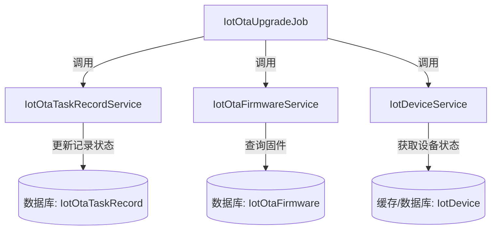
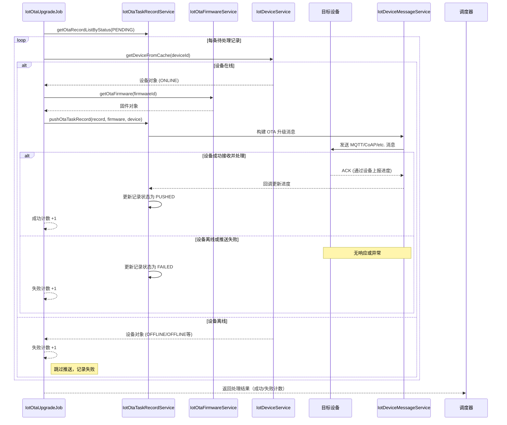

# OTA 升级任务作业 (IotOtaUpgradeJob) 文档

## 概述

`IotOtaUpgradeJob` 是物联网 (IoT) 模块中的一个 Quartz 调度作业，负责定期处理待执行的 OTA (Over-The-Air，空中升级) 任务。其核心职责是查询状态为 `PENDING`（待推送）的 OTA 任务记录，并将对应的固件升级指令下发至目标设备。

该作业确保固件更新能够可靠地推送到在线设备上，并根据推送结果更新任务记录的状态。对于离线设备，会标记为失败并记录日志，以便后续重试。

## 架构与组件

### 主要组件

- **IotOtaUpgradeJob** (`ota_3` 模块): Quartz 作业实现，触发 OTA 任务处理流程。
- **IotOtaTaskRecordService** (`ota_4` 模块): 提供 OTA 任务记录的查询和推送操作。
- **IotOtaFirmwareService** (`ota_4` 模块): 负责固件信息的查询和管理。
- **IotDeviceService** (`ota_4` 模块): 提供设备信息的查询（特别是从缓存中获取设备状态）。

### 组件关系

以下 Mermaid 图展示了 `IotOtaUpgradeJob` 与其直接依赖的服务之间的关系：

### 在系统中的位置

`IotOtaUpgradeJob` 属于物联网模块的作业层（Job层），位于 `yudao-module-iot/yudao-module-iot-biz/src/main/java/cn/iocoder/yudao/module/iot/job/ota/` 包下。它是物联网模块中负责设备固件升级的核心调度组件，与以下模块协同工作：

- **设备管理模块**：提供设备在线状态和基本信息。
- **固件管理模块**：存储和管理可用于升级的固件版本。
- **任务记录模块**：跟踪每个设备的 OTA 升级任务状态和进度。

通过定时触发，该作业将零散的 OTA 任务批量处理，提升系统效率和可靠性。

## 数据流

以下序列图展示了 `IotOtaUpgradeJob` 处理单个 OTA 任务记录的典型流程：

## 依赖关系

作业依赖以下服务接口（实际实现在 `ota_4` 模块中）：

| 服务接口 | 负责职责 | 关键方法 |
|----------|----------|----------|
| `IotOtaTaskRecordService` | OTA 任务记录管理 | `getOtaRecordListByStatus`, `pushOtaTaskRecord` |
| `IotOtaFirmwareService`   | 固件信息管理   | `getOtaFirmware` |
| `IotDeviceService`        | 设备信息管理   | `getDeviceFromCache` |

这些依赖通过 Spring 的 `@Resource` 注解自动注入。

## 配置与调度

### 作业配置

该作业通过 `@TenantJob` 注解声明为租户隔离的 Quartz 作业，其触发规则由 `IotJobConfiguration` 类（`ota_49` 模块）定义。典型的 cron 表达式可能为 `0 0/5 * * * ?`（每 5 分钟执行一次），具体配置请参考 `IotJobConfiguration`。

### 关键配置项

- **执行间隔**：在 `IotJobConfiguration` 中通过 `@Scheduled` 或 Quartz 的 `CronTrigger` 配置。
- **日志级别**：建议在生产环境中将 `cn.iocoder.yudao.module.iot.job.ota.IotOtaUpgradeJob` 的日志级别设置为 `INFO` 或更高，以避免频繁的调试日志。

## 核心方法与逻辑

### `execute` 方法

这是 Quartz 作业的入口点，执行以下步骤：

1. **获取待处理记录**：调用 `otaTaskRecordService.getOtaRecordListByStatus(IotOtaTaskRecordStatusEnum.PENDING.getStatus())` 获取所有状态为 `PENDING` 的 OTA 任务记录。
2. **初始化计数器**：准备成功和失败的计数器。
3. **遍历处理每条记录**：
   - 通过设备 ID 从缓存获取设备对象。
   - 检查设备是否在线（状态为 `ONLINE`）。
   - 若在线：
     - 通过固件 ID 获取固件对象（使用本地缓存避免重复数据库查询）。
     - 调用 `otaTaskRecordService.pushOtaTaskRecord` 尝试推送升级任务。
     - 根据返回结果更新成功/失败计数。
   - 若离线：直接增加失败计数。
4. **记录并返回结果**：记录处理日志，并返回一个包含成功和失败数量的结果字符串。

### 关键实现细节

- **固件缓存**：在处理多条记录时，使用本地 `Map<Long, IotOtaFirmwareDO>` 缓存已查询的固件，避免对同一固件的重复数据库访问。
- **设备状态检查**：仅当设备状态精确匹配 `IotDeviceStateEnum.ONLINE.getState()` 时才尝试推送，其他状态（如 `OFFLINE`, `INACTIVE` 等）均视为不可用。
- **错误处理**：推送过程中捕获所有异常，记录错误日志，并将对应记录标记为失败状态（通过 `pushOtaTaskRecord` 内部逻辑）。
- **事务性**：`pushOtaTaskRecord` 方法内部包含数据库更新操作，确保状态更新的一致性。

## 注意事项与最佳实践

1. **幂等性**：设备端处理 OTA 升级消息应具备幂等性，以防止因网络重传导致的重复升级。
2. **错误恢复**：失败的任务会保持 `FAILED` 状态，依赖于设备上报进度或人工干预进行重试。建议配合监控告警机制及时发现异常。
3. **性能考虑**：
   - 作业执行频率需根据业务需求和设备数量平衡设置，避免频繁执行造成数据库压力。
   - 固件缓存机制有效减少了重复查询，但在固件更新频繁的场景下需注意缓存失效时机。
4. **监控建议**：
   - 监控作业执行耗时和成功率。
   - 警报条件：连续多次执行失败率超过阈值（如 50%）。
   - 跟踪平均处理时间，以调整调度频率。
5. **扩展性**：如果设备数量极大（如百万级），考虑分批处理或引入消息队列（如 RocketMQ）进行异步解耦，当前实现适用于中等规模设备场景。

## 与其他模块的交互

- **设备状态同步**：依赖 `IotDeviceService` 通过缓存（Redis）获取实时设备状态，该缓存由设备上报心跳或状态变更事件更新。
- **固件版本管理**：固件信息由 `IotOtaFirmwareService` 提供，确保只分发已审核和发布的正式版本。
- **任务状态流转**：推送成功后，任务记录状态从 `PENDING` 变为 `PUSHED`；设备上报进度后，由 `IotOtaTaskRecordService#updateOtaRecordProgress` 方法进一步更新状态（如 `IN_PROGRESS`, `SUCCESS`, `FAILED`）。

## 结论

`IotOtaUpgradeJob` 是物联网模块中 OTA 升级流程的核心调度引擎。通过定期扫描待推送任务、验证设备在线状态、下发升级指令并更新状态，它实现了固件更新的自动化和可靠性。设计上充分考虑了缓存优化、错误处理和状态一致性，能够在中等规模的设备场景中提供稳定的服务。对于超大规模设备，建议结合消息队列进行异步解耦以进一步提升吞吐量和容错能力。