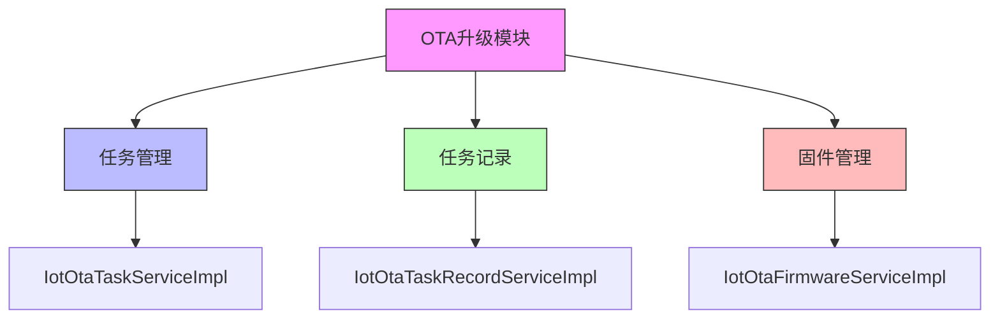
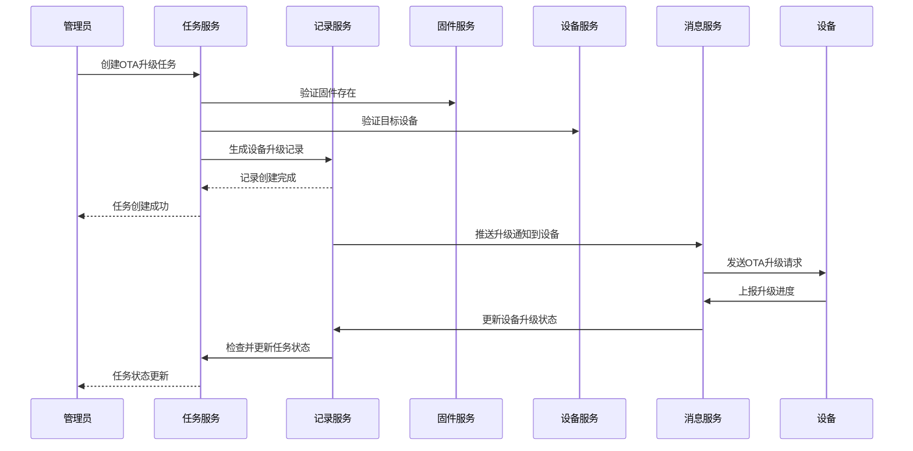

# OTA (Over-The-Air) 升级模块

## 概述

OTA (Over-The-Air) 升级模块是物联网平台的核心组件，负责管理固件的远程升级过程。该模块提供了完整的固件升级生命周期管理，包括固件上传、升级任务创建、设备升级进度跟踪以及任务状态监控等功能。

通过该模块，管理员可以：
- 上传和管理固件文件
- 创建和管理OTA升级任务
- 实时监控设备升级进度
- 查看升级历史记录
- 处理升级过程中的异常情况

## 架构概述

OTA模块采用分层架构设计，主要由以下三个子模块组成：

### 子模块说明

1. [任务管理](ota_4_task_management.md)：负责OTA升级任务的创建、取消、状态更新等业务逻辑
2. [任务记录](ota_4_task_records.md)：负责跟踪单个设备在OTA任务中的升级进度和状态
3. [固件管理](ota_4_firmware_management.md)：负责固件文件的上传、存储、版本管理等功能

### 工作流程

OTA升级过程遵循以下工作流程：

## 功能特点

1. **完整的升级生命周期管理**：从固件上传到升级完成的全过程管理
2. **灵活的设备范围选择**：支持按设备选择或全量升级
3. **实时进度监控**：提供设备升级进度的实时更新
4. **故障自动处理**：自动处理升级过程中的异常情况
5. **可取消的升级任务**：支持对进行中的升级任务进行取消
6. **详细的升级记录**：保存完整的升级历史供审计和分析

## 与其他模块的关系

OTA模块主要与以下模块交互：

- [设备管理模块](../device/device.md)：获取目标设备信息和更新设备固件版本
- [产品管理模块](../product/product.md)：验证固件与产品的关联关系
- [消息服务模块](../message/message.md)：通过MQTT等协议向设备推送升级指令
- [作业调度模块](../job/job.md)：支持定时升级任务的自动执行

有关这些相关模块的详细信息，请参考它们各自的文档。

## 使用场景

1. **固件版本升级**：当有新版本固件可用时，通过OTA模块将固件推送到现场设备
2. **批量设备更新**：支持一次性将固件更新到数千台设备
3. **分阶段发布**：可以先在小范围设备上测试新固件，验证无误后再扩大范围
4. **故障恢复**：当设备因固件问题出现故障时，可以通过OTA推送修复固件
5. **功能增强**：通过OTA升级为设备添加新功能或改进现有功能

## 安全考虑

1. **固件完整性验证**：所有固件在下载后会进行MD5校验以确保文件完整性
2. **权限控制**：只有授权的管理员可以创建和管理OTA升级任务
3. **设备身份验证**：设备在接收升级指令前需要通过身份验证
4. **传输加密**：升级过程中的数据传输采用加密通道
5. **回滚机制**：支持在升级失败时自动回滚到之前的固件版本

## 性能指标

1. **并发处理能力**：支持同时处理多个升级任务
2. **设备扩展性**：能够支持数万台设备的并发升级
3. **响应延迟**：任务创建和状态查询响应时间小于200ms
4. **带宽占用**：采用增量更新和压缩传输以降低网络带宽消耗