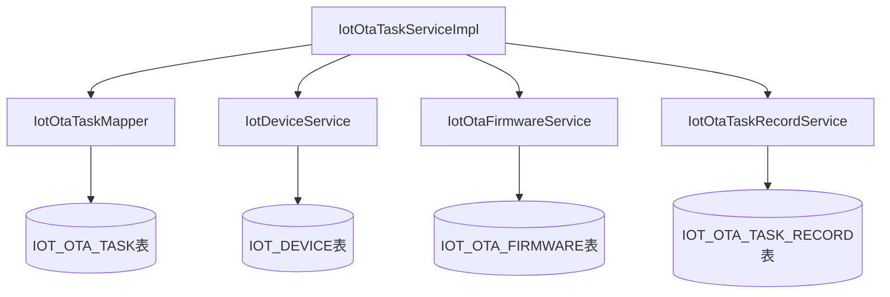
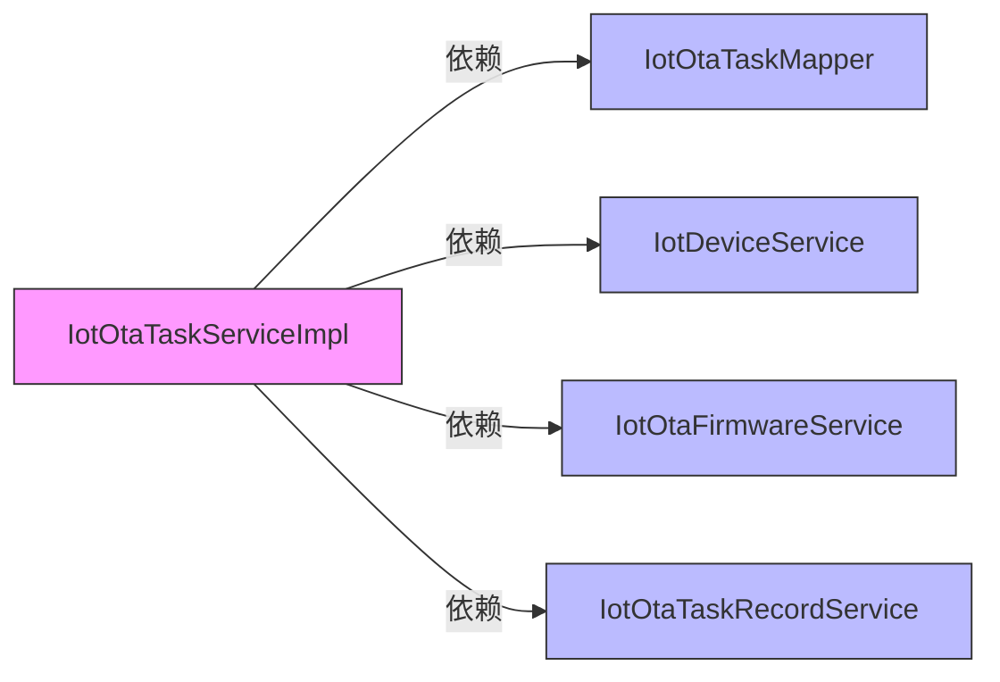
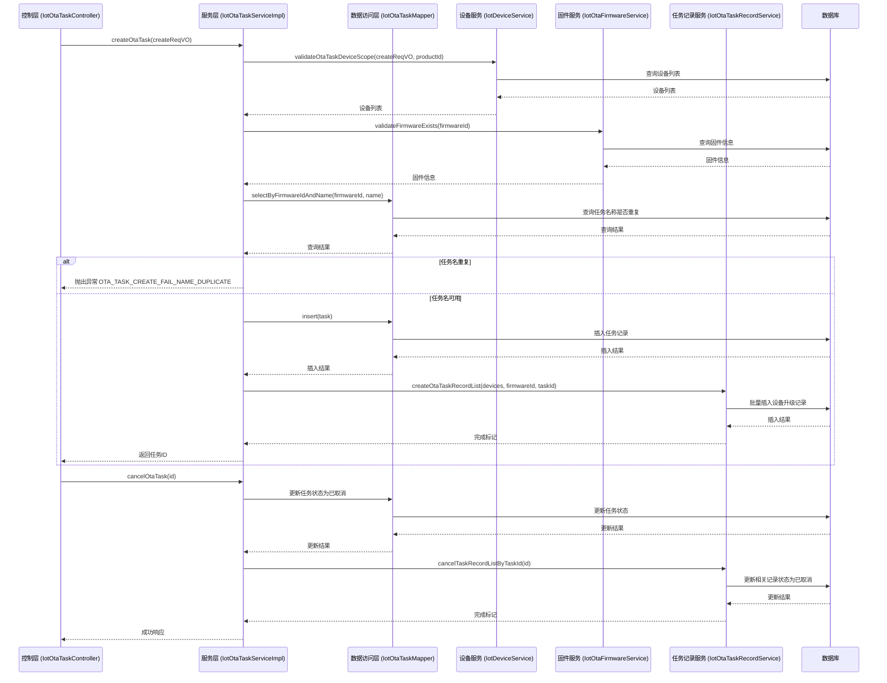
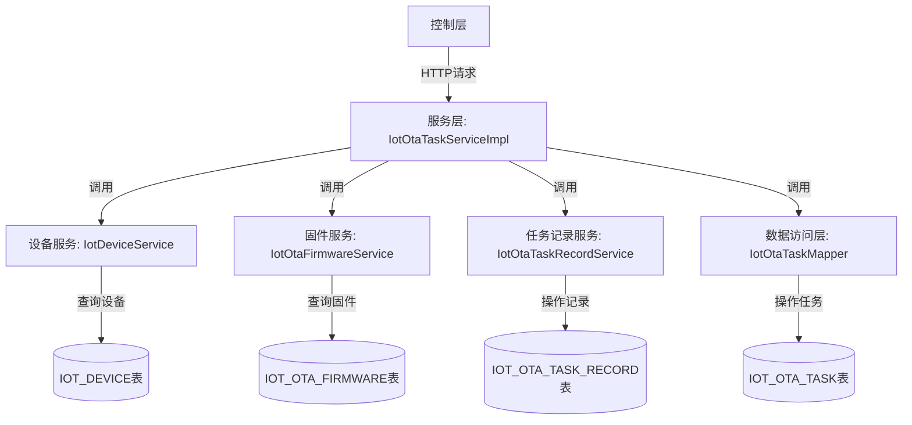
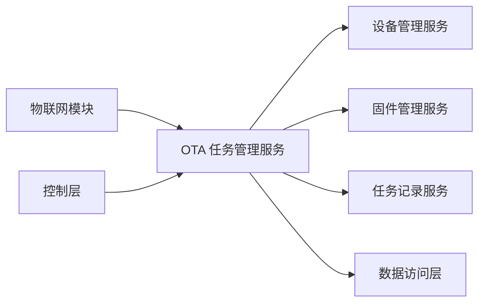

# OTA 任务管理模块文档

## 模块概述

OTA 任务管理模块（IotOtaTaskServiceImpl）负责物联网设备的固件升级任务的创建、管理和监控。它协调固件、设备和升级记录之间的关系，确保固件升级任务的正确执行和状态追踪。

### 核心功能
- 创建固件升级任务，包括固件验证、设备范围验证和任务初始化
- 取消正在进行的升级任务
- 管理设备升级范围（全部设备或指定设备）
- 跟踪任务中的设备升级进度和状态
- 与设备服务、固件服务和任务记录服务协作完成升级流程

### 在系统中的位置
该模块位于物联网模块的服务层（service/ota），是 OTA 升级功能的核心业务逻辑实现。它接收来自控制层（IotOtaTaskController）的请求，并协调底层数据访问层（DAO）和其他服务（设备服务、固件服务、任务记录服务）来完成业务操作。

## 架构设计

### 组件关系图

### 依赖关系图

### 数据流图

### 组件交互图

## 详细设计

### 核心类说明

#### IotOtaTaskServiceImpl
- **类注解**：`@Service`, `@Validated`, `@Slf4j`
- **主要职责**：实现 IotOtaTaskService 接口，提供 OTA 任务的创建和取消功能
- **关键依赖**：
  - `IotOtaTaskMapper`: 数据访问层接口，用于 IOT_OTA_TASK 表的操作
  - `IotDeviceService`: 设备服务，用于验证和获取设备信息
  - `IotOtaFirmwareService`: 固件服务，用于验证和获取固件信息
  - `IotOtaTaskRecordService`: 任务记录服务，用于管理设备升级记录

### 关键方法说明

#### createOtaTask(IotOtaTaskCreateReqVO createReqVO)
**功能**：创建一个新的 OTA 升级任务  
**参数**：
- `createReqVO`: 创建任务的请求对象，包含任务名称、描述、固件ID、设备范围等信息  
**返回值**：新创建任务的ID  
**异常**：
- `OTA_TASK_CREATE_FAIL_NAME_DUPLICATE`: 当同一固件下已存在同名任务时抛出  
**步骤**：
1. 验证固件是否存在（通过 IotOtaFirmwareService.validateFirmwareExists）
2. 检查同一固件下是否已存在同名任务（通过 IotOtaTaskMapper.selectByFirmwareIdAndName）
3. 验证设备范围信息（通过 validateOtaTaskDeviceScope 方法，调用 IotDeviceService 获取设备列表）
4. 创建任务对象，设置初始状态为进行中，设备总数和成功数
5. 保存任务到数据库（通过 IotOtaTaskMapper.insert）
6. 为任务中的所有设备创建升级记录（通过 IotOtaTaskRecordService.createOtaTaskRecordList）

#### cancelOtaTask(Long id)
**功能**：取消指定ID的 OTA 升级任务  
**参数**：
- `id`: 要取消的任务ID  
**返回值**：无  
**异常**：可能抛出数据库访问异常  
**步骤**：
1. 将任务状态更新为已取消（通过 IotOtaTaskMapper.updateByIdAndStatus）
2. 取消该任务下所有未完成的升级记录（通过 IotOtaTaskRecordService.cancelTaskRecordListByTaskId）

### 异常处理
- 使用 `ServiceExceptionUtil.exception` 方法封装业务异常，统一错误码和消息
- 主要业务异常：`OTA_TASK_CREATE_FAIL_NAME_DUPLICATE`（任务名称重复）
- 数据库访问异常由 Spring 事务管理器回滚并向上抛出

### 事务管理
- 两个公共方法（`createOtaTask` 和 `cancelOtaTask`）均使用 `@Transactional(rollbackFor = Exception.class)` 注解
- 确保在创建任务时，任务创建和设备记录创建要么全部成功，要么全部回滚
- 确保在取消任务时，任务状态更新和记录状态更新要么全部成功，要么全部回滚

## 在系统中的位置

### 与其他模块的交互

### 被哪些模块调用
- **控制层**：`IotOtaTaskController` 调用此服务处理 HTTP 请求（创建任务、取消任务）
- **其他服务**：目前没有其他服务直接调用此服务（作为叶子节点服务）

### 调用哪些其他模块
- **设备管理服务**（IotDeviceService）：用于验证设备范围和获取设备列表
- **固件管理服务**（IotOtaFirmwareService）：用于验证固件存在性
- **任务记录服务**（IotOtaTaskRecordService）：用于创建和管理设备升级记录
- **数据访问层**（IotOtaTaskMapper）：用于直接操作任务表

## 接口说明

### IotOtaTaskService 接口方法
| 方法名 | 参数 | 返回值 | 说明 |
|--------|------|--------|------|
| `createOtaTask` | `IotOtaTaskCreateReqVO createReqVO` | `Long` | 创建新的 OTA 升级任务，返回任务ID |
| `cancelOtaTask` | `Long id` | `void` | 取消指定ID的 OTA 升级任务 |

### 关键数据对象说明

#### IotOtaTaskDO
对应数据库表 `iot_ota_task`，表示一个 OTA 升级任务
- `id`: 任务编号（主键）
- `name`: 任务名称
- `description`: 任务描述
- `firmwareId`: 关联的固件编号
- `status`: 任务状态（参考 IotOtaTaskStatusEnum）
- `deviceScope`: 设备升级范围（参考 IotOtaTaskDeviceScopeEnum）
- `deviceTotalCount`: 设备总数
- `deviceSuccessCount`: 升级成功的设备数量

#### IotOtaTaskRecordDO
对应数据库表 `iot_ota_task_record`，表示设备的升级记录
- `id`: 升级记录编号（主键）
- `firmwareId`: 固件编号
- `taskId`: 关联的任务编号
- `deviceId`: 设备编号
- `fromFirmwareId`: 升级前的固件编号
- `status`: 升级状态（参考 IotOtaTaskRecordStatusEnum）
- `progress`: 升级进度（百分比）
- `description`: 升级进度描述

#### 枚举类说明
- **IotOtaTaskDeviceScopeEnum**：设备升级范围
  - `ALL(1)`: 全部设备（当前产品下的所有设备）
  - `SELECT(2)`: 指定设备（需要在创建时提供具体设备列表）
- **IotOtaTaskStatusEnum**：任务状态
  - `IN_PROGRESS(10)`: 进行中（升级中）
  - `END(20)`: 已结束（包括全部成功、部分成功）
  - `CANCELED(30)`: 已取消（一般是主动取消任务）
- **IotOtaTaskRecordStatusEnum**：升级记录状态
  - `PENDING(0)`: 待推送
  - `PUSHED(10)`: 已推送
  - `UPGRADING(20)`: 升级中
  - `SUCCESS(30)`: 升级成功
  - `FAILURE(40)`: 升级失败
  - `CANCELED(50)`: 升级取消

## 配置说明
本服务无特殊配置需求，完全通过 Spring 的依赖注入获得所需依赖。所有依赖的服务和 mapper 均通过 `@Resource` 注解注入。

## 注意事项
1. **任务名称唯一性**：同一固件下的任务名称必须唯一，创建时会进行校验
2. **设备范围验证**：创建任务时会验证设备范围是否有效（例如，对于 SELECT 范围，需要确保指定的设备存在且属于同一产品）
3. **事务一致性**：创建任务和取消任务操作均在事务中完成，确保数据一致性
4. **级联操作**：取消任务时会自动取消该任务下所有相关的升级记录
5. **性能考虑**：
   - 创建任务时会根据设备范围查询可能涉及的所有设备，对于大规模设备场景需注意查询性能
   - 设备升级记录的创建是批量操作，以减少数据库交互次数
6. **扩展性**：
   - 如果需要添加新的任务状态或记录状态，只需更新对应的枚举类
   - 设备范围的扩展（例如添加按分组选择）只需修改 `validateOtaTaskDeviceScope` 方法和 `IotOtaTaskDeviceScopeEnum` 枚举

## 与其他文档的关联
- [设备管理服务文档](device_service.md)：了解 IotDeviceService 的详细实现
- [固件管理服务文档](firmware_service.md)：了解 IotOtaFirmwareService 的详细实现
- [任务记录服务文档](task_record_service.md)：了解 IotOtaTaskRecordService 的详细实现
- [OTA 任务控制器文档](ota_task_controller.md)：了解控制层如何调用此服务