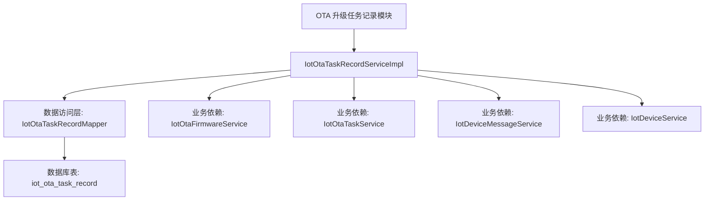
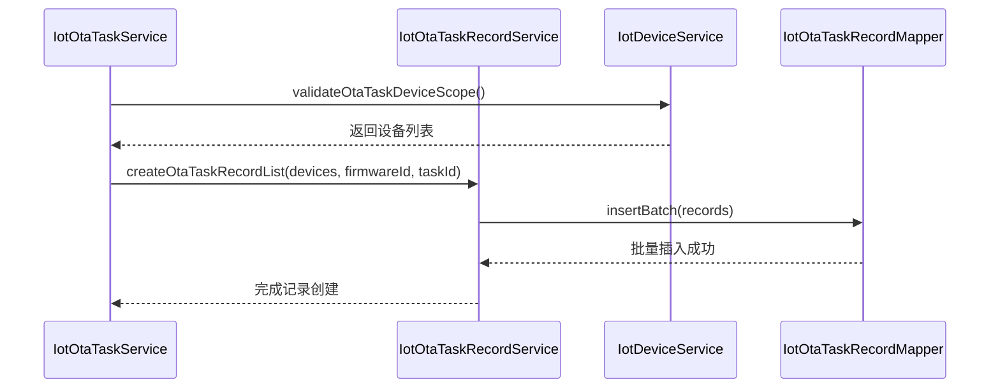
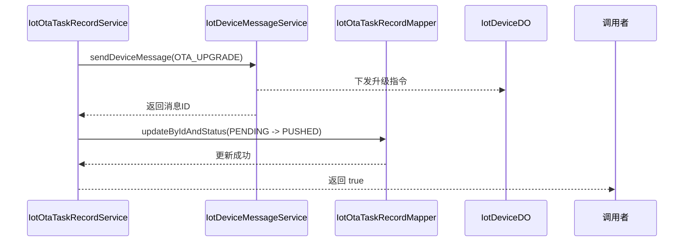
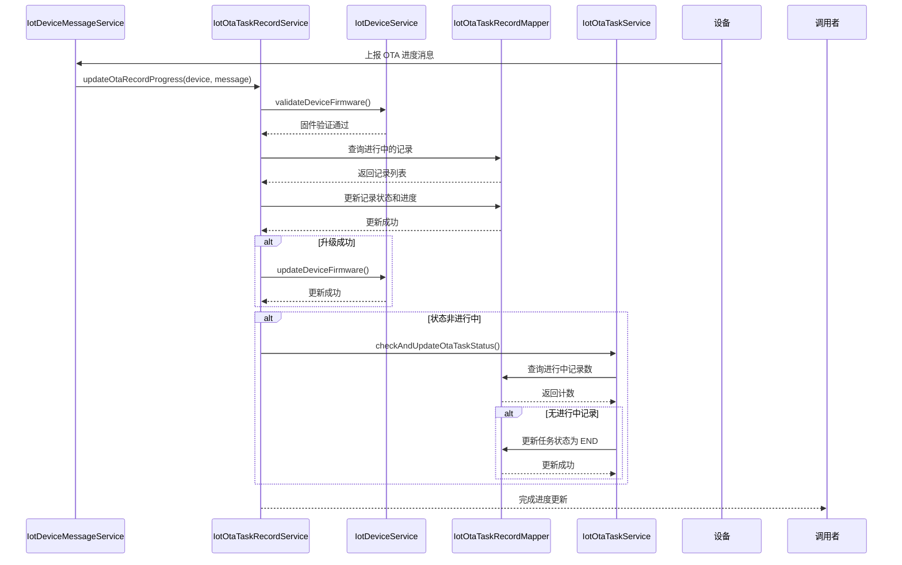
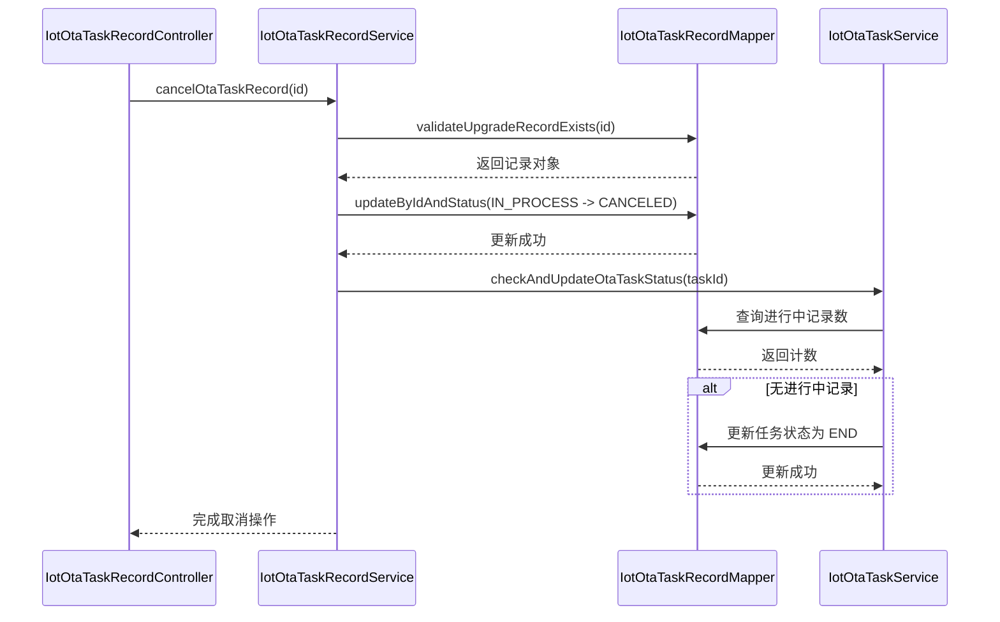
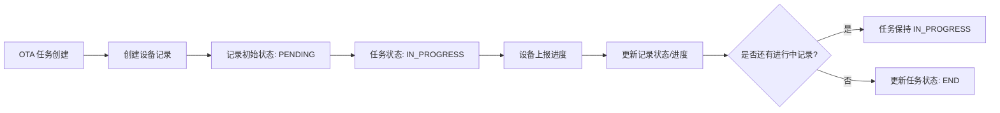
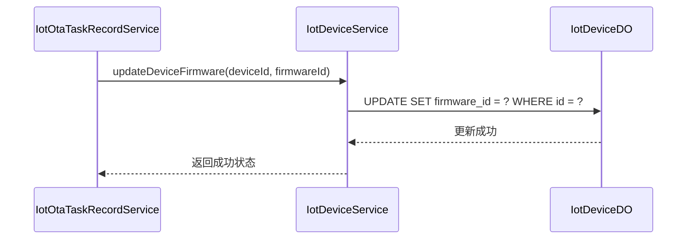
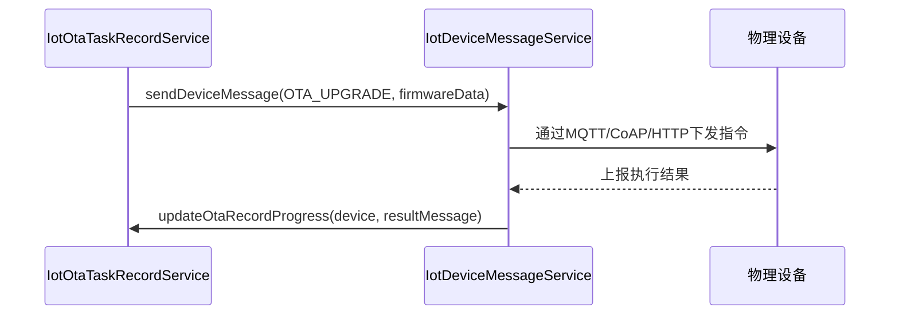

# OTA 升级任务记录模块文档

## 模块概述

OTA 升级任务记录模块（IotOtaTaskRecordServiceImpl）是物联网平台中负责管理设备固件升级任务执行记录的核心服务。该模块负责记录和追踪每个设备在 OTA 升级过程中的状态、进度和结果，为 OTA 升级任务提供完整的执行轨迹和状态监控。

该模块与 OTA 任务管理、固件管理、设备管理和设备消息服务紧密协作，形成完整的 OTA 升级解决方案。

## 核心功能

1. **记录创建**：为 OTA 任务中的每个设备创建升级记录
2. **状态管理**：追踪和更新设备升级过程中的各种状态
3. **进度追踪**：记录设备升级的进度百分比和描述信息
4. **结果处理**：处理升级成功、失败、取消等各种结果
5. **状态统计**：提供按任务和固件维度的升级状态统计
6. **任务状态协同**：根据设备记录状态自动更新父任务的整体状态

## 系统架构

### 模块定位



### 关键依赖关系

| 依赖模块 | 接口 | 作用 |
|---------|------|------|
| IotOtaTaskRecordMapper | 数据访问接口 | 执行数据库 CRUD 操作 |
| IotOtaFirmwareService | 固件服务 | 获取固件信息和版本 |
| IotOtaTaskService | 任务服务 | 协同更新任务状态 |
| IotDeviceMessageService | 设备消息服务 | 发送 OTA 升级指令 |
| IotDeviceService | 设备服务 | 更新设备固件版本 |

### 数据模型

#### IotOtaTaskRecordDO (数据对象)

| 字段名 | 类型 | 说明 | 关联关系 |
|--------|------|------|----------|
| id | Long | 升级记录编号（主键） | - |
| firmwareId | Long | 固件编号 | IotOtaFirmwareDO.id |
| taskId | Long | 任务编号 | IotOtaTaskDO.id |
| deviceId | Long | 设备编号 | IotDeviceDO.id |
| fromFirmwareId | Long | 来源固件编号 | IotDeviceDO.firmwareId |
| status | Integer | 升级状态 | IotOtaTaskRecordStatusEnum |
| progress | Integer | 升级进度（百分比） | 0-100 |
| description | String | 升级进度描述 | 最后一次进度描述 |

#### IotOtaTaskRecordStatusEnum (状态枚举)

| 枚举值 | 值 | 说明 | 所属状态组 |
|--------|----|------|------------|
| PENDING | 0 | 待推送 | 进行中 |
| PUSHED | 10 | 已推送 | 进行中 |
| UPGRADING | 20 | 升级中 | 进行中 |
| SUCCESS | 30 | 升级成功 | 已结束 |
| FAILURE | 40 | 升级失败 | 已结束 |
| CANCELED | 50 | 升级取消 | 已结束 |

**进行中状态集合**: PENDING(0), PUSHED(10), UPGRADING(20)  
**优先级状态列表**: SUCCESS(30), PENDING(0), PUSHED(10), UPGRADING(20), FAILURE(40), CANCELED(50)

## 接口规范

### IotOtaTaskRecordService 接口方法

| 方法名 | 参数 | 返回值 | 功能描述 |
|--------|------|--------|----------|
| createOtaTaskRecordList | List<IotDeviceDO> devices, Long firmwareId, Long taskId | void | 为指定设备列表创建 OTA 升级记录 |
| getOtaTaskRecordStatusStatistics | Long firmwareId, Long taskId | Map<Integer, Long> | 按状态统计 OTA 记录数量 |
| getOtaTaskRecord | Long id | IotOtaTaskRecordDO | 根据 ID 获取单条 OTA 记录 |
| getOtaTaskRecordPage | IotOtaTaskRecordPageReqVO pageReqVO | PageResult<IotOtaTaskRecordDO> | 分页查询 OTA 记录 |
| cancelTaskRecordListByTaskId | Long taskId | void | 根据任务 ID 批量取消进行中的记录 |
| getOtaTaskRecordListByDeviceIdAndStatus | Set<Long> deviceIds, Set<Integer> statuses | List<IotOtaTaskRecordDO> | 根据设备 ID 和状态查询记录 |
| getOtaRecordListByStatus | Integer status | List<IotOtaTaskRecordDO> | 根据状态获取记录列表 |
| cancelOtaTaskRecord | Long id | void | 取消单条 OTA 记录 |
| pushOtaTaskRecord | IotOtaTaskRecordDO record, IotOtaFirmwareDO firmware, IotDeviceDO device | boolean | 推送 OTA 任务到设备 |
| updateOtaRecordProgress | IotDeviceDO device, IotDeviceMessage message | void | 根据设备消息更新 OTA 记录进度 |

### RESTful API 接口

#### 获取 OTA 升级记录状态统计
- **路径**: `/iot/ota/task/record/get-status-statistics`
- **方法**: GET
- **参数**:
  - firmwareId (Long, 可选): 固件编号
  - taskId (Long, 可选): 升级任务编号
- **返回**: `Map<Integer, Long>` - 键为状态码，值为对应状态的记录数量
- **权限**: `iot:ota-task-record:query`

#### 分页查询 OTA 升级记录
- **路径**: `/iot/ota/task/record/page`
- **方法**: GET
- **参数**: IotOtaTaskRecordPageReqVO
  - taskId (Long, 可选): 升级任务编号
  - status (Integer, 可选): 升级记录状态
  - 分页参数 (pageNo, pageSize)
- **返回**: `PageResult<IotOtaTaskRecordRespVO>` - 分页的 OTA 记录列表
- **权限**: `iot:ota-task-record:query`

#### 获取单条 OTA 升级记录
- **路径**: `/iot/ota/task/record/get`
- **方法**: GET
- **参数**:
  - id (Long, 必填): 升级记录编号
- **返回**: `IotOtaTaskRecordRespVO` - OTA 记录详情
- **权限**: `iot:ota-task-record:query`

#### 取消 OTA 升级记录
- **路径**: `/iot/ota/task/record/cancel`
- **方法**: PUT
- **参数**:
  - id (Long, 必填): 升级记录编号
- **返回**: `Boolean` - 操作是否成功
- **权限**: `iot:ota-task-record:cancel`

## 业务流程

### 1. OTA 任务创建时的记录初始化



### 2. OTA 任务推送流程



### 3. 设备上报进度更新流程



### 4. 记录取消流程



## 数据库表结构

### iot_ota_task_record 表

| 列名 | 类型 | 约束 | 说明 |
|------|------|------|------|
| id | BIGINT | PRIMARY KEY | 升级记录编号 |
| firmware_id | BIGINT | NOT NULL | 固件编号 |
| task_id | BIGINT | NOT NULL | 任务编号 |
| device_id | BIGINT | NOT NULL | 设备编号 |
| from_firmware_id | BIGINT | NULLABLE | 来源固件编号 |
| status | INT | NOT NULL | 升级状态 |
| progress | INT | NULLABLE | 升级进度（百分比） |
| description | VARCHAR | NULLABLE | 升级进度描述 |
| create_time | DATETIME | NOT NULL | 创建时间 |
| update_time | DATETIME | NOT NULL | 更新时间 |

**索引**:
- 主键索引: `id`
- 普通索引: `task_id`, `device_id`, `status`

## 关键实现细节

### 状态转换逻辑

1. **初始状态**: 创建时设置为 `PENDING(0)` 
2. **推送状态**: 成功下发后变为 `PUSHED(10)`
3. **升级过程**: 设备上报进度时变为 `UPGRADING(20)`
4. **完成状态**: 
   - 成功: `SUCCESS(30)`
   - 失败: `FAILURE(40)`
   - 取消: `CANCELED(50)`

### 进度更新规则

- 进度值必须在 0-100 范围内
- 只保存最新的进度描述，历史详情可查询设备消息表
- 进度更新同时更新状态和描述字段

### 任务状态协同机制

当设备记录状态发生变化时，系统会检查对应任务下是否还有进行中的记录：
- 如果还有进行中的记录（PENDING/PUSHED/UPGRADING），任务保持进行中状态
- 如果没有进行中的记录，自动将任务状态更新为已结束（END）

### 批量操作优化

- 创建记录时使用批量插入（insertBatch）
- 取消记录时使用批量更新（updateListByIdAndStatus）
- 状态统计使用预初始化映射减少查询开销

## 与其他模块的交互

### 与 OTA 任务模块的关系



### 与设备模块的关系



### 与设备消息模块的关系



## 错误处理

### 常见异常情况

| 错误码 | 说明 | 触发条件 |
|--------|------|----------|
| OTA_TASK_RECORD_NOT_EXISTS | OTA 任务记录不存在 | 尝试操作不存在的记录 ID |
| OTA_TASK_RECORD_CANCEL_FAIL_STATUS_ERROR | 取消 OTA 任务记录失败 | 记录状态不在进行中范围内 |
| OTA_TASK_RECORD_UPDATE_PROGRESS_FAIL_NO_EXISTS | 更新 OTA 记录进度失败 | 设备没有进行中的记录 |
| OTA_FIRMWARE_NOT_EXISTS | OTA 固件不存在 | 根据产品ID和版本查找不到固件 |

### 异常处理机制

1. **参数验证**: 使用 Hutool 工具类进行非空、范围验证
2. **业务校验**: 通过断言（Assert）验证关键业务条件
3. **异常转换**: 将底层异常包装为业务异常，提供友好的错误信息
4. **事务回滚**: 关键操作使用 @Transactional 确保数据一致性

## 性能考虑

### 查询优化

1. **选择性查询**: 在状态统计查询中只选择必要的字段（deviceId, status）
2. **索引利用**: 所有查询都利用了合适的索引（task_id, device_id, status）
3. **批量操作**: 创建和取消操作使用批处理减少数据库交互次数

### 缓存策略

当前实现中没有显式缓存，但通过以下方式提升性能：
- 状态枚举值预计算（PRIORITY_STATUSES, IN_PROCESS_STATUSES）
- 批量数据库操作减少网络开销
- 关联查询在服务层完成（如设备名称、固件版本填充）

## 使用示例

### 创建 OTA 任务记录

```java
// 在 OTA 任务创建过程中自动调用
List<IotDeviceDO> devices = deviceService.getDeviceListByProductId(productId);
otaTaskRecordService.createOtaTaskRecordList(devices, firmwareId, taskId);
```

### 查询任务状态统计

```java
// 获取特定任务和固件的状态分布
Map<Integer, Long> statusStats = otaTaskRecordService.getOtaTaskRecordStatusStatistics(
    firmwareId, taskId);
// 例如返回: {0=5, 10=3, 20=2, 30=10, 40=1, 50=0}
// 表示: 5个待推送, 3个已推送, 2个升级中, 10个成功, 1个失败, 0个取消
```

### 处理设备上报进度

```java
// 在设备消息处理器中调用
@Override
public void onMessageReceived(IotDeviceDO device, IotDeviceMessage message) {
    if (IotDeviceMessageMethodEnum.OTA_PROGRESS.getMethod().equals(method)) {
        otaTaskRecordService.updateOtaRecordProgress(device, message);
    }
}
```

### 取消单个记录

```java
// 通过 API 调用或内部服务调用
otaTaskRecordService.cancelOtaTaskRecord(recordId);
```

## 最佳实践

1. **状态一致性**: 确保状态转换遵循定义的流程，避免非法状态跳转
2. **事务边界**: 在涉及多个表更新的操作中使用事务保证数据一致性
3. **错误恢复**: 对于网络或设备通信失败的情况，保留原状态便于重试
4. **监控友好**: 通过状态统计接口提供监控仪表盘所需的数据
5. **历史追溯**: 详细的过程信息保存在设备消息表中，记录表只保留最新状态

## 与相关模块的关联文档

- [OTA 任务管理模块](ota_3_task_management.md): 了解如何创建和管理 OTA 升级任务
- [OTA 固件管理模块](ota_4_firmware_management.md): 了解固件版本管理和分发
- [设备管理模块](device_7_service.md): 了解设备信息和固件版本维护
- [设备消息服务](message_11_service.md): 了解设备通信机制和消息格式

## 结论

OTA 升级任务记录模块是物联网平台 OTA 解决方案的核心组件之一，负责追踪和管理每个设备的升级过程。通过精心设计的状态机制、高效的数据库操作以及与其他模块的紧密协作，该模块提供了可靠的升级监控和管理能力。

该模块的设计遵循了单一职责原则，专注于记录管理，而将实际的设备通信委托给设备消息服务，将任务协调委托给任务服务，形成了清晰的职责分离和良好的可维护性。