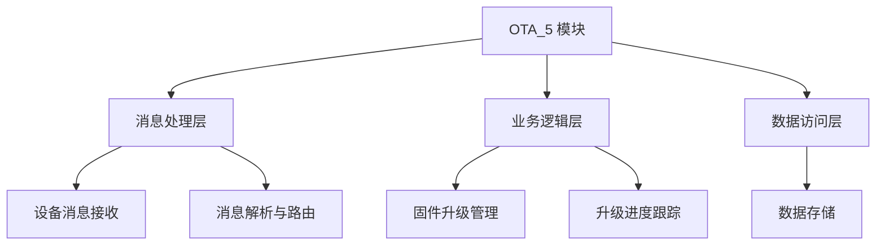
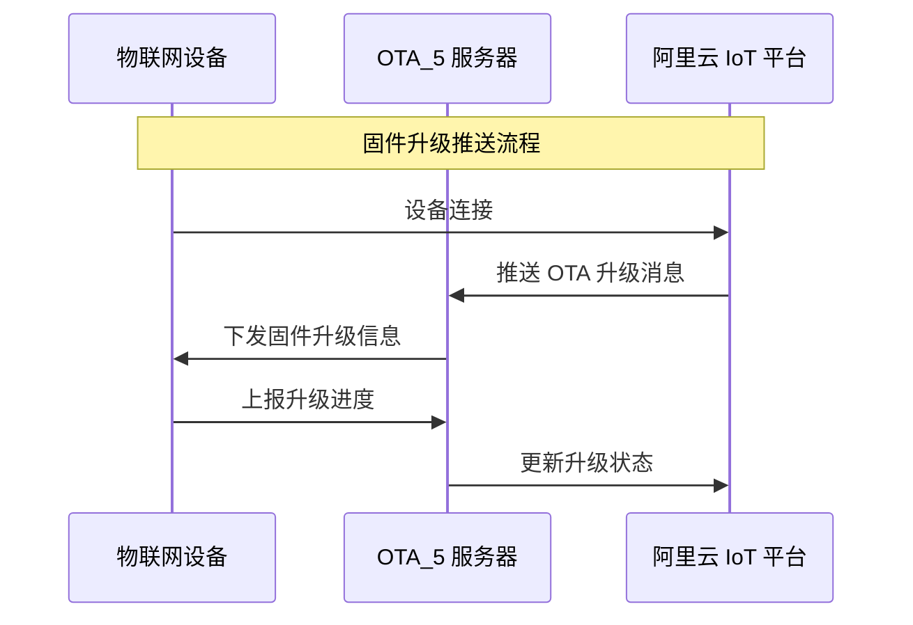

# OTA_5 模块文档

## 1. 概述

**OTA_5** 模块是物联网 (IoT) 系统中的一个核心组件，主要负责设备固件的远程升级管理。该模块通过与阿里云 IoT 平台的集成，实现设备固件的推送、升级进度跟踪以及状态管理。

### 1.1 功能特性

- **固件升级推送**: 向设备推送新的固件版本信息，包括下载地址、文件大小、摘要等。
- **升级进度上报**: 接收设备上报的升级进度信息，实时跟踪升级状态。
- **状态管理**: 管理设备的固件版本、升级状态等信息。
- **消息通信**: 基于阿里云 IoT 平台的消息通信机制，实现设备与服务器之间的消息交互。

### 1.2 适用场景

- 物联网设备固件远程升级
- 设备固件版本管理
- 升级进度实时监控

---

## 2. 架构设计

### 2.1 模块结构



### 2.2 核心组件

| 组件名称 | 功能描述 |
|----------|----------|
| `IotDeviceOtaUpgradeReqDTO` | 设备固件升级推送请求 DTO，用于下行消息参数。 |
| `IotDeviceOtaProgressReqDTO` | 设备升级进度上报请求 DTO，用于上行消息参数。 |
| `IotDeviceMessageMethodEnum` | 设备消息方法枚举，定义消息类型和方向。 |

### 2.3 消息流转



---

## 3. 详细设计

### 3.1 消息定义

#### 3.1.1 `IotDeviceOtaUpgradeReqDTO`

用于下行消息，向设备推送固件升级信息。

**字段说明:**

| 字段名 | 类型 | 必填 | 描述 |
|--------|------|------|------|
| `version` | String | 是 | 固件版本号 |
| `fileUrl` | String | 是 | 固件文件下载地址 |
| `fileSize` | Long | 是 | 固件文件大小（字节） |
| `fileDigestAlgorithm` | String | 是 | 固件文件摘要算法 |
| `fileDigestValue` | String | 是 | 固件文件摘要值 |

**示例:**
```json
{
  "version": "1.0.0",
  "fileUrl": "https://example.com/firmware/1.0.0.bin",
  "fileSize": 1024,
  "fileDigestAlgorithm": "MD5",
  "fileDigestValue": "abc123def456"
}
```

#### 3.1.2 `IotDeviceOtaProgressReqDTO`

用于上行消息，设备上报升级进度。

**字段说明:**

| 字段名 | 类型 | 必填 | 描述 |
|--------|------|------|------|
| `version` | String | 是 | 固件版本号 |
| `status` | Integer | 是 | 升级状态（0: 升级中, 1: 升级成功, 2: 升级失败） |
| `description` | String | 否 | 描述信息 |
| `progress` | Integer | 是 | 升级进度（0-100） |

**示例:**
```json
{
  "version": "1.0.0",
  "status": 1,
  "description": "升级成功",
  "progress": 100
}
```

### 3.2 消息方法枚举

`IotDeviceMessageMethodEnum` 定义了设备消息的类型和方向，其中与 OTA 相关的方法包括：

| 方法名 | 方法值 | 方向 | 描述 |
|--------|--------|------|------|
| `OTA_UPGRADE` | `thing.ota.upgrade` | 下行 | OTA 固件信息推送 |
| `OTA_PROGRESS` | `thing.ota.progress` | 上行 | OTA 升级进度上报 |

**注意:**
- `OTA_PROGRESS` 方法不需要回复，参考阿里云 IoT 平台的设计。

---

## 4. API 接口

### 4.1 消息接收与处理

#### 4.1.1 设备消息接收

**接口描述:**
接收来自阿里云 IoT 平台的设备消息，并根据消息类型进行路由处理。

**请求参数:**
```json
{
  "method": "thing.ota.upgrade",
  "params": {
    "version": "1.0.0",
    "fileUrl": "https://example.com/firmware/1.0.0.bin",
    "fileSize": 1024,
    "fileDigestAlgorithm": "MD5",
    "fileDigestValue": "abc123def456"
  }
}
```

**响应参数:**
```json
{
  "code": 200,
  "msg": "成功"
}
```

### 4.2 固件升级管理

#### 4.2.1 推送固件升级信息

**接口描述:**
向指定设备推送固件升级信息。

**请求参数:**
```json
{
  "deviceId": "device123",
  "otaUpgradeReq": {
    "version": "1.0.0",
    "fileUrl": "https://example.com/firmware/1.0.0.bin",
    "fileSize": 1024,
    "fileDigestAlgorithm": "MD5",
    "fileDigestValue": "abc123def456"
  }
}
```

**响应参数:**
```json
{
  "code": 200,
  "msg": "推送成功"
}
```

#### 4.2.2 查询设备升级状态

**接口描述:**
查询设备的固件升级状态。

**请求参数:**
```json
{
  "deviceId": "device123"
}
```

**响应参数:**
```json
{
  "code": 200,
  "msg": "成功",
  "data": {
    "version": "1.0.0",
    "status": 1,
    "progress": 100,
    "updateTime": "2023-10-01 12:00:00"
  }
}
```

---

## 5. 数据存储

### 5.1 数据库表结构

#### 5.1.1 `iot_ota_firmware` 表
存储固件信息。

| 字段名 | 类型 | 描述 |
|--------|------|------|
| `id` | BIGINT | 主键 |
| `product_key` | VARCHAR | 产品 Key |
| `version` | VARCHAR | 固件版本号 |
| `file_url` | VARCHAR | 固件文件地址 |
| `file_size` | BIGINT | 文件大小 |
| `file_digest_algorithm` | VARCHAR | 摘要算法 |
| `file_digest_value` | VARCHAR | 摘要值 |
| `status` | INT | 状态（0: 草稿, 1: 已发布, 2: 已停用） |
| `remark` | VARCHAR | 备注 |
| `creator` | VARCHAR | 创建人 |
| `create_time` | DATETIME | 创建时间 |
| `updater` | VARCHAR | 更新人 |
| `update_time` | DATETIME | 更新时间 |

#### 5.1.2 `iot_ota_task` 表
存储 OTA 升级任务。

| 字段名 | 类型 | 描述 |
|--------|------|------|
| `id` | BIGINT | 主键 |
| `task_name` | VARCHAR | 任务名称 |
| `product_key` | VARCHAR | 产品 Key |
| `firmware_version` | VARCHAR | 固件版本号 |
| `target_version` | VARCHAR | 目标版本号 |
| `status` | INT | 状态（0: 待发布, 1: 进行中, 2: 已完成, 3: 已停止） |
| `strategy` | INT | 升级策略（0: 自动, 1: 手动） |
| `creator` | VARCHAR | 创建人 |
| `create_time` | DATETIME | 创建时间 |
| `updater` | VARCHAR | 更新人 |
| `update_time` | DATETIME | 更新时间 |

#### 5.1.3 `iot_ota_task_record` 表
存储 OTA 升级任务记录。

| 字段名 | 类型 | 描述 |
|--------|------|------|
| `id` | BIGINT | 主键 |
| `task_id` | BIGINT | 任务 ID |
| `device_id` | VARCHAR | 设备 ID |
| `version` | VARCHAR | 固件版本号 |
| `status` | INT | 状态（0: 待升级, 1: 升级中, 2: 升级成功, 3: 升级失败） |
| `progress` | INT | 升级进度（0-100） |
| `description` | VARCHAR | 描述信息 |
| `creator` | VARCHAR | 创建人 |
| `create_time` | DATETIME | 创建时间 |
| `updater` | VARCHAR | 更新人 |
| `update_time` | DATETIME | 更新时间 |

---

## 6. 集成指南

### 6.1 与阿里云 IoT 平台集成

#### 6.1.1 配置阿里云 IoT 平台

1. **创建产品与设备:**
   - 在阿里云 IoT 平台创建产品，并添加设备。
   - 获取产品 `ProductKey` 和设备 `DeviceName`。

2. **配置 Topic:**
   - 订阅阿里云 IoT 平台的 OTA 相关 Topic。
   - 例如：`/ota/upgrade/{productKey}/{deviceName}`。

#### 6.1.2 消息处理

- **下行消息:** 当阿里云 IoT 平台推送 OTA 升级消息时，服务器接收并解析消息，调用 `IotDeviceOtaUpgradeReqDTO` 进行处理。
- **上行消息:** 设备上报升级进度时，服务器接收并解析消息，调用 `IotDeviceOtaProgressReqDTO` 进行处理。

### 6.2 与设备端集成

#### 6.2.1 设备端消息接收

设备端需要实现以下逻辑：

1. **订阅 OTA 升级 Topic:**
   ```c
   // 伪代码
   void onMessageReceived(char* topic, char* payload) {
       if (strcmp(topic, "/ota/upgrade/yourProductKey/yourDeviceName") == 0) {
           // 解析 payload 为 IotDeviceOtaUpgradeReqDTO
           // 开始下载固件并升级
       }
   }
   ```

2. **上报升级进度:**
   ```c
   // 伪代码
   void reportOtaProgress(int progress, int status, char* description) {
       IotDeviceOtaProgressReqDTO progressReq = {
           .version = "1.0.0",
           .status = status,
           .description = description,
           .progress = progress
       };
       // 发送消息到阿里云 IoT 平台
   }
   ```

---

## 7. 最佳实践

### 7.1 固件版本管理

- **版本命名规范:** 使用语义化版本号（如 `1.0.0`），便于版本追踪。
- **固件文件存储:** 使用对象存储（如阿里云 OSS）存储固件文件，确保高可用和安全。
- **固件摘要校验:** 使用 `fileDigestAlgorithm` 和 `fileDigestValue` 校验固件完整性。

### 7.2 升级策略

- **自动升级:** 适用于紧急安全补丁或小版本更新。
- **手动升级:** 适用于大版本更新或需要用户确认的场景。
- **分批升级:** 避免大量设备同时升级，导致服务器压力过大。

### 7.3 升级进度监控

- **实时监控:** 通过 `IotDeviceOtaProgressReqDTO` 上报的进度信息，实时监控升级状态。
- **异常处理:** 当升级失败时，及时通知相关人员，并提供失败原因。

---

## 8. 常见问题

### 8.1 设备无法接收到 OTA 升级消息

**可能原因:**
- 设备未正确订阅 Topic。
- 阿里云 IoT 平台消息推送失败。
- 设备端消息处理逻辑有误。

**解决方案:**
- 检查设备的 Topic 订阅配置。
- 查看阿里云 IoT 平台的消息推送日志。
- 调试设备端的消息接收和处理逻辑。

### 8.2 升级进度上报失败

**可能原因:**
- 网络连接问题。
- 设备端消息格式错误。
- 服务器消息解析失败。

**解决方案:**
- 检查设备网络连接。
- 确保消息格式符合 `IotDeviceOtaProgressReqDTO` 定义。
- 查看服务器日志，确认消息解析是否成功。

---

## 9. 参考文档

- [阿里云 IoT - OTA 升级](https://help.aliyun.com/zh/iot/user-guide/perform-ota-updates)
- [阿里云 IoT - 设备消息通信](https://help.aliyun.com/zh/iot/user-guide/device-communication)
- [阿里云 IoT - 拓扑管理](https://help.aliyun.com/zh/iot/user-guide/manage-topological-relationships)

---

## 10. 附录

### 10.1 消息格式示例

#### 10.1.1 下行消息（OTA_UPGRADE）
```json
{
  "method": "thing.ota.upgrade",
  "params": {
    "version": "1.0.0",
    "fileUrl": "https://example.com/firmware/1.0.0.bin",
    "fileSize": 1024,
    "fileDigestAlgorithm": "MD5",
    "fileDigestValue": "abc123def456"
  }
}
```

#### 10.1.2 上行消息（OTA_PROGRESS）
```json
{
  "method": "thing.ota.progress",
  "params": {
    "version": "1.0.0",
    "status": 1,
    "description": "升级成功",
    "progress": 100
  }
}
```

### 10.2 错误码定义

| 错误码 | 描述 | 解决方案 |
|--------|------|----------|
| 400 | 请求参数错误 | 检查请求参数格式 |
| 404 | 固件不存在 | 检查固件版本号是否正确 |
| 500 | 服务器内部错误 | 查看服务器日志 |

---

**注意:** 本文档仅供参考，实际开发中请根据具体业务需求进行调整。