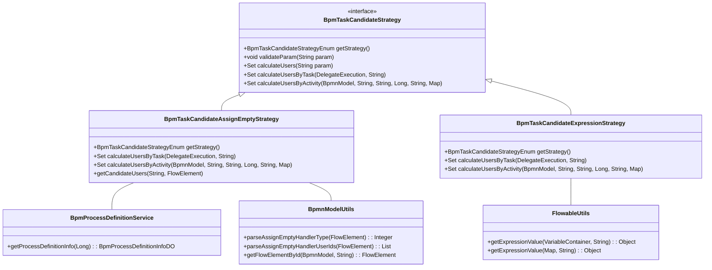
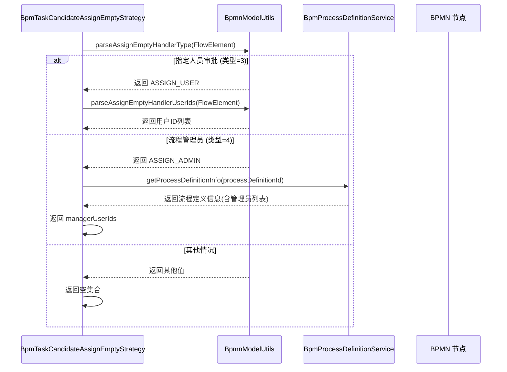
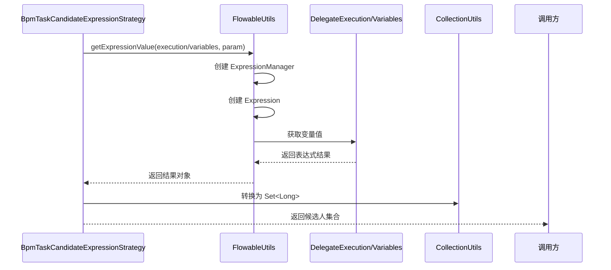

# BPM 任务候选人策略 - Other 模块

## 模块概述

`other` 模块是 BPM 模块中 Flowable 扩展的一部分，专门处理**不属于标准用户/部门/表单策略**的特殊任务候选人分配场景。该模块实现了两种特殊的候选人策略：

1. **审批人为空策略** (`ASSIGN_EMPTY`)：当用户任务未指定审批人时的兜底处理方案
2. **流程表达式策略** (`EXPRESSION`)：通过 SpEL 表达式动态计算候选人的灵活方案

这两个策略在 `BpmTaskCandidateStrategyEnum` 枚举中分别对应 `ASSIGN_EMPTY` (1) 和 `EXPRESSION` (60)，与其他策略（如用户、部门、表单等）共同构成了完整的 BPM 任务候选人分配体系。

## 架构概览



## 核心组件详解

### 1. BpmTaskCandidateAssignEmptyStrategy - 审批人为空策略

**策略类型**：`ASSIGN_EMPTY` (1)

**场景说明**：当 BPMN 流程中的用户任务节点未明确指定审批人时，该策略提供兜底处理方案。它根据流程定义中配置的"审批人为空处理类型"来决定将任务分配给谁。

**处理逻辑**：



**关键代码分析**：

```java
@Component
public class BpmTaskCandidateAssignEmptyStrategy implements BpmTaskCandidateStrategy {

    @Resource
    @Lazy
    private BpmProcessDefinitionService processDefinitionService;

    @Override
    public BpmTaskCandidateStrategyEnum getStrategy() {
        return BpmTaskCandidateStrategyEnum.ASSIGN_EMPTY;
    }

    @Override
    public Set<Long> calculateUsersByTask(DelegateExecution execution, String param) {
        return getCandidateUsers(execution.getProcessDefinitionId(), execution.getCurrentFlowElement());
    }

    @Override
    public Set<Long> calculateUsersByActivity(BpmnModel bpmnModel, String activityId, String param,
                                              Long startUserId, String processDefinitionId, Map<String, Object> processVariables) {
        FlowElement flowElement = BpmnModelUtils.getFlowElementById(bpmnModel, activityId);
        return getCandidateUsers(processDefinitionId, flowElement);
    }

    private Set<Long> getCandidateUsers(String processDefinitionId, FlowElement flowElement) {
        // 解析审批人为空的处理类型
        Integer assignEmptyHandlerType = BpmnModelUtils.parseAssignEmptyHandlerType(flowElement);
        
        // 情况一：指定人员审批
        if (Objects.equals(assignEmptyHandlerType, BpmUserTaskAssignEmptyHandlerTypeEnum.ASSIGN_USER.getType())) {
            return new HashSet<>(BpmnModelUtils.parseAssignEmptyHandlerUserIds(flowElement));
        }

        // 情况二：流程管理员
        if (Objects.equals(assignEmptyHandlerType, BpmUserTaskAssignEmptyHandlerTypeEnum.ASSIGN_ADMIN.getType())) {
            BpmProcessDefinitionInfoDO processDefinition = processDefinitionService.getProcessDefinitionInfo(processDefinitionId);
            Assert.notNull(processDefinition, "流程定义({})不存在", processDefinitionId);
            return new HashSet<>(processDefinition.getManagerUserIds());
        }

        // 都不满足，返回空
        return new HashSet<>();
    }
}
```

**审批人为空处理类型枚举** (`BpmUserTaskAssignEmptyHandlerTypeEnum`)：

| 类型 | 值 | 说明 |
|------|-----|------|
| APPROVE | 1 | 自动通过 |
| REJECT | 2 | 自动拒绝 |
| ASSIGN_USER | 3 | 指定人员审批（本策略处理） |
| ASSIGN_ADMIN | 4 | 转交给流程管理员（本策略处理） |

> **注意**：`ASSIGN_USER` 和 `ASSIGN_ADMIN` 两种类型会实际返回候选人列表，而 `APPROVE` 和 `REJECT` 类型不返回任何用户，由流程引擎自动处理。

### 2. BpmTaskCandidateExpressionStrategy - 流程表达式策略

**策略类型**：`EXPRESSION` (60)

**场景说明**：允许用户通过 SpEL (Spring Expression Language) 表达式动态计算任务候选人。这是最灵活的候选人分配方式，可以访问流程变量、执行上下文等。

**使用示例**：
- `${ownerUserId}` - 从流程变量中获取用户ID
- `${flowableContext.getVariable("assignee")}` - 获取流程变量
- `Arrays.asList(1001L, 1002L)` - 直接返回用户列表

**关键代码分析**：

```java
@Component
@Slf4j
public class BpmTaskCandidateExpressionStrategy implements BpmTaskCandidateStrategy {

    @Override
    public BpmTaskCandidateStrategyEnum getStrategy() {
        return BpmTaskCandidateStrategyEnum.EXPRESSION;
    }

    @Override
    public void validateParam(String param) {
        // 表达式不做参数校验，因为表达式本身可能很复杂
    }

    @Override
    public Set<Long> calculateUsersByTask(DelegateExecution execution, String param) {
        // 从 DelegateExecution 中解析表达式
        Object result = FlowableUtils.getExpressionValue(execution, param);
        return CollectionUtils.toLinkedHashSet(Long.class, result);
    }

    @Override
    public Set<Long> calculateUsersByActivity(BpmnModel bpmnModel, String activityId, String param,
                                              Long startUserId, String processDefinitionId, Map<String, Object> processVariables) {
        Map<String, Object> variables = processVariables == null ? new HashMap<>() : processVariables;
        try {
            // 从变量中解析表达式
            Object result = FlowableUtils.getExpressionValue(variables, param);
            return CollectionUtils.toLinkedHashSet(Long.class, result);
        } catch (FlowableException ex) {
            // 预测未运行的节点时，表达式可能引用不存在的变量，此时忽略异常
            if (ex.getCause() != null && ex.getCause() instanceof PropertyNotFoundException) {
                return Sets.newHashSet();
            }
            log.error("[calculateUsersByActivity][表达式({}) 变量({}) 解析报错", param, variables, ex);
            throw ex;
        }
    }
}
```

**表达式解析流程**：



**异常处理**：在 `calculateUsersByActivity` 方法中，当进行流程预测（未执行节点）时，如果表达式引用了不存在的流程变量，会抛出 `PropertyNotFoundException`，此时策略会返回空集合而不是报错，确保流程预测的稳定性。

## 与其他策略的关系

`other` 模块的策略与其他候选人策略共同实现了 `BpmTaskCandidateStrategy` 接口，形成完整的策略体系：

```mermaid
classDiagram
    class BpmTaskCandidateStrategy {
        <<interface>>
        +getStrategy()
        +validateParam()
        +calculateUsers()
        +calculateUsersByTask()
        +calculateUsersByActivity()
    }

    class BpmTaskCandidateUserStrategy {
        +getStrategy() = USER
    }

    class BpmTaskCandidateDeptLeaderStrategy {
        +getStrategy() = DEPT_LEADER
    }

    class BpmTaskCandidateFormUserStrategy {
        +getStrategy() = FORM_USER
    }

    class BpmTaskCandidateAssignEmptyStrategy {
        +getStrategy() = ASSIGN_EMPTY
    }

    class BpmTaskCandidateExpressionStrategy {
        +getStrategy() = EXPRESSION
    }

    BpmTaskCandidateStrategy <|-- BpmTaskCandidateUserStrategy
    BpmTaskCandidateStrategy <|-- BpmTaskCandidateDeptLeaderStrategy
    BpmTaskCandidateStrategy <|-- BpmTaskCandidateFormUserStrategy
    BpmTaskCandidateStrategy <|-- BpmTaskCandidateAssignEmptyStrategy
    BpmTaskCandidateStrategy <|-- BpmTaskCandidateExpressionStrategy

    note right of BpmTaskCandidateAssignEmptyStrategy
        审批人为空时的兜底策略
    end note

    note right of BpmTaskCandidateExpressionStrategy
        通过 SpEL 表达式动态计算
    end note
```

## 使用场景

### 场景一：审批人为空时的自动分配

在流程设计时，某些用户任务节点可能没有明确指定审批人。此时可以通过配置"审批人为空处理类型"来定义默认行为：

- **指定人员审批**：在节点扩展属性中配置 `assignEmptyHandlerType=3` 和 `assignUserIds=1001,1002`，当无审批人时自动分配给指定用户
- **流程管理员**：配置 `assignEmptyHandlerType=4`，自动分配给流程定义的管理员

### 场景二：动态表达式分配

需要根据复杂的业务逻辑动态确定审批人时，可以使用表达式策略：

```java
// 示例表达式：根据流程变量中的部门ID查找部门负责人
"${deptLeaderService.getLeaderByDeptId(departmentId)}"

// 示例表达式：多个审批人组合
"${Arrays.asList(userId1, userId2, departmentLeader.getUserId())}"

// 示例表达式：条件判断
"${status == 'CRITICAL' ? adminUserId : userId}"
```

## 依赖关系

```mermaid
graph TD
    subgraph other [other 模块]
        A[BpmTaskCandidateAssignEmptyStrategy]
        B[BpmTaskCandidateExpressionStrategy]
    end

    A --> C[BpmProcessDefinitionService]
    A --> D[BpmnModelUtils]
    B --> E[FlowableUtils]
    A --> F[BpmTaskCandidateStrategyEnum]
    A --> G[BpmUserTaskAssignEmptyHandlerTypeEnum]
    B --> H[CollectionUtils]
    B --> I[FlowableUtils]
    
    subgraph 依赖模块
        C --> [yudao-module-bpm]
        D --> [yudao-module-bpm]
        E --> [yudao-module-bpm]
        F --> [yudao-module-bpm]
        G --> [yudao-module-bpm]
        H --> [yudao-common]
        I --> [yudao-common]
    end
```

## 总结

`other` 模块提供了两种特殊的任务候选人策略，扩展了 Flowable 的候选人分配能力：

1. **`BpmTaskCandidateAssignEmptyStrategy`**：解决了流程节点未指定审批人时的分配问题，支持指定用户和流程管理员两种兜底方案
2. **`BpmTaskCandidateExpressionStrategy`**：提供了最灵活的表达式驱动分配方式，支持通过 SpEL 表达式动态计算候选人

这两个策略与用户、部门、表单等其他策略一起，构成了 BPM 模块完整的任务候选人分配体系，满足了各种复杂的业务流程审批场景需求。
