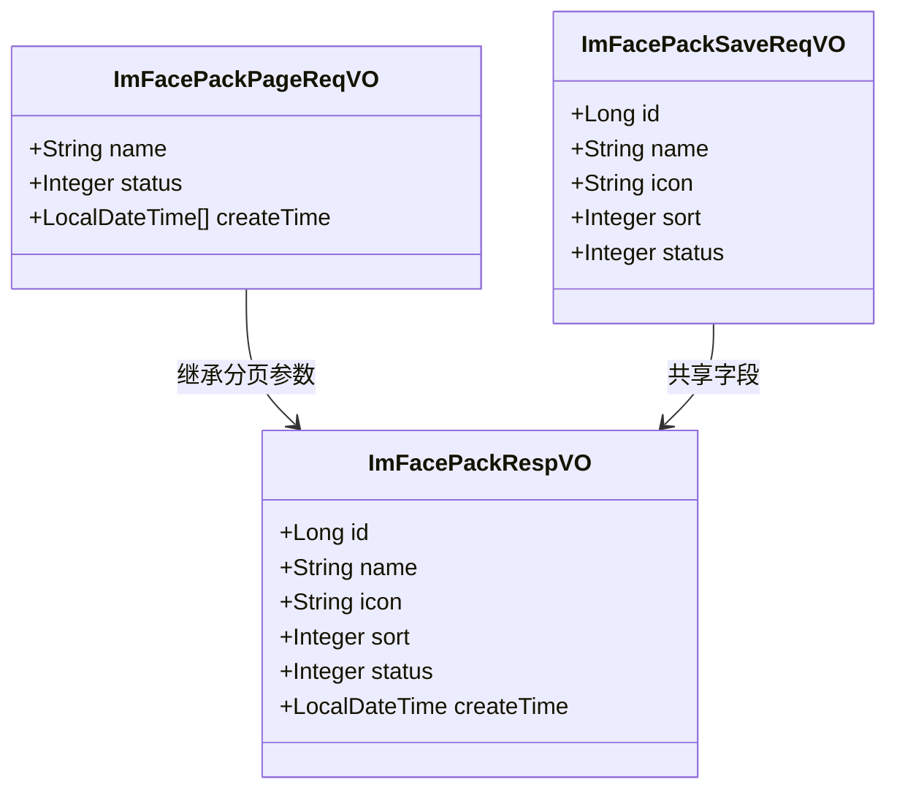
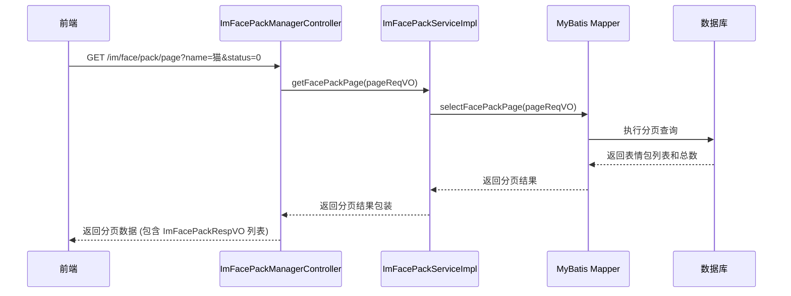

# pack_2 模块文档

## 概述

pack_2 模块是 IM（即时通讯）模块中的子模块，负责管理表情包（Face Pack）的相关功能。它提供了表情包的创建、修改、分页查询等操作的数据传输对象（DTO）和视图对象（VO）。

该模块位于 `yudao-module-im` 项目中，具体路径为：
`src/main/java/cn/iocoder/yudao/module/im/controller/admin/manager/face/vo/pack`

## 架构概述

pack_2 模块主要由三个核心组件组成，它们共同实现了表情包管理的数据传输层：

### 组件说明

1. **ImFacePackRespVO** (`ImFacePackRespVO.java`)
   - 用于表情包信息的响应视图对象
   - 包含表情包的完整信息：ID、名称、图标、排序、状态和创建时间
   - 由后端返回给前端用于展示表情包列表或详情

2. **ImFacePackSaveReqVO** (`ImFacePackSaveReqVO.java`)
   - 用于创建或修改表情包的请求对象
   - 包含表情包的基本信息：名称、图标、排序和状态
   - 包含数据验证注解（如非空、长度限制、状态枚举验证）

3. **ImFacePackPageReqVO** (`ImFacePackPageReqVO.java`)
   - 用于表情包分页查询的请求对象
   - 继承自通用分页参数类（PageParam）
   - 添加了表情包名称（模糊匹配）、状态和创建时间范围作为查询条件

## 功能说明

pack_2 模块为 IM 模块的表情包管理功能提供了数据传输层支持，主要用途包括：

- 表情包列表的分页查询（通过 ImFacePackPageReqVO）
- 表情包的创建和修改（通过 ImFacePackSaveReqVO）
- 表情包信息的返回展示（通过 ImFacePackRespVO）

这些组件通常被 IM 模块的控制器（如 `ImFacePackManagerController`）和服务层（如 `ImFacePackServiceImpl`）使用，以实现完整的表情包管理功能。

## 与其他模块的关系

pack_2 模块是 IM 模块的一部分，它依赖于以下通用组件：

- [框架通用分页参数](yudao-framework.md)：ImFacePackPageReqVO 继承自 `cn/iocoder/yudao/framework/common/pojo/PageParam`
- [框架通用状态枚举](yudao-framework.md)：使用 `CommonStatusEnum` 进行状态验证
- [框架通用验证注解](yudao-framework.md)：使用 `@NotBlank`, `@Size`, `@InEnum` 等进行参数验证

有关 IM 模块的整体架构和其他组件的详细说明，请参考 [IM 模块文档](im.md)。

## 数据流示例

以下是表情包分页查询的典型数据流：

## 使用指南

在开发过程中，如果需要扩展表情包的功能（如添加新字段），应同时修改以下文件：

1. 数据库表 `im_face_pack`（对应的 DO 类：`ImFacePackDO`）
2. 数据传输对象：`ImFacePackRespVO`, `ImFacePackSaveReqVO`, `ImFacePackPageReqVO`
3. 控制器方法：`ImFacePackManagerController` 中的相关接口
4. 服务层方法：`ImFacePackServiceImpl` 中的业务逻辑
5. MyBatis Mapper 和 XML：更新查询和插入语句

所有修改应保持前后端字段的一致性，并确保数据验证规则得到更新。