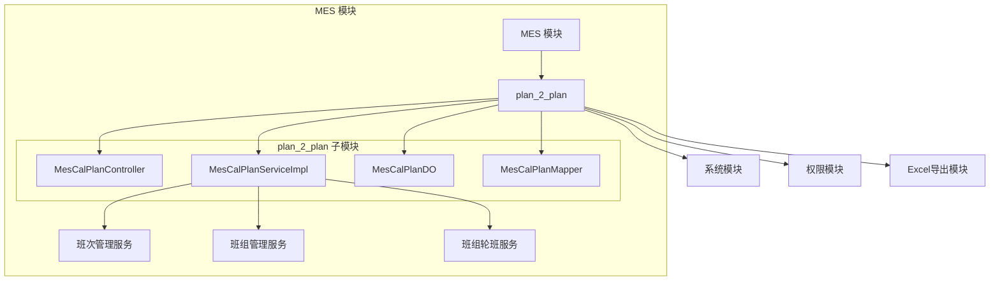
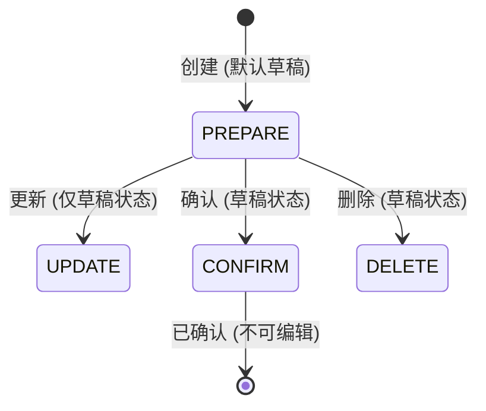
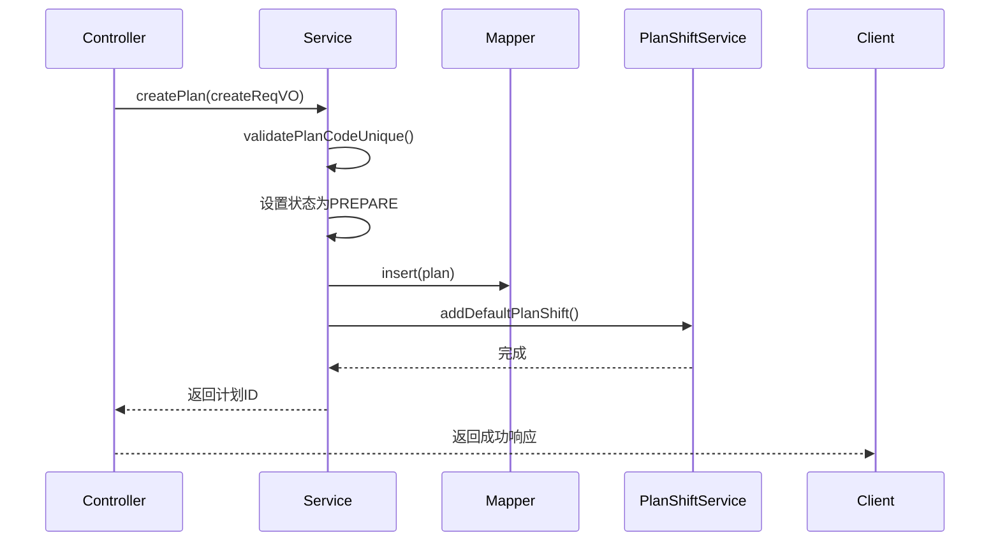
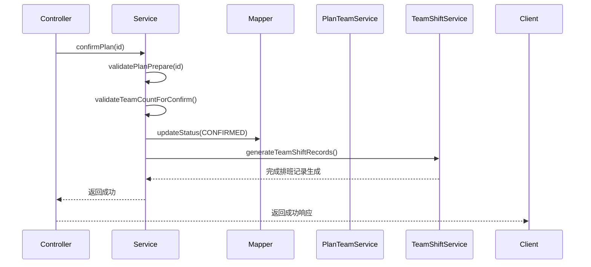
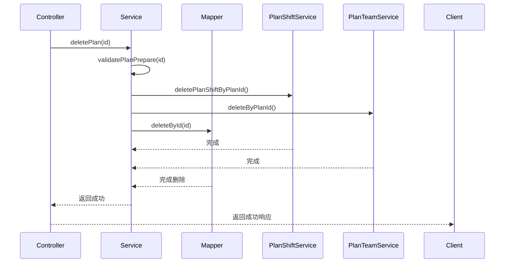
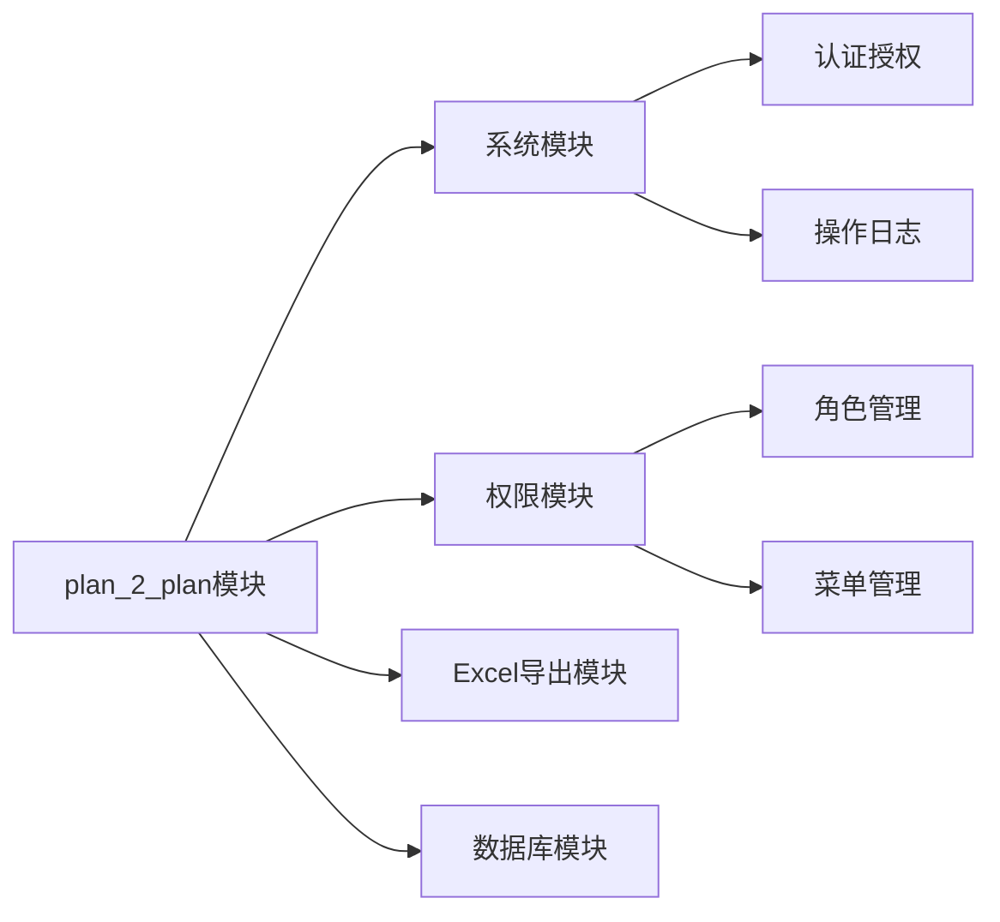

# MES 排班计划模块 (plan_2_plan) 文档

## 1. 模块概述

MES 排班计划模块是制造执行系统（MES）中的核心功能模块，用于管理生产排班计划。该模块支持创建、更新、确认和删除排班计划，并自动根据轮班方式生成班组排班记录，实现生产计划的自动化管理。

排班计划是MES系统中连接生产任务与班组执行的关键纽带，通过定义计划的时间范围、轮班方式和班组配置，为后续的生产调度提供基础数据支持。

## 2. 架构设计

### 2.1 模块关系图

### 2.2 组件关系

- **Controller**：负责接收HTTP请求，调用Service层处理业务逻辑，返回JSON响应
- **Service**：核心业务逻辑层，包含事务管理、数据校验、状态控制等
- **DO**：数据对象层，映射数据库表结构，包含字段定义和枚举类型
- **Mapper**：数据访问层，提供数据库CRUD操作

## 3. 核心组件说明

### 3.1 控制器层 (MesCalPlanController)

**文件路径**：`yudao-module-mes/src/main/java/cn/iocoder/yudao/module/mes/controller/admin/cal/plan/MesCalPlanController.java`

#### 功能概述
提供RESTful API接口，支持排班计划的完整生命周期管理：
- 创建排班计划
- 更新排班计划
- 确认排班计划
- 删除排班计划
- 查询排班计划详情
- 分页查询排班计划
- Excel导出排班计划数据

#### API接口说明

| 接口路径 | 请求方法 | 功能描述 | 权限标识 |
|---------|---------|---------|---------|
| `/mes/cal/plan/create` | POST | 创建排班计划 | `mes:cal-plan:create` |
| `/mes/cal/plan/update` | PUT | 更新排班计划 | `mes:cal-plan:update` |
| `/mes/cal/plan/confirm` | PUT | 确认排班计划 | `mes:cal-plan:update` |
| `/mes/cal/plan/delete` | DELETE | 删除排班计划 | `mes:cal-plan:delete` |
| `/mes/cal/plan/get` | GET | 获取排班计划详情 | `mes:cal-plan:query` |
| `/mes/cal/plan/page` | GET | 分页查询排班计划 | `mes:cal-plan:query` |
| `/mes/cal/plan/export-excel` | GET | 导出排班计划Excel | `mes:cal-plan:export` |

#### 请求/响应对象

- **创建请求**：`MesCalPlanSaveReqVO`
- **更新请求**：`MesCalPlanSaveReqVO`
- **分页请求**：`MesCalPlanPageReqVO`
- **响应**：`MesCalPlanRespVO`

### 3.2 服务层 (MesCalPlanServiceImpl)

**文件路径**：`yudao-module-mes/src/main/java/cn/iocoder/yudao/module/mes/service/cal/plan/MesCalPlanServiceImpl.java`

#### 功能概述
实现排班计划的核心业务逻辑，包括：
- 数据唯一性校验（计划编码唯一性）
- 状态机管理（草稿→已确认）
- 事务控制
- 关联数据自动处理（班次生成、班组关联）
- 业务规则校验（班组数量与轮班方式匹配）

#### 核心方法说明

| 方法名 | 功能描述 | 事务 | 关键校验 |
|-------|---------|------|---------|
| `createPlan` | 创建新排班计划 | ✓ | 编码唯一性、默认班次生成 |
| `updatePlan` | 更新排班计划 | ✓ | 存在性、未确认状态、编码唯一性 |
| `confirmPlan` | 确认排班计划 | ✓ | 草稿状态、班组数量匹配、生成排班记录 |
| `deletePlan` | 删除排班计划 | ✓ | 草稿状态、级联删除关联数据 |
| `getPlan` | 获取计划详情 | - | - |
| `getPlanPage` | 分页查询计划 | - | - |
| `validatePlanPrepare` | 验证计划处于草稿状态 | - | 状态校验 |
| `validatePlanExists` | 验证计划存在 | - | 存在性校验 |
| `validatePlanCodeUnique` | 验证计划编码唯一 | - | 唯一性校验 |
| `validateTeamCountForConfirm` | 确认前校验班组数量 | - | 轮班方式与班组数量匹配 |

#### 状态流转

### 3.3 数据对象 (MesCalPlanDO)

**文件路径**：`yudao-module-mes/src/main/java/cn/iocoder/yudao/module/mes/dal/dataobject/cal/plan/MesCalPlanDO.java`

#### 字段说明

| 字段名 | 类型 | 描述 | 关联枚举/字典 |
|-------|------|------|-------------|
| id | Long | 主键 | - |
| code | String | 计划编码 | - |
| name | String | 计划名称 | - |
| calendarType | Integer | 班组类型 | - |
| startDate | LocalDateTime | 开始日期 | - |
| endDate | LocalDateTime | 结束日期 | - |
| shiftType | Integer | 轮班方式 | `MesCalShiftTypeEnum` / `DictTypeConstants#MES_CAL_SHIFT_TYPE` |
| shiftMethod | Integer | 倒班方式 | `MesCalShiftMethodEnum` / `DictTypeConstants#MES_CAL_SHIFT_METHOD` |
| shiftCount | Integer | 倒班天数 | - |
| status | Integer | 状态 | `MesCalPlanStatusEnum` / `DictTypeConstants#MES_CAL_PLAN_STATUS` |
| remark | String | 备注 | - |

#### 关联枚举

- **MesCalPlanStatusEnum**：排班计划状态枚举（草稿、已确认等）
- **MesCalShiftTypeEnum**：轮班方式枚举（定义所需班组数量）
- **MesCalShiftMethodEnum**：倒班方式枚举

## 4. 数据流分析

### 4.1 创建排班计划流程

### 4.2 确认排班计划流程

### 4.3 删除排班计划流程

## 5. 依赖关系

### 5.1 模块依赖

### 5.2 服务依赖

MesCalPlanServiceImpl 依赖以下服务：
- **MesCalPlanMapper**：数据访问层，执行数据库操作
- **MesCalPlanShiftService**：班次管理服务，处理计划与班次的关联
- **MesCalPlanTeamService**：班组管理服务，处理计划与班组的关联
- **MesCalTeamShiftService**：班组轮班服务，生成班组排班记录

## 6. 业务规则

1. **状态约束**：只有草稿状态（PREPARE）的计划才能被更新或删除
2. **唯一性约束**：计划编码必须全局唯一（排除自身）
3. **确认约束**：确认计划时，班组数量必须满足轮班方式要求的最小数量
4. **事务约束**：所有写操作（创建、更新、确认、删除）均在事务中执行
5. **级联删除**：删除计划时，自动级联删除关联的班次和班组记录

## 7. 扩展点

### 7.1 轮班方式扩展

通过 `MesCalShiftTypeEnum` 枚举定义不同的轮班方式，每个轮班方式指定所需的最小班组数量。新增轮班方式只需扩展枚举并配置对应的业务逻辑。

### 7.2 状态扩展

通过 `MesCalPlanStatusEnum` 枚举定义计划状态。新增状态需要：
1. 扩展枚举类型
2. 在Service中增加状态校验逻辑
3. 在Controller中增加对应状态的操作接口

### 7.3 关联数据处理

在确认计划时，通过 `teamShiftService.generateTeamShiftRecords(id)` 自动生成班组排班记录。此逻辑可扩展为支持不同的排班生成策略。

## 8. 与其他模块的集成

### 8.1 权限集成

使用 Spring Security 的 `@PreAuthorize` 注解进行权限控制，基于系统模块的权限体系：
- `mes:cal-plan:create`：创建权限
- `mes:cal-plan:update`：更新/确认权限
- `mes:cal-plan:delete`：删除权限
- `mes:cal-plan:query`：查询权限
- `mes:cal-plan:export`：导出权限

### 8.2 日志集成

使用 `@ApiAccessLog` 注解记录操作日志，导出操作会记录到系统操作日志表中。

### 8.3 Excel集成

使用 `ExcelUtils` 工具类实现Excel导出功能，支持将排班计划数据导出为Excel文件。

## 9. 测试要点

1. **创建测试**：验证计划编码唯一性校验、默认班次生成、状态设置
2. **更新测试**：验证草稿状态限制、编码唯一性校验、状态不可通过更新修改
3. **确认测试**：验证草稿状态限制、班组数量校验、排班记录生成
4. **删除测试**：验证草稿状态限制、级联删除完整性
5. **查询测试**：验证分页查询、详情查询、导出功能
6. **权限测试**：验证不同权限用户的访问控制

## 10. 参考文档

- [yudao-module-mes.md] - MES 模块整体文档
- [system-module.md] - 系统模块权限与日志文档
- [excel-module.md] - Excel导出功能文档
- [permission-module.md] - 权限控制文档
