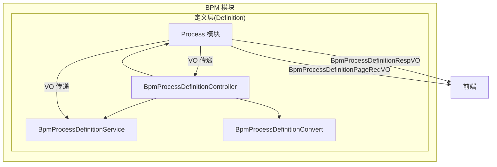
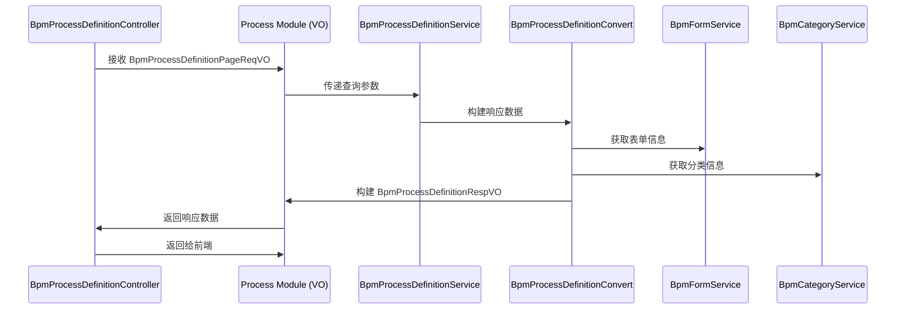

# Process 模块文档

## 1. 模块概述

**Process 模块**是 BPM（业务流程管理）模块中定义层（Definition）的子模块，主要负责流程定义相关的 VO（Value Object）数据传输对象。该模块定义了流程定义响应对象（`BpmProcessDefinitionRespVO`）和分页查询请求对象（`BpmProcessDefinitionPageReqVO`），用于在控制器与前端之间传递流程定义数据。

## 2. 架构概览



## 3. 核心组件

### 3.1 BpmProcessDefinitionRespVO

**描述**：流程定义响应 VO，用于返回流程定义的详细信息。该类继承自 `BpmModelMetaInfoVO`，包含了流程模型的基础元信息以及流程定义特有的字段。

**类结构**：
```
BpmProcessDefinitionRespVO
├── BpmModelMetaInfoVO (父类)
│   ├── icon: 流程图标
│   ├── description: 流程描述
│   ├── type: 流程类型
│   ├── formType: 表单类型
│   ├── formId: 表单编号
│   ├── formCustomCreatePath: 自定义表单创建路径
│   ├── formCustomViewPath: 自定义表单查看路径
│   ├── visible: 是否可见
│   ├── startUserIds: 可发起用户编号数组
│   ├── startDeptIds: 可发起部门编号数组
│   ├── managerUserIds: 可管理用户编号数组
│   ├── sort: 排序
│   ├── allowCancelRunningProcess: 允许撤销审批中的申请
│   ├── allowWithdrawTask: 允许审批人撤回任务
│   ├── processIdRule: 流程 ID 规则
│   ├── autoApprovalType: 自动去重类型
│   ├── titleSetting: 标题设置
│   ├── summarySetting: 摘要设置
│   ├── processBeforeTriggerSetting: 流程前置通知设置
│   ├── processAfterTriggerSetting: 流程后置通知设置
│   ├── taskBeforeTriggerSetting: 任务前置通知设置
│   ├── taskAfterTriggerSetting: 任务后置通知设置
│   └── printTemplateSetting: 自定义打印模板设置
├── id: 流程定义编号
├── version: 流程版本
├── name: 流程名称
├── key: 流程标识
├── category: 流程分类
├── categoryName: 流程分类名字
├── modelType: 流程模型的类型
├── modelId: 流程模型的编号
├── formConf: 表单的配置-JSON 字符串
├── formFields: 表单项的数组-JSON 字符串的数组
├── formName: 表单名字
├── suspensionState: 中断状态
├── deploymentTime: 部署时间
├── bpmnXml: BPMN XML
├── simpleModel: SIMPLE 设计器模型数据 json 格式
├── sort: 流程定义排序
└── UserTask (内部类)
        ├── id: 任务标识
        └── name: 任务名
```

**主要字段说明**：

| 字段名 | 类型 | 必填 | 描述 |
|--------|------|------|------|
| id | String | 是 | 流程定义唯一编号 |
| version | Integer | 是 | 流程版本号 |
| name | String | 是 | 流程名称 |
| key | String | 是 | 流程定义标识（key） |
| category | String | 否 | 流程分类编码 |
| categoryName | String | 否 | 流程分类名称 |
| modelType | Integer | 是 | 流程模型类型（参见 BpmModelTypeEnum） |
| modelId | String | 是 | 流程模型编号 |
| formConf | String | 是 | 自定义表单配置 JSON |
| formFields | List<String> | 是 | 自定义表单字段数组 |
| formName | String | 否 | 表单名称 |
| suspensionState | Integer | 是 | 挂起状态（参见 SuspensionState 枚举） |
| deploymentTime | LocalDateTime | 否 | 部署时间 |
| bpmnXml | String | 否 | BPMN XML 内容 |
| simpleModel | String | 否 | SIMPLE 设计器模型数据 |
| sort | Long | 是 | 排序值 |

**内部类 UserTask**：用于表示流程中的用户任务节点，包含任务标识和任务名称。

### 3.2 BpmProcessDefinitionPageReqVO

**描述**：流程定义分页查询请求 VO，用于前端分页查询流程定义时传递参数。该类继承自 `PageParam`，包含分页基础参数和查询条件。

**类结构**：
```
BpmProcessDefinitionPageReqVO
├── PageParam (父类)
│   ├── page: 当前页码
│   └── pageSize: 每页记录数
└── key: 流程定义标识（精准匹配）
```

**主要字段说明**：

| 字段名 | 类型 | 必填 | 描述 |
|--------|------|------|------|
| key | String | 否 | 流程定义标识（key），支持精准匹配 |

**继承自 PageParam 的分页参数**：
- `page`: 当前页码（默认 1）
- `pageSize`: 每页记录数（默认 10）

## 4. 模块交互关系

### 4.1 与 BPM 定义层其他模块的交互

Process 模块与 BPM 定义层的其他模块紧密协作：



### 4.2 与前端交互

Process 模块通过 VO 对象与前端 Vue 应用进行数据交换：

- **请求**：前端通过 `BpmProcessDefinitionPageReqVO` 传递分页查询参数
- **响应**：后端通过 `BpmProcessDefinitionRespVO` 返回流程定义详细信息

## 5. 相关模块引用

| 模块 | 描述 | 引用文档 |
|------|------|----------|
| [BPM 模块](bpm.md) | 业务流程管理核心模块 | [bpm.md](bpm.md) |
| [定义层](bpm_definition.md) | BPM 的定义子模块，包含流程定义、表单、模型等 | [bpm_definition.md](bpm_definition.md) |
| [OA 模块](oa.md) | 办公自动化模块，使用流程定义实现审批流 | [oa.md](oa.md) |
| [模型层](bpm_model.md) | BPM 模型管理模块，与流程定义关联 | [bpm_model.md](bpm_model.md) |

## 6. API 接口说明

Process 模块主要服务于以下 API 接口：

| 接口路径 | 方法 | 描述 | 请求 VO | 响应 VO |
|----------|------|------|---------|---------|
| `/bpm/process-definition/page` | GET | 获取流程定义分页列表 | `BpmProcessDefinitionPageReqVO` | `PageResult<BpmProcessDefinitionRespVO>` |
| `/bpm-process-definition/list` | GET | 获取流程定义列表（按挂起状态） | - | `List<BpmProcessDefinitionRespVO>` |
| `/bpm-process-definition/simple-list` | GET | 获取精简流程定义列表（用于下拉选择） | - | `List<BpmProcessDefinitionRespVO>` |
| `/bpm-process-definition/get` | GET | 获取流程定义详情 | id/key | `BpmProcessDefinitionRespVO` |

## 7. 设计要点

1. **继承关系**：`BpmProcessDefinitionRespVO` 继承自 `BpmModelMetaInfoVO`，复用流程模型的元数据信息，避免重复定义。
2. **内部类设计**：`UserTask` 作为内部类，仅在当前 VO 中使用，保持封装性。
3. **分页支持**：`BpmProcessDefinitionPageReqVO` 继承 `PageParam`，天然支持分页查询。
4. **数据完整性**：响应 VO 包含了流程定义的所有关键信息，包括 BPMN XML、表单配置、部署信息等，便于前端展示和编辑。
5. **权限控制**：在控制器层通过 `@PreAuthorize` 注解进行权限校验，确保只有有权限的用户才能访问流程定义数据。

## 8. 扩展性说明

Process 模块的设计具有良好的扩展性：

- **流程类型扩展**：通过 `modelType` 字段支持不同类型的流程模型（如 SIMPLE 设计器、BPMN 设计器等）
- **表单类型扩展**：通过 `formType` 字段支持不同表单类型（自定义表单、普通表单等）
- **通知扩展**：通过 `HttpRequestSetting` 支持流程前后置通知的 HTTP 回调
- **打印模板扩展**：通过 `PrintTemplateSetting` 支持自定义打印模板

---

*文档生成时间：2025*