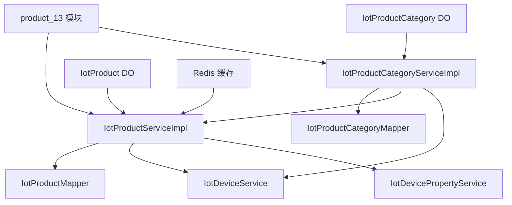
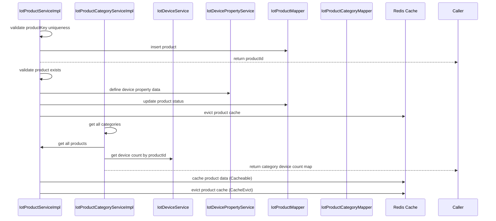

# product_13 模块文档

## 模块概述

product_13 模块是物联网(IoT)平台的产品管理服务，负责物联网产品和产品分类的创建、查询、更新、删除以及状态管理。该模块提供了产品与设备属性之间的关联功能，支持产品发布时自动同步设备属性数据模型到时间序列数据库(TDengine)。

## 架构概述

### 核心组件

1. **IotProductServiceImpl** - 详见 [product_13_product_service.md](product_13_product_service.md)
   - 负责物联网产品的完整生命周期管理
   - 提供产品创建、更新、删除、查询等CRUD操作
   - 实现产品状态管理（未发布/已发布）
   - 支持产品缓存机制（基于Redis）
   - 处理产品发布时的设备属性数据模型同步

2. **IotProductCategoryServiceImpl** - 详见 [product_13_category_service.md](product_13_category_service.md)
   - 负责物联网产品分类的管理
   - 提供分类的创建、更新、删除、查询操作
   - 维护产品与分类之间的关联关系
   - 提供分类设备数量统计功能

### 功能详情

#### 产品服务 (IotProductServiceImpl)

详见 [product_13_product_service.md](product_13_product_service.md)

#### 产品分类服务 (IotProductCategoryServiceImpl)

详见 [product_13_category_service.md](product_13_category_service.md)

### 数据模型

虽然数据模型类未在提供的代码片段中找到，但根据服务实现可以推断：

**IotProductDO (产品数据对象):**
- id: 产品ID
- productKey: 产品标识（唯一）
- productSecret: 产品密钥（用于设备认证）
- name: 产品名称
- categoryId: 所属分类ID
- status: 产品状态（0-未发布，1-已发布）
- createTime: 创建时间
- updateTime: 更新时间

**IotProductCategoryDO (产品分类数据对象):**
- id: 分类ID
- name: 分类名称
- sort: 排序值
- status: 分类状态
- createTime: 创建时间
- updateTime: 更新时间

### 与其他模块的交互

### 接口说明

#### IotProductService 接口方法

详见 [product_13_product_service.md](product_13_product_service.md)

#### IotProductCategoryService 接口方法

详见 [product_13_category_service.md](product_13_category_service.md)

### 配置说明

1. **缓存配置**: 产品服务使用Spring Cache抽象，缓存名称由`RedisKeyConstants.PRODUCT`定义
2. **事务管理**: 产品状态更新使用`@DSTransactional`注解确保多数据源事务一致性
3. **租户隔离**: 产品缓存查询使用`@TenantIgnore`注解忽略租户信息，实现跨租户共享
4. **延迟加载**: 设备属性服务使用`@Lazy`注解延迟加载，避免循环依赖

### 使用示例

详见 [product_13_product_service.md](product_13_product_service.md)

### 依赖关系

该模块依赖以下其他模块或服务:
- IotDeviceService: 用于获取产品关联的设备信息和设备数量统计
- IotDevicePropertyService: 用于在产品发布时创建和同步设备属性数据模型
- IotProductMapper: 产品数据访问层
- IotProductCategoryMapper: 产品分类数据访问层
- Redis: 用于产品信息缓存

### 注意事项

1. 产品删除有严格限制：只有未发布状态且没有关联设备的产品才能被删除
2. 产品发布时会自动创建设备属性数据模型，这是一个耗时操作
3. 产品信息更新会自动清除相关缓存以保证数据一致性
4. 产品分类服务依赖产品服务和设备服务来计算设备数量统计