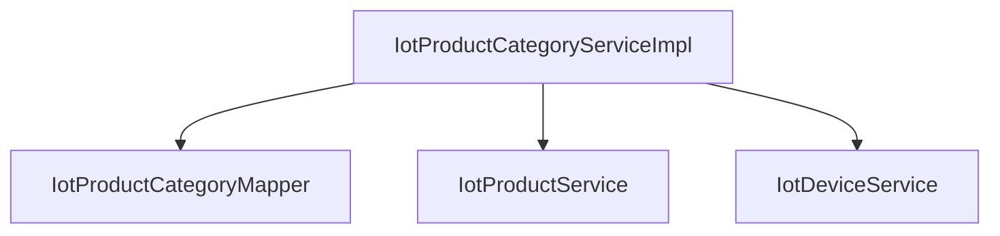

# product_13_category_service.md

## 产品分类服务 (IotProductCategoryServiceImpl)

### 模块概述

产品分类服务负责物联网产品分类的管理。该服务提供了分类的创建、更新、删除、查询等操作，并维护产品与分类之间的关联关系。同时，该服务还提供了分类设备数量的统计功能，用于展示每个分类下关联的设备总数。

### 核心功能

#### 1. 分类生命周期管理

**分类创建**
- 将请求对象转换为数据对象
- 插入数据库
- 返回新创建的分类ID

```java
@Override
public Long createProductCategory(IotProductCategorySaveReqVO createReqVO) {
    // 插入
    IotProductCategoryDO productCategory = BeanUtils.toBean(createReqVO, IotProductCategoryDO.class);
    iotProductCategoryMapper.insert(productCategory);
    // 返回
    return productCategory.getId();
}
```

**分类更新**
- 验证分类是否存在
- 将请求对象转换为数据对象
- 更新数据库中的记录

```java
@Override
public void updateProductCategory(IotProductCategorySaveReqVO updateReqVO) {
    // 校验存在
    validateProductCategoryExists(updateReqVO.getId());
    // 更新
    IotProductCategoryDO updateObj = BeanUtils.toBean(updateReqVO, IotProductCategoryDO.class);
    iotProductCategoryMapper.updateById(updateObj);
}
```

**分类删除**
- 验证分类是否存在
- 从数据库中删除分类记录

```java
@Override
public void deleteProductCategory(Long id) {
    // 校验存在
    validateProductCategoryExists(id);
    // 删除
    iotProductCategoryMapper.deleteById(id);
}
```

#### 2. 分类查询

**查询方式**
- 单个分类查询（根据ID）
- 批量分类查询（根据ID列表）
- 分页查询分类列表
- 按状态获取分类列表
- 统计指定时间后创建的分类数量

```java
@Override
public IotProductCategoryDO getProductCategory(Long id) {
    return iotProductCategoryMapper.selectById(id);
}

@Override
public List<IotProductCategoryDO> getProductCategoryList(Collection<Long> ids) {
    if (CollUtil.isEmpty(ids)) {
        return CollUtil.newArrayList();
    }
    return iotProductCategoryMapper.selectByIds(ids);
}

@Override
public PageResult<IotProductCategoryDO> getProductCategoryPage(IotProductCategoryPageReqVO pageReqVO) {
    return iotProductCategoryMapper.selectPage(pageReqVO);
}

@Override
public List<IotProductCategoryDO> getProductCategoryListByStatus(Integer status) {
    return iotProductCategoryMapper.selectListByStatus(status);
}

@Override
public Long getProductCategoryCount(LocalDateTime createTime) {
    return iotProductCategoryMapper.selectCountByCreateTime(createTime);
}
```

#### 3. 分类设备统计

**统计功能**
- 获取所有产品分类
- 获取所有产品信息
- 获取各产品的设备数量统计
- 计算每个分类下的设备总数
- 返回分类名称到设备数量的映射

```java
@Override
public Map<String, Integer> getProductCategoryDeviceCountMap() {
    // 1. 获取所有数据
    List<IotProductCategoryDO> categories = iotProductCategoryMapper.selectList();
    List<IotProductDO> products = productService.getProductList();
    Map<Long, Integer> deviceCountMapByProductId = deviceService.getDeviceCountMapByProductId();

    // 2. 统计每个分类下的设备数量
    Map<String, Integer> categoryDeviceCountMap = new HashMap<>();
    for (IotProductCategoryDO category : categories) {
        // 2.1 找到该分类下的所有产品
        List<IotProductDO> categoryProducts = filterList(products, 
            product -> Objects.equals(product.getCategoryId(), category.getId()));
        // 2.2 累加设备数量
        Integer totalDeviceCount = getSumValue(categoryProducts, 
            product -> deviceCountMapByProductId.getOrDefault(product.getId(), 0), 
            Integer::sum, 0);
        categoryDeviceCountMap.put(category.getName(), totalDeviceCount);
    }
    return categoryDeviceCountMap;
}
```

### 依赖关系



### 配置说明

**工具类使用**
- `BeanUtils`: 对象属性拷贝
- `CollUtil`: 集合工具操作
- `filterList`: 过滤集合元素
- `getSumValue`: 求和计算

### 异常处理

**自定义异常**
- `PRODUCT_CATEGORY_NOT_EXISTS`: 产品分类不存在

**异常处理机制**
```java
throw exception(PRODUCT_CATEGORY_NOT_EXISTS);
```

### 性能优化

1. **批量查询**: 使用`selectByIds`方法批量获取分类信息，减少数据库交互
2. **空集合检查**: 在批量查询前检查集合是否为空，避免不必要的数据库调用
3. **聚合计算**: 通过Java代码聚合计算分类设备数量，避免复杂的SQL连接查询

### 使用场景

1. **产品分类管理**: 为物联网产品进行分类管理，便于组织和查找
2. **设备统计分析**: 统计每个分类下的设备数量，用于运营分析和决策
3. **产品分类展示**: 在前端界面展示产品分类及其设备数量

### API接口

详见 [product_13.md] 中的接口说明部分。
