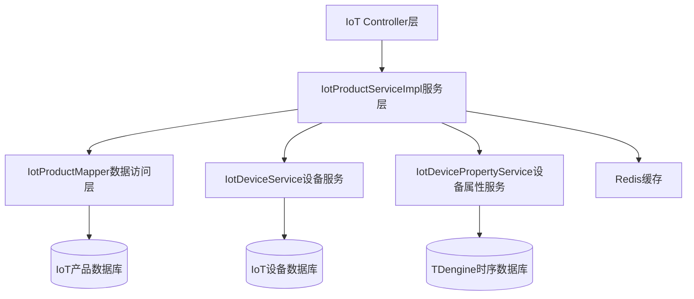
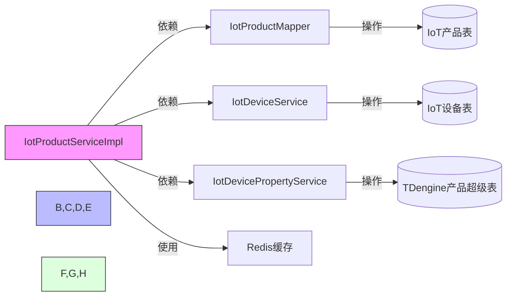
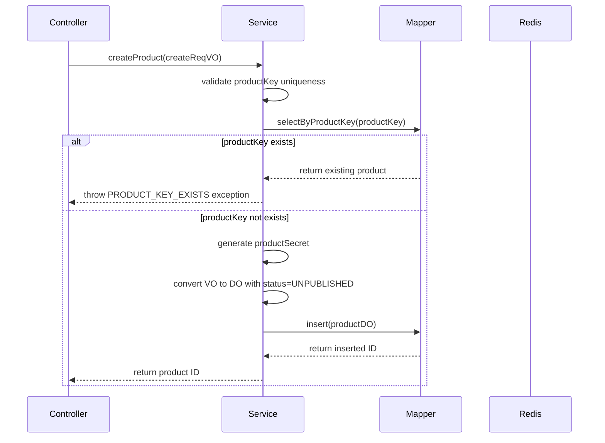
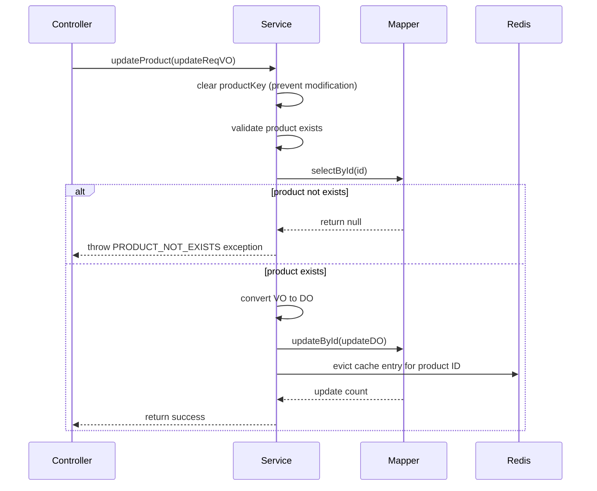
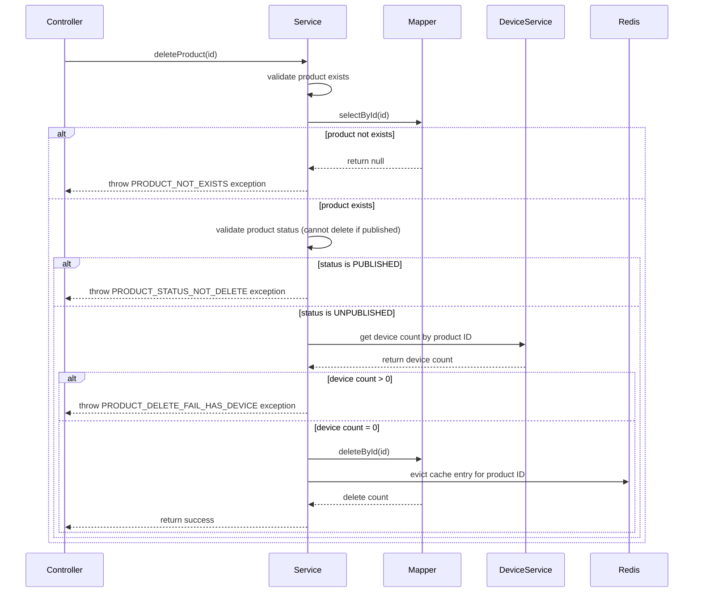
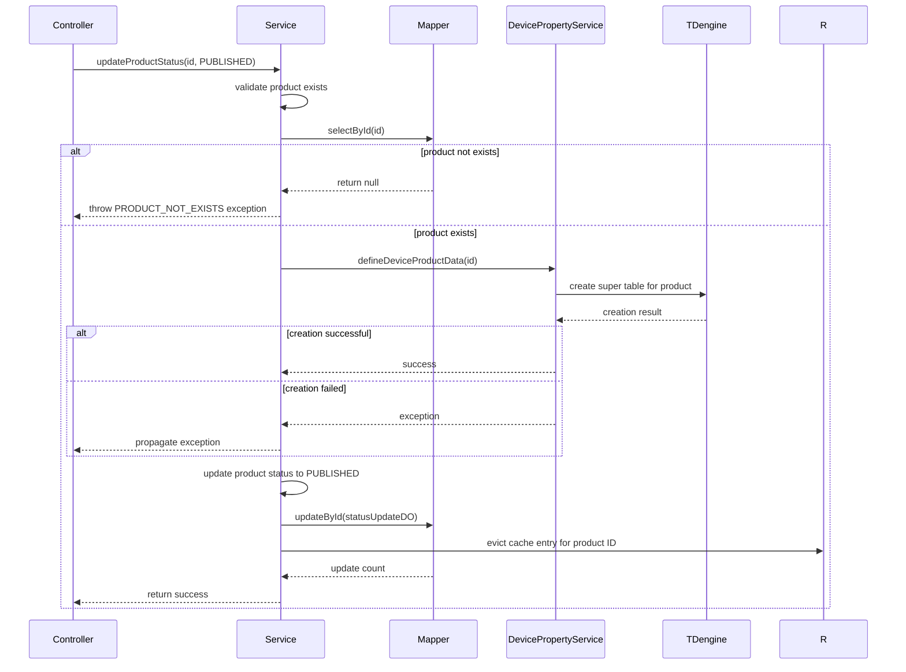
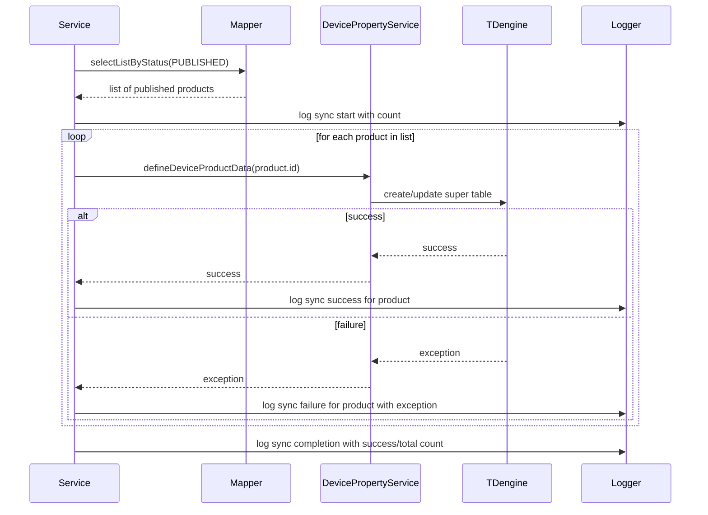

# product_13_product_service 模块文档

## 模块概述

product_13_product_service 模块是 Yudao 平台物联网（IoT）模块中的产品服务实现，负责管理物联网产品的完整生命周期。该服务提供产品的创建、查询、更新、删除、状态管理以及与设备属性表同步等核心功能。

该模块位于 `yudao-module-iot/yudao-module-iot-biz/src/main/java/cn/iocoder/yudao/module/iot/service/product/IotProductServiceImpl.java`，是 IoT 产品管理的核心业务逻辑实现。

## 核心功能

1. **产品生命周期管理**：创建、查询、更新、删除物联网产品
2. **产品状态管理**：支持产品状态切换（开发中/已发布）
3. **产品属性同步**：与 TDengine 数据库同步产品属性表结构
4. **缓存机制**：使用 Redis 缓存提高查询性能
5. **租户隔离支持**：提供租户隔离忽略选项，支持跨租户查询
6. **数据验证**：产品密钥唯一性校验、状态合法性验证等

## 架构设计

### 模块定位

product_13_product_service 属于 IoT 模块的服务层，位于业务逻辑层，负责处理产品相关的业务规则和数据操作。



### 核心组件关系



### 依赖关系说明

- **IotProductMapper**: MyBatis Plus 数据访问层，负责与 IoT 产品数据库表交互
- **IotDeviceService**: 设备服务，用于验证产品下是否有关联设备
- **IotDevicePropertyService**: 设备属性服务，用于在产品发布时创建 TDengine 超级表
- **Redis缓存**: 用于缓存产品信息，提高查询性能，使用 `@Cacheable` 和 `@CacheEvict` 注解
- **租户忽略注解**: `@TenantIgnore` 用于忽略租户上下文，支持跨租户查询产品信息

## 数据模型

### IotProductDO (数据对象)

```java
@TableName("iot_product")
@KeySequence("iot_product_seq")
@Data
@Builder
@NoArgsConstructor
@AllArgsConstructor
public class IotProductDO extends TenantBaseDO {
    /** 产品 ID */
    private Long id;
    
    /** 租户编号 */
    private Long tenantId;
    
    /** 产品名称 */
    private String name;
    
    /** 产品标识 (ProductKey) */
    private String productKey;
    
    /** 产品密钥 (ProductSecret) */
    private String productSecret;
    
    /** 产品描述 */
    private String description;
    
    /** 产品分类 ID */
    private Long categoryId;
    
    /** 设备类型 */
    private Integer deviceType;
    
    /** 产品状态 (0:开发中, 1:已发布) */
    private Integer status;
    
    /** 创建时间 */
    private LocalDateTime createTime;
    
    /** 更新时间 */
    private LocalDateTime updateTime;
}
```

### 关联实体

- **IotProductCategoryDO**: 产品分类信息
- **IotDeviceDO**: 设备信息（与产品一对多关联）
- **IotDevicePropertyDO**: 设备属性数据（存储在 TDengine 中）

## 接口规范

### IotProductService 接口方法

| 方法名 | 参数 | 返回值 | 功能描述 |
|--------|------|--------|----------|
| createProduct | IotProductSaveReqVO | Long | 创建新产品，生成产品密钥 |
| updateProduct | IotProductSaveReqVO | void | 更新产品信息（不允许修改 productKey） |
| deleteProduct | Long id | void | 删除产品（需验证状态和关联设备） |
| validateProductExists | Long id | IotProductDO | 验证产品是否存在（通过 ID） |
| validateProductExists | String productKey | IotProductDO | 验证产品是否存在（通过 productKey） |
| getProduct | Long id | IotProductDO | 获取产品详情 |
| getProductFromCache | Long id | IotProductDO | 从缓存获取产品详情（忽略租户） |
| getProductByProductKey | String productKey | IotProductDO | 通过 productKey 获取产品 |
| getProductPage | IotProductPageReqVO | PageResult<IotProductDO> | 分页查询产品列表 |
| updateProductStatus | Long id, Integer status | void | 更新产品状态（发布时创建 TDengine 表） |
| getProductList | 无 | List<IotProductDO> | 获取所有产品列表 |
| getProductList | Integer deviceType | List<IotDeviceDO> | 按设备类型获取产品列表 |
| getProductCount | LocalDateTime createTime | Long | 按创建时间统计产品数量 |
| getProductList | Collection<Long> ids | List<IotProductDO> | 批量获取产品列表 |
| syncProductPropertyTable | 无 | void | 同步所有已发布产品的属性表到 TDengine |
| validateProductsExist | Collection<Long> ids | void | 批量验证产品是否存在 |

### IotProductController REST API

| HTTP方法 | 路径 | 说明 | 所需权限 |
|----------|------|------|----------|
| POST | /iot/product/create | 创建产品 | iot:product:create |
| PUT | /iot/product/update | 更新产品 | iot:product:update |
| PUT | /iot/product/update-status | 更新产品状态 | iot:product:update |
| DELETE | /iot/product/delete | 删除产品 | iot:product:delete |
| GET | /iot/product/get | 获取单个产品详情 | iot:product:query |
| GET | /iot/product/get-by-key | 通过 ProductKey 获取产品 | iot:product:query |
| GET | /iot/product/page | 分页查询产品列表 | iot:product:query |
| GET | /iot/product/export-excel | 导出产品 Excel | iot:product:export |
| POST | /iot/product/sync-property-table | 同步产品属性表结构 | iot:product:update |
| GET | /iot/product/simple-list | 获取产品简易列表（下拉选项） | 无需权限 |

## 业务流程

### 产品创建流程



### 产品更新流程



### 产品删除流程



### 产品状态更新流程（发布操作）



### 产品属性表同步流程



## 配置说明

### 缓存配置

产品服务使用 Spring Cache 技术进行缓存管理：

- **缓存名称**: `RedisKeyConstants.PRODUCT` (对应 Redis 中的 key 前缀)
- **缓存键**: 产品 ID (`#id`)
- **缓存条件**: 除非结果为 null (`unless = "#result == null"`)
- **缓存更新**: 更新或删除产品时自动清除对应缓存 (`@CacheEvict`)
- **租户处理**: 使用 `@TenantIgnore` 注解忽略租户上下文，支持跨租户查询

### 事务管理

- 产品状态更新方法使用 `@DSTransactional(rollbackFor = Exception.class)` 确保事务一致性
- 多租户数据源支持通过动态数据源注解实现

### 异常处理

服务方法使用统一的异常处理机制：

- `PRODUCT_KEY_EXISTS`: 产品密钥已存在
- `PRODUCT_NOT_EXISTS`: 产品不存在
- `PRODUCT_STATUS_NOT_DELETE`: 产品状态不允许删除（已发布状态）
- `PRODUCT_DELETE_FAIL_HAS_DEVICE`: 产品删除失败，存在关联设备

## 与其他模块的交互

### 与设备模块的交互

产品服务依赖设备服务来：
1. 检查产品下是否有关联设备（防止有设备的产品被删除）
2. 获取产品下的设备数量映射
3. 在产品状态变更时触发设备属性表的创建

### 与产品分类模块的交互

通过控制层，产品服务与产品分类服务协作：
1. 在查询产品时，关联获取分类名称
2. 在产品创建/更新时，验证分类ID的有效性

### 与缓存系统的交互

- 使用 Redis 作为二级缓存，减少数据库查询压力
- 产品信息更新时自失效相关缓存
- 支持跨租户查询场景（通过 `@TenantIgnore`）

## 性能优化设计

1. **缓存机制**: 热点产品数据缓存，减少数据库访问
2. **延迟加载**: 设备属性服务使用 `@Lazy` 注解避免循环依赖
3. **批量操作**: 支持批量产品查询和验证
4. **异步操作**: 设备属性同步支持异步处理提升响应速度
5. **查询优化**: MyBatis Plus 动态 SQL 和分页插件提升查询效率

## 安全考虑

1. **权限控制**: 所有操作通过 Spring Security 的 `@PreAuthorize` 注解进行权限验证
2. **数据验证**: 产品密钥唯一性约束防止重复创建
3. **状态保护**: 已发布产品禁止删除，防止误操作导致的数据丢失
4. **租户隔离**: 支持租户隔离，同时提供跨租户查询能力（特殊场景）
5. **防注入**: 使用 MyBatis Plus 参数绑定防止 SQL 注入

## 异常处理机制

服务层统一使用 `ServiceExceptionUtil.exception()` 方法抛出业务异常，异常码定义在 `ErrorCodeConstants` 中：

- `PRODUCT_KEY_EXISTS`: 产品密钥已存在
- `PRODUCT_NOT_EXISTS`: 产品不存在
- `PRODUCT_STATUS_NOT_DELETE`: 产品状态不允许删除
- `PRODUCT_DELETE_FAIL_HAS_DEVICE`: 产品删除失败，存在关联设备

## 使用示例

### 创建产品

```java
IotProductSaveReqVO reqVO = new IotProductSaveReqVO();
reqVO.setName("智能温度传感器");
reqVO.setProductKey("temp_sensor_001");
reqVO.setDescription("用于环境监测的温度传感器");
reqVO.setCategoryId(1L);
reqVO.setDeviceType(1);

Long productId = productService.createProduct(reqVO);
// 返回生成的产品ID，同时自动生成产品密钥
```

### 查询产品

```java
// 通过ID查询（走缓存）
IotProductDO product = productService.getProductFromCache(1L);

// 通过ProductKey查询
IotProductDO product = productService.getProductByProductKey("temp_sensor_001");

// 分页查询
IotProductPageReqVO pageReqVO = new IotProductPageReqVO();
pageReqVO.setName("温度");
pageRefVO.setPageSize(10);
pageReqVO.setPageNum(1);
PageResult<IotProductDO> pageResult = productService.getProductPage(pageReqVO);
```

### 更新产品状态

```java
// 将产品状态更新为已发布（会自动触发TDengine表创建）
productService.updateProductStatus(1L, IotProductStatusEnum.PUBLISHED.getStatus());
```

### 批量操作

```java
// 批量获取产品
List<Long> productIds = Arrays.asList(1L, 2L, 3L);
List<IotProductDO> products = productService.getProductList(productIds);

// 批量验证产品存在
productService.validateProductsExist(productIds);
```

## 最佳实践

1. **产品密钥管理**: 产品密钥由系统自动生成，确保唯一性和安全性
2. **状态流程控制**: 严格控制产品状态转换流程（开发中 → 已发布）
3. **缓存预热**: 系统启动时可考虑预热热点产品缓存
4. **监控告警**: 建议对产品属性表同步过程添加监控和告警机制
5. **数据备份**: 重要产品信息变更前建议进行数据备份
6. **异常恢复**: 属性表同步失败时应有重试机制或人工干预流程

## 待办事项与改进方向

1. **同步机制优化**: 考虑将产品属性表同步改为异步队列处理，提高响应速度
2. **缓存预热策略**: 实现智能缓存预热，基于访问频率自动加载热点数据
3. **审计日志**: 添加产品重要操作的审计日志记录
4. **批量操作优化**: 优化批量产品操作的性能，减少数据库交互次数
5. **监控埋点**: 在关键操作点添加监控埋点，便于性能分析和问题定位
6. **国际化支持**: 为产品描述等字段添加多语言支持
7. **版本控制**: 考虑引入产品版本管理机制，支持产品迭代和回滚

## 结论

product_13_product_service 模块是 IoT 产品管理的核心组件，提供了完整的产品生命周期管理功能。通过合理的分层设计、缓存机制、事务管理和异常处理，确保了系统的高性能、高可靠性和易维护性。该模块与设备服务、属性服务紧密集成，支持物联网平台的完整功能链，从产品定义到设备管理再到数据采集和存储的全过程。