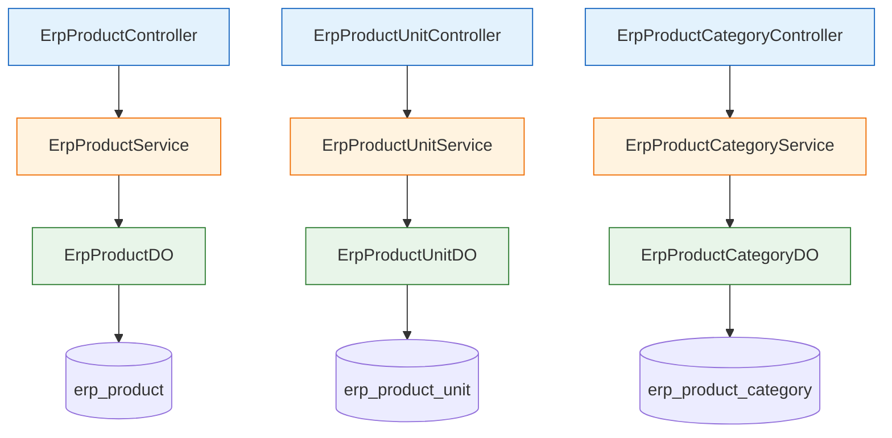

# ERP 产品模块

## 模块概述

ERP 产品模块负责管理企业资源计划系统中的产品信息，包括产品基本信息、产品单位和产品分类的管理。该模块提供了完整的CRUD操作、分页查询、导入导出等功能，支持产品在ERP系统中的全生命周期管理。

## 架构概述

该模块采用典型的分层架构设计，主要包括以下几个组件：

- **控制层 (Controller)**: 负责处理HTTP请求，参数验证和响应构建
- **服务层 (Service)**: 实现业务逻辑，协调数据访问层
- **数据访问层 (DAO)**: 通过MyBatis进行数据库操作
- **数据对象层 (DO)**: 定义数据库实体类
- **视图对象层 (VO)**: 定义API请求和响应的数据传输对象

### 组件关系图

## 功能说明

### 1. 产品管理 (ErpProductController)

产品管理控制器提供了产品的完整CRUD操作，包括：

- **创建产品**: 通过`/create`端点创建新产品
- **更新产品**: 通过`/update`端点修改现有产品信息
- **删除产品**: 通过`/delete`端点根据ID删除产品
- **查询产品**: 通过`/get`端点根据ID获取单个产品详情
- **分页查询**: 通过`/page`端点获取产品分页列表
- **精简列表**: 通过`/simple-list`端点获取启用状态的产品列表（用于下拉选择）
- **Excel导出**: 通过`/export-excel`端点导出产品数据到Excel文件

### 2. 产品单位管理 (ErpProductUnitController)

产品单位管理控制器负责产品计量单位的管理，提供类似的CRUD操作：

- **创建产品单位**: 通过`/create`端点创建新产品单位
- **更新产品单位**: 通过`/update`端点修改产品单位信息
- **删除产品单位**: 通过`/delete`端点根据ID删除产品单位
- **查询产品单位**: 通过`/get`端点根据ID获取单个产品单位详情
- **分页查询**: 通过`/page`端点获取产品单位分页列表
- **精简列表**: 通过`/simple-list`端点获取启用状态的产品单位列表
- **Excel导出**: 通过`/export-excel`端点导出产品单位数据到Excel文件

### 3. 产品分类管理 (ErpProductCategoryController)

产品分类管理控制器负责产品分类层级结构的管理：

- **创建产品分类**: 通过`/create`端点创建新产品分类
- **更新产品分类**: 通过`/update`端点修改产品分类信息
- **删除产品分类**: 通过`/delete`端点根据ID删除产品分类
- **查询产品分类**: 通过`/get`端点根据ID获取单个产品分类详情
- **列表查询**: 通过`/list`端点根据条件获取产品分类列表
- **精简列表**: 通过`/simple-list`端点获取启用状态的产品分类列表
- **Excel导出**: 通过`/export-excel`端点导出产品分类数据到Excel文件

## 与其他模块的关系

ERP产品模块与系统中的其他模块紧密集成：

- 与ERP采购模块集成：产品信息用于采购订单和采购入库
- 与ERP销售模块集成：产品信息用于销售订单和销售出库
- 与ERP库存模块集成：产品信息是库存管理的基础
- 与ERP财务模块集成：产品成本和价格信息用于财务核算

有关其他模块的详细信息，请参考相应的模块文档：
- [ERP 采购模块](purchase_3.md)
- [ERP 销售模块](sale_3.md)
- [ERP 库存模块](stock_4.md)
- [ERP 财务模块](finance_3.md)

## API接口摘要

### 产品相关接口

| 接口 | 方法 | 路径 | 描述 |
|------|------|------|------|
| 创建产品 | POST | /erp/product/create | 创建新产品 |
| 更新产品 | PUT | /erp/product/update | 更新产品信息 |
| 删除产品 | DELETE | /erp/product/delete | 删除指定ID的产品 |
| 获取产品 | GET | /erp/product/get | 根据ID获取产品详情 |
| 分页查询 | GET | /erp/product/page | 分页查询产品列表 |
| 精简列表 | GET | /erp/product/simple-list | 获取启用状态的产品列表 |
| Excel导出 | GET | /erp/product/export-excel | 导出产品数据到Excel |

### 产品单位相关接口

| 接口 | 方法 | 路径 | 描述 |
|------|------|------|------|
| 创建产品单位 | POST | /erp/product-unit/create | 创建新产品单位 |
| 更新产品单位 | PUT | /erp/product-unit/update | 更新产品单位信息 |
| 删除产品单位 | DELETE | /erp/product-unit/delete | 删除指定ID的产品单位 |
| 获取产品单位 | GET | /erp/product-unit/get | 根据ID获取产品单位详情 |
| 分页查询 | GET | /erp/product-unit/page | 分页查询产品单位列表 |
| 精简列表 | GET | /erp/product-unit/simple-list | 获取启用状态的产品单位列表 |
| Excel导出 | GET | /erp/product-unit/export-excel | 导出产品单位数据到Excel |

### 产品分类相关接口

| 接口 | 方法 | 路径 | 描述 |
|------|------|------|------|
| 创建产品分类 | POST | /erp/product-category/create | 创建新产品分类 |
| 更新产品分类 | PUT | /erp/product-category/update | 更新产品分类信息 |
| 删除产品分类 | DELETE | /erp/product-category/delete | 删除指定ID的产品分类 |
| 获取产品分类 | GET | /erp/product-category/get | 根据ID获取产品分类详情 |
| 列表查询 | GET | /erp/product-category/list | 根据条件查询产品分类列表 |
| 精简列表 | GET | /erp/product-category/simple-list | 获取启用状态的产品分类列表 |
| Excel导出 | GET | /erp/product-category/export-excel | 导出产品分类数据到Excel |

## 数据模型

### 产品数据模型 (ErpProductDO)

产品数据对象包含以下关键字段：
- id: 产品ID（主键）
- name: 产品名称
- categoryId: 产品分类ID
- categoryName: 产品分类名称（冗余字段，用于提升查询性能）
- unitId: 产品单位ID
- unitName: 产品单位名称（冗余字段）
- barCode: 产品条码
- purchasePrice: 采购价格
- salePrice: 销售价格
- minPrice: 最低售价
- status: 产品状态（启用/禁用）

### 产品单位数据模型 (ErpProductUnitDO)

产品单位数据对象包含：
- id: 单位ID（主键）
- name: 单位名称
- status: 单位状态

### 产品分类数据模型 (ErpProductCategoryDO)

产品分类数据对象包含：
- id: 分类ID（主键）
- name: 分类名称
- parentId: 父分类ID（用于构建分类层级）
- status: 分类状态

## 安全与权限

该模块所有接口都基于Spring Security进行权限控制，需要相应的权限才能访问：

- `erp:product:create` - 创建产品权限
- `erp:product:update` - 更新产品权限
- `erp:product:delete` - 删除产品权限
- `erp:product:query` - 查询产品权限
- `erp:product:export` - 导出产品权限
- `erp:product-unit:create` - 创建产品单位权限
- `erp:product-unit:update` - 更新产品单位权限
- `erp:product-unit:delete` - 删除产品单位权限
- `erp:product-unit:query` - 查询产品单位权限
- `erp:product-unit:export` - 导出产品单位权限
- `erp:product-category:create` - 创建产品分类权限
- `erp:product-category:update` - 更新产品分类权限
- `erp:product-category:delete` - 删除产品分类权限
- `erp:product-category:query` - 查询产品分类权限
- `erp:product-category:export` - 导出产品分类权限

## 异常处理

模块统一使用框架提供的`CommonResult`进行响应包装，成功返回`success()`，失败会自动捕获异常并返回适当的错误码和消息。

所有控制器方法都使用了`@Validated`注解进行参数验证，确保输入数据符合业务规则。

## 性能考虑

1. 在产品查询中使用了冗余字段（如categoryName、unitName）以减少JOIN操作，提升查询性能
2. 分页查询使用了MyBatis的分页插件，有效控制内存消耗
3. Excel导出功能设置了页面大小为`PageParam.PAGE_SIZE_NONE`，确保导出全部数据而不受分页限制
4. 精简列表接口专门用于下拉选择场景，只返回必要的字段以减少数据传输量

## 依赖说明

该模块主要依赖以下框架和组件：
- Spring Boot Web MVC
- MyBatis Plus
- Spring Security
- Swagger/OpenAPI 3
- EasyExcel (用于Excel导出)
- 框架通用工具类（如BeanUtils、CollectionUtils等）