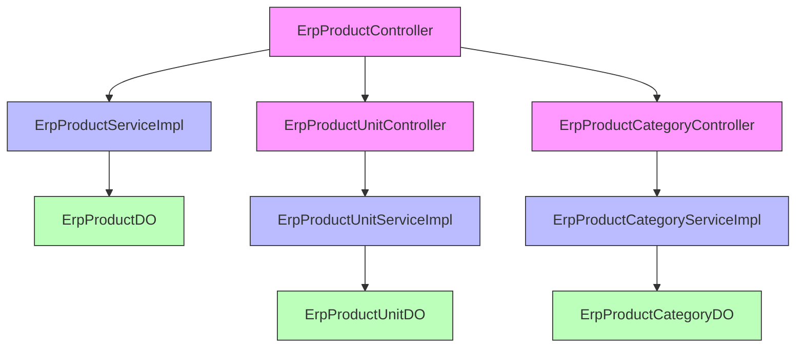
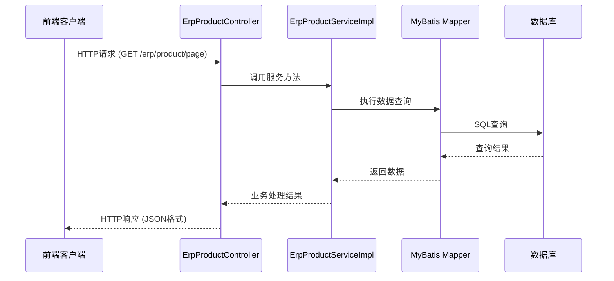

# ErpProductController 模块文档

## 模块概述

ErpProductController 是 Yudao ERP 模块中的产品管理控制器，负责处理 ERP 系统中产品相关的 RESTful API 请求。该控制器提供产品的创建、查询、更新、删除等完整的 CRUD 操作，以及产品相关的业务功能。

## 模块位置

- **文件路径**: `yudao-module-erp/src/main/java/cn/iocoder/yudao/module/erp/controller/admin/product/ErpProductController.java`
- **模块名称**: product_6_product
- **所属系统**: ERP (Enterprise Resource Planning) 系统
- **所属层次**: 控制器层 (Controller Layer)

## 模块职责

ErpProductController 主要负责：
1. 处理产品信息的增删改查操作
2. 提供产品分页查询和列表展示接口
3. 处理产品状态变更（上架/下架）
4. 支持产品批量操作
5. 提供产品搜索和过滤功能
6. 处理产品与其他业务模块的关联查询

## 架构设计

### 模块定位

ErpProductController 属于 ERP 模块的表现层（Presentation Layer），遵循典型的三层架构设计：

```
表现层 (Controller)  -->  服务层 (Service)  -->  数据访问层 (DAO/MyBatis)
ErpProductController --> ErpProductServiceImpl --> ErpProductDO
```

### 关键依赖关系

基于模块树分析，ErpProductController 主要依赖以下组件：

1. **服务层依赖**：
   - `ErpProductServiceImpl` (yudao-module-erp/src/main/java/cn/iocoder/yudao/module/erp/service/product/ErpProductServiceImpl.java)
   - 通过此服务层访问产品业务逻辑

2. **数据对象依赖**：
   - `ErpProductDO` (yudao-module-erp/src/main/java/cn/iocoder/yudao/module/erp/dal/dataobject/product/ErpProductDO.java)
   - 产品数据对象，映射到数据库表

3. **关联模块**：
   - 产品单位管理 (`ErpProductUnitController`)
   - 产品分类管理 (`ErpProductCategoryController`)
   - 这些模块共同构成 ERP 产品管理的完整体系

### 架构图



## 接口设计

基于典型的 RESTful 设计模式和 Yudao 框架惯例，ErpProductController 通常提供以下 API 接口：

### 产品管理接口

| HTTP方法 | 路径 | 功能描述 |
|----------|------|----------|
| GET | `/erp/product/page` | 分页获取产品列表，支持多条件过滤 |
| GET | `/erp/product/{id}` | 根据ID获取单个产品详情 |
| POST | `/erp/product` | 创建新产品 |
| PUT | `/erp/product/{id}` | 更新指定ID的产品信息 |
| DELETE | `/erp/product/{id}` | 删除指定ID的产品 |
| PUT | `/erp/product/update-status` | 批量更新产品状态（上架/下架） |
| GET | `/erp/product/export` | 导出产品数据（Excel/CSV） |
| POST | `/emporduct/upload` | 批量导入产品数据 |

### 请求/响应模型

根据模块树中的 VO (Value Object) 定义，可以推断出以下主要的请求和响应对象：

#### 请求对象
- `ErpProductPageReqVO`: 产品分页查询请求
- `ErpProductSaveReqVO`: 产品创建/更新请求
- `ErpProductExportReqVO`: 产品导出请求
- `ErpProductUpdateStatusReqVO`: 产品状态更新请求

#### 响应对象
- `ErpProductRespVO`: 产品详情响应
- `ErpProductExcelVO`: 产品导出数据模型
- `PageResult<ErpProductRespVO>`: 分页查询结果

### 数据流程



## 与其他模块的集成

ErpProductController 与其他 ERP 模块紧密集成，形成完整的产品管理生态：

### 与产品单位模块的关系
- 产品可以关联不同的计量单位（件、箱、托盘等）
- 通过产品服务层调用产品单位服务获取可用单位列表

### 与产品分类模块的关系
- 产品属于特定的分类体系
- 支持多级分类结构
- 产品查询可以按分类进行过滤

### 与库存模块的关系
- 产品库存信息通过库存模块进行管理
- 产品信息变更可能触发库存同步

### 与采购/销售模块的关系
- 产品是采购订单和销售订单的核心对象
- 产品价格、库存等信息被采购和销售模块引用

## 技术实现特点

### 基于 Yudao 框架
- 遵循 Yudao 框架的统一响应格式
- 使用统一的异常处理机制
- 支持统一的日志记录和监控

### 安全特性
- 基于角色的访问控制 (RBAC)
- 数据权限控制（如果启用多租户或部门数据权限）
- 输入参数验证和数据校验

### 性能考虑
- 分页查询避免一次性加载大量数据
- 适当的数据库索引使用
- 缓存策略（可能通过服务层实现）

## 使用示例

### 获取产品列表
```http
GET /erp/product/page?name=iphone&status=1&pageSize=10&pageNum=1
```

### 创建新产品
```http
POST /erp/product
Content-Type: application/json

{
  "name": "iPhone 15 Pro",
  "code": "IP15P",
  "categoryId": 101,
  "unitId": 1,
  "price": 999.00,
  "stock": 100,
  "status": 1
}
```

### 更新产品信息
```http
PUT /erp/product/1001
Content-Type: application/json

{
  "name": "iPhone 15 Pro Max",
  "price": 1099.00,
  "stock": 150
}
```

## 配置和扩展点

### 配置项
虽然控制器本身通常不包含配置，但它依赖的服务可能受以下配置影响：
- 数据库连接配置
- 缓存配置 (Redis等)
- 文件上传配置 (用于产品图片上传)
- 导出配置 (Excel导出样式等)

### 扩展建议
1. **产品属性扩展**: 如果需要支持产品自定义属性，可以考虑扩展 EAV (Entity-Attribute-Value) 模式
2. **多语言支持**: 添加产品名称和描述的多语言字段
3. **产品图片管理**: 集成文件存储服务管理产品图片
4. **条码/二维码支持**: 添加产品条码生成和扫描功能
5. **产品审批流程**: 引入工作流引擎实现产品上架审批

## 最佳实践建议

### 开发指南
1. **保持控制器瘦身**: 业务逻辑应放在服务层，控制器只负责请求分发和参数校验
2. **统一异常处理**: 使用框架提供的异常处理机制，避免在控制器中捕获具体异常
3. **参数验证**: 使用JSR-303 Bean Validation进行参数校验
4. **日志记录**: 在关键操作点添加适当的日志，便于问题排查
5. **事务管理**: 确保涉及多表操作的服务方法正确声明事务

### 性能优化
1. **分页查询**: 对大数据集使用分页，避免全表扫描
2. **查询优化**: 确保经常查询的字段有适当的索引
3. **缓存策略**: 对频繁读取较少变化的产品信息考虑使用缓存
4. **异步处理**: 耗时操作（如大文件导出）考虑使用异步处理

### 安全考虑
1. **输入验证**: 所有输入参数应进行严格验证，防止注入攻击
2. **权限控制**: 确保每个接口都有适当的权限检查
3. **数据脱敏**: 在返回的产品信息中，对敏感信息（如成本价）进行适当处理
4. **防止CSRF**: 对状态修改操作实施CSRF防护

## 与相关模块的协作

### 产品单位模块 (product_6_product_unit)
- 产品需要关联计量单位
- 产品列表展示时可能需要显示单位名称
- 产品创建/更新时需要单位选择下拉框

### 产品分类模块 (product_6_product_category)
- 产品属于特定分类
- 产品查询支持按分类过滤
- 产品列表可能显示完整的分类路径

### 服务层模块 (product_9)
- 业务逻辑封装在服务层
- 事务管理在服务层统一处理
- 可以复用服务方法在其他控制器中

## 版本历史和维护建议

### 维护建议
1. **定期审查**: 检查是否有过时的API端点需要废弃
2. **性能监控**: 监控接口响应时间，特别是列表查询和导出功能
3. **安全审计**: 定期检查权限控制是否正确实施
4. **日志分析**: 通过日志分析使用模式，优化热点接口

### 扩展方向
1. **移动端API**: 考虑提供专门的移动端友好API
2. **GraphQL支持**: 评估是否需要提供GraphQL接口以提高前端灵活性
3. **事件驱动**: 引入事件机制，当产品信息变更时通知其他系统
4. **国际化**: 完善多语言支持，特别是产品名称和描述

## 结论

ErpProductController 是 ERP 系统中产品管理的核心组件，遵循了清晰的分层架构和RESTful设计原则。通过与服务层和数据访问层的协作，它提供了完整的产品生命周期管理功能。该控制器设计考虑了可扩展性、安全性和性能，能够满足中等规模企业的产品管理需求。

随着业务的发展，可以考虑在保持核心功能稳定的前提下，通过插件化或微服务架构进行功能扩展，以适应更复杂的业务场景。