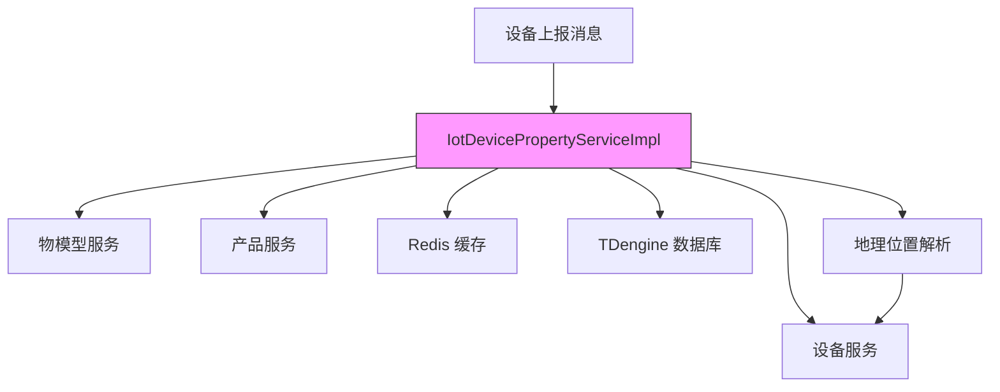
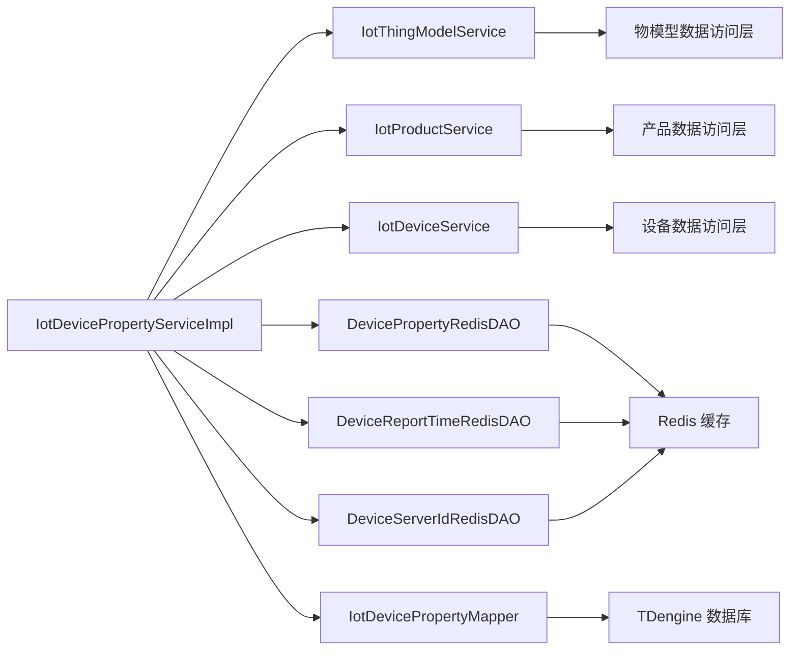
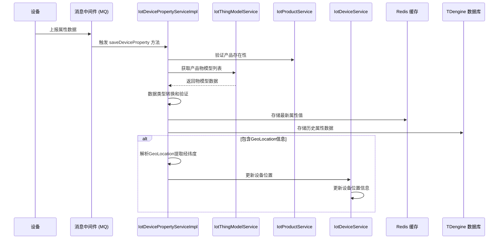
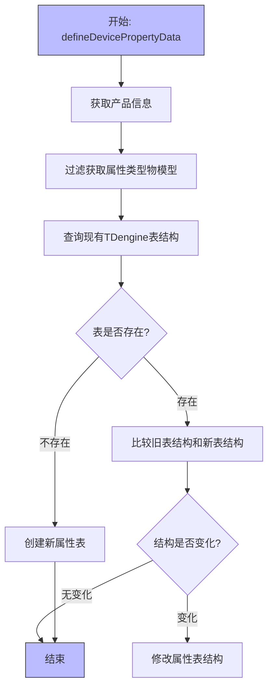
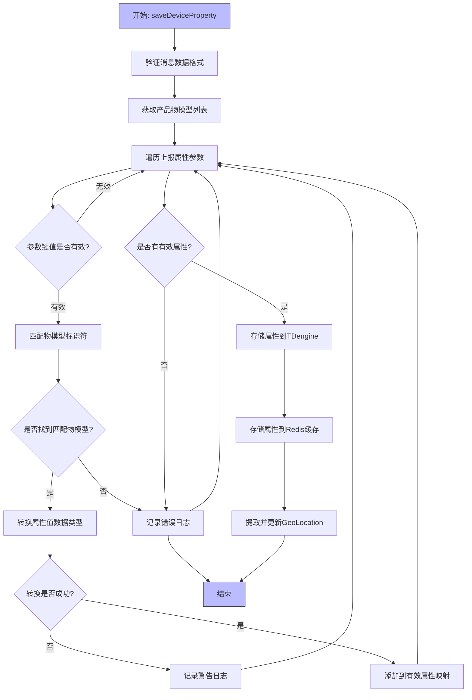

# property_2 模块文档

## 模块概述

property_2 模块是物联网平台中负责处理设备属性数据的服务实现。它提供设备属性的定义、存储、查询和更新功能，是物联网设备数据采集和管理的核心组件。

该模块主要负责：
1. 根据物模型定义设备属性表结构
2. 接收和处理设备上报的属性数据
3. 将属性数据存储到时序数据库（TDengine）和缓存（Redis）
4. 提供设备属性的实时查询和历史查询功能
5. 从设备属性中提取地理位置信息并更新设备定位

## 核心功能

### 1. 设备属性定义
根据产品的物模型自动创建或修改对应的TDengine超级表结构，确保数据库 schema 与物模型保持一致。

### 2. 设备属性存储
处理设备上报的属性消息，进行数据类型转换和验证后，将属性数据同时写入：
- TDengine 时序数据库（用于历史数据存储和查询）
- Redis 缓存（用于实时数据快速访问）

### 3. 设备属性查询
提供两种查询方式：
- 最新属性值查询：从 Redis 获取设备的最新属性状态
- 历史属性查询：从 TDengine 查询设备属性的历史变化记录

### 4. 设备定位更新
从设备上报的属性中提取 GeoLocation 信息（经纬度、海拔等），并更新设备的地理位置信息。

### 5. 异步操作支持
使用 Spring 的 @Async 注解支持异步操作，提高系统响应性能，特别是设备上报时间戳和服务器 ID 的更新操作。

## 架构设计



### 组件说明

| 组件 | 负责职责 |
|------|----------|
| IotDevicePropertyServiceImpl | 设备属性服务实现类，核心业务逻辑 |
| IotThingModelService | 物模型管理服务，提供物模型数据和属性转换 |
| IotProductService | 产品管理服务，验证产品存在性 |
| IotDeviceService | 设备管理服务，更新设备位置等信息 |
| DevicePropertyRedisDAO | 设备属性 Redis 数据访问对象 |
| DeviceReportTimeRedisDAO | 设备上报时间 Redis 数据访问对象 |
| DeviceServerIdRedisDAO | 设备服务器 ID Redis 数据访问对象 |
| IotDevicePropertyMapper | TDengine 设备属性数据访问对象 |

## 依赖关系



### 外部依赖说明

| 依赖模块 | 说明 | 文档链接 |
|----------|------|----------|
| 物模型服务 (IotThingModelService) | 提供物模型管理和属性值转换功能 | [thingmodel_4.md](thingmodel_4.md) |
| 产品服务 (IotProductService) | 产品信息管理和验证 | [product_13.md](product_13.md) |
| 设备服务 (IotDeviceService) | 设备信息管理和位置更新 | [device_7.md](device_7.md) |
| Redis 缓存层 | 设备属性和上报时间的缓存存储 | [cache.md](cache.md) |
| TDengine 数据访问层 | 时序数据库操作 | [tdengine.md](tdengine.md) |

## 数据流



## 关键流程

### 1. 设备属性定义流程



### 2. 设备属性保存流程



### 3. 历史属性查询流程

```mermaid
flowchart TD
    A[开始: getHistoryDevicePropertyList] --> B[调用TDengine mapper查询]
    B --> C{查询是否成功?}
    C -->|是| D[返回查询结果列表]
    C -->|否| E{错误是否为"表不存在"?}
    E -->|是| F[返回空列表]
    E -->|否| G[抛出异常]
    D --> H[结束]
    F --> H
    G --> H
    style A fill:#bbf,stroke:#333
    style H fill:#bbf,stroke:#333
```

## 接口说明

### IotDevicePropertyService 接口方法

| 方法名称 | 参数 | 返回值 | 说明 |
|----------|------|--------|------|
| defineDevicePropertyData | productId: Long | void | 根据产品ID定义设备属性表结构 |
| saveDeviceProperty | device: IotDeviceDO, message: IotDeviceMessage | void | 保存设备上报的属性数据 |
| getLatestDeviceProperties | deviceId: Long | Map<String, IotDevicePropertyDO> | 获取设备最新属性值 |
| getHistoryDevicePropertyList | listReqVO: IotDevicePropertyHistoryListReqVO | List<IotDevicePropertyVO> | 获取设备属性历史数据 |
| getDeviceIdListByReportTime | maxReportTime: LocalDateTime | Set<Long> | 获取指定时间前上报的设备ID列表 |
| updateDeviceReportTimeAsync | id: Long, reportTime: LocalDateTime | void | 异步更新设备上报时间 |
| updateDeviceServerIdAsync | id: Long, serverId: String | void | 异步更新设备服务器ID |
| getDeviceServerId | id: Long | String | 获取设备服务器ID |

### 关键实现细节

1. **数据类型映射**：物模型数据类型与TDengine数据类型的映射关系
   ```java
   private static final Map<String, String> TYPE_MAPPING = MapUtil.<String, String>builder()
           .put(IotDataSpecsDataTypeEnum.INT.getDataType(), TDengineTableField.TYPE_INT)
           .put(IotDataSpecsDataTypeEnum.FLOAT.getDataType(), TDengineTableField.TYPE_FLOAT)
           .put(IotDataSpecsDataTypeEnum.DOUBLE.getDataType(), TDengineTableField.TYPE_DOUBLE)
           .put(IotDataSpecsDataTypeEnum.ENUM.getDataType(), TDengineTableField.TYPE_TINYINT)
           .put(IotDataSpecsDataTypeEnum.BOOL.getDataType(), TDengineTableField.TYPE_TINYINT)
           .put(IotDataSpecsDataTypeEnum.TEXT.getDataType(), TDengineTableField.TYPE_VARCHAR)
           .put(IotDataSpecsDataTypeEnum.DATE.getDataType(), TDengineTableField.TYPE_TIMESTAMP)
           .put(IotDataSpecsDataTypeEnum.STRUCT.getDataType(), TDengineTableField.TYPE_VARCHAR)
           .put(IotDataSpecsDataTypeEnum.ARRAY.getDataType(), TDengineTableField.TYPE_VARCHAR)
           .build();
   ```

2. **GeoLocation解析**：从设备上报的属性中提取地理位置信息
   - 支持阿里云IoT平台GeoLocation标准格式
   - 解析Longitude、Latitude、Altitude、CoordinateSystem字段
   - 验证经纬度范围（经度-180~180，纬度-90~90）

3. **异步处理**：使用@Async注解处理非关键路径操作
   - 设备上报时间更新
   - 设备服务器ID更新

## 与其他模块的关系

property_2 模块是物联网平台设备数据处理链路中的关键环节，与以下模块紧密协作：

1. **上游依赖**：
   - 物模型模块：提供设备属性的定义和数据类型转换规则
   - 产品模块：验证产品存在性并获取产品信息
   - 设备模块：更新设备状态和位置信息

2. **下游服务**：
   - 设备影子服务：基于最新属性值更新设备影子状态
   - 告警服务：分析属性变化触发告警规则
   - 数据可视化：提供历史属性数据用于图表展示

3. **数据流向**：
   ```
   设备上报 → 消息中间件 → 属性服务 → 
   {TDengine(历史数据), Redis(实时数据), 设备服务(位置更新)}
   ```

## 异常处理

模块中主要的异常处理策略包括：

1. **数据验证异常**：对设备上报的数据进行格式验证，记录错误日志并跳过无效数据
2. **类型转换异常**：属性值类型转换失败时记录警告并跳过该属性
3. **数据库操作异常**：
   - 表不存在时自动创建（在定义属性表流程中）
   - 其他数据库异常直接抛出上层处理
4. **GeoLocation解析异常**：解析失败时记录警告并返回null，不影响其他属性的处理

## 性能考虑

1. **缓存使用**：最新属性值存储在Redis中，提供O(1)的读取性能
2. **批量操作**：使用Redis的批量操作（putAll）减少网络往返次数
3. **异步处理**：非关键路径操作（如时间戳更新）使用异步处理提高响应速度
4. **延迟加载**：对可能产生循环依赖的服务使用@Lazy延迟加载
5. **条件查询优化**：历史查询时捕获特定异常（表不存在）避免不必要的错误传播

## 配置说明

该模块主要依赖以下配置：

1. **TDengine配置**：通过 IotDevicePropertyMapper 访问TDengine时序数据库
2. **Redis配置**：通过各RedisDAO访问不同类型的设备数据
3. **线程池配置**：@Async注解依赖Spring的线程池配置

## 典型使用场景

1. **设备上报处理**：当设备通过MQTT/CoAP/HTTP等协议上报属性数据时，属性服务负责数据的解析、存储和分发
2. **设备初始化**：当产品物模型更新时，需要重新定义设备属性表结构
3. **实时监控**：前端通过属性服务获取设备最新状态用于实时监控大屏
4. **历史分析**：数据分析服务通过属性服务查询历史数据进行趋势分析和预测
5. **地理围栏**：位置服务依赖属性服务解析的GeoLocation信息进行地理围栏判断

## 与其他模块的关联文档

为了避免信息重复，以下是与本模块紧密相关的其他模块文档链接：

- [物模型服务文档](thingmodel_4.md)：详细说明物模型的定义、属性类型和数据转换规则
- [产品服务文档](product_13.md)：产品管理和验证的完整实现
- [设备服务文档](device_7.md)：设备信息管理、状态更新和位置服务
- [Redis缓存文档](cache.md)：缓存策略和Redis使用最佳实践
- [TDengine数据访问文档](tdengine.md)：时序数据库操作和性能优化指南

## 结论

property_2 模块作为物联网平台的核心数据处理服务，提供了设备属性的完整生命周期管理。通过结合使用TDengine时序数据库和Redis缓存，既保证了历史数据的可查询性，又确保了实时数据的高可访问性。其设计充分考虑了物联网场景的特点，包括高频数据上传、多种数据类型支持、地理位置解析以及异步处理机制，使其能够有效处理海量设备数据并为上层业务提供可靠的数据服务。