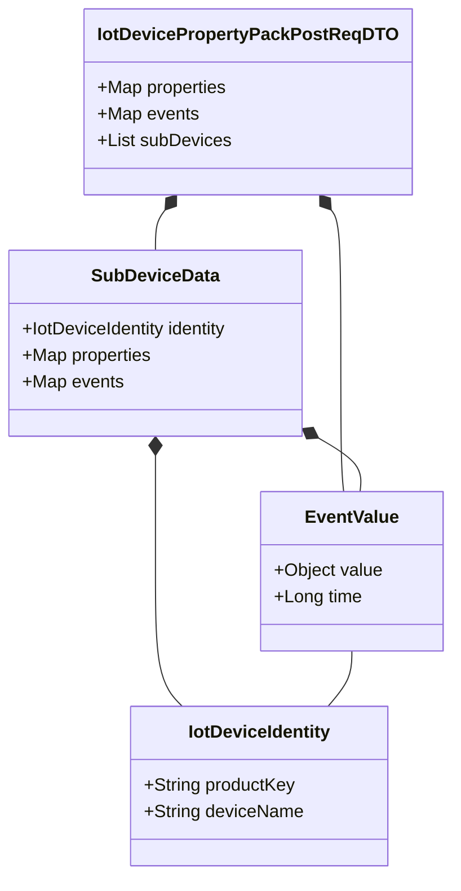
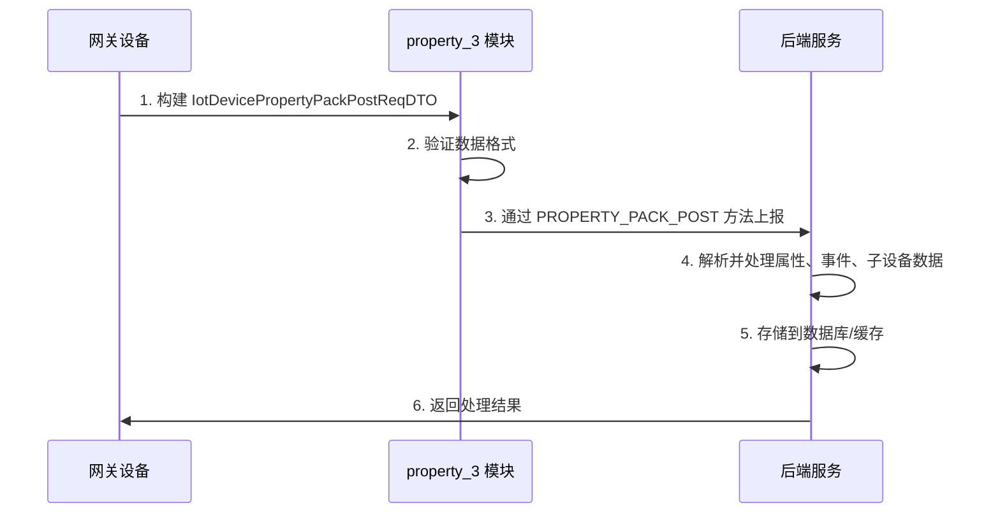
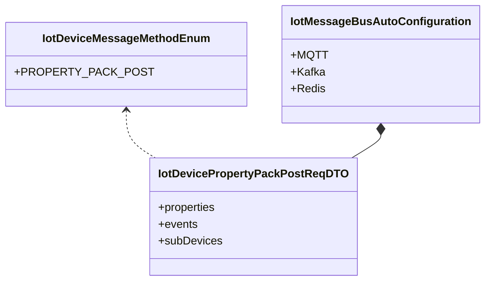
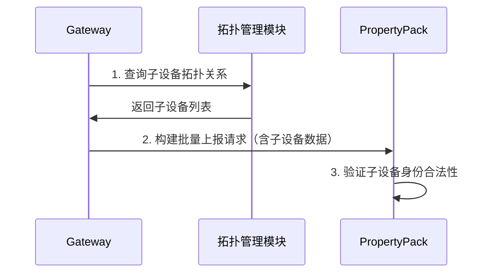

# IoT 设备属性批量上报模块 (property_3)

## 1. 模块概述

`property_3` 模块是 IoT 核心模块中的设备属性批量上报功能模块，主要用于处理网关设备一次性上报多个属性、事件以及子设备数据的场景。该模块遵循阿里云 IoT 平台的批量上报数据规范，支持网关设备将自身属性和事件、以及关联子设备的属性和事件一次性打包上报，减少网络通信次数，提高上报效率。

**核心功能：**
- 网关设备属性批量上报
- 网关设备事件批量上报
- 子设备属性与事件批量上报
- 支持阿里云 IoT 平台协议规范

**参考文档：** [阿里云 - 网关批量上报数据](http://help.aliyun.com/zh/marketplace/gateway-reports-data-in-batches)

## 2. 架构设计

### 2.1 模块定位

```
┌─────────────────────────────────────────────────────────────┐
│                    IoT 核心模块 (iot-core)                   │
│  ┌───────────────────────────────────────────────────────┐  │
│  │              property_3 模块 (属性批量上报)            │  │
│  │                                                       │  │
│  │  ┌───────────────────────────────────────────────┐    │  │
│  │  │ IotDevicePropertyPackPostReqDTO (核心 DTO)    │    │  │
│  │  │  ├─ properties: 网关自身属性                 │    │  │
│  │  │  ├─ events:   网关自身事件                   │    │  │
│  │  │  └─ subDevices: 子设备数据列表               │    │  │
│  │  └───────────────────────────────────────────────┘    │  │
│  │                                                       │  │
│  │  ┌───────────────────────────────────────────────┐    │  │
│  │  │ EventValue (事件值对象)                        │    │  │
│  │  │  ├─ value: 事件参数                            │    │  │
│  │  │  └─ time: 上报时间戳                           │    │  │
│  │  └───────────────────────────────────────────────┘    │  │
│  │                                                       │  │
│  │  ┌───────────────────────────────────────────────┐    │  │
│  │  │ SubDeviceData (子设备数据)                     │    │  │
│  │  │  ├─ identity: 子设备标识                       │    │  │
│  │  │  ├─ properties: 子设备属性                     │    │  │
│  │  │  └─ events:   子设备事件                       │    │  │
│  │  └───────────────────────────────────────────────┘    │  │
│  └───────────────────────────────────────────────────────┘  │
└─────────────────────────────────────────────────────────────┘
```

### 2.2 组件关系图



## 3. 核心组件说明

### 3.1 IotDevicePropertyPackPostReqDTO

**描述：** IoT 设备属性批量上报 Request DTO，用于 `IotDeviceMessageMethodEnum#PROPERTY_PACK_POST` 消息的 params 参数。

**字段说明：**

| 字段名 | 类型 | 说明 | 备注 |
|--------|------|------|------|
| properties | `Map<String, Object>` | 网关自身属性 | key: 属性标识符, value: 属性值 |
| events | `Map<String, EventValue>` | 网关自身事件 | key: 事件标识符, value: 事件值对象 |
| subDevices | `List<SubDeviceData>` | 子设备数据列表 | 包含子设备的属性和事件 |

**使用场景：** 网关设备通过 `PROPERTY_PACK_POST` 方法一次性上报自身属性、事件以及所有关联子设备的属性和事件。

### 3.2 EventValue

**描述：** 事件值对象，包含事件参数和上报时间。

**字段说明：**

| 字段名 | 类型 | 说明 | 备注 |
|--------|------|------|------|
| value | `Object` | 事件参数 | 事件的具体值 |
| time | `Long` | 上报时间 | 毫秒时间戳 |

**使用场景：** 用于封装事件上报时的具体值和发生时间，确保事件数据的完整性和时序性。

### 3.3 SubDeviceData

**描述：** 子设备数据，包含子设备标识、属性和事件。

**字段说明：**

| 字段名 | 类型 | 说明 | 备注 |
|--------|------|------|------|
| identity | `IotDeviceIdentity` | 子设备标识 | 包含 productKey 和 deviceName |
| properties | `Map<String, Object>` | 子设备属性 | key: 属性标识符, value: 属性值 |
| events | `Map<String, EventValue>` | 子设备事件 | key: 事件标识符, value: 事件值对象 |

**使用场景：** 表示网关下挂的一个子设备，该子设备可能上报了自己的属性和事件。

### 3.4 IotDeviceIdentity

**描述：** 设备身份标识，由产品密钥和设备名称组成。

**字段说明：**

| 字段名 | 类型 | 说明 | 备注 |
|--------|------|------|------|
| productKey | `String` | 产品标识 | 必填，不能为空 |
| deviceName | `String` | 设备名称 | 必填，不能为空 |

**使用场景：** 唯一标识一个 IoT 设备，用于区分不同产品和设备。

## 4. 数据流分析

### 4.1 批量上报流程



### 4.2 数据结构示例

```json
{
  "properties": {
    "temperature": 25.5,
    "humidity": 60.0,
    "status": "ON"
  },
  "events": {
    "doorOpen": {
      "value": true,
      "time": 1704067200000
    }
  },
  "subDevices": [
    {
      "identity": {
        "productKey": "p123456",
        "deviceName": "sensor_001"
      },
      "properties": {
        "batteryLevel": 85,
        "signalStrength": -72
      },
      "events": {
        "motionDetected": {
          "value": true,
          "time": 1704067200000
        }
      }
    },
    {
      "identity": {
        "productKey": "p123456",
        "deviceName": "sensor_002"
      },
      "properties": {
        "temperature": 22.3,
        "humidity": 65.0
      }
    }
  ]
}
```

## 5. 模块依赖关系

### 5.1 依赖模块

| 模块 | 依赖说明 | 组件 |
|------|----------|------|
| iot-core | 核心模块，提供基础 DTO 和枚举 | `IotDeviceMessageMethodEnum`, `IotDeviceIdentity` |
| iot-gateway | 网关模块，处理设备消息接入 | 通过 `PROPERTY_PACK_POST` 方法接收 |
| iot-biz | 业务模块，处理上报数据业务逻辑 | 消费批量上报消息 |

### 5.2 被依赖模块

| 模块 | 依赖说明 | 组件 |
|------|----------|------|
| iot-gateway | 网关协议解析 | 解析 `PROPERTY_PACK_POST` 消息体 |
| iot-biz | 数据处理服务 | 消费并处理批量上报数据 |
| iot-core | 消息总线 | 通过消息总线转发批量上报消息 |

## 6. 与其他模块的交互

### 6.1 与消息模块交互



### 6.2 与设备拓扑模块交互



## 7. 配置与扩展

### 7.1 配置项

该模块主要通过 `IotMessageBusAutoConfiguration` 进行消息总线配置，支持多种消息中间件：

- MQTT
- Kafka  
- Redis
- RabbitMQ
- WebSocket
- TCP

### 7.2 扩展点

1. **数据处理扩展：** 可在 `IotDataRuleServiceImpl` 中扩展批量上报数据的规则处理逻辑
2. **存储扩展：** 可通过自定义 `IotDataSinkAction` 扩展批量数据的存储方式
3. **协议扩展：** 可参考 `IotDeviceMessageMethodEnum` 扩展新的批量上报协议

## 8. 参考文档

- [阿里云 IoT 网关批量上报数据](http://help.aliyun.com/zh/marketplace/gateway-reports-data-in-batches)
- [阿里云 IoT 设备属性、事件和服务指南](https://help.aliyun.com/zh/iot/user-guide/device-properties-events-and-services)
- [阿里云 IoT 网关拓扑关系管理](https://help.aliyun.com/zh/iot/user-guide/manage-topological-relationships)

## 9. 相关模块

- [iot-core](iot_core.md) - IoT 核心模块，提供基础组件和工具类
- [iot-gateway](iot_gateway.md) - IoT 网关模块，负责设备消息接入和协议转换
- [iot-biz](iot_biz.md) - IoT 业务模块，处理设备数据业务逻辑
- [iot-rule](iot_rule.md) - IoT 规则引擎模块，处理设备数据规则处理