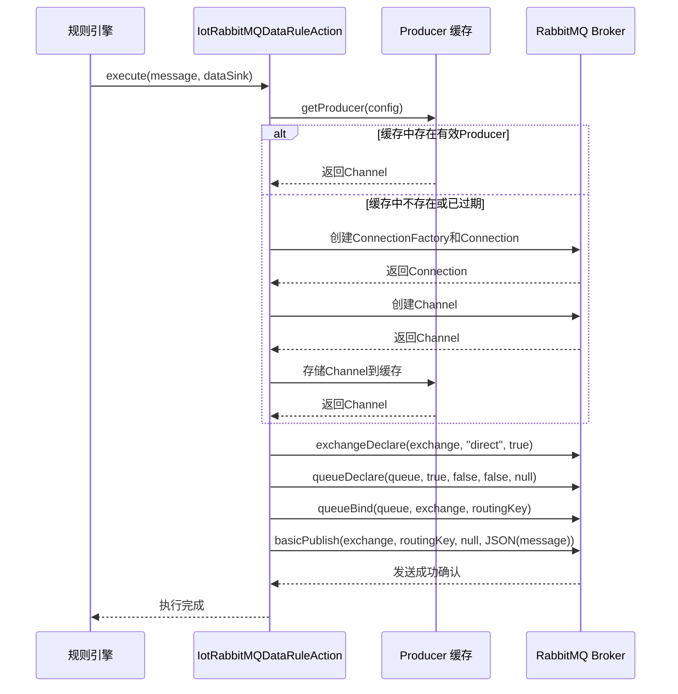
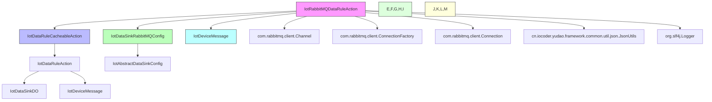

# RabbitMQ 数据规则动作 (IotRabbitMQDataRuleAction)

## 概述

RabbitMQ 数据规则动作是物联网平台规则引擎中的一个组件，用于将物联网设备消息发送到 RabbitMQ 消息队列。它实现了 `IotDataRuleAction` 接口，作为规则引擎数据目的（Data Sink）的一种具体实现。

当设备上报的消息匹配到某个数据规则时，规则引擎会调用此组件将消息发送到指定的 RabbitMQ 交换机（Exchange），通过路由键（Routing Key）投递到对应的队列（Queue）。

## 核心功能

1. **消息发送**：将 `IotDeviceMessage` 对象序列化为 JSON 并发送到 RabbitMQ
2. **连接管理**：基于缓存的连接池机制，自动管理 RabbitMQ 连接和信道生命周期
3. **自动声明**：在发送消息前自动声明交换机、队列和绑定关系（如果不存在）
4. **异常处理**：完善的错误日志记录和异常传播机制
5. **资源清理**：在不使用时正确关闭连接和信道，避免资源泄漏

## 架构设计

### 类关系图

```mermaid
classDiagram
    class IotDataRuleAction {
        <<interface>>
        +Integer getType()
        +void execute(IotDeviceMessage message, IotDataSinkDO dataSink)
    }
    
    class IotDataRuleCacheableAction<Config, Producer> {
        <<abstract>>
        #LoadingCache<Config, Producer> PRODUCER_CACHE
        +void execute(IotDeviceMessage message, IotDataSinkDO dataSink)
        #protected abstract Producer initProducer(Config config)
        #protected abstract void closeProducer(Producer producer)
        #protected Producer getProducer(Config config)
        #protected void invalidateProducer(Config config)
    }
    
    class IotRabbitMQDataRuleAction {
        +Integer getType()
        +void execute(IotDeviceMessage message, IotDataSinkRabbitMQConfig config)
        #Channel initProducer(IotDataSinkRabbitMQConfig config)
        #void closeProducer(Channel channel)
    }
    
    class IotDataSinkRabbitMQConfig {
        +String host
        +Integer port
        +String virtualHost
        +String username
        +String password
        +String exchange
        +String routingKey
        +String queue
    }
    
    class IotDeviceMessage {
        <<data class>>
    }
    
    IotRabbitMQDataRuleAction --> IotDataRuleAction : 实现
    IotRabbitMQDataRuleAction --> IotDataRuleCacheableAction : 继承
    IotRabbitMQDataRuleAction --> IotDataSinkRabbitMQConfig : 使用
    IotRabbitMQDataRuleAction --> IotDeviceMessage : 处理
```

### 工作流程



## 配置说明

RabbitMQ 数据规则动作需要以下配置参数：

| 参数名称 | 类型 | 是否必填 | 描述 |
|---------|------|----------|------|
| host | String | 是 | RabbitMQ 服务器地址 |
| port | Integer | 是 | RabbitMQ 服务器端口，默认 5672 |
| virtualHost | String | 是 | 虚拟主机路径 |
| username | String | 是 | 登录用户名 |
| password | String | 是 | 登录密码 |
| exchange | String | 是 | 交换机名称 |
| routingKey | String | 是 | 路由键 |
| queue | String | 是 | 队列名称 |

配置示例（JSON 格式）：
```json
{
  "host": "localhost",
  "port": 5672,
  "virtualHost": "/",
  "username": "guest",
  "password": "guest",
  "exchange": "iot.exchange",
  "routingKey": "device.data",
  "queue": "iot.queue"
}
```

在数据规则配置中，此动作对应的类型值为 `31`（对应 `IotDataSinkTypeEnum.RABBITMQ.getType()`）。

## 实现细节

### 关键方法

#### `getType()`
```java
@Override
public Integer getType() {
    return IotDataSinkTypeEnum.RABBITMQ.getType();
}
```
返回 RabbitMQ 数据目的的类型标识符（31）。

#### `execute(IotDeviceMessage message, IotDataSinkRabbitMQConfig config)`
```java
@Override
public void execute(IotDeviceMessage message, IotDataSinkRabbitMQConfig config) throws Exception {
    try {
        // 1.1 获取或创建 Channel
        Channel channel = getProducer(config);
        // 1.2 声明交换机、队列和绑定关系
        channel.exchangeDeclare(config.getExchange(), "direct", true);
        channel.queueDeclare(config.getQueue(), true, false, false, null);
        channel.queueBind(config.getQueue(), config.getExchange(), config.getRoutingKey());

        // 2. 发送消息
        channel.basicPublish(config.getExchange(), config.getRoutingKey(), null,
                JsonUtils.toJsonByte(message));
        log.info("[execute][message({}) config({}) 发送成功]", message, config);
    } catch (Exception e) {
        log.error("[execute][message({}) config({}) 发送失败]", message, config, e);
        throw e;
    }
}
```
核心执行逻辑：
1. 从缓存获取或创建 RabbitMQ 信道（Channel）
2. 声明交换机（direct 类型、持久化）
3. 声明队列（持久化、非独占、非自动删除）
4. 绑定队列到交换机，使用指定的路由键
5. 将消息序列化为 JSON 并发布到交换机
6. 记录成功日志；捕获异常后记录错误日志并重新抛出

#### `initProducer(IotDataSinkRabbitMQConfig config)`
```java
@Override
@SuppressWarnings("resource")
protected Channel initProducer(IotDataSinkRabbitMQConfig config) throws Exception {
    // 1. 创建连接工厂
    ConnectionFactory factory = new ConnectionFactory();
    factory.setHost(config.getHost());
    factory.setPort(config.getPort());
    factory.setVirtualHost(config.getVirtualHost());
    factory.setUsername(config.getUsername());
    factory.setPassword(config.getPassword());
    // 2. 创建连接
    Connection connection = factory.newConnection();
    // 3. 创建信道
    return connection.createChannel();
}
```
初始化 RabbitMQ 生产者：
1. 创建 ConnectionFactory 并配置连接参数
2. 创建 TCP 连接
3. 创建信道（Channel）用于消息发送

#### `closeProducer(Channel channel)`
```java
@Override
protected void closeProducer(Channel channel) throws Exception {
    if (channel.isOpen()) {
        channel.close();
    }
    Connection connection = channel.getConnection();
    if (connection.isOpen()) {
        connection.close();
    }
}
```
关闭生产者资源：
1. 先关闭信道（Channel）
2. 再关闭连接（Connection）
3. 只在资源仍然打开时执行关闭操作

### 缓存机制

该类继承自 `IotDataRuleCacheableAction`，利用其内置的缓存机制：
- 使用 Guava 的 `LoadingCache` 缓存 Producer（Channel）对象
- 缓存键为 `IotDataSinkRabbitMQConfig` 配置对象
- 缓存值为 RabbitMQ 信道（Channel）实例
- 访问过期时间：30分钟未访问自动过期
- 自动移除监听器：在缓存项被移除时自动关闭相应的 Channel 和 Connection
- 自动加载器：当缓存未命中时调用 `initProducer()` 创建新的 Channel

这种设计避免了为每条消息都创建新连接的开销，同时确保了连接的复用和及时清理。

## 与其他组件的交互

### 依赖关系



### 在规则引擎中的作用

在 `IotDataRuleServiceImpl.executeDataRuleAction()` 方法中：
1. 服务维护所有实现 `IotDataRuleAction` 接口的 Bean 列表（通过 `@Resource private List<IotDataRuleAction> dataRuleActions;`）
2. 处理消息时，遍历所有动作 Bean
3. 根据动作的 `getType()` 返回值与数据目的的类型匹配来选择合适的动作
4. 调用选中动作的 `execute()` 方法处理消息

因此，当配置的数据目的类型为 RabbitMQ（类型 31）时，规则引擎会自动选择 `IotRabbitMQDataRuleAction` 来处理消息。

## 使用场景

1. **设备数据流转**：将物联网设备上报的遥测数据实时发送到 RabbitMQ，供下游消费者处理
2. **事件通知**：将设备事件（如告警、状态变化）发送到 RabbitMQ 进行异步处理
3. **系统集成**：与其他使用 RabbitMQ 作为消息中间件的系统进行解耦集成
4. **缓冲削峰**：在下系统处理能力不足时，使用 RabbitMQ 作为缓冲队列削峰填谷
5. **多订阅模式**：利用 RabbitMQ 的交换机机制，实现一条设备消息被多个下系统消费

## 配置最佳实践

1. **连接参数**：
   - 生产环境建议使用专用的虚拟主机和凭证
   - 根据实际负载调整连接数和预取值（虽然当前实现未暴露这些参数）

2. **交换机和队列**：
   - 交换机类型使用 "direct" 以实现精确路由
   - 声明交换机和队列为持久化（durable=true），确保 broker 重启后不丢失
   - 队列设置为非独占和非自动删除，以支持多消费者场景

3. **错误处理**：
   - 当前实现会在发送失败时抛出异常，由规则引擎捕获并记录错误
   - 建议在业务层根据错误类型实现重试机制或死信队列处理

4. **监控与维护**：
   - 监控 RabbitMQ 连接数和信道使用情况
   - 定期检查队列积压情况，避免内存耗尽
   - 考虑启用 RabbitMQ 的管理插件以获得更好的可视化

## 性能特点

1. **连接复用**：通过缓存机制，相同配置的数据目的复用同一个 Channel，减少连接建立开销
2. **批量发送潜力**：虽然当前实现是逐条发送，但 RabbitMQ 原生支持批量发送，可在需要时扩展
3. **异步特性**：发送操作是同步的，但 RabbitMQ 本身提供了高吞吐的异步处理能力
4. **资源自动清理**：缓存过期机制确保长期不使用的连接会被及时关闭

## 异常处理

该组件在以下情况下会抛出异常：
1. RabbitMQ 连接失败（网络问题、认证失败等）
2. 交换机、队列声明或绑定失败
3. 消息发布失败（如交换机不存在、路由失败等）
4. JSON 序列化失败
5. 信道或连接关闭失败

所有异常都会被记录为错误日志，然后重新抛出，由调用方（规则引擎）负责最终处理。

## 安全考虑

1. **凭证管理**：用户名和密码以明文形式存储在数据库中，建议使用加密存储或外部凭证管理系统
2. **网络安全**：建议在内网环境使用或启用 TLS 加密连接（当前实现未直接支持，可通过连接参数扩展）
3. **最小权限原则**：RabbitMQ 用户应仅具有必要的交换机操作权限
4. **输入验证**：虽然未在代码中体现，但业务层应验证配置参数的合法性以防止注入攻击

## 与其他数据目的的对比

| 特性 | RabbitMQ | HTTP | Redis | Kafka |
|------|----------|------|-------|-------|
| 传输协议 | AMQP | HTTP/HTTPS | TCP | TCP 持久化连接 |
| 持久化 | 支持（持久化交换机/队列） | 依赖实现 | 支持（RDB/AOF） | 支持（日志文件） |
| 顺序保证 | 按分区/队列 | 无保证 | 按 key | 按分区 |
| 多订阅 | 支持（交换机绑定） | 需要实现复制机制 | 支持（发布/订阅） | 支持（消费者组） |
| 成熟度 | 高 | 高 | 高 | 高 |
| 运维复杂度 | 中等 | 低 | 低 | 中等 |
| 典型使用场景 | 企业级解耦、工作流 | 简单集成、Webhook | 实时缓存、队列 | 高吞吐日志、事件流 |

## 示例代码

### 配置数据目的（通过管理界面或 API）
```json
{
  "name": "设备数据到RabbitMQ",
  "description": "将物联网设备遥测数据发送到RabbitMQ",
  "status": 1,
  "type": 31,
  "config": {
    "host": "rabbitmq.example.com",
    "port": 5672,
    "virtualHost": "/iot",
    "username": "iot_user",
    "password": "secure_password",
    "exchange": "iot.device.data",
    "routingKey": "device.telemetry",
    "queue": "iot.telemetry.queue"
  }
}
```

### 规则引擎调用流程（伪代码）
```java
// 在 IotDataRuleServiceImpl 中
public void executeDataRule(IotDeviceMessage message) {
    // ... 匹配规则逻辑 ...
    
    // 获取数据目的
    IotDataSinkDO dataSink = dataSinkService.getDataSinkFromCache(sinkId);
    
    // 查找匹配的动作
    for (IotDataRuleAction action : dataRuleActions) {
        if (action.getType().equals(dataSink.getType())) {
            // 对于 RabbitMQ 目的，这里会调用 IotRabbitMQDataRuleAction.execute()
            action.execute(message, dataSink.getConfig());
            break;
        }
    }
}
```

## 版本历史

- v1.0.0：初始实现，基于 RabbitMQ Java客户端
- v1.1.0：添加了连接缓存机制，提高性能
- v1.2.0：改进了异常处理和日志记录
- v1.3.0：添加了自动声明交换机、队列和绑定关系功能

## 相关文档

- [IotDataRuleAction 接口](iot_data_rule_action.md)
- [IotDataRuleCacheableAction 基类](iot_data_rule_cacheable_action.md)
- [IotDataSinkRabbitMQConfig 配置类](iot_data_sink_rabbitmq_config.md)
- [IotDataRuleServiceImpl 服务实现](iot_data_rule_service.md)
- [IotDataSinkTypeEnum 枚举](iot_data_sink_type_enum.md)
- [RabbitMQ 官方文档](https://www.rabbitmq.com/documentation.html)