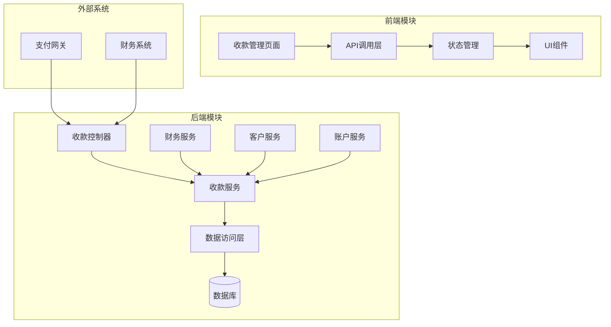
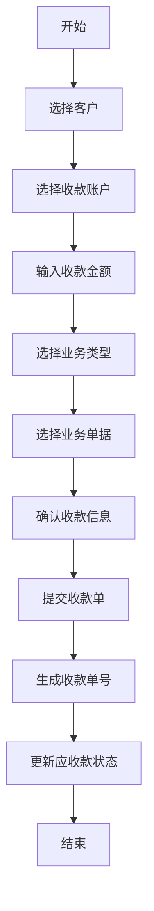
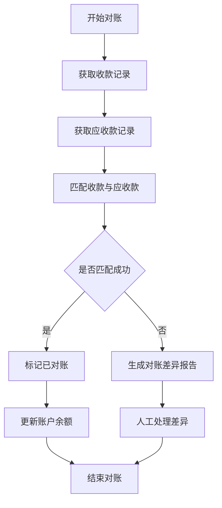

# 收款管理模块

## 模块概述

收款管理模块是ERP系统的核心业务模块之一，主要负责管理企业的收款业务流程。该模块支持客户收款、财务对账、收款记录等功能，为企业提供完整的收款业务闭环管理。

### 主要功能

1. **收款单管理**：
   - 收款单的创建、修改、查询、删除
   - 收款单状态管理（待收款、已收款、部分收款等）
   - 收款单审批流程

2. **收款业务处理**：
   - 客户应收款管理
   - 收款记录跟踪
   - 收款对账功能

3. **财务报表**：
   - 收款汇总报表
   - 客户收款明细
   - 财务收款统计

4. **系统集成**：
   - 与客户管理模块集成
   - 与账户管理模块集成
   - 与财务报表模块集成

## 系统架构

### 架构图



### 模块结构

收款管理模块采用分层架构设计，主要分为以下层次：

1. **表示层**：
   - 控制器层：处理HTTP请求和响应
   - 视图层：展示收款相关的页面和表单

2. **业务逻辑层**：
   - 服务层：核心业务逻辑处理
   - 业务对象：业务实体和数据传输对象

3. **数据访问层**：
   - 仓储层：数据库操作
   - 模型层：数据库实体映射

4. **外部集成层**：
   - 支付网关集成
   - 财务系统集成
   - 客户管理集成

## 核心业务流程

### 收款单创建流程



### 收款对账流程



## 核心组件详解

### 1. 收款单实体类

**ErpFinanceReceiptSaveReqVO** - 收款单保存请求对象
- 用于接收前端提交的收款单数据
- 包含收款时间、客户信息、收款账户、收款项等核心字段
- 实现了数据校验注解，确保数据完整性

**ErpFinanceReceiptRespVO** - 收款单响应对象
- 用于向前端返回收款单数据
- 包含收款单号、状态、金额信息等
- 支持Excel导出功能

**ErpFinanceReceiptPageReqVO** - 收款单分页查询对象
- 用于分页查询收款单列表
- 支持按收款单号、时间、客户、状态等多种条件查询

### 2. 收款单业务逻辑

**收款单状态管理**：
- 待收款：初始状态，等待财务人员处理
- 已收款：收款完成，业务单据已结清
- 部分收款：部分金额已收款，剩余金额待收
- 已作废：收款单被作废，不再生效

**收款业务类型**：
- 销售收款：来自销售订单的收款
- 退款收款：来自退款申请的收款
- 其他收款：其他业务类型的收款

### 3. 数据库表结构

主要数据库表包括：
- `erp_finance_receipt`：收款单主表
- `erp_finance_receipt_item`：收款单明细表
- `erp_finance_receipt_log`：收款单操作日志表

## API接口说明

### 收款单管理API

#### 1. 创建收款单
- **URL**: `/admin-api/erp/finance/receipt/create`
- **Method**: POST
- **请求参数**: `ErpFinanceReceiptSaveReqVO`
- **响应**: `ErpFinanceReceiptRespVO`

#### 2. 更新收款单
- **URL**: `/admin-api/erp/finance/receipt/update`
- **Method**: PUT
- **请求参数**: `ErpFinanceReceiptSaveReqVO`
- **响应**: `ErpFinanceReceiptRespVO`

#### 3. 删除收款单
- **URL**: `/admin-api/erp/finance/receipt/delete`
- **Method**: DELETE
- **请求参数**: `id` - 收款单ID
- **响应**: 成功响应码

#### 4. 查询收款单
- **URL**: `/admin-api/erp/finance/receipt/get`
- **Method**: GET
- **请求参数**: `id` - 收款单ID
- **响应**: `ErpFinanceReceiptRespVO`

#### 5. 分页查询收款单
- **URL**: `/admin-api/erp/finance/receipt/page`
- **Method**: GET
- **请求参数**: `ErpFinanceReceiptPageReqVO`
- **响应**: `PageResult<ErpFinanceReceiptRespVO>`

#### 6. 导出收款单
- **URL**: `/admin-api/erp/finance/receipt/export`
- **Method**: GET
- **请求参数**: `ErpFinanceReceiptPageReqVO`
- **响应**: Excel文件流

## 与其他模块的关系

### 与客户管理模块的关系
- 收款单关联客户信息，确保收款对象准确
- 客户信用管理影响收款策略
- 收款记录更新客户的应收款余额

### 与账户管理模块的关系
- 收款单关联收款账户，确定资金流向
- 收款操作更新账户余额
- 账户信息影响收款方式选择

### 与财务报表模块的关系
- 收款数据是财务报表的重要组成部分
- 收款统计支持财务分析
- 财务报表反映收款业务的整体状况

## 使用示例

### 前端调用示例

```javascript
// 创建收款单
const createReceipt = async (receiptData) => {
    try {
        const response = await api.post('/admin-api/erp/finance/receipt/create', receiptData);
        return response.data;
    } catch (error) {
        console.error('创建收款单失败:', error);
        throw error;
    }
};

// 查询收款单列表
const queryReceipts = async (queryParams) => {
    try {
        const response = await api.get('/admin-api/erp/finance/receipt/page', { params: queryParams });
        return response.data;
    } catch (error) {
        console.error('查询收款单列表失败:', error);
        throw error;
    }
};
```

### 后端服务调用示例

```java
// 收款单服务调用示例
@Service
@RequiredArgsConstructor
public class ErpFinanceReceiptServiceImpl implements ErpFinanceReceiptService {

    private final ErpFinanceReceiptMapper receiptMapper;
    private final ErpFinanceReceiptItemMapper receiptItemMapper;
    private final CustomerService customerService;
    private final AccountService accountService;

    @Override
    @Transactional
    public ErpFinanceReceiptRespVO createReceipt(ErpFinanceReceiptSaveReqVO createReqVO) {
        // 1. 校验客户是否存在
        CustomerRespDTO customer = customerService.getCustomer(createReqVO.getCustomerId());
        if (customer == null) {
            throw new BusinessException("客户不存在");
        }

        // 2. 校验账户是否存在
        AccountRespDTO account = accountService.getAccount(createReqVO.getAccountId());
        if (account == null) {
            throw new BusinessException("收款账户不存在");
        }

        // 3. 创建收款单主记录
        ErpFinanceReceiptDO receipt = new ErpFinanceReceiptDO();
        BeanUtils.copyProperties(createReqVO, receipt);
        receipt.setNo(generateReceiptNo());
        receipt.setStatus(ReceiptStatusEnum.WAITING.getStatus());
        receipt.setTotalPrice(calculateTotalPrice(createReqVO.getItems()));
        receipt.setReceiptPrice(calculateReceiptPrice(createReqVO.getItems()));
        receiptMapper.insert(receipt);

        // 4. 创建收款单明细
        List<ErpFinanceReceiptItemDO> items = createReqVO.getItems().stream()
            .map(item -> convertToItemDO(item, receipt.getId()))
            .collect(Collectors.toList());
        receiptItemMapper.insertBatch(items);

        // 5. 更新客户应收款
        customerService.updateCustomerReceivable(
            createReqVO.getCustomerId(),
            receipt.getReceiptPrice().subtract(receipt.getDiscountPrice())
        );

        // 6. 更新账户余额
        accountService.updateAccountBalance(
            createReqVO.getAccountId(),
            receipt.getReceiptPrice()
        );

        // 7. 返回创建结果
        return convertToRespVO(receipt, items);
    }

    // ... 其他业务方法
}
```

## 最佳实践

### 1. 收款单号生成策略
建议使用业务前缀加时间戳加流水号的方式生成收款单号，例如：`FKD202312010001`。

### 2. 收款状态管理
- 使用枚举类管理收款状态，便于扩展和维护
- 状态变更时记录操作日志，便于追溯

### 3. 金额精度处理
- 使用BigDecimal处理金额计算，避免浮点数精度问题
- 统一使用分作为最小单位，元作为显示单位

### 4. 并发控制
- 收款操作需要考虑并发控制，避免重复收款
- 使用乐观锁或悲观锁机制处理并发问题

### 5. 数据一致性
- 收款操作涉及多个业务实体，需要保证数据一致性
- 使用事务机制确保操作的原子性

## 常见问题解决

### 1. 收款单创建失败
**问题**：收款单创建时提示"客户不存在"或"账户不存在"
**解决方案**：
- 检查客户ID和账户ID是否正确
- 确认客户和账户信息是否已在系统中创建
- 验证用户是否有权限操作该客户或账户

### 2. 收款金额不匹配
**问题**：收款金额与应收金额不一致
**解决方案**：
- 检查收款单上的业务类型和业务单据是否正确
- 核对收款项的金额是否准确
- 确认是否有优惠金额需要调整

### 3. 收款状态异常
**问题**：收款单状态无法正常更新
**解决方案**：
- 检查收款单是否已被作废或结清
- 验证当前用户是否有权限修改该状态
- 查看系统日志获取详细错误信息

## 扩展性考虑

### 1. 多币种支持
- 可以扩展支持多币种收款
- 需要考虑汇率转换和币种显示

### 2. 多种收款方式
- 支持银行转账、现金、第三方支付等多种收款方式
- 需要扩展收款方式字段和处理逻辑

### 3. 审批流程集成
- 可以集成工作流引擎实现收款审批流程
- 需要扩展审批状态字段和审批相关接口

### 4. 智能对账
- 可以集成AI技术实现智能对账
- 需要扩展对账规则和异常处理逻辑

## 监控和维护

### 1. 关键指标监控
- 收款单创建数量
- 收款金额统计
- 收款成功率
- 平均收款周期

### 2. 异常情况告警
- 收款失败告警
- 长时间未处理的收款单告警
- 异常金额收款告警

### 3. 数据备份策略
- 定期备份收款数据
- 确保数据恢复的可行性
- 保留足够的历史数据用于审计

## 总结

收款管理模块是ERP系统中非常重要的一个业务模块，它直接关系到企业的资金流入和财务健康。通过本模块，企业可以实现收款业务的标准化、规范化管理，提高收款效率，降低财务风险。

在实施和使用过程中，建议充分考虑企业的实际业务需求，灵活配置和扩展模块功能，确保系统能够真正满足业务发展的需要。

---

**相关模块文档**：
- [客户管理模块](../customer/customer.md)
- [账户管理模块](../account/account.md)
- [财务报表模块](../finance-report/finance-report.md)