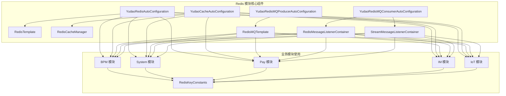
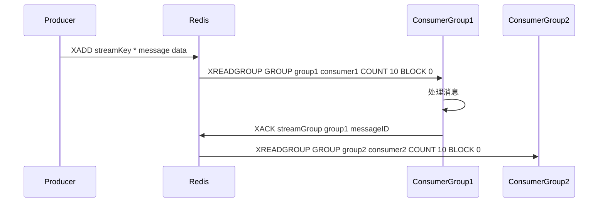

# Redis 模块文档

## 1. 概述

Redis 模块是 Yudao 框架中的核心基础设施组件，为整个系统提供高性能的缓存、消息队列、分布式锁等能力。作为多租户、多模块共享的基础设施，Redis 被广泛应用于 BPM、CRM、ERP、IM、IoT、Pay、System 等多个业务模块中。

## 2. 架构设计

### 2.1 整体架构

```
┌─────────────────────────────────────────────────────────────────┐
│                         Redis 模块                              │
├─────────────────────────────────────────────────────────────────┤
│  ┌─────────────┐    ┌─────────────┐    ┌─────────────┐          │
│  │  Redis 缓存 │    │  Redis MQ   │    │  分布式锁   │          │
│  │  (Cache)    │    │  (Message)  │    │  (Lock)     │          │
│  └──────┬──────┘    └──────┬──────┘    └──────┬──────┘          │
│         │                 │                 │                   │
│   ┌─────┴─────┐    ┌──────┴──────┐    ┌─────┴─────┐            │
│  │  CacheUtils │    │  RedisMQ    │    │  Lock4j   │            │
│  │  缓存工具类 │    │  消息队列   │    │  分布式锁│            │
│  └──────┬──────┘    └──────┬──────┘    └─────┬─────┘            │
│         │                 │                 │                   │
│  ┌──────┴──────┐    ┌──────┴──────┐    ┌─────┴─────┐            │
│  │ 业务模块    │    │ 业务模块    │    │ 业务模块  │            │
│  │ (BPM,CRM..) │    │ (IM,Pay.. ) │    │ (System..)│            │
│  └─────────────┘    └─────────────┘    └─────────────┘            │
└─────────────────────────────────────────────────────────────────┘
```

### 2.2 模块关系图



## 3. 核心组件

### 3.1 Redis 自动配置 (YudaoRedisAutoConfiguration)

**功能**: 创建 RedisTemplate Bean，使用 JSON 序列化方式。

**关键配置**:
- Key 使用 String 序列化
- Hash Key 使用 String 序列化
- Value 使用 JSON 序列化（支持 Java Time 类型）

```java
@Bean
public RedisTemplate<String, Object> redisTemplate(RedisConnectionFactory factory) {
    RedisTemplate<String, Object> template = new RedisTemplate<>();
    template.setConnectionFactory(factory);
    template.setKeySerializer(RedisSerializer.string());
    template.setHashKeySerializer(RedisSerializer.string());
    RedisSerializer<?> redisSerializer = buildRedisSerializer();
    template.setValueSerializer(redisSerializer);
    template.setHashValueSerializer(redisSerializer);
    return template;
}
```

### 3.2 缓存自动配置 (YudaoCacheAutoConfiguration)

**功能**: 配置 RedisCacheManager，支持 Spring Cache 注解（@Cacheable, @CachePut, @CacheEvict）。

**关键特性**:
- 使用单冒号 `:` 作为 key 分隔符（避免 Redis Desktop Manager 显示多余空格）
- 支持事务感知：@Transactional 方法内的缓存操作延迟到 afterCommit
- 支持 RedisScan 批量操作配置

```java
@Bean
public RedisCacheManager redisCacheManager(RedisTemplate<String, Object> redisTemplate,
                                           RedisCacheConfiguration redisCacheConfiguration,
                                           YudaoCacheProperties yudaoCacheProperties) {
    RedisCacheWriter cacheWriter = RedisCacheWriter.nonLockingRedisCacheWriter(
        connectionFactory, BatchStrategies.scan(yudaoCacheProperties.getRedisScanBatchSize()));
    TimeoutRedisCacheManager cacheManager = new TimeoutRedisCacheManager(cacheWriter, redisCacheConfiguration);
    cacheManager.setTransactionAware(true); // 开启事务感知
    return cacheManager;
}
```

### 3.3 Redis MQ 生产者配置 (YudaoRedisMQProducerAutoConfiguration)

**功能**: 创建 RedisMQTemplate，用于发送 Redis 消息。

```java
@Bean
public RedisMQTemplate redisMQTemplate(StringRedisTemplate redisTemplate,
                                       List<RedisMessageInterceptor> interceptors) {
    RedisMQTemplate redisMQTemplate = new RedisMQTemplate(redisTemplate);
    interceptors.forEach(redisMQTemplate::addInterceptor);
    return redisMQTemplate;
}
```

### 3.4 Redis MQ 消费者配置 (YudaoRedisMQConsumerAutoConfiguration)

**功能**: 配置 Redis 消息监听容器，支持两种消息模式：
1. **Pub/Sub 模式**: 通过 RedisMessageListenerContainer 消费 Channel 消息
2. **Stream 模式**: 通过 StreamMessageListenerContainer 消费 Stream 消息（支持消费者组）

**关键特性**:
- 自动创建消费者组（Consumer Group）
- 支持消息手动确认（autoAcknowledge = false）
- 支持消息重发和清理任务
- 消费者名称格式：`IP@PID`

```java
@Bean
public StreamMessageListenerContainer<String, ObjectRecord<String, String>> 
    redisStreamMessageListenerContainer(RedisMQTemplate redisMQTemplate, 
                                       List<AbstractRedisStreamMessage<?>> listeners) {
    // 创建容器并注册监听器
    StreamMessageListenerContainer<String, ObjectRecord<String, String>> container =
        StreamMessageListenerContainer.create(redisMQTemplate.getRequiredConnectionFactory(), options);
    
    listeners.parallelStream().forEach(listener -> {
        // 创建消费者组
        redisTemplate.opsForStream().createGroup(listener.getStreamKey(), listener.getGroup());
        // 注册监听器
        container.register(builder.build(), listener);
    });
    return container;
}
```

## 4. Redis 消息模式

### 4.1 Pub/Sub 模式

**组件**: AbstractRedisChannelMessageListener

**特点**:
- 基于 Redis Channel 的发布/订阅模式
- 消息为广播模式（所有订阅者都能收到）
- 消息不持久化，消费者离线会丢失消息

**使用场景**: 实时通知、广播消息

```java
public abstract class AbstractRedisChannelMessageListener<T extends AbstractRedisChannelMessage> 
    implements MessageListener {
    
    @Override
    public final void onMessage(Message message, byte[] bytes) {
        T messageObj = JsonUtils.parseObject(message.getBody(), messageType);
        try {
            consumeMessageBefore(messageObj);
            onMessage(messageObj); // 业务消费逻辑
        } finally {
            consumeMessageAfter(messageObj);
        }
    }
}
```

### 4.2 Stream 模式

**组件**: AbstractRedisStreamMessage + StreamMessageListenerContainer

**特点**:
- 基于 Redis Stream 的消息队列
- 支持消费者组（Consumer Group）
- 消息持久化，支持消息回溯
- 支持手动确认（ACK），保证至少一次消费
- 支持消息重发和清理任务

**使用场景**: 异步任务、削峰填谷、事件驱动架构



## 5. Redis Key 规范

### 5.1 Key 命名规范

所有业务模块通过 RedisKeyConstants 接口定义 Redis Key 前缀，遵循以下规范：

| 模块 | Key 前缀 | 示例 |
|------|---------|------|
| BPM | `bpm:` | `bpm:process_id:{processId}` |
| CRM | `crm:` | `crm:seq_no:{prefix}` |
| ERP | `erp:` | `erp:seq_no:{prefix}` |
| IM | `im:` | `friend_state`, `group:{groupId}` |
| System | (无统一前缀) | `role:{id}`, `user_role_ids:{userId}` |
| Pay | `pay:` | `pay_no:{prefix}`, `pay_notify:lock:{id}` |
| MES | `mes:` | `mes:md:auto_code:{ruleId}:{cycleKey}` |
| Lock4j | `lock4j:` | `lock4j:{lockKey}` |

**Key 格式规范**:
- 使用 `:` 作为分隔符
- 避免使用特殊字符
- 包含必要的路由信息（如模块名、业务类型）

### 5.2 常见 Key 类型

#### 5.2.1 缓存 Key

```java
// System 模块
String DEPT_CHILDREN_ID_LIST = "dept_children_ids"; // dept_children_ids:{id}
String ROLE = "role"; // role:{id}
String USER_ROLE_ID_LIST = "user_role_ids"; // user_role_ids:{userId}
String OAUTH2_ACCESS_TOKEN = "oauth2_access_token:%s"; // oauth2_access_token:{token}
```

#### 5.2.2 序号生成 Key

```java
// CRM 模块
String NO = "crm:seq_no:"; // 使用 Redis INCR 生成自增编号

// Pay 模块
String PAY_NO = "pay_no:"; // pay_no:{prefix}
```

#### 5.2.3 分布式锁 Key

```java
// Lock4j 模块
String LOCK4J = "lock4j:%s"; // lock4j:{lockKey}

// Pay 模块
String PAY_NOTIFY_LOCK = "pay_notify:lock:%d"; // pay_notify:lock:{id}
String PAY_WALLET_LOCK = "pay_wallet:lock:%d"; // pay_wallet:lock:{id}
```

#### 5.2.4 IM 模块特殊 Key

```java
// IM 模块
String FRIEND_STATE = "friend_state"; // friend_state:{userId}_{friendUserId}
String GROUP = "group"; // group:{groupId}
String GROUP_MEMBER_IDS = "group_member_ids"; // group_member_ids:{groupId}
String IM_RTC_CALL_LOCK = "im_rtc_call:%d:%s"; // im_rtc_call:{type}:{suffix}
```

## 6. 配置属性

### 6.1 Redis 缓存配置 (YudaoCacheProperties)

```yaml
yudao:
  cache:
    redis:
      key-prefix: "yudao:cache"  # 缓存 Key 前缀
      time-to-live: 10m         # 默认过期时间
      cache-null-values: false  # 是否缓存空值
      use-key-prefix: true      # 是否使用 Key 前缀
```

### 6.2 Redis 扫描配置

```yaml
yudao:
  cache:
    redis-scan-batch-size: 30  # Redis SCAN 每次返回的数量
```

## 7. 使用方式

### 7.1 使用 Spring Cache

```java
@Cacheable(cacheNames = "role", key = "#id")
public Role getRole(Long id) {
    return roleMapper.selectById(id);
}

@CachePut(cacheNames = "role", key = "#result.id")
public Role updateRole(Role role) {
    roleMapper.updateById(role);
    return role;
}

@CacheEvict(cacheNames = "role", key = "#id")
public void deleteRole(Long id) {
    roleMapper.deleteById(id);
}
```

### 7.2 直接使用 RedisTemplate

```java
@Autowired
private RedisTemplate<String, Object> redisTemplate;

public void saveProcessId(String processId, String businessId) {
    String key = RedisKeyConstants.BPM_PROCESS_ID + processId;
    redisTemplate.opsForValue().set(key, businessId, 1, TimeUnit.HOURS);
}

public String getProcessId(String businessId) {
    // 反向查询...
}
```

### 7.3 使用 Redis MQ

**生产者**:
```java
redisMQTemplate.send(channel, message); // Pub/Sub
redisMQTemplate.send(streamKey, message); // Stream
```

**消费者** (Pub/Sub):
```java
@Component
@Slf4j
public class ExampleChannelMessageListener 
    extends AbstractRedisChannelMessageListener<ExampleChannelMessage> {
    
    @Override
    public void onMessage(ExampleChannelMessage message) {
        log.info("收到消息: {}", message);
        // 业务处理
    }
}
```

**消费者** (Stream):
```java
@Component
@Slf4j
public class ExampleStreamMessage 
    extends AbstractRedisStreamMessage<ExampleStreamMessage> {
    
    @Override
    public void onMessage(ExampleStreamMessage message) {
        log.info("收到 Stream 消息: {}", message);
        // 业务处理
    }
}
```

## 8. 依赖关系

### 8.1 核心依赖

```xml
<!-- Redis 自动配置 -->
<dependency>
    <groupId>cn.iocoder.yudao</groupId>
    <artifactId>yudao-spring-boot-starter-redis</artifactId>
</dependency>

<!-- Redis MQ 消费者 -->
<dependency>
    <groupId>cn.iocoder.yudao</groupId>
    <artifactId>yudao-spring-boot-starter-mq</artifactId>
</dependency>

<!-- 分布式锁 -->
<dependency>
    <groupId>cn.iocoder.yudao</groupId>
    <artifactId>yudao-spring-boot-starter-protection</artifactId>
</dependency>
```

### 8.2 业务模块依赖

| 模块 | Redis 用途 |
|------|-----------|
| BPM | 流程 ID 缓存、分布式锁 |
| System | 权限缓存、租户上下文、OAuth2 令牌 |
| Pay | 支付序号、分布式锁 |
| IM | 好友关系、群消息、RTC 锁 |
| IoT | 设备消息、规则缓存 |
| CRM | 序号生成、权限缓存 |
| ERP | 序号生成 |
| MES | 编码规则缓存 |

## 9. 最佳实践

### 9.1 Key 设计建议

1. **统一前缀**: 每个模块定义自己的 Key 前缀，避免冲突
2. **结构化设计**: `模块:业务类型:操作:ID`，如 `bpm:process:123`
3. **控制大小**: Key 长度不宜过长，建议不超过 512 字节
4. **避免热点**: 对高频访问的 Key 考虑分片

### 9.2 缓存策略

1. **读写模式**: 采用 Cache-Aside 模式，先读数据库，缓存失效时再加载
2. **过期时间**: 设置合理的 TTL，避免缓存雪崩
3. **事务一致性**: 使用 `@Transactional` 感知，缓存更新延迟到事务提交后
4. **空值缓存**: 建议关闭空值缓存 (`cache-null-values: false`)

### 9.3 消息队列

1. **模式选择**: 
   - 需要消息持久化和回溯 → 使用 Stream 模式
   - 实时广播通知 → 使用 Pub/Sub 模式
2. **消息确认**: Stream 模式建议手动确认 (`autoAcknowledge = false`)
3. **消费组**: 多个消费者实例组成消费组，实现负载均衡
4. **重发机制**: 未确认消息会在超时后重新放入待消费队列

### 9.4 分布式锁

1. **使用 Lock4j**: 通过 `@Lock4j` 注解简化分布式锁使用
2. **Key 唯一性**: 确保锁 Key 的唯一性，避免误锁
3. **合理超时**: 设置合适的锁过期时间，防止死锁
4. **可重入**: 支持可重入锁，同一线程可多次获取锁

```java
@Lock4j(key = "order:${orderId}", time = 10, unit = TimeUnit.SECONDS)
public void processOrder(Order order) {
    // 业务逻辑
}
```

## 10. 常见问题

### 10.1 Redis 版本要求

- 最低版本：Redis 5.0.0
- Stream 模式需要 Redis 5.0+ 支持消费者组

### 10.2 序列化问题

- Key 使用 String 序列化（UTF-8）
- Value 使用 JSON 序列化（Jackson）
- 支持 Java 8 时间类型（LocalDateTime, LocalDate 等）

### 10.3 性能优化

1. **批量操作**: 使用 `BatchStrategies.scan` 优化 Redis SCAN 性能
2. **连接池**: 配置合适的 Redis 连接池参数
3. **监控**: 通过 Redis 监控工具（如 Redis Monitor, Slow Log）监控性能
4. **分片**: 大数据量考虑 Redis 分片集群

### 10.4 多租户支持

- TenantContextHolder 通过 ThreadLocal 存储租户 ID
- Redis Key 建议包含租户 ID，实现数据隔离
- 使用 `TenantUtils.execute(tenantId, runnable)` 切换租户上下文

```java
TenantUtils.execute(tenantId, () -> {
    // 在租户上下文中执行操作
    List<Data> list = dataMapper.selectList();
});
```

## 11. 参考文档

- [Redis 官方文档](https://redis.io/documentation)
- [Spring Data Redis 文档](https://docs.spring.io/spring-data/redis/docs/current/reference/html/)
- [Redisson 分布式锁文档](https://github.com/redisson/redisson)
- [Yudao 框架文档](https://doc.iocoder.cn)
