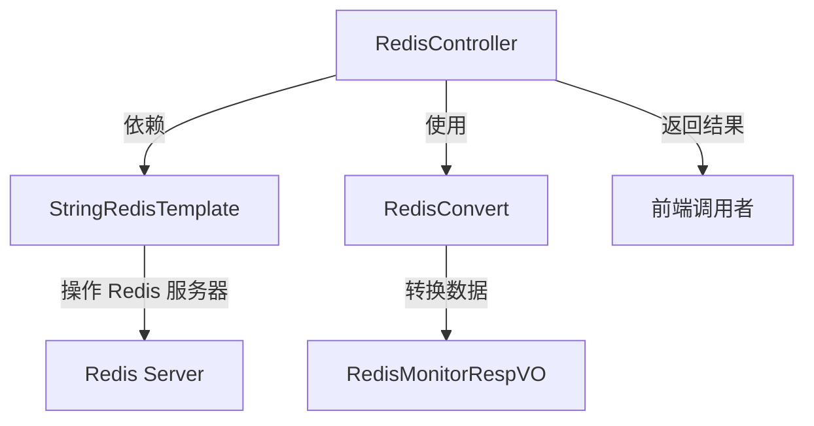

# Redis 监控模块 (Redis_5)

## 概述
Redis_5 模块位于 yudao-module-infra 模块中，提供 Redis 服务器的监控信息接口。该模块通过 Spring Data Redis 的 StringRedisTemplate 获取 Redis 服务器的信息、数据库大小和命令统计数据，并将其转换为前端友好的响应格式。

## 核心功能
- 提供 Redis 监控信息查询接口（GET /infra/redis/get-monitor-info）
- 获取 Redis 服务器详细信息（包括版本、内存使用、连接数等）
- 获取当前数据库的 key 数量
- 获取 Redis 命令执行统计信息（如每个命令的调用次数、耗时等）
- 使用权限控制确保只有授权用户可以访问监控信息

## 架构设计


## 依赖关系
- **StringRedisTemplate**: Spring Data Redis 提供的用于 Redis 操作的模板类，用于执行 Redis 命令。
- **RedisConvert**: 负责将从 Redis 获取的原始 Properties 对象转换为 RedisMonitorRespVO 对象。

## 接口说明
### 获得 Redis 监控信息
- **路径**: `/infra/redis/get-monitor-info`
- **方法**: GET
- **权限**: 需要 `infra:redis:get-monitor-info` 权限
- **响应**:
  - 成功: `CommonResult<RedisMonitorRespVO>`
  - `RedisMonitorRespVO` 包含:
    * `commandStat`: 命令统计信息（Properties 类型）
    * 其他从 Redis info 命令获取的信息（如 `redis_version`, `used_memory`, `connected_clients` 等）
    * `dbSize`: 当前数据库的 key 数量

## 在系统中的定位
Redis_5 模块是 yudao-module-infra 模块的一部分，为整个系统提供基础设施服务。它不直接处理业务逻辑，而是为管理后台提供 Redis 服务器的监控数据，帮助运维人员了解 Redis 的使用状态和性能。

## 与其他模块的关系
- 该模块不依赖于其他业务模块（如 crm, erp 等），但其他模块可能使用 Redis 作为缓存或消息队列。
- 如果需要了解其他模块中 Redis 的使用方式（如缓存键设计），请参考对应模块的文档（例如：[crm 模块的 Redis 使用](redis_2.md)、[erp 模块的 Redis 使用](redis_3.md)、[im 模块的 Redis 使用](redis_4.md) 等）。

## 注意事项
- 该接口仅在管理后台可用，需要相应的权限。
- 由于 Redis 命令统计信息可能较大，建议在生产环境中谨慎频繁调用。
- 返回的命令统计信息是自上次 Redis 服务器启动或统计信息重置以来的累计值。

## 示例响应
```json
{
  "code": 0,
  "message": "成功",
  "data": {
    "commandStat": {
      "cmdstat_get": {"calls": 100, "usec": 5000, "usec_per_call": 50.0},
      "cmdstat_set": {"calls": 50, "usec": 2500, "usec_per_call": 50.0}
    },
    "redis_version": "6.2.6",
    "used_memory": "100MB",
    "connected_clients": 10,
    "db0": {"keys": 1000, "expires": 50, "avg_ttl": 300}
  }
}
```

## 结论
Redis_5 模块提供了一个简单而有效的方式来监控 Redis 服务器的状态和性能，为系统的运维和故障排除提供了重要的数据支持。