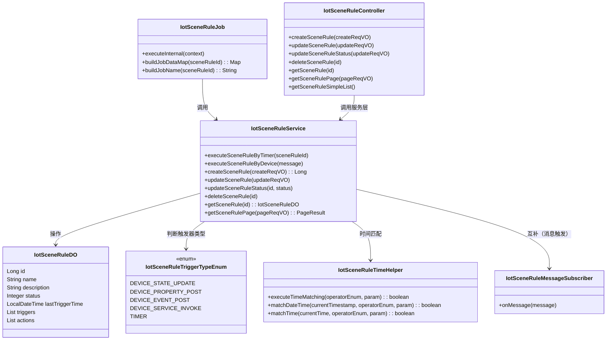
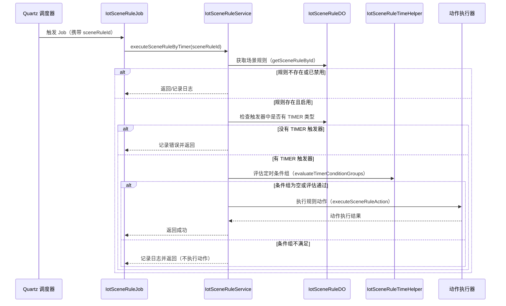
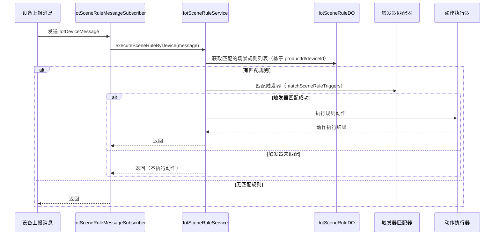

# rule_4 模块文档

## 概述

`rule_4` 模块对应 `IotSceneRuleJob` 类，是一个基于 Quartz 的定时任务，专门用于执行类型为 `TIMER（定时触发）的物联网场景联动规则。当 Quartz 调度触发该 Job 时，它会根据传入的规则场景编号，加载对应的场景规则，评估其定时条件组（如果有），并在条件满足时执行规则中定义的动作（如设备属性设置、服务调用、告警触发等）。

该模块是物联网平台规则引擎的重要组成部分，负责基于时间的自动化场景触发，与基于设备消息的场景触发（由 `IotSceneRuleMessageSubscriber` 处理）形成互补，共同构成完整的场景联动规则执行体系。

## 核心组件

| 组件 | 类名 | 职责 |
|------|------|------|
| IotSceneRuleJob | `cn.iocoder.yudao.module.iot.job.rule.IotSceneRuleJob` | Quartz Job 实现，负责从 JobDataMap 中获取规则场景 ID，并委托 `IotSceneRuleService` 执行定时规则。 |
| IotSceneRuleService | `cn.iocoder.yudao.module.iot.service.rule.scene.IotSceneRuleService`（实现类：`IotSceneRuleServiceImpl`） | 提供场景规则的 CRUD、状态管理、定时执行及基于设备消息的执行等服务。 |
| IotSceneRuleDO | `cn.iocoder.yudao.module.iot.dal.dataobject.rule.IotSceneRuleDO` | 场景规则数据对象，包含触发器（Trigger）和动作（Action）的定义。 |
| IotSceneRuleTriggerTypeEnum | `cn.iocoder.yudao.module.iot.enums.rule.IotSceneRuleTriggerTypeEnum` | 定义场景规则触发器类型，其中 `TIMER` 类型对应本 Job 的处理逻辑。 |
| IotSceneRuleTimeHelper | `cn.iocoder.yudao.module.iot.service.rule.scene.IotSceneRuleTimeHelper` | 提供时间匹配工具方法，供定时条件评估使用。 |
| IotSceneRuleMessageSubscriber | `cn.iocoder.yudao.module.iot.mq.consumer.rule.IotSceneRuleMessageSubscriber` | 消费设备消息，触发非定时类型的场景规则（与本 Job 互补）。 |
| IotSceneRuleController | `cn.iocoder.yudao.module.iot.controller.admin.rule.IotSceneRuleController` | 提供场景规则的 RESTful API，用于前端管理。 |

## 组件关系

以下 Mermaid 图展示了 `rule_4` 模块与其核心依赖之间的关系：

## 数据流与处理流程

### 定时触发场景规则的执行流程

### 基于设备消息的场景规则执行流程（供参考，与本模块互补）

## 依赖关系

`rule_4` 模块主要依赖以下其他模块或组件：

- **IotSceneRuleService**（同模块）：核心服务层，处理规则的业务逻辑。
- **IotSceneRuleDO**（同模块）：数据对象，定义了规则的结构。
- **IotSceneRuleTriggerTypeEnum**（同模块）：触发器类型枚举，用于区分定时触发与其他触发方式。
- **IotSceneRuleTimeHelper**（同模块）：提供时间匹配工具，支持 Cron 表达式和时间区间的判断。
- **IotDeviceService**（设备服务模块）：在执行规则时可能需要获取设备状态或属性（间接通过服务调用）。
- **IotProductService**（产品服务模块）：在执行规则时可能需要获取产品信息。
- **Quartz 框架**：提供任务调度能力，`IotSceneRuleJob` 继自 `QuartzJobBean`。
- **Spring 框架**：使用 `@Resource`、`@Slf4j` 等注解进行依赖注入和日志。

> 注：上述依赖中的服务层（如 IotDeviceService、IotProductService）属于其他业务模块，详细信息请参考对应模块的文档（如 `device_service.md`、`product_service.md`）。

## 在系统中的定位

`rule_4` 模块属于物联网平台的 **规则引擎子系统**，具体负责 **定时触发型场景联动规则** 的执行。它与以下模块协同工作：

- **设备消息触发规则**（由 `IotSceneRuleMessageSubscriber` 处理）：响应设备上报的属性变化、事件等实时触发。
- **规则管理接口**（由 `IotSceneRuleController` 提供）：供前端页面创建、修改、删除、查询场景规则。
- **规则动作执行器**（`IotSceneRuleAction` 实现类）：如设备属性设置、服务调用、告警触发等具体动作的实现。
- **告警、设备、产品等基础服务**：规则动作可能依赖这些服务来完成实际操作。

通过这种分层设计，`rule_4` 模块专注于定时调度和条件评估，将具体的动作实现解耦，提高了系统的可维护性和扩展性。

## 与其他文档的关联

为了避免信息重复，以下方面的详细说明请参考对应的模块文档：

- 场景规则数据结构及字段含义：参见 `IotSceneRuleDO.md`。
- 场景规则服务接口及实现细节：参见 `IotSceneRuleService.md`。
- 触发器类型枚举值及使用场景：参见 `IotSceneRuleTriggerTypeEnum.md`。
- 时间匹配工具方法的实现原理：参见 `IotSceneRuleTimeHelper.md`。
- 基于设备消息的场景规则触发机制：参见 `IotSceneRuleMessageSubscriber.md`。
- 场景规则的 RESTful API 设计：参见 `IotSceneRuleController.md`。
- Quartz 作业调度配置及作业数据构建：参见本文档（`rule_4.md`）中的作业构建方法。

## 小结

`rule_4` 模块（`IotSceneRuleJob`）是物联网平台中负责执行定时触发场景联动规则的核心组件。它通过 Quartz 调度机制，定期检查并执行符合时间条件的场景规则，从而实现基于时间的自动化联动。与基于设备消息的触发机制互补，共同构建了平台完整的事件驱动与时间驱动的规则执行体系。