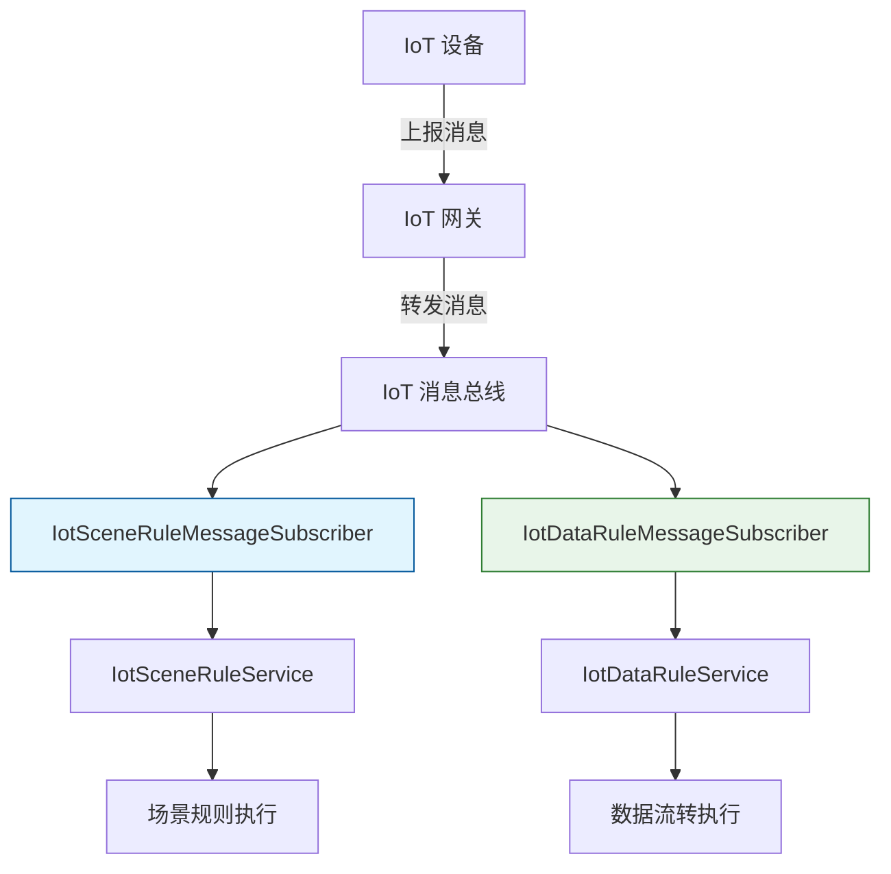
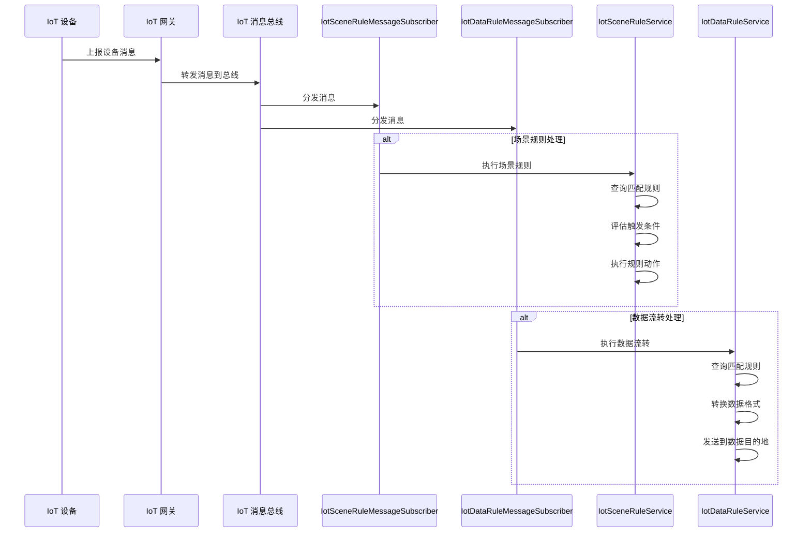
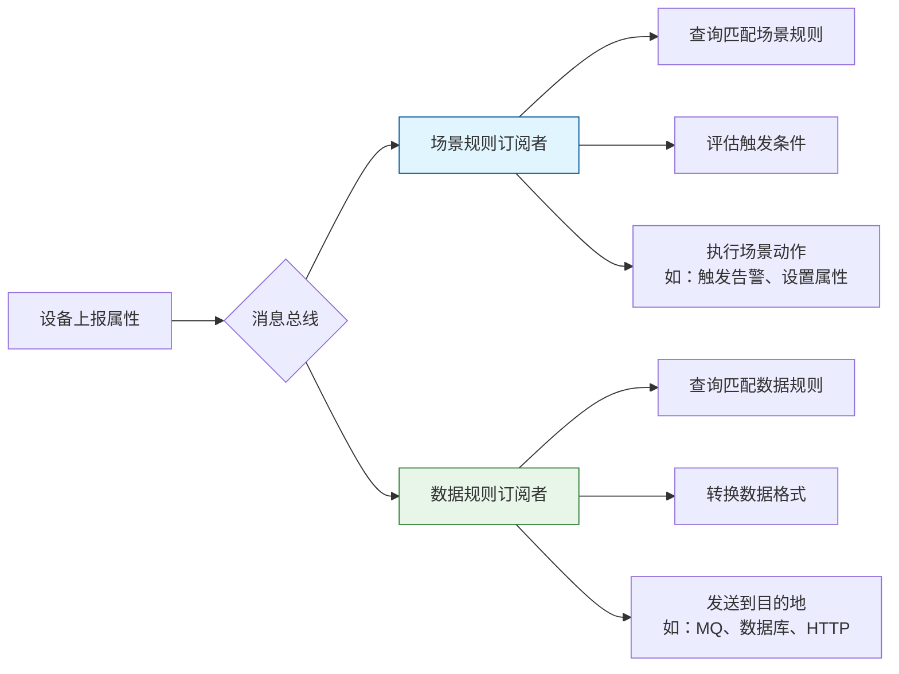

# rule_5 模块文档

## 概述

rule_5 模块是 IoT 平台中的消息处理模块，负责订阅和处理 IoT 设备消息，实现场景规则执行和数据流转功能。该模块包含两个核心消息订阅者：

1. **IotSceneRuleMessageSubscriber**：处理设备消息并执行场景规则（如触发告警、设置设备属性等）
2. **IotDataRuleMessageSubscriber**：处理设备消息并执行数据流转规则（如将数据发送到消息队列、数据库等）

两个订阅者都基于 IoT 消息总线机制工作，订阅设备消息主题，并在收到设备上报消息时触发相应的业务逻辑。

## 架构概述

## 核心组件

### IotSceneRuleMessageSubscriber

负责处理 IoT 设备消息并执行场景规则。当设备上报消息时，该订阅者会：

1. 接收来自消息总线的设备消息
2. 根据设备信息查询匹配的场景规则
3. 评估规则的触发条件
4. 执行规则定义的动作（如触发告警、设置设备属性等）

### IotDataRuleMessageSubscriber

负责处理 IoT 设备消息并执行数据流转规则。当设备上报消息时，该订阅者会：

1. 接收来自消息总线的设备消息
2. 根据设备信息查询匹配的数据流转规则
3. 将设备数据转发到配置的数据目的地（如 MQ、数据库、HTTP 端点等）

## 工作流程

## 与其他模块的关系

rule_5 模块主要与以下模块交互：

- **iot-core 模块**：提供消息总线接口和设备消息定义
- **iot-service 模块**：提供场景规则服务和数据规则服务实现
- **iot-gateway 模块**：设备消息的来源，通过网关将设备上报的消息发送到消息总线

有关这些相关模块的详细信息，请参考：
- [iot-core 模块文档](iot-core.md)
- [iot-service 模块文档](iot-service.md)
- [iot-gateway 模块文档](iot-gateway.md)

## 配置说明

该模块通过 Spring 的自动配置机制工作，无需额外的 XML 配置。关键配置点包括：

1. 消息总线主题：订阅 `iot_device_message` 主题
2. 消费者分组：场景规则使用 `iot_rule_consumer`，数据规则使用 `iot_data_rule_consumer`
3. 租户隔离：数据规则处理使用租户上下文隔离，场景规则处理则不使用租户隔离（因为通常在无租户上下文的情况下被调用）

## 数据流示例

## 关键特点

1. **解耦设备与业务逻辑**：通过消息总线机制，设备上报与业务处理解耦
2. **可扩展性**：新增规则类型只需实现相应的订阅者接口
3. **租户隔离支持**：数据规则处理充分考虑了多租户场景
4. **高性能**：采用异步非阻塞的消息处理方式
5. **容错机制**：处理异常时会记录日志但不会中断消息处理流程

## 使用场景

1. **智能家居场景**：当温度传感器上报温度超过阈值时，自动打开空调
2. **工业监控场景**：当设备振动异常时，自动触发维修工单
3. **数据分析场景**：将设备上报的遥测数据实时流入数据仓库进行分析
4. **设备联动场景**：当门磁传感器检测到开门时，自动打开监控摄像头