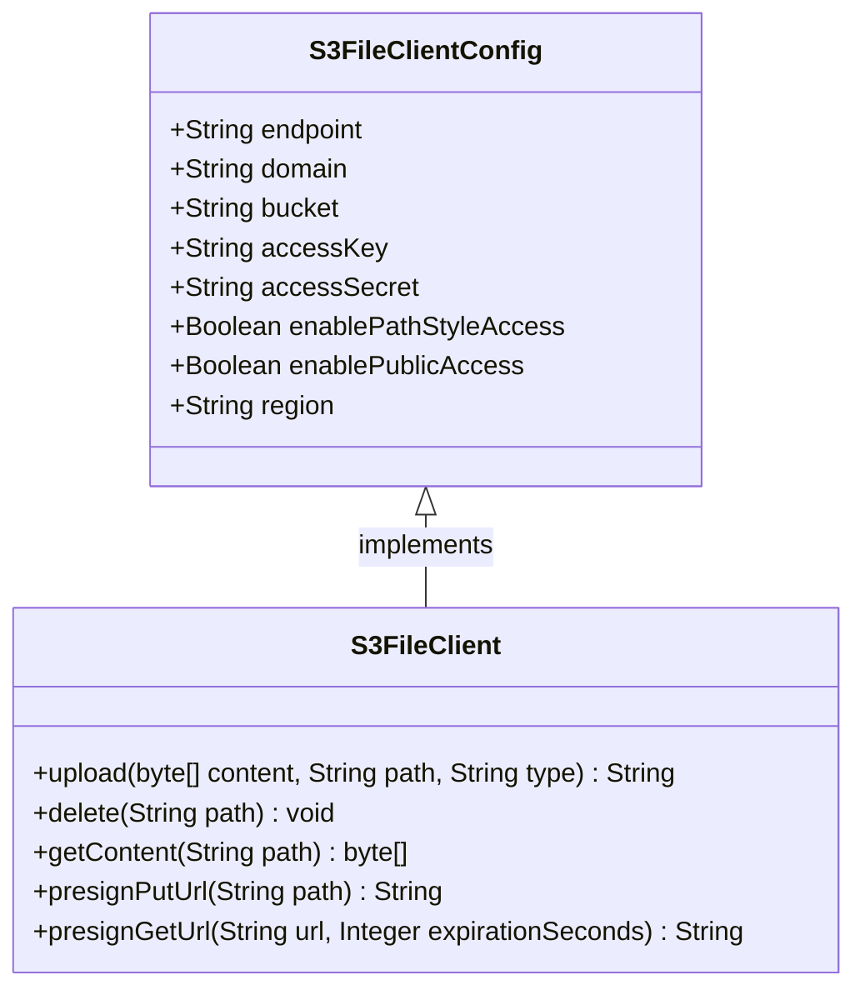

# S3 模块

## 概述
S3 模块提供了对象存储服务的客户端实现，支持多种云存储服务（如 MinIO、阿里云 OSS、腾讯云 COS、七牛云、华为云 OBS、火山云等），基于 S3 协议。该模块是文件存储框架的一部分，为上层文件服务提供统一的对象存储访问接口。

## 架构概述

## 子模块
<!-- SUB_MODULES_PLACEHOLDER -->

## 与其他模块的关系
S3 模块依赖于文件存储框架的基础类（如 `AbstractFileClient`），并被 `FileServiceImpl` 等服务用于处理文件上传、下载等操作。