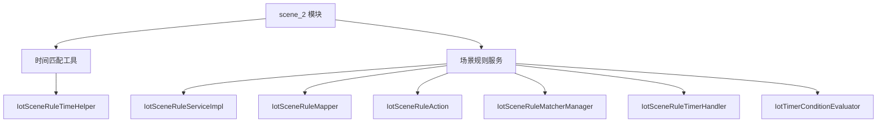
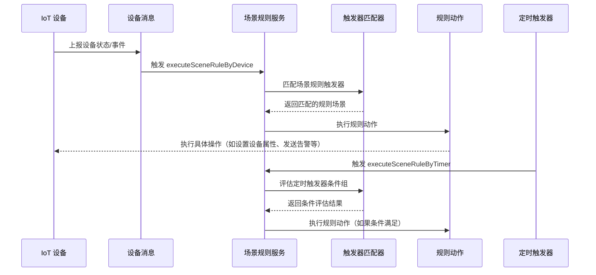

# scene_2 模块文档

## 概述

scene_2 模块是 IoT (物联网) 系统中的场景规则处理模块。该模块负责管理和执行基于设备状态和时间条件的自动化规则，使得物联网设备能够根据预定义的条件自动触发特定的动作。

## 架构概述

scene_2 模块主要由以下两个核心子模块组成：

1. **时间匹配工具 (Time Matcher)** - 提供时间条件匹配的通用方法
2. **场景规则服务 (Scene Rule Service)** - 负责场景规则的创建、更新、删除、查询和执行

## 子模块功能

### 时间匹配工具 (Time Matcher)
详细文档请参考 [scene_2_time_matcher.md](scene_2_time_matcher.md)

该子模块提供时间条件匹配的通用方法，主要用于：
- 判断是否为日期时间操作符
- 判断是否为时间操作符
- 执行时间匹配逻辑（包括日期时间匹配和当日时间匹配）
- 解析时间字符串（支持 HH:mm 和 HH:mm:ss 两种格式）

### 场景规则服务 (Scene Rule Service)
详细文档请参考 [scene_2_service.md](scene_2_service.md)

该子模块负责场景规则的完整生命周期管理，包括：
- 场景规则的创建、更新、删除和查询
- 场景规则状态管理（启用/禁用）
- 基于设备消息触发场景规则
- 基于定时器触发场景规则
- 条件组评估（AND/OR 逻辑）
- 动作执行
- 最后触发时间更新

## 与其他模块的关系

scene_2 模块依赖于以下其他模块：
- IoT 设备服务 (IotDeviceService) - 用于获取设备信息
- IoT 产品服务 (IotProductService) - 用于获取产品信息
- IoT 消息队列 - 用于处理设备消息
- 租户工具 (TenantUtils) - 用于处理多租户场景
- 缓存工具 - 用于提高性能

## 数据流

场景规则的典型执行流程如下：

## 关键特性

1. **灵活的触发条件**：支持基于设备属性、设备事件、时间触发器等多种触发方式
2. **复杂的条件逻辑**：支持条件组的 AND/OR 组合，实现复杂的业务规则
3. **多种动作类型**：支持设备属性设置、告警触发、服务调用等多种动作类型
4. **定时器支持**：支持基于时间的定时触发器，可配置具体时间或时间区间
5. **租户隔离**：支持多租户环境，每个租户的场景规则相互独立
6. **缓存优化**：利用缓存提高频繁查询的性能
7. **异常处理**：完善的异常处理机制，确保系统稳定运行

## 使用场景

1. **智能家居**：根据温度传感器读数自动调节空调温度
2. **工业监控**：当设备温度超过阈值时自动触发告警并停机
3. **农业物联网**：根据土壤湿度自动控制灌溉系统
4. **智慧城市**：根据交通流量自动调节信号灯时序
5. **定时任务调度**：在特定时间自动执行设备维护任务