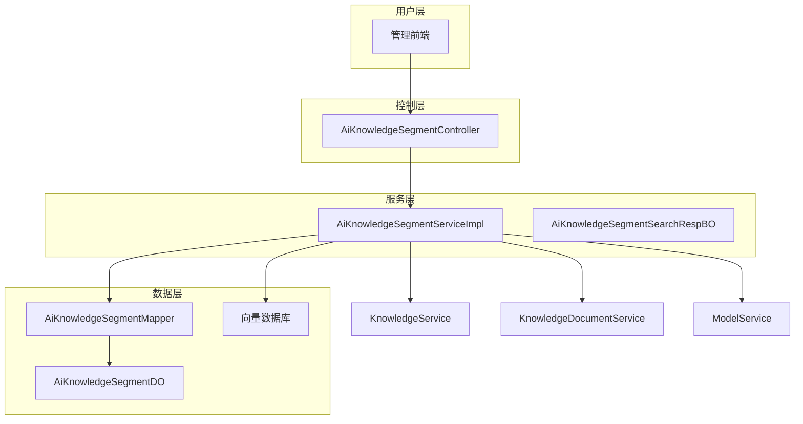
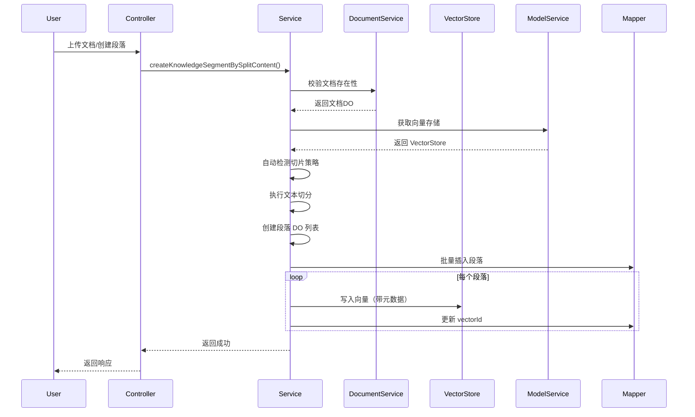
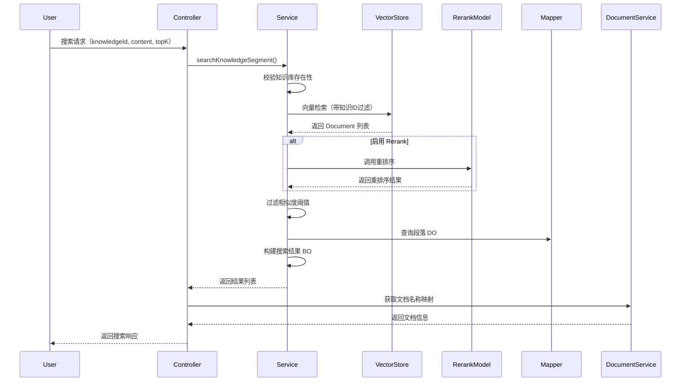
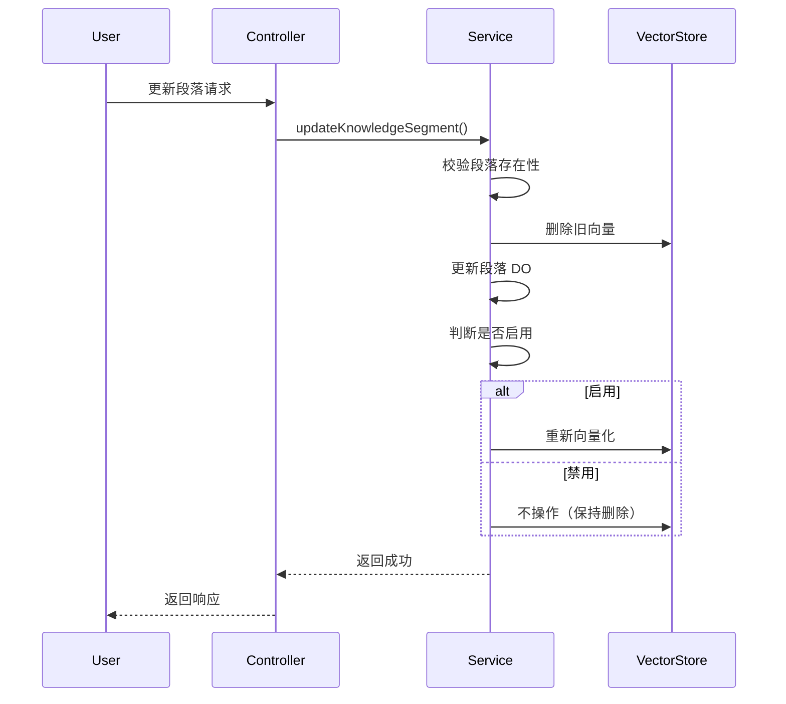

# AI 知识库段落模块文档

## 1. 模块概述

AI 知识库段落（Segment）模块是 Yudao 平台 AI 功能中的核心组件，负责管理知识库文档的细粒度切片、向量存储与检索。该模块将文档内容切分为多个语义段落，并为每个段落生成向量嵌入，支持基于语义相似度的智能检索，为 AI 问答、知识检索等功能提供底层数据支撑。

## 2. 功能特性

- **文档切片**：支持多种文本切分策略（Token、语义、Markdown QA 等），将长文档切分为语义完整的段落
- **向量存储**：将每个段落嵌入为向量，存储至向量数据库（如 Qdrant），并关联元数据（知识库ID、文档ID、段落ID）
- **智能检索**：支持基于语义相似度的段落检索，可选 Rerank 重排序提升检索精度
- **状态管理**：支持段落启用/禁用控制，禁用段落不参与检索
- **进度追踪**：提供文档段落向量化进度查询，便于监控批量处理状态
- **权限控制**：基于 Spring Security 的细粒度权限校验，确保操作安全

## 3. 架构设计

### 3.1 整体架构



### 3.2 组件关系

| 组件 | 职责 | 关联模块 |
|------|------|----------|
| **Controller** | 接收 HTTP 请求，参数校验，返回结果 | 前端 UI、Service |
| **ServiceImpl** | 核心业务逻辑：切片、向量化、检索、状态管理 | Mapper、VectorStore、其他 Service |
| **Mapper** | 数据库操作（CRUD、分页） | DO |
| **DO** | 数据库实体对象 | 数据库表 `ai_knowledge_segment` |
| **VectorStore** | 向量存储与检索（Embedding + 相似度搜索） | AI 模型服务 |
| **BO** | 检索结果业务对象 | Service、Controller |

## 4. API 说明

### 4.1 接口列表

| 接口 | 方法 | 路径 | 描述 | 权限 |
|------|------|------|------|------|
| 获取段落详情 | GET | `/ai/knowledge/segment/get` | 根据 ID 获取单个段落详情 | `ai:knowledge:query` |
| 获取分页列表 | GET | `/ai/knowledge/segment/page` | 分页查询段落列表 | `ai:knowledge:query` |
| 创建段落 | POST | `/ai/knowledge/segment/create` | 创建新段落（手动添加） | `ai:knowledge:create` |
| 更新段落 | PUT | `/ai/knowledge/segment/update` | 更新段落内容 | `ai:knowledge:update` |
| 更新状态 | PUT | `/ai/knowledge/segment/update-status` | 启用/禁用段落 | `ai:knowledge:update` |
| 删除段落 | DELETE | `/ai/knowledge/segment/delete` | 删除段落 | `ai:knowledge:delete` |
| 内容切片 | GET | `/ai/knowledge/segment/split` | 根据 URL 自动切分文档 | `ai:knowledge:query` |
| 获取处理进度 | GET | `/ai/knowledge/segment/get-process-list` | 获取文档向量化进度 | `ai:knowledge:query` |
| 搜索段落 | GET | `/ai/knowledge/segment/search` | 语义搜索相似段落 | `ai:knowledge:query` |

### 4.2 请求/响应对象

#### 4.2.1 AiKnowledgeSegmentPageReqVO - 分页查询请求

```java
@Schema(description = "管理后台 - AI 知识库分段的分页 Request VO")
@Data
public class AiKnowledgeSegmentPageReqVO extends PageParam {
    @Schema(description = "文档编号", example = "1")
    private Long documentId;
    
    @Schema(description = "分段内容关键字", example = "Java 开发")
    private String content;
    
    @Schema(description = "分段状态", example = "1")
    @InEnum(CommonStatusEnum.class)
    private Integer status;
}
```

**字段说明**：
- `documentId`：关联的文档编号
- `content`：段落内容关键字搜索
- `status`：段落状态（启用/禁用）

#### 4.2.2 AiKnowledgeSegmentSaveReqVO - 创建/更新请求

```java
@Schema(description = "管理后台 - AI 新增/修改知识库段落 request VO")
@Data
public class AiKnowledgeSegmentSaveReqVO {
    @Schema(description = "编号", example = "24790")
    private Long id;
    
    @Schema(description = "知识库文档编号", example = "1024")
    private Long documentId;
    
    @Schema(description = "切片内容", requiredMode = Schema.RequiredMode.REQUIRED, example = "Java 开发手册")
    @NotEmpty(message = "切片内容不能为空")
    private String content;
}
```

**字段说明**：
- `id`：主键，创建时为空，更新时必填
- `documentId`：所属文档编号
- `content`：段落文本内容

#### 4.2.3 AiKnowledgeSegmentUpdateStatusReqVO - 状态更新请求

```java
@Schema(description = "管理后台 - AI 知识库段落的更新状态 Request VO")
@Data
public class AiKnowledgeSegmentUpdateStatusReqVO {
    @Schema(description = "编号", requiredMode = Schema.RequiredMode.REQUIRED, example = "24790")
    private Long id;
    
    @Schema(description = "是否启用", requiredMode = Schema.RequiredMode.REQUIRED, example = "1")
    @NotNull(message = "是否启用不能为空")
    @InEnum(CommonStatusEnum.class)
    private Integer status;
}
```

**状态值**：
- `0`：禁用
- `1`：启用

#### 4.2.4 AiKnowledgeSegmentSearchReqVO - 搜索请求

```java
@Schema(description = "管理后台 - AI 知识库段落搜索 Request VO")
@Data
public class AiKnowledgeSegmentSearchReqVO {
    @Schema(description = "知识库编号", requiredMode = Schema.RequiredMode.REQUIRED, example = "1024")
    @NotNull(message = "知识库编号不能为空")
    private Long knowledgeId;
    
    @Schema(description = "内容", requiredMode = Schema.RequiredMode.REQUIRED, example = "如何使用这个产品")
    @NotEmpty(message = "内容不能为空")
    private String content;
    
    @Schema(description = "最大返回数量", example = "5")
    private Integer topK;
    
    @Schema(description = "相似度阈值", example = "0.7")
    private Double similarityThreshold;
}
```

**字段说明**：
- `knowledgeId`：所属知识库编号（必填）
- `content`：搜索关键词（必填）
- `topK`：返回结果数量，默认从知识库配置获取
- `similarityThreshold`：相似度阈值，低于该值的结果将被过滤

#### 4.2.5 AiKnowledgeSegmentProcessRespVO - 处理进度响应

```java
@Schema(description = "管理后台 - AI 知识库段落向量进度 Response VO")
@Data
public class AiKnowledgeSegmentProcessRespVO {
    @Schema(description = "文档编号", requiredMode = Schema.RequiredMode.REQUIRED, example = "1")
    private Long documentId;
    
    @Schema(description = "总段落数量", requiredMode = Schema.RequiredMode.REQUIRED, example = "10")
    private Long count;
    
    @Schema(description = "已向量化段落数量", requiredMode = Schema.RequiredMode.REQUIRED, example = "5")
    private Long embeddingCount;
}
```

#### 4.2.6 AiKnowledgeSegmentSearchRespVO - 搜索响应

```java
@Schema(description = "管理后台 - AI 知识库段落搜索 Response VO")
@Data
public class AiKnowledgeSegmentSearchRespVO extends AiKnowledgeSegmentRespVO {
    @Schema(description = "文档名称", requiredMode = Schema.RequiredMode.REQUIRED, example = "产品使用手册")
    private String documentName;
    
    @Schema(description = "相似度分数", requiredMode = Schema.RequiredMode.REQUIRED, example = "0.95")
    private Double score;
}
```

**字段说明**：
- `documentName`：所属文档名称
- `score`：相似度分数（0-1 之间，越高越相似）

## 5. 核心流程

### 5.1 文档切片与向量化流程



### 5.2 语义搜索流程



### 5.3 段落更新流程



## 6. 数据模型

### 6.1 AiKnowledgeSegmentDO（数据库实体）

| 字段 | 类型 | 说明 |
|------|------|------|
| id | BIGINT | 主键 |
| knowledgeId | BIGINT | 知识库编号 |
| documentId | BIGINT | 文档编号 |
| content | TEXT | 段落内容 |
| contentLength | INT | 内容长度（字符数） |
| vectorId | VARCHAR | 向量存储中的 ID |
| tokens | INT | Token 数量 |
| status | INT | 状态（启用/禁用） |
| retrievalCount | INT | 检索次数 |
| createTime | DATETIME | 创建时间 |
| updateTime | DATETIME | 更新时间 |

### 6.2 向量存储元数据

每个向量段落附加以下元数据键值对：

| 键 | 类型 | 说明 |
|----|------|------|
| knowledgeId | String | 知识库编号（字符串） |
| documentId | String | 文档编号（字符串） |
| segmentId | String | 段落编号（字符串） |

> **注意**：元数据值统一转换为字符串，因为部分向量存储（如 Qdrant）不支持 Long 类型。

## 7. 切片策略

系统支持多种文档切片策略，可根据文档内容自动检测或手动指定：

| 策略 | 适用场景 | 特点 |
|------|----------|------|
| **AUTO** | 自动检测 | 根据文档格式智能选择策略 |
| **MARKDOWN_QA** | Markdown QA 格式 | 按 ## 标题分割，保留问答结构 |
| **SEMANTIC** | 通用文本 | 语义切分，保留上下文完整性 |
| **PARAGRAPH** | 段落文本 | 按段落分割，无重叠 |
| **TOKEN** | 通用文本 | 按 Token 数量固定切分 |

### 7.1 自动检测逻辑

1. 检测是否为 Markdown QA 格式（包含多个 ## 标题且标题占比 > 10%）
2. 检测是否为普通 Markdown 文档（.md/.markdown 后缀）
3. 默认使用语义切分策略

## 8. 依赖模块

| 模块 | 依赖说明 |
|------|----------|
| **AI 知识库模块** | 关联知识库（Knowledge）和文档（Document）信息 |
| **AI 模型模块** | 获取 Embedding 模型和向量存储实例 |
| **权限模块** | 操作权限校验（`ai:knowledge:*`） |
| **通用工具模块** | 字符串处理、集合操作、对象转换等 |
| **向量存储模块** | 向量数据库操作（增、删、查） |

## 9. 异常处理

| 异常码 | 异常信息 | 触发场景 |
|--------|----------|----------|
| `KNOWLEDGE_SEGMENT_NOT_EXISTS` | 段落不存在 | 查询/更新/删除不存在的段落 |
| `KNOWLEDGE_SEGMENT_CONTENT_TOO_LONG` | 段落内容过长，最多支持 {0} 个 Token | 创建段落时内容超过文档限制 |
| `KNOWLEDGE_NOT_EXISTS` | 知识库不存在 | 关联的知识库已删除 |
| `KNOWLEDGE_DOCUMENT_NOT_EXISTS` | 文档不存在 | 关联的文档已删除 |

## 10. 扩展点

### 10.1 切片策略扩展

可通过实现 `AiDocumentSplitStrategyEnum` 新增切片策略，并在 `splitContentByStrategy` 方法中增加 case 处理。

### 10.2 向量存储扩展

系统通过 `VectorStore` 接口抽象向量存储操作，支持切换不同的向量数据库（如 Qdrant、Milvus 等）。

### 10.3 Rerank 扩展

通过注入 `RerankModel` 实现重排序功能，可替换为不同的重排序算法。

## 11. 相关文档

- [知识库模块.md](knowledge.md) - 知识库整体管理
- [文档模块.md](document.md) - 文档上传与管理
- [AI 服务模块.md](ai-service.md) - AI 模型与向量服务
- [权限模块.md](permission.md) - 权限配置与校验
