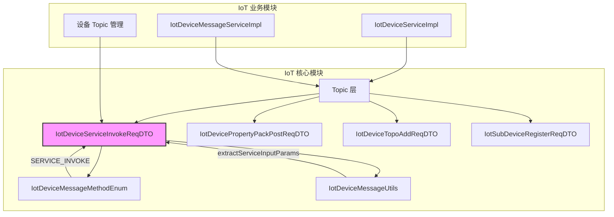
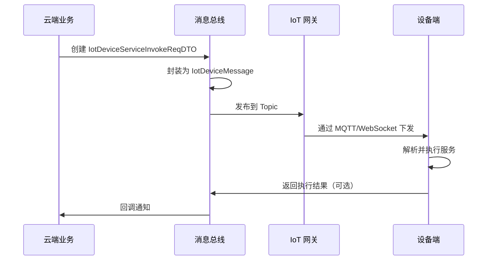
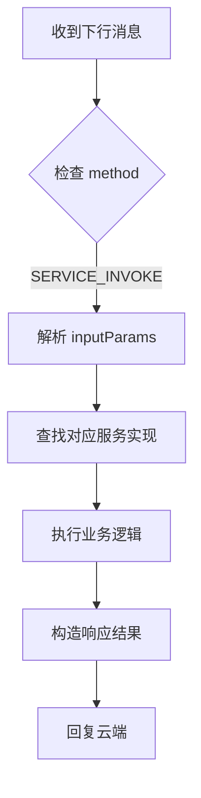

# IoT 设备服务调用模块文档

## 1. 模块概述

**服务调用模块**是 IoT 核心模块（`yudao-module-iot-core`）中负责处理设备服务请求的核心组件。该模块定义了设备服务调用的请求 DTO，用于支持云端向设备发起服务调用（Service Invocation）的场景。

在物联网架构中，设备通常通过上报属性、事件等方式与云端交互，但有时云端也需要主动调用设备上的特定服务（如重启设备、获取诊断信息等）。本模块正是为此类**下行服务调用**场景提供数据载体。

### 核心功能

- 定义设备服务调用的请求数据结构
- 支持服务标识符和输入参数的封装
- 与 IoT 消息总线（Message Bus）无缝集成
- 遵循阿里云 IoT 平台 `thing.service.invoke` 协议规范

## 2. 架构关系



### 模块依赖关系

| 依赖模块 | 说明 |
|---------|------|
| `yudao-module-iot-core` | 本模块所在的核心模块，包含所有 Topic DTO |
| `yudao-module-iot-biz` | 业务模块，使用 DTO 处理实际设备消息 |
| `yudao-module-iot-gateway` | 网关模块，通过 Topic 协议解析设备消息 |

## 3. 核心组件详解

### 3.1 IotDeviceServiceInvokeReqDTO

**文件路径**: `yudao-module-iot/yudao-module-iot-core/src/main/java/cn/iocoder/yudao/module/iot/core/topic/service/IotDeviceServiceInvokeReqDTO.java`

#### 类设计

```java
@Data
@NoArgsConstructor
@AllArgsConstructor
public class IotDeviceServiceInvokeReqDTO {
    
    /** 服务标识符 */
    private String identifier;
    
    /** 服务输入参数 */
    private Map<String, Object> inputParams;
}
```

#### 字段说明

| 字段名 | 类型 | 必填 | 说明 |
|-------|------|------|------|
| identifier | String | 是 | 服务标识符，对应设备上定义的服务名称（如 `reboot`, `getDiagnostic`） |
| inputParams | Map<String, Object> | 否 | 服务输入参数，键值对形式，根据具体服务定义 |

#### 使用场景

当云端需要调用设备上的某个服务时，构造该 DTO 并通过消息总线发送：

```java
// 示例：构造服务调用请求
IotDeviceServiceInvokeReqDTO request = new IotDeviceServiceInvokeReqDTO(
    "reboot",                    // 服务标识符：重启服务
    Collections.singletonMap("delay", 5)  // 输入参数：延迟5秒
);

// 通过消息总线发送下行消息
IotDeviceMessage message = new IotDeviceMessage();
message.setMethod(IotDeviceMessageMethodEnum.SERVICE_INVOKE.getMethod());
message.setParams(request);
message.setDeviceId("device_001");
messageGateway.send(message);
```

#### 消息协议规范

遵循阿里云 IoT 平台设备服务调用协议：

- **Topic**: `$/{productKey}/{deviceName}/service/invocation`
- **Method**: `thing.service.invoke`
- **Payload**: JSON 格式，包含 `identifier` 和 `inputParams`
- **Response**: 设备执行后返回结果（Code 非空表示回复）

### 3.2 关联枚举：IotDeviceMessageMethodEnum

该 DTO 关联的枚举值 `SERVICE_INVOKE` 定义了消息的语义：

```java
SERVICE_INVOKE("thing.service.invoke", "服务调用", false),
```

- **method**: `thing.service.invoke`
- **name**: 服务调用
- **upstream**: `false`（表示这是下行消息，由云端发起）

### 3.3 工具类支持：IotDeviceMessageUtils

消息工具类提供了对服务调用消息的处理能力：

```java
// 从设备消息中提取输入参数
public static Map<String, Object> extractServiceInputParams(IotDeviceMessage message) {
    // 兼容 Map 和 POJO 两种 params 形态
    Object inputData = readField(params, "inputData");
    Object inputParams = readField(params, "inputParams");
    // ...
}
```

该工具类支持从原始消息中反序列化提取 `IotDeviceServiceInvokeReqDTO` 中的参数，便于业务层处理。

## 4. 数据流分析

### 4.1 云端发起服务调用流程



### 4.2 设备端处理流程



## 5. 与其他 Topic DTO 的关系

本模块是 IoT Topic 层 DTO 集合的一部分，与其他 Topic DTO 协同工作：

| DTO | 用途 | 关联 Method |
|-----|------|-------------|
| `IotDeviceServiceInvokeReqDTO` | 服务调用请求 | `SERVICE_INVOKE` |
| `IotDevicePropertyPackPostReqDTO` | 属性/事件批量上报 | `PROPERTY_PACK_POST` |
| `IotSubDeviceRegisterReqDTO` | 子设备注册 | `DEVICE_REGISTER` |
| `IotDeviceTopoAddReqDTO` | 拓扑关系添加 | `TOPO_ADD` |
| `IotDeviceOtaUpgradeReqDTO` | OTA 升级指令 | `OTA_UPGRADE` |

## 6. 扩展性设计

### 6.1 参数灵活性

`inputParams` 使用 `Map<String, Object>` 类型，支持任意结构的参数传递，便于：

- 不同服务定义不同的参数结构
- 未来新增参数无需修改 DTO 结构
- 兼容不同设备的参数格式

### 6.2 兼容设计

工具类 `IotDeviceMessageUtils.extractServiceInputParams()` 同时支持：

- **Map 格式**：MQ 消息反序列化后的标准 Map 结构
- **POJO 格式**：本地总线直接传递的 DTO 对象

这种设计保证了在分布式消息和本地事件两种场景下的一致性。

## 7. 参考文档

- [阿里云 IoT 设备服务调用文档](https://help.aliyun.com/zh/iot/user-guide/device-properties-events-and-services)
- [IoT 模块整体架构](./iot-core.md)
- [消息总线设计](./message-bus.md)
- [Topic 层其他 DTO](./topic-dto.md)

## 8. 常见问题

### Q1: 服务调用是否需要设备回复？

**A**: 根据 `IotDeviceMessageMethodEnum.SERVICE_INVOKE.upstream = false`，服务调用是下行消息，**设备可以选择性回复**。如果需要获取执行结果，设备应通过回复消息（Code 非空）返回结果。

### Q2: 如何支持多个服务？

**A**: 通过 `identifier` 字段区分不同服务。云端可以根据需要定义多个服务标识符，每个服务对应不同的 `inputParams` 结构。

### Q3: 参数类型支持哪些？

**A**: `Map<String, Object>` 支持所有基本类型（String、Integer、Boolean、Double 等）以及嵌套 Map/List 结构，通过 JSON 序列化传输。
