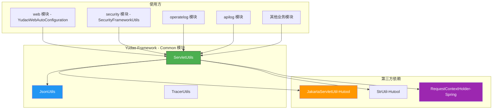
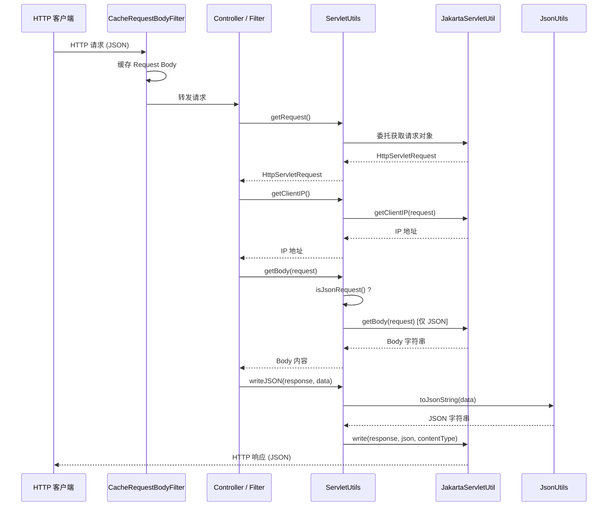
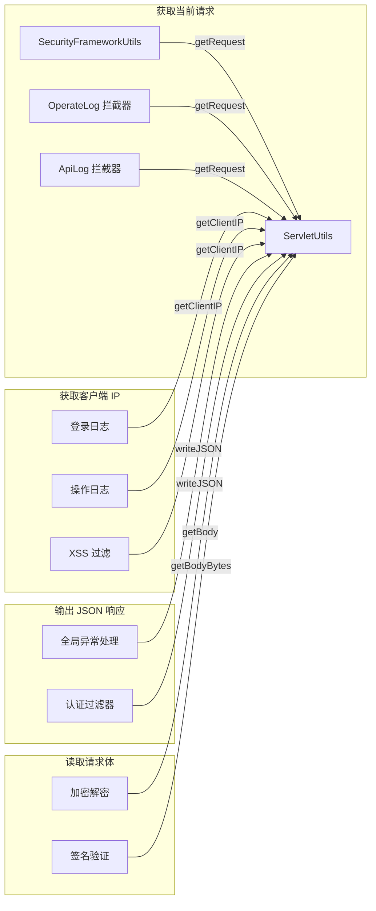

# Servlet 工具模块文档

## 1. 概述

`servlet` 模块是框架提供的一组 **Servlet 工具类**，位于 `yudao-framework/yudao-common` 基础模块中。该模块封装了基于 Jakarta Servlet API（兼容 Spring Boot 3.x + Tomcat 10）的常见 Web 操作，包括获取请求/响应对象、读取客户端 IP、User-Agent、请求体、参数和头部信息等。

该模块在所有需要处理 HTTP 请求的应用层模块（如 `web`、`security`、`operatelog` 等）中被广泛使用，是整个系统 Web 层的通用基础支持模块。

---

## 2. 核心类：`ServletUtils`

### 2.1 类定位与职责

**类名**：`cn.iocoder.yudao.framework.common.util.servlet.ServletUtils`

**核心职责**：
- 提供对 `HttpServletRequest` / `HttpServletResponse` 的便捷访问
- 封装常见的请求属性提取（UA、IP、Body、Params、Headers）
- 提供 JSON 格式响应的快速输出
- 作为框架内 Web 工具类的统一入口，避免各模块重复实现

**依赖的模块/类**：
| 依赖项 | 用途 |
|-------|------|
| `cn.hutool.extra.servlet.JakartaServletUtil` | 底层 Servlet 操作委托，获取 IP、Body、ParamMap、HeaderMap |
| `cn.hutool.core.util.StrUtil` | 字符串工具（判空、忽略大小写前缀匹配） |
| `cn.iocoder.yudao.framework.common.util.json.JsonUtils` | 对象序列化为 JSON 字符串 |
| `org.springframework.web.context.request.RequestContextHolder` | 从 Spring 上下文中获取当前请求 |
| `jakarta.servlet.http.HttpServletRequest/Response` | Jakarta EE Servlet API |

### 2.2 API 说明

| 方法 | 参数 | 返回值 | 说明 |
|------|------|--------|------|
| `writeJSON` | `HttpServletResponse response, Object object` | `void` | 将对象序列化为 JSON 字符串并写入响应，Content-Type 设为 `application/json;charset=UTF-8` |
| `getUserAgent(HttpServletRequest)` | `HttpServletRequest request` | `String` | 获取请求头 `User-Agent`，若为 null 返回空字符串 |
| `getUserAgent()` | 无 | `String` | 从 Spring `RequestContextHolder` 获取当前请求的 User-Agent |
| `getRequest()` | 无 | `HttpServletRequest` | 从 Spring `RequestContextHolder` 获取当前请求，非 Web 线程返回 null |
| `getClientIP()` | 无 | `String` | 获取当前请求的客户端 IP（委托 Hutool 实现，支持反向代理） |
| `getClientIP(HttpServletRequest)` | `HttpServletRequest request` | `String` | 获取指定请求的客户端 IP |
| `isJsonRequest` | `ServletRequest request` | `boolean` | 判断请求的 Content-Type 是否以 `application/json` 开头（忽略大小写） |
| `getBody` | `HttpServletRequest request` | `String` | 获取 JSON 请求的 Body 内容（要求已通过 `CacheRequestBodyFilter` 缓存） |
| `getBodyBytes` | `HttpServletRequest request` | `byte[]` | 获取 JSON 请求的 Body 字节数组 |
| `getParamMap` | `HttpServletRequest request` | `Map<String, String>` | 获取请求参数 Map |
| `getHeaderMap` | `HttpServletRequest request` | `Map<String, String>` | 获取请求头部 Map |

### 2.3 关键实现细节

#### 2.3.1 JSON 响应写入
```java
public static void writeJSON(HttpServletResponse response, Object object) {
    String content = JsonUtils.toJsonString(object);
    JakartaServletUtil.write(response, content, MediaType.APPLICATION_JSON_VALUE + ";charset=UTF-8");
}
```
- 使用 `JsonUtils`（基于 Jackson/Hutool）将对象序列化
- 通过 `JakartaServletUtil.write` 写入响应流
- 显式指定 UTF-8 编码

#### 2.3.2 请求体读取约束
```java
public static String getBody(HttpServletRequest request) {
    if (isJsonRequest(request)) {
        return JakartaServletUtil.getBody(request);
    }
    return null;
}
```
- **仅在 JSON 请求下读取 Body**
- 依赖 `CacheRequestBodyFilter` 预缓存 Body，否则只能读取一次（InputStream 不可重复读）

#### 2.3.3 获取当前请求
```java
public static HttpServletRequest getRequest() {
    RequestAttributes requestAttributes = RequestContextHolder.getRequestAttributes();
    if (!(requestAttributes instanceof ServletRequestAttributes)) {
        return null;
    }
    return ((ServletRequestAttributes) requestAttributes).getRequest();
}
```
- 依赖 Spring 的 `RequestContextHolder`，非 Web 线程（如异步任务、MQ 消费者）返回 null

---

## 3. 架构关系图



---

## 4. 数据流图



---

## 5. 调用关系示例

### 5.1 在各模块中的典型调用



### 5.2 相关工具模块引用

- [json 模块](json.md) — 提供 `JsonUtils`，用于 `writeJSON` 中的对象序列化
- [http 模块](http.md) — 提供 `HttpUtils`，负责外部 HTTP 调用，与 `ServletUtils` 互补（一个处理入站请求，一个处理出站请求）
- [monitor 模块](monitor.md) — 提供 `TracerUtils`，与 `ServletUtils` 配合在请求上下文中获取 TraceId
- [spring 模块](spring.md) — 提供 `SpringUtils`，补充非 Web 环境下的 Bean 获取能力

---

## 6. 与相关模块的对比

| 模块 | 工具类 | 方向 | 适用场景 |
|------|--------|------|----------|
| **servlet** | `ServletUtils` | **入站**（处理接收到的 HTTP 请求） | Controller/Filter 中获取请求信息、输出响应 |
| **http** | `HttpUtils` | **出站**（发起外部 HTTP 调用） | 调用第三方 REST API、服务间通信 |
| **monitor** | `TracerUtils` | **链路追踪** | 获取/设置 TraceId，与请求上下文关联 |

---

## 7. 最佳实践

### 7.1 获取当前登录用户 IP
```java
// 推荐方式
String clientIP = ServletUtils.getClientIP();
```

### 7.2 返回统一 JSON 格式
```java
// 在全局异常处理器或过滤器中
ServletUtils.writeJSON(response, CommonResult.error(500, "服务器内部错误"));
```

### 7.3 读取请求 Body（需配合 CacheRequestBodyFilter）
```java
// 确保 CacheRequestBodyFilter 已注册
String body = ServletUtils.getBody(request);
if (body != null) {
    // 解析 body...
}
```

### 7.4 线程安全说明
- `getRequest()` 依赖 `RequestContextHolder`，底层使用 `ThreadLocal`，**仅可在处理请求的线程中调用**
- 若在异步任务、MQ 消费者、定时任务中调用，将返回 `null`

---

## 8. 常见问题

### Q: `getBody()` 返回 null？
**A**: 可能原因：
1. 请求 Content-Type 不是 `application/json`
2. `CacheRequestBodyFilter` 未启用或未正确配置
3. Body 已被提前读取（InputStream 已关闭）

### Q: `getRequest()` 在异步线程中返回 null？
**A**: `RequestContextHolder` 默认基于 `ThreadLocal`，异步线程不会继承请求上下文。可通过配置 `RequestContextHolder.setRequestAttributes` 或使用 `TransmittableThreadLocal` 解决。

### Q: 为什么使用 `JakartaServletUtil` 而非 `ServletUtil`？
**A**: 项目基于 Spring Boot 3.x + Tomcat 10，使用 **Jakarta EE**（javax → jakarta 命名空间），因此选择 Hutool 的 Jakarta 版本工具类。
