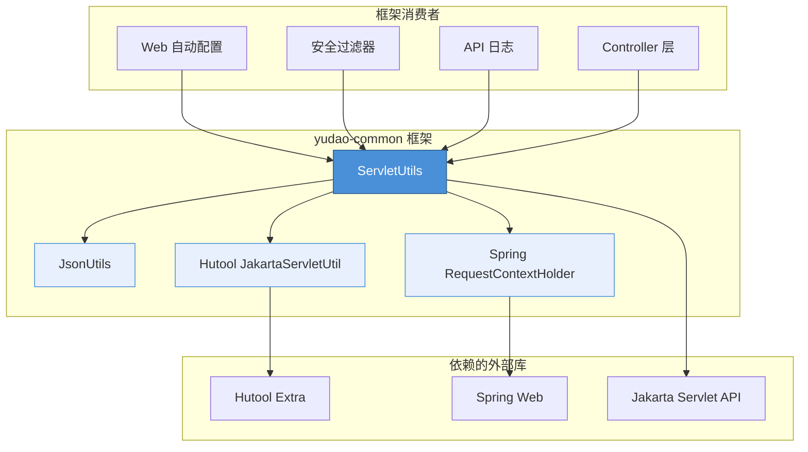
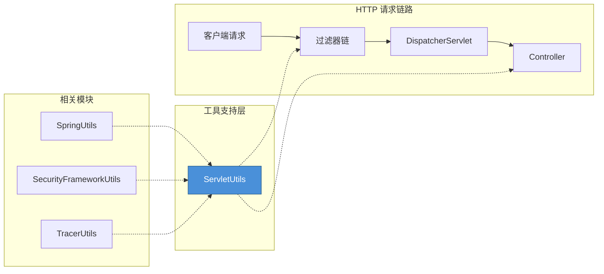
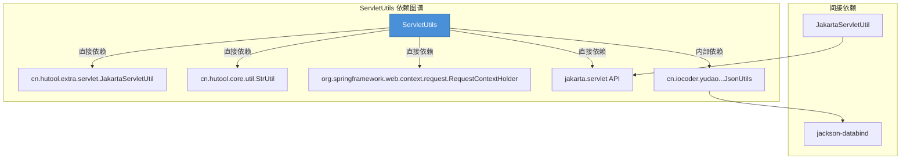
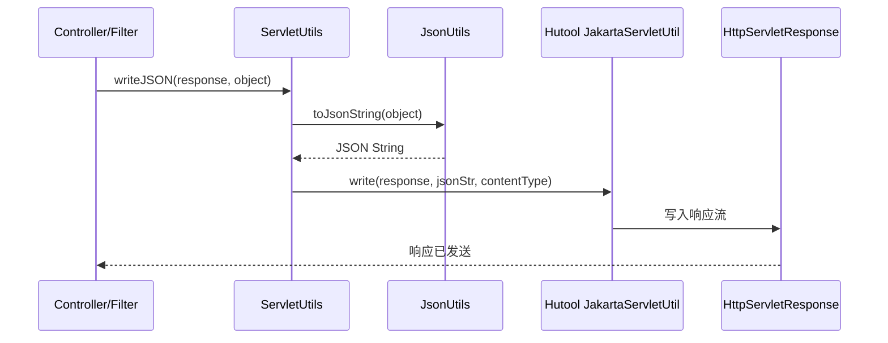
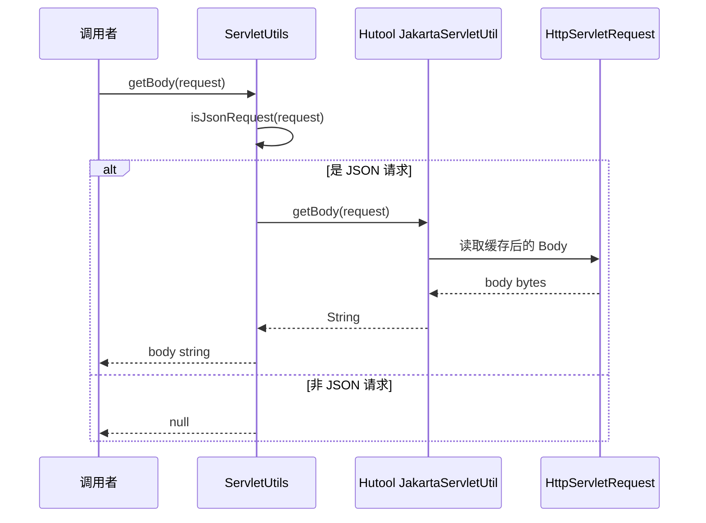
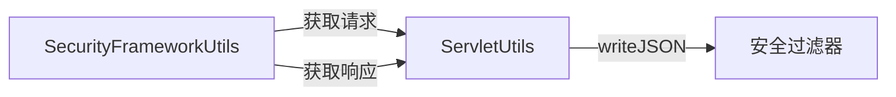

# ServletUtils 模块

## 概述

`ServletUtils` 是位于 `yudao-common` 框架中的一个客户端工具类，提供基于 Jakarta Servlet 和 Spring Web 上下文的 HTTP 请求/响应处理功能。该工具类封装了常见的 Servlet 操作，包括请求头获取、客户端 IP 解析、JSON 响应写入、请求体读取等，是系统中所有 Web 层模块的基础工具。

通过静态方法的形式，`ServletUtils` 为控制器（Controller）、过滤器（Filter）、拦截器（Interceptor）等组件提供了便捷的 Servlet 操作能力，避免了重复代码。

---

## 架构定位

### 模块层级关系



### 在系统架构中的位置



---

## API 参考

### 方法总览

| 方法名 | 返回类型 | 简述 |
|--------|----------|------|
| `writeJSON` | `void` | 将对象序列化为 JSON 并写入 HTTP 响应 |
| `getUserAgent(HttpServletRequest)` | `String` | 获取请求头中的 User-Agent |
| `getUserAgent()` | `String` | 从当前线程上下文获取 User-Agent |
| `getRequest()` | `HttpServletRequest` | 从 Spring 上下文获取当前请求对象 |
| `getClientIP()` | `String` | 从当前线程上下文获取客户端 IP |
| `getClientIP(HttpServletRequest)` | `String` | 从指定请求中获取客户端 IP |
| `isJsonRequest` | `boolean` | 判断请求是否为 JSON 内容类型 |
| `getBody(HttpServletRequest)` | `String` | 获取请求体字符串（仅 JSON 请求） |
| `getBodyBytes(HttpServletRequest)` | `byte[]` | 获取请求体字节数组（仅 JSON 请求） |
| `getParamMap` | `Map<String, String>` | 获取请求参数映射 |
| `getHeaderMap` | `Map<String, String>` | 获取请求头映射 |

---

### 方法详细说明

#### 1. `writeJSON(HttpServletResponse response, Object object)`

将给定的 Java 对象序列化为 JSON 字符串，并以 `application/json;charset=UTF-8` 的 Content-Type 写入 HTTP 响应。

**内部实现：**
1. 调用 `JsonUtils.toJsonString(object)` 将对象转为 JSON 字符串
2. 调用 Hutool 的 `JakartaServletUtil.write()` 写入响应

**典型用途：**
- 在过滤器或拦截器中直接返回 JSON 错误响应
- 在 Controller 中手动构建响应（如文件导出场景）

---

#### 2. `getUserAgent(HttpServletRequest request)` / `getUserAgent()`

获取请求头中的 `User-Agent` 字符串。重载方法 `getUserAgent()` 通过 `getRequest()` 自动从 Spring 上下文获取请求对象。

**典型用途：**
- 操作日志记录用户浏览器/设备信息
- 请求来源分析统计

---

#### 3. `getRequest()`

从 `RequestContextHolder` 中获取当前线程绑定的 `HttpServletRequest` 对象。这是 Spring MVC 提供的请求上下文持有机制，确保在同一个请求处理线程中可以随时访问请求对象。

**注意：**
- 在异步处理或线程池中可能获取不到请求对象（返回 `null`）
- 需要确保已在 Spring Web 环境中调用

---

#### 4. `getClientIP()` / `getClientIP(HttpServletRequest)`

获取客户端真实 IP 地址。内部委托给 Hutool 的 `JakartaServletUtil.getClientIP()`，该方法会自动处理常见的反向代理头部（如 `X-Forwarded-For`、`X-Real-IP` 等），获取最左侧的真实客户端 IP。

**典型用途：**
- 安全审计记录操作者 IP
- 限流、黑白名单判断
- 地区定位服务

---

#### 5. `isJsonRequest(ServletRequest request)`

通过检查请求的 `Content-Type` 是否以 `application/json` 开头来判断是否为 JSON 请求（忽略大小写）。

**典型用途：**
- 在过滤器中有条件地缓存请求体
- 根据请求类型选择不同的处理逻辑

---

#### 6. `getBody(HttpServletRequest request)` / `getBodyBytes(HttpServletRequest request)`

获取请求体的字符串或字节数组形式。**注意**：该方法仅在 `isJsonRequest` 返回 `true` 时才会读取请求体，否则返回 `null`。

**设计考量：**
- JSON 请求通常需要多次读取请求体（例如：认证过滤器读取一次 + Controller 的 `@RequestBody` 读取一次）
- 只对 JSON 请求启用读取，避免不必要的流操作
- 需要配合 `CacheRequestBodyFilter` 使用（该过滤器会缓存请求体以实现重复读取）

**典型用途：**
- 在 AOP 切面中记录请求体日志
- 在过滤器中验签/解密请求体

---

#### 7. `getParamMap(HttpServletRequest request)`

获取请求参数的 Map 映射，其中 key 为参数名，value 为参数值（仅第一个值，多个同名参数只取第一个）。

---

#### 8. `getHeaderMap(HttpServletRequest request)`

获取所有请求头的 Map 映射。

---

## 依赖关系

### 外部依赖



### 依赖说明

| 依赖项 | 类型 | 用途 |
|--------|------|------|
| `cn.hutool.extra.servlet.JakartaServletUtil` | 直接外部依赖 | 提供 `write()`、`getClientIP()`、`getBody()`、`getParamMap()`、`getHeaderMap()` 等基础 Servlet 操作 |
| `cn.hutool.core.util.StrUtil` | 直接外部依赖 | 提供 `startWithIgnoreCase()` 方法用于忽略大小写判断 Content-Type |
| `org.springframework.web.context.request.RequestContextHolder` | 直接外部依赖 | 提供从线程上下文获取当前请求的能力 |
| `jakarta.servlet.*` | 直接外部依赖 | Servlet API 标准接口 |
| `cn.iocoder.yudao.framework.common.util.json.JsonUtils` | 内部依赖 | JSON 序列化工具，用于 `writeJSON()` 方法 |

> 关于 `JsonUtils` 的详细说明请参考 [json_utils.md](json_utils.md)（假设存在）。

---

## 内部数据流

### 响应 JSON 写入流程



### 请求体获取流程



---

## 与相关模块的协作

`ServletUtils` 在系统中被多个上层模块使用，以下是主要的协作关系：

### 1. Web 安全模块 (`yudao-spring-boot-starter-security`)

在 `SecurityFrameworkUtils` 中，通过 `ServletUtils.getRequest()` 获取请求对象以提取当前登录用户信息。



### 2. API 日志模块 (`yudao-spring-boot-starter-web`)

在 API 日志切面中，使用 `ServletUtils` 获取请求 IP、User-Agent、请求体等信息以记录操作日志。

### 3. 数据脱敏模块

在脱敏处理上下文中，通过 `ServletUtils` 获取请求信息以判断是否需要脱敏。

### 4. 多租户模块

在多租户过滤器中，通过请求解析租户 ID。

---

## 典型使用场景与示例

### 场景一：在过滤器中返回 JSON 错误

```java
public class AuthFilter extends OncePerRequestFilter {
    @Override
    protected void doFilterInternal(HttpServletRequest request, 
                                     HttpServletResponse response, 
                                     FilterChain chain) {
        if (!isAuthenticated(request)) {
            // 直接返回 JSON 错误响应
            ServletUtils.writeJSON(response, CommonResult.error(401, "未授权"));
            return;
        }
        chain.doFilter(request, response);
    }
}
```

### 场景二：记录操作日志

```java
public class LogAspect {
    @Around("@annotation(OperateLog)")
    public Object around(ProceedingJoinPoint joinPoint) {
        // 记录请求信息
        String userAgent = ServletUtils.getUserAgent();
        String clientIP = ServletUtils.getClientIP();
        String requestBody = ServletUtils.getBody(ServletUtils.getRequest());
        
        // ... 业务逻辑
        return joinPoint.proceed();
    }
}
```

### 场景三：获取当前请求上下文

```java
// 在 Service 层获取请求信息（非 Controller 层）
public class SomeServiceImpl {
    public void doSomething() {
        HttpServletRequest request = ServletUtils.getRequest();
        if (request != null) {
            String token = request.getHeader("Authorization");
            // ... 处理 token
        }
    }
}
```

---

## 注意事项

1. **请求体重复读取**：`getBody()` 和 `getBodyBytes()` 依赖 `CacheRequestBodyFilter` 对请求体进行缓存。直接读取原始 `HttpServletRequest` 的输入流会导致后续读取不到数据。确保在过滤器链中已配置 `CacheRequestBodyFilter`。

2. **线程安全**：`getRequest()` 依赖于 `RequestContextHolder`，该机制使用 `ThreadLocal` 存储请求上下文。在异步处理或线程池中，若没有正确传递上下文，可能获取不到请求对象。

3. **IP 获取的准确性**：`getClientIP()` 委托给 Hutool 实现，通常会依次检查 `X-Forwarded-For`、`X-Real-IP`、`Proxy-Client-IP`、`WL-Proxy-Client-IP` 等头部。确保反向代理配置正确，否则可能获取到代理服务器的 IP。

4. **性能考量**：`getParamMap()` 和 `getHeaderMap()` 返回的是新创建的 Map 对象，在频繁调用时注意性能开销。

---

## 与其他工具模块的对比

| 功能点 | ServletUtils | SpringUtils | SecurityFrameworkUtils |
|--------|-------------|-------------|----------------------|
| 获取当前请求 | ✅ `getRequest()` | ❌ | ✅ (间接通过 ServletUtils) |
| 获取客户端 IP | ✅ | ❌ | ❌ |
| 获取请求体 | ✅ | ❌ | ❌ |
| 写入 JSON 响应 | ✅ | ❌ | ❌ |
| 获取 Spring Bean | ❌ | ✅ | ❌ |
| 获取当前登录用户 | ❌ | ❌ | ✅ |
| 获取 User-Agent | ✅ | ❌ | ❌ |

> 关于 `SpringUtils` 的详细说明请参考 [spring_utils.md](spring_utils.md)。  
> 关于 `SecurityFrameworkUtils` 的详细说明请参考 [security_framework_utils.md](security_framework_utils.md)。

---

## 扩展阅读

- [Spring RequestContextHolder 官方文档](https://docs.spring.io/spring-framework/docs/current/javadoc-api/org/springframework/web/context/request/RequestContextHolder.html)
- [Hutool JakartaServletUtil 文档](https://doc.hutool.cn/apidocs/cn/hutool/extra/servlet/JakartaServletUtil.html)
- [JsonUtils 模块文档](json_utils.md)（假设存在）
- [CacheRequestBodyFilter 配置说明](web_auto_configuration.md)（假设存在）
