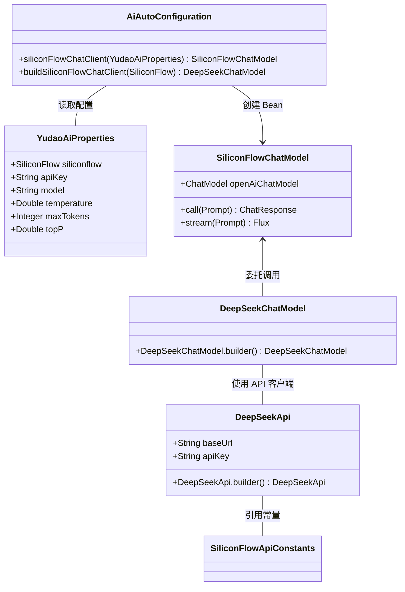

# SiliconFlow 模块文档

## 1. 概述

**SiliconFlow** 模块是 Yudao AI 模块中的一个子模块，用于集成 **SiliconFlow**（硅基流动）AI 服务平台。SiliconFlow 是一个提供大模型 API 服务的平台，支持多种大模型的调用，包括 DeepSeek 系列模型等。

该模块实现了与 SiliconFlow 平台的对接，通过统一的 Spring AI 接口，使得系统可以方便地使用 SiliconFlow 提供的 AI 能力，包括文本对话、图像生成等功能。

## 2. 模块定位

```
yudao-module-ai (AI 模块)
├── framework/
│   └── ai/
│       └── core/
│           └── model/
│               └── siliconflow/          ← SiliconFlow 模块
│                   ├── SiliconFlowApiConstants.java
│                   └── SiliconFlowChatModel.java
├── config/
│   └── AiAutoConfiguration.java          ← 包含 SiliconFlow 的自动配置
└── properties/
    └── YudaoAiProperties.java            ← 包含 SiliconFlow 的配置属性
```

SiliconFlow 模块与其他 AI 提供商模块（如 DashScope、XingHuo、BaiChuan 等）并列，采用统一的集成模式，通过 `DeepSeekChatModel` 兼容层实现对 SiliconFlow API 的调用。

## 3. 核心组件

### 3.1 SiliconFlowApiConstants

**文件路径**: `yudao-module-ai/src/main/java/cn/iocoder/yudao/module/ai/framework/ai/core/model/siliconflow/SiliconFlowApiConstants.java`

该类定义了 SiliconFlow 相关的常量，包括 API 基础 URL、默认模型名称和提供商名称。

| 常量名 | 值 | 说明 |
|--------|-----|------|
| `DEFAULT_BASE_URL` | `"https://api.siliconflow.cn"` | SiliconFlow API 的默认基础地址 |
| `MODEL_DEFAULT` | `"deepseek-ai/DeepSeek-V4-Pro"` | 默认使用的对话模型 |
| `DEFAULT_IMAGE_MODEL` | `"Kwai-Kolors/Kolors"` | 默认使用的图像生成模型 |
| `PROVIDER_NAME` | `"Siiconflow"` | 提供商名称 |

```java
public final class SiliconFlowApiConstants {
    public static final String DEFAULT_BASE_URL = "https://api.siliconflow.cn";
    public static final String MODEL_DEFAULT = "deepseek-ai/DeepSeek-V4-Pro";
    public static final String DEFAULT_IMAGE_MODEL = "Kwai-Kolors/Kolors";
    public static final String PROVIDER_NAME = "Siiconflow";
}
```

### 3.2 SiliconFlowChatModel

**文件路径**: `yudao-module-ai/src/main/java/cn/iocoder/yudao/module/ai/framework/ai/core/model/siliconflow/SiliconFlowChatModel.java`

该类实现了 `ChatModel` 接口，是对 OpenAI 兼容模型的封装。它内部持有一个 `ChatModel` 实例（实际为 `DeepSeekChatModel`），通过委托模式调用底层模型，实现与 SiliconFlow 平台的对话能力。

```java
@Slf4j
@RequiredArgsConstructor
public class SiliconFlowChatModel implements ChatModel {
    private final ChatModel openAiChatModel;

    @Override
    public ChatResponse call(Prompt prompt) {
        return openAiChatModel.call(prompt);
    }

    @Override
    public Flux<ChatResponse> stream(Prompt prompt) {
        return openAiChatModel.stream(prompt);
    }

    @Override
    public ChatOptions getOptions() {
        return openAiChatModel.getOptions();
    }
}
```

**设计特点**:
- 采用 **装饰器模式**，将 SiliconFlow 包装为标准的 `ChatModel` 接口
- 支持同步调用 (`call`) 和流式调用 (`stream`)
- 所有方法直接委托给底层的 OpenAI 兼容模型

### 3.3 自动配置类 AiAutoConfiguration

**文件路径**: `yudao-module-ai/src/main/java/cn/iocoder/yudao/module/ai/framework/ai/config/AiAutoConfiguration.java`

在 `AiAutoConfiguration` 中，通过条件注解 `@ConditionalOnProperty` 控制 SiliconFlow 聊天模型的创建。当配置 `yudao.ai.siliconflow.enable=true` 时，会自动创建 `SiliconFlowChatModel` Bean。

```java
@Bean
@ConditionalOnMissingBean
@ConditionalOnProperty(value = "yudao.ai.siliconflow.enable", havingValue = "true")
public SiliconFlowChatModel siliconFlowChatClient(YudaoAiProperties yudaoAiProperties) {
    YudaoAiProperties.SiliconFlow properties = yudaoAiProperties.getSiliconflow();
    return buildSiliconFlowChatClient(properties);
}
```

**创建流程**:
1. 读取 `YudaoAiProperties.SiliconFlow` 配置
2. 如果未指定模型，使用 `SiliconFlowApiConstants.MODEL_DEFAULT`
3. 构建 `DeepSeekApi`，设置 Base URL 和 API Key
4. 构建 `DeepSeekChatOptions`，设置温度、最大 Token、TopP 等参数
5. 创建 `DeepSeekChatModel` 并包装为 `SiliconFlowChatModel`

### 3.4 配置属性类 YudaoAiProperties

**文件路径**: `yudao-module-ai/src/main/java/cn/iocoder/yudao/module/ai/framework/ai/config/YudaoAiProperties.java`

`YudaoAiProperties` 类通过 `@ConfigurationProperties(prefix = "yudao.ai")` 加载 AI 相关的配置，其中包含 `SiliconFlow` 内部类，用于配置 SiliconFlow 的具体参数。

```java
@ConfigurationProperties(prefix = "yudao.ai")
@Data
public class YudaoAiProperties {
    private SiliconFlow siliconflow;

    @Data
    public static class SiliconFlow {
        private String enable;      // 是否启用 (true/false)
        private String apiKey;      // API Key
        private String model;       // 模型名称
        private Double temperature; // 温度参数
        private Integer maxTokens;  // 最大 Token 数
        private Double topP;        // TopP 参数
    }
}
```

**配置示例** (application.yml):
```yaml
yudao:
  ai:
    siliconflow:
      enable: true
      apiKey: your-siliconflow-api-key
      model: deepseek-ai/DeepSeek-V4-Pro
      temperature: 0.7
      maxTokens: 2048
      topP: 0.9
```

## 4. 架构设计

### 4.1 整体架构

```
┌─────────────────────────────────────────────────────────┐
│                    应用层 (Controller/Service)          │
│           ┌─────────────────────────────────────┐       │
│           │        ChatModel 接口               │       │
│           │  (统一 AI 对话接口)                 │       │
│           └─────────────────────────────────────┘       │
│                         ▲                             │
│                         │ 依赖注入                    │
└─────────────────────────┼─────────────────────────────┘
                          │
          ┌───────────────┴───────────────┐
          │                             │
┌───────▼───────┐               ┌───────▼───────┐
│ SiliconFlowChatModel │       │   DashScopeChatModel │
│ (封装层)         │               │ (其他提供商)        │
└───────┬───────┘               └───────┬───────┘
        │                             │
        ▼                             ▼
┌──────────────────┐          ┌──────────────────┐
│ DeepSeekChatModel│          │ DashScopeChatModel│
│ (OpenAI兼容层)   │          │ (具体实现)       │
└──────────────────┘          └──────────────────┘
        │
        ▼
┌──────────────────┐
│   DeepSeekApi    │
│ (HTTP 客户端)    │
└──────────────────┘
        │
        ▼
┌──────────────────┐
│ SiliconFlow API  │
│ (https://api.siliconflow.cn) │
└──────────────────┘
```

### 4.2 组件交互关系



## 5. 使用方式

### 5.1 启用 SiliconFlow

在 `application.yml` 中启用 SiliconFlow 配置：

```yaml
yudao:
  ai:
    siliconflow:
      enable: true
      apiKey: sk-your-api-key
      model: deepseek-ai/DeepSeek-V4-Pro
      temperature: 0.7
      maxTokens: 2048
      topP: 0.9
```

### 5.2 注入使用

通过 Spring 的 `@Autowired` 注入 `SiliconFlowChatModel` 或使用统一的 `ChatModel` 接口：

```java
@Autowired
private ChatModel chatModel; // 实际为 SiliconFlowChatModel 实例

public String generateResponse(String prompt) {
    ChatResponse response = chatModel.call(new Prompt(prompt));
    return response.getResult().getOutput().getContent();
}
```

### 5.3 流式调用

```java
Flux<ChatResponse> streamResponse = chatModel.stream(new Prompt(prompt));
streamResponse.subscribe(response -> {
    System.out.print(response.getResult().getOutput().getContent());
});
```

## 6. 与其他模块的关系

### 6.1 与 AI 模块其他组件的关系

| 模块 | 关系 | 说明 |
|------|------|------|
| `DashScope` | 并列关系 | 同为 AI 提供商集成，配置模式相同 |
| `XingHuo` | 并列关系 | 同为 AI 提供商集成 |
| `Midjourney` | 并列关系 | 图像生成模块，使用 `DEFAULT_IMAGE_MODEL` |
| `AiUtils` | 依赖关系 | 工具类，可能用于辅助处理 |

### 6.2 与前端 UI 模块的关系

前端通过 API 调用 AI 服务，SiliconFlow 的配置通过后端暴露给前端使用：

```
前端 (Vue3) → API 接口 → 后端 (SiliconFlowChatModel) → SiliconFlow API
```

相关前端 API 定义在：
- `yudao-ui/yudao-ui-admin-vue3/src/api/ai/model/chatRole/` - 聊天角色管理
- `yudao-ui/yudao-ui-admin-vue3/src/api/ai/model/model/` - 模型管理

## 7. 配置项说明

| 配置项 | 默认值 | 说明 |
|--------|--------|------|
| `yudao.ai.siliconflow.enable` | false | 是否启用 SiliconFlow |
| `yudao.ai.siliconflow.apiKey` | - | SiliconFlow API Key，必填 |
| `yudao.ai.siliconflow.model` | `deepseek-ai/DeepSeek-V4-Pro` | 使用的模型名称 |
| `yudao.ai.siliconflow.temperature` | 0.7 | 温度参数，控制随机性 |
| `yudao.ai.siliconflow.maxTokens` | - | 最大生成长度 |
| `yudao.ai.siliconflow.topP` | - | TopP 采样参数 |

## 8. 错误处理

当前 `SiliconFlowChatModel` 未包含专门的错误处理逻辑，错误由底层的 `DeepSeekChatModel` 和 `DeepSeekApi` 处理。建议在生产环境中添加：

1. API Key 有效性校验
2. 请求超时设置
3. 重试机制
4. 错误日志记录

## 9. 扩展性设计

该模块遵循良好的扩展性设计：

1. **接口抽象**：通过 `ChatModel` 接口屏蔽不同 AI 提供商的差异
2. **配置驱动**：通过 `@ConditionalOnProperty` 控制 Bean 创建，支持多环境切换
3. **兼容层**：使用 `DeepSeekChatModel` 作为兼容层，便于未来扩展其他类似 API 的提供商
4. **常量集中**：所有常量集中在 `SiliconFlowApiConstants`，便于维护

## 10. 参考文档

- [SiliconFlow 官方文档](https://www.siliconflow.cn/)
- [Spring AI 官方文档](https://docs.spring.io/spring-ai/reference/)
- [DashScope 集成文档](dashscope.md)
- [XingHuo 集成文档](xinghuo.md)
