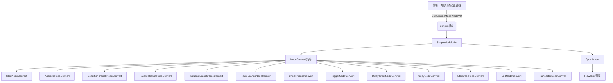
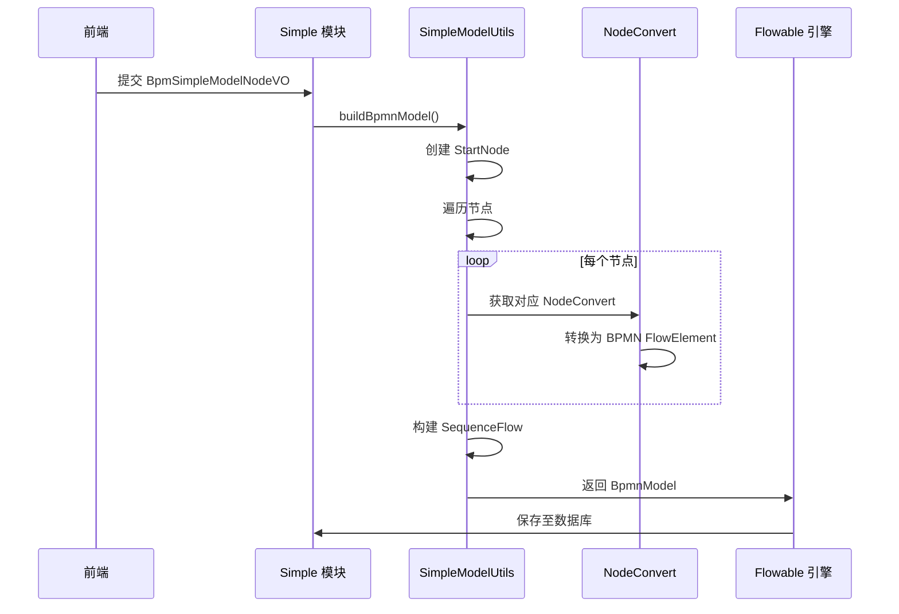
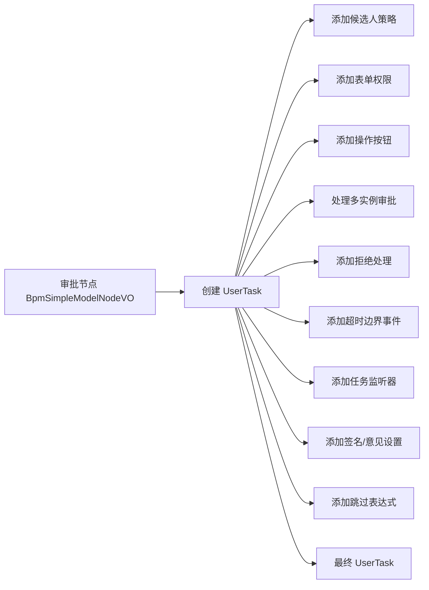
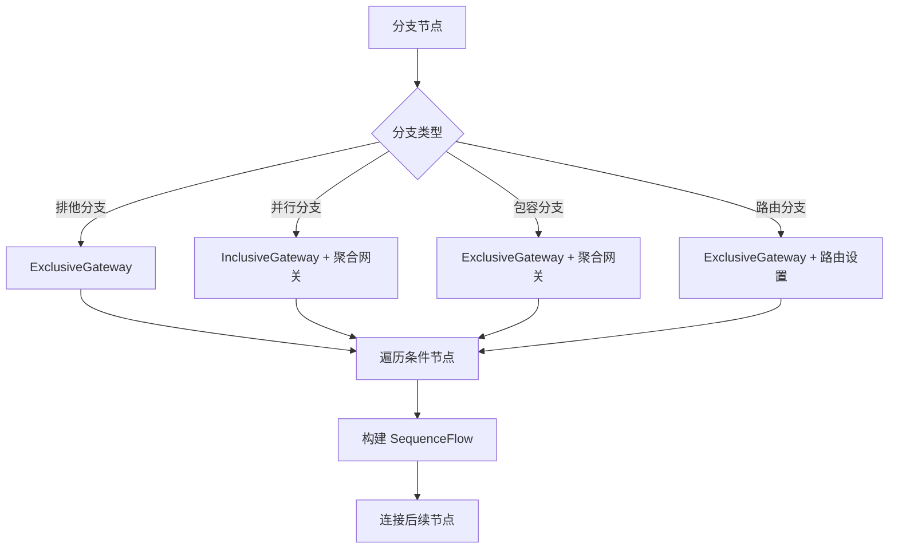

# Simple 模块文档

## 1. 模块概述

Simple 模块是 BPM（业务流程管理）模块中的一个核心子模块，专注于提供**仿钉钉流程设计模型**的简化版流程定义功能。该模块允许用户通过可视化的方式快速创建和管理业务流程，类似于钉钉宜搭的流程设计器体验。

**核心功能：**
- 提供简化的流程节点模型定义（BpmSimpleModelNodeVO）
- 支持多种流程节点类型（开始、审批、分支、触发器等）
- 将前端定义的简单模型转换为标准的 BPMN 2.0 流程模型
- 支持流程模拟和预测

## 2. 架构概览



## 3. 核心组件

### 3.1 BpmSimpleModelNodeVO

**描述：** 仿钉钉流程设计模型的节点 VO，用于定义流程中的单个节点及其配置。

**主要属性：**

| 属性 | 类型 | 说明 |
|------|------|------|
| id | String | 模型节点编号 |
| type | Integer | 模型节点类型（枚举定义） |
| name | String | 模型节点名称 |
| showText | String | 节点展示内容 |
| candidateStrategy | Integer | 候选人策略（用于审批、抄送节点） |
| candidateParam | String | 候选人参数 |
| approveType | Integer | 审批节点类型 |
| approveMethod | Integer | 多人审批方式 |
| approveRatio | Integer | 通过比例 |
| fieldsPermission | List<Map<String, String>> | 表单权限 |
| buttonsSetting | List<OperationButtonSetting> | 操作按钮设置 |
| signEnable | Boolean | 是否需要签名 |
| reasonRequire | Boolean | 是否填写审批意见 |
| skipExpression | String | 跳过表达式 |
| conditionNodes | List<BpmSimpleModelNodeVO> | 条件节点（分支节点使用） |
| routerGroups | List<RouterSetting> | 路由分支组 |
| triggerSetting | TriggerSetting | 触发器节点配置 |
| childProcessSetting | ChildProcessSetting | 子流程设置 |

**内部嵌套类：**

- **ListenerHandler**：任务监听器配置（创建、指派、完成监听）
- **HttpRequestParam**：HTTP 请求参数设置（键值对）
- **RejectHandler**：审批节点拒绝处理策略
- **TimeoutHandler**：审批节点超时处理策略
- **AssignEmptyHandler**：空处理策略（当无审批人时的处理）
- **OperationButtonSetting**：操作按钮设置
- **ConditionSetting**：条件设置（条件节点专用）
- **ConditionGroups**：条件组（包含条件和规则）
- **Condition**：条件（包含规则和关系）
- **ConditionRule**：条件规则（运算符、左值、右值）
- **DelaySetting**：延迟器设置（定时任务）
- **RouterSetting**：路由分支设置（路由分支节点专用）
- **TriggerSetting**：触发器节点配置（HTTP 触发器、表单触发器）
- **HttpRequestTriggerSetting**：HTTP 请求触发器设置
- **FormTriggerSetting**：流程表单触发器设置
- **ChildProcessSetting**：子流程节点配置（包含发起人、超时、多实例设置）

### 3.2 BpmSimpleModelUpdateReqVO

**描述：** 仿钉钉流程设计模型的新增/修改请求 VO，用于封装整个流程模型数据。

**结构：**
```java
@Data
public class BpmSimpleModelUpdateReqVO {
    @Schema(description = "流程模型编号")
    private String id;
    
    @Schema(description = "仿钉钉流程设计模型对象")
    @Valid
    private BpmSimpleModelNodeVO simpleModel;
}
```

### 3.3 SimpleModelUtils

**描述：** 工具类，负责将前端定义的简单模型（BpmSimpleModelNodeVO）转换为标准的 BPMN 2.0 模型（BpmnModel）。

**核心方法：**

| 方法 | 说明 |
|------|------|
| `buildBpmnModel()` | 主入口，构建完整的 BPMN 模型 |
| `traverseNodeToBuildFlowNode()` | 遍历节点，构建 FlowNode 元素 |
| `traverseNodeToBuildSequenceFlow()` | 遍历节点，构建 SequenceFlow 连线 |
| `simulateProcess()` | 流程模拟，预测流程走向 |
| `isSkipNode()` | 判断是否跳过节点 |
| `evalConditionExpress()` | 评估条件表达式 |

**NodeConvert 策略接口：**

```java
private interface NodeConvert {
    List<? extends FlowElement> convertList(BpmSimpleModelNodeVO node);
    FlowElement convert(BpmSimpleModelNodeVO node);
    BpmSimpleModelNodeTypeEnum getType();
}
```

**具体转换器实现：**

| 转换器 | 节点类型 | 说明 |
|--------|----------|------|
| StartNodeConvert | START_NODE | 开始事件 |
| EndNodeConvert | END_NODE | 结束事件 |
| StartUserNodeConvert | START_USER_NODE | 发起人节点 |
| ApproveNodeConvert | APPROVE_NODE | 审批节点（含超时边界事件） |
| TransactorNodeConvert | TRANSACTOR_NODE | 事务节点（继承审批节点） |
| CopyNodeConvert | COPY_NODE | 抄送节点 |
| ConditionBranchNodeConvert | CONDITION_BRANCH_NODE | 排他分支网关 |
| ParallelBranchNodeConvert | PARALLEL_BRANCH_NODE | 并行分支网关（含聚合网关） |
| InclusiveBranchNodeConvert | INCLUSIVE_BRANCH_NODE | 包容分支网关（含聚合网关） |
| RouteBranchNodeConvert | ROUTER_BRANCH_NODE | 路由分支网关 |
| TriggerNodeConvert | TRIGGER_NODE | 触发器节点（含 ReceiveTask） |
| DelayTimerNodeConvert | DELAY_TIMER_NODE | 延迟定时器节点 |
| ChildProcessConvert | CHILD_PROCESS | 子流程调用节点 |

## 4. 功能流程

### 4.1 模型转换流程



### 4.2 审批节点转换流程



### 4.3 分支节点转换流程



## 5. 节点类型说明

| 节点类型 | 类型值 | BPMN 元素 | 说明 |
|----------|--------|-----------|------|
| 开始节点 | START_NODE | StartEvent | 流程起点 |
| 发起人节点 | START_USER_NODE | UserTask | 流程发起人任务 |
| 审批节点 | APPROVE_NODE | UserTask | 普通审批任务 |
| 事务节点 | TRANSACTOR_NODE | UserTask | 事务审批任务 |
| 抄送节点 | COPY_NODE | ServiceTask | 抄送任务 |
| 结束节点 | END_NODE | EndEvent | 流程终点 |
| 排他分支 | CONDITION_BRANCH_NODE | ExclusiveGateway | 条件分支（排他） |
| 并行分支 | PARALLEL_BRANCH_NODE | InclusiveGateway | 并行分支 |
| 包容分支 | INCLUSIVE_BRANCH_NODE | InclusiveGateway | 包容分支（部分满足） |
| 路由分支 | ROUTER_BRANCH_NODE | ExclusiveGateway | 路由分支（多条件） |
| 触发器节点 | TRIGGER_NODE | ServiceTask + ReceiveTask | HTTP 回调触发 |
| 延迟定时器 | DELAY_TIMER_NODE | ReceiveTask + BoundaryEvent | 定时等待 |
| 子流程 | CHILD_PROCESS | CallActivity | 调用子流程 |

## 6. 条件表达式构建

Simple 模块支持两种条件表达式类型：

1. **EXPRESSION**：直接使用 SpEL 表达式（如 `${day>3}`）
2. **RULE**：基于规则的表达式，自动转换为 SpEL

**规则表达式构建示例：**
```java
// 条件组：and=true, rules=[age>25, status=1]
// 构建结果：${(age > 25 && status == 1)}
```

## 7. 依赖关系

Simple 模块主要依赖以下模块：

- **BPM 模块**：`yudao-module-bpm` - 核心 BPMN 引擎集成
- **Flowable 框架**：`yudao-module-bpm/framework/flowable` - Flowable 扩展
- **公共工具模块**：`yudao-common` - 通用工具类（验证、JSON、集合等）

## 8. 相关文档

- [BPM 模块文档](bpm.md) - 完整的 BPM 功能说明
- [Flowable 框架文档](flowable.md) - Flowable 扩展细节
- [公共工具文档](common.md) - 通用工具类说明

## 9. 扩展点

Simple 模块提供了以下扩展点：

1. **NodeConvert 策略**：可通过实现 `NodeConvert` 接口添加新的节点类型
2. **条件表达式**：支持自定义 SpEL 表达式
3. **监听器**：支持任务创建、指派、完成监听器
4. **触发器**：支持 HTTP 回调和表单触发器
5. **超时处理**：支持任务超时边界事件和提醒
