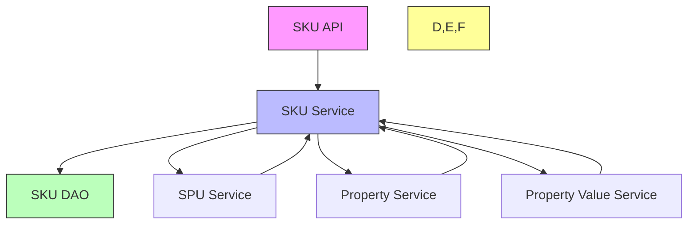
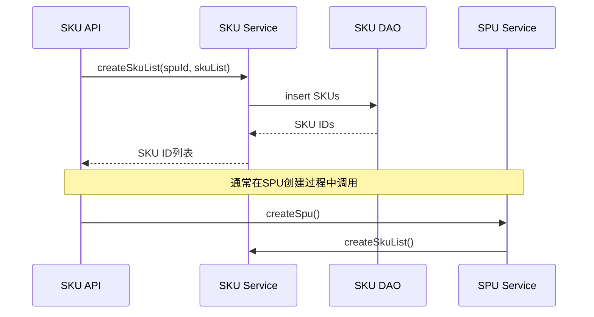
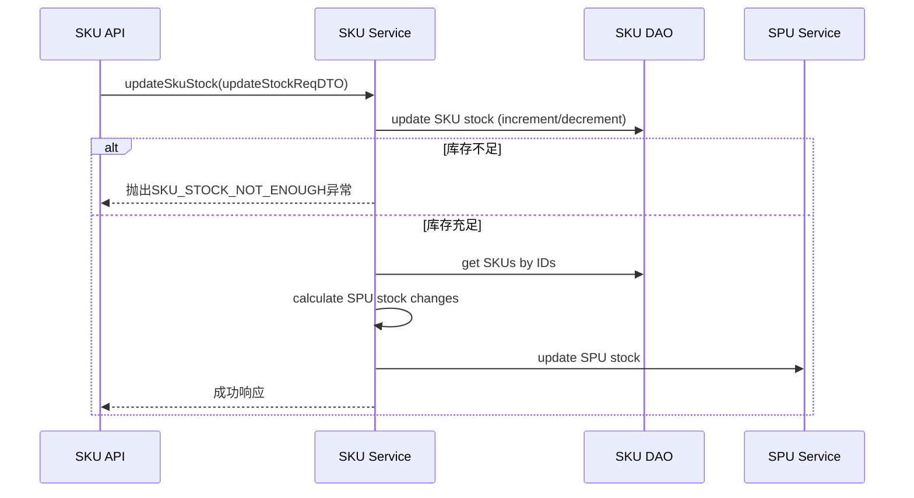
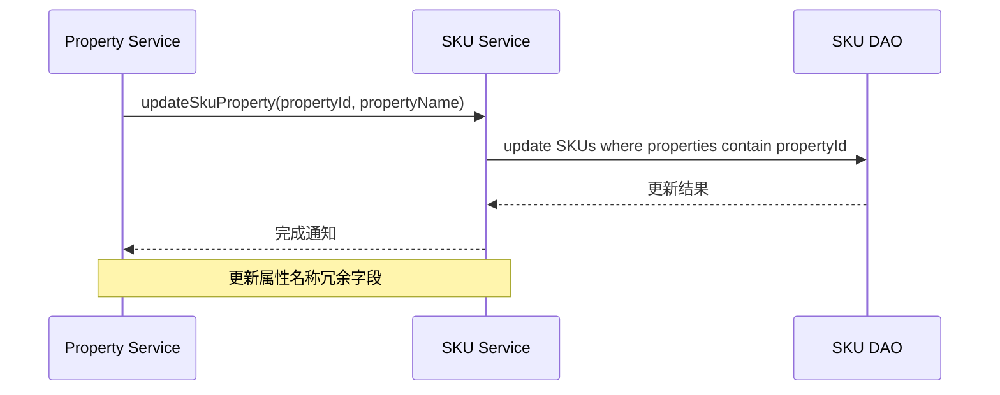

# SKU 模块文档

## 模块概述

SKU（Stock Keeping Unit，库存量单位）模块是商城系统中的核心组件，负责管理商品的具体规格和属性。在电商系统中，SPU（Standard Product Unit，标准产品单元）代表一个抽象的商品类别（如“iPhone 14”），而SKU代表该商品的具体变体（如“iPhone 14 128GB 深空灰”）。

SKU模块与SPU模块紧密协作，共同构建完整的商品信息体系。SKU模块负责存储和管理商品的具体属性组合、价格、库存等具体信息。

## 核心功能

1. **SKU基本信息管理**：创建、查询、更新、删除SKU信息
2. **SKU库存管理**：支持库存增减操作，并自动同步更新关联SPU的库存
3. **SKU属性管理**：处理SKU的属性和属性值关联
4. **SPU-SKU关联**：在SPU创建/更新时自动处理关联的SKU列表
5. **数据转换**：提供DTO、DO之间的转换功能

## 架构设计

### 模块结构

```
product模块
├── api/
│   └── sku/
│       └── ProductSkuApiImpl.java          # SKU API实现
├── convert/
│   └── sku/
│       └── ProductSkuConvert.java          # SKU数据转换器
├── dal/
│   └── dataobject/
│       └── sku/
│           └── ProductSkuDO.java           # SKU数据对象
├── dto/
│   └── sku/
│       ├── ProductSkuRespDTO.java          # SKU响应DTO
│       └── ProductSkuUpdateStockReqDTO.java # SKU库存更新请求DTO
└── service/
    └── sku/
        └── ProductSkuServiceImpl.java      # SKU服务实现
```

### 核心组件说明

#### 1. ProductSkuApiImpl (API层)
提供对外的SKU服务接口，主要功能：
- 根据ID获取单个SKU信息
- 根据ID列表批量获取SKU信息
- 根据SPU ID列表获取对应的SKU列表
- 更新SKU库存

#### 2. ProductSkuServiceImpl (服务层)
实现SKU业务逻辑，核心方法包括：
- 创建SKU列表（通常在创建SPU时调用）
- 更新SKU列表（通常在更新SPU时调用）
- 删除指定SPU的所有SKU
- 更新SKU库存（同时更新关联SPU的库存）
- 验证SKU列表的有效性
- 根据属性ID更新相关SKU的属性信息
- 根据属性值ID更新相关SKU的属性值信息

#### 3. ProductSkuDO (数据层)
SKU的数据库映射对象，包含字段：
- id: SKU唯一标识（自增）
- spuId: 关联的SPU ID
- properties: 属性数组（JSON格式）
- price: 销售价格（分）
- marketPrice: 市场价格（分）
- costPrice: 成本价格（分）
- barCode: 条形码
- picUrl: 图片地址
- stock: 库存数量
- weight: 商品重量（kg）
- volume: 商品体积（m³）
- firstBrokeragePrice: 一级分销佣金（分）
- secondBrokeragePrice: 二级分销佣金（分）
- salesCount: 销量

内部静态类Property表示SKU的属性：
- propertyId: 属性ID
- propertyName: 属性名称（冗余）
- valueId: 属性值ID
- valueName: 属性值名称（冗余）

#### 4. ProductSkuRespDTO (数据传输对象)
用于API响应的SKU数据传输对象，包含：
- 基础字段：id, spuId, price, marketPrice, costPrice, barCode, picUrl, stock, weight, volume, firstBrokeragePrice, secondBrokeragePrice
- properties: 属性详情列表（使用ProductPropertyValueDetailRespDTO）

#### 5. ProductSkuUpdateStockReqDTO (库存更新请求)
用于更新SKU库存的请求对象：
- id: SKU ID
- incrCount: 库存变化数量（正数增加，负数减少）

#### 6. ProductSkuConvert (数据转换器)
提供数据转换功能：
- convertSpuStockMap: 根据SKU库存变化计算SPU库存变化
- buildPropertyKey: 生成SKU属性的唯一标识键

## 依赖关系

SKU模块与其他模块的依赖关系如下：



### 关键依赖说明

1. **SPU Service依赖**：
   - SKU Service在创建/更新SPU时需要处理关联的SKU列表
   - SPU Service需要更新SPU的库存信息（基于SKU库存汇总）
   - 存在循环依赖，通过@Lazy注解解决

2. **Property Service依赖**：
   - 当属性名称更新时，需要同步更新所有关联SKU的属性名称冗余
   - 当属性值名称更新时，需要同步更新所有关联SKU的属性值名称冗余

3. **Property Value Service依赖**：
   - 类似Property Service，当属性值信息更新时需要同步到SKU

## 数据流程

### 1. SKU创建流程


### 2. SKU库存更新流程


### 3. SKU属性更新流程


## 接口详情

### SKU API接口

| 方法 | 说明 | 参数 | 返回值 |
|------|------|------|--------|
| getSku(Long id) | 根据ID获取SKU信息 | SKU ID | ProductSkuRespDTO |
| getSkuList(Collection<Long> ids) | 批量获取SKU信息 | SKU ID列表 | ProductSkuRespDTO列表 |
| getSkuListBySpuId(Collection<Long> spuIds) | 根据SPU ID获取SKU列表 | SPU ID列表 | ProductSkuRespDTO列表 |
| updateSkuStock(ProductSkuUpdateStockReqDTO updateStockReqDTO) | 更新SKU库存 | 库存更新请求 | 无 |

### SKU Service接口

| 方法 | 说明 | 参数 | 返回值 |
|------|------|------|--------|
| createSkuList(Long spuId, List<ProductSkuSaveReqVO> skuList) | 创建SKU列表 | SPU ID, SKU列表 | SKU ID列表 |
| updateSkuList(Long spuId, List<ProductSkuSaveReqVO> skuList) | 更新SKU列表 | SPU ID, SKU列表 | 无 |
| deleteSkuBySpuId(Long spuId) | 删除SPU的所有SKU | SPU ID | 无 |
| getSku(Long id) | 根据ID获取SKU | SKU ID | ProductSkuDO |
| getSkuList(Collection<Long> ids) | 批量获取SKU | SKU ID列表 | ProductSkuDO列表 |
| getSkuListBySpuId(Collection<Long> spuIds) | 根据SPU ID获取SKU列表 | SPU ID列表 | ProductSkuDO列表 |
| validateSkuList(List<ProductSkuSaveReqVO> skuList, Integer specType) | 验证SKU列表 | SKU列表, 规格类型 | 无 |
| updateSkuStock(ProductSkuUpdateStockReqDTO updateStockReqDTO) | 更新SKU库存 | 库存更新请求 | 无 |
| updateSkuProperty(Long propertyId, String propertyName) | 更新SKU属性名称 | 属性ID, 属性名称 | 无 |
| updateSkuPropertyValue(Long propertyValueId, String propertyValueName) | 更新SKU属性值名称 | 属性值ID, 属性值名称 | 无 |

## 数据模型

### ProductSkuDO (数据库表: product_sku)

| 字段名 | 类型 | 说明 | 备注 |
|--------|------|------|------|
| id | BIGINT | SKU ID | 主键，自增 |
| spu_id | BIGINT | SPU ID | 外键关联product_spo表 |
| properties | JSON | 属性数组 | 存储SKU的属性信息 |
| price | INT | 销售价格 | 单位：分 |
| market_price | INT | 市场价格 | 单位：分 |
| cost_price | INT | 成本价格 | 单位：分 |
| bar_code | VARCHAR | 条形码 |  |
| pic_url | VARCHAR | 图片地址 |  |
| stock | INT | 库存 |  |
| weight | DOUBLE | 商品重量 | 单位：kg |
| volume | DOUBLE | 商品体积 | 单位：m³ |
| first_brokerage_price | INT | 一级分销佣金 | 单位：分 |
| second_brokerage_price | INT | 二级分销佣金 | 单位：分 |
| sales_count | INT | 销量 |  |

### ProductSkuDO.Property 内部类

| 字段名 | 类型 | 说明 |
|--------|------|------|
| property_id | BIGINT | 属性ID |
| property_name | VARCHAR | 属性名称（冗余） |
| value_id | BIGINT | 属性值ID |
| value_name | VARCHAR | 属性值名称（冗余） |

## 与其他模块的交互

### 与SPU模块的交互
SKU模块是SPU模块的重要组成部分：
- 当创建SPU时，会同时创建其所有SKU
- 当更新SPU时，会同步更新其SKU列表
- SPU的某些属性（如价格、库存）是从其SKU聚合计算得出的
- 删除SPU时会级联删除其所有SKU

### 与属性模块的交互
SKU模块与商品属性模块紧密耦合：
- SKU的properties字段存储了具体的属性值组合
- 当属性名称或属性值名称更新时，需要同步更新所有关联SKU的冗余字段
- 这通过ProductSkuService的updateSkuProperty和updateSkuPropertyValue方法实现

## 使用示例

### 1. 查询单个SKU
```java
// 通过API调用
ProductSkuRespDTO sku = productSkuApi.getSku(1L);

// 通过Service调用
ProductSkuDO sku = productSkuService.getSku(1L);
```

### 2. 批量查询SKU
```java
List<Long> skuIds = Arrays.asList(1L, 2L, 3L);
List<ProductSkuRespDTO> skus = productSkuApi.getSkuList(skuIds);
```

### 3. 根据SPU查询SKU
```java
List<Long> spuIds = Arrays.asList(10L, 20L);
List<ProductSkuRespDTO> skus = productSkuApi.getSkuListBySpuId(spuIds);
```

### 4. 更新SKU库存
```java
ProductSkuUpdateStockReqDTO.Item item = new ProductSkuUpdateStockReqDTO.Item();
item.setId(1L); // SKU ID
item.setIncrCount(-5); // 减少5个库存

ProductSkuUpdateStockReqDTO request = new ProductSkuUpdateStockReqDTO();
request.setItems(Collections.singletonList(item));

productSkuApi.updateSkuStock(request);
```

### 5. 创建SKU列表（通常在创建SPU时调用）
```java
List<ProductSkuSaveReqVO> skuList = new ArrayList<>();
ProductSkuSaveReqVO sku1 = new ProductSkuSaveReqVO();
sku1.setPrice(1000); // 10.00元
sku1.setStock(100);
// 设置其他属性...
skuList.add(sku1);

productSkuService.createSkuList(spuId, skuList);
```

## 性能考虑

1. **库存更新优化**：
   - SKU库存更新使用增量更新（increment/decrement）避免读取-修改-写入竞态条件
   - SPU库存更新通过批量计算减少数据库操作次数

2. **属性冗余更新**：
   - 属性名称或属性值名称更新时，只更新相关的SKU记录
   - 使用属性ID或属性值ID作为查询条件，确保更新效率

3. **查询优化**：
   - 提供根据ID、ID列表、SPU ID列表的查询方法
   - 建议在数据库中为spu_id字段创建索引以提高查询性能

## 异常处理

SKU模块定义了以下业务异常：
- SKU_NOT_EXISTS: SKU不存在
- SKU_SAVE_FAIL_SPEC_TYPE_ERROR: 规格类型错误
- SKU_STOCK_NOT_ENOUGH: 库存不足

这些异常在服务层抛出，可以在控制层统一处理并返回适当的HTTP状态码。

## 最佳实践

1. **库存操作**：
   -  always use the provided stock update methods to ensure consistency between SKU and SPU stock levels
   -  never directly modify the stock field in ProductSkuDO without using the service methods

2. **属性管理**：
   -  when updating product properties or property values, use the service methods that automatically update related SKUs
   -  avoid directly modifying the properties field in ProductSkuDO

3. **事务管理**：
   -  SKU creation/update/delete operations are typically wrapped in transactions
   -  when performing batch operations, ensure proper transaction boundaries

4. **数据一致性**：
   -  the redundancy of property names and values in ProductSkuDO.Property is intentional for query performance
   -  this redundancy is maintained automatically through the service layer methods

## 与前端的对应关系

在前端Vue3项目中，SKU相关的API和数据结构对应：

- API路径: `/product/sku/*`
- 响应数据结构: 对应 `ProductSkuRespDTO`
- 请求数据结构: 对应 `ProductSkuUpdateStockReqDTO`
- 相关视图: 商品编辑页中的SKU管理部分

前端Typedefs参考（从ui模块）：
```typescript
interface ProductSkuRespVO {
  id: number;
  spuId: number;
  properties: Array<{
    propertyId: number;
    propertyName: string;
    valueId: number;
    valueName: string;
  }>;
  price: number;
  marketPrice: number;
  costPrice: number;
  barCode: string;
  picUrl: string;
  stock: number;
  weight: number;
  volume: number;
  firstBrokeragePrice: number;
  secondBrokeragePrice: number;
}
```

## 结论

SKU模块是商城系统中处理商品具体规格和属性的核心组件。它通过与SPU模块、属性模块的紧密协作，提供了完整的商品SKU管理功能。设计上注重数据一致性（特别是库存同步）、性能优化（通过增量更新和批量操作）以及易用性（提供丰富的API和服务方法）。

模块遵循分层架构原则，清晰地分离了API层、服务层和数据访问层，使得业务逻辑易于维护和扩展。通过合理的依赖管理和事务控制，确保了数据的一致性和系统的稳定性。