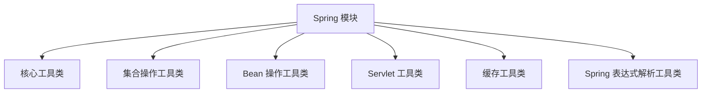
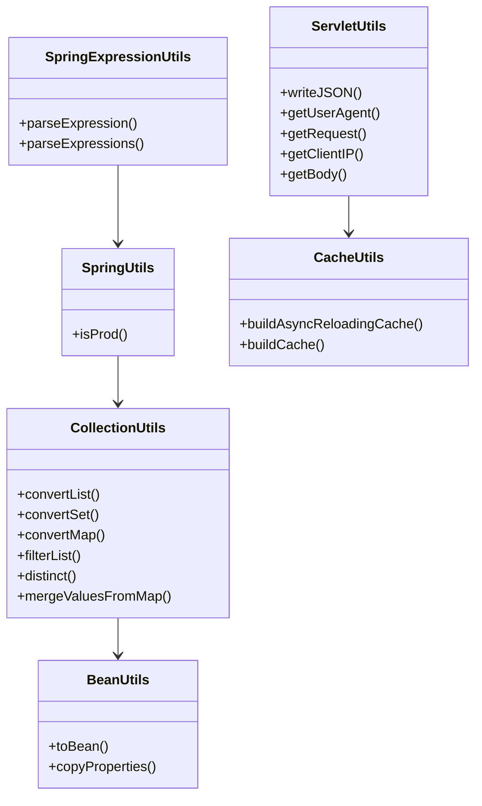
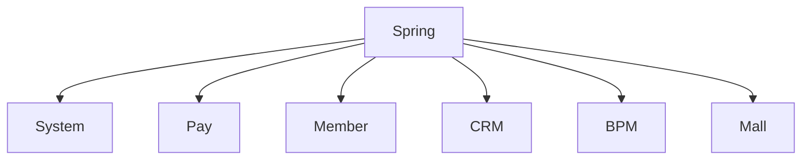

# Spring 模块文档

## 1. 概述

Spring 模块是 Yudao 系统的核心基础模块之一，提供了常用的 Spring 工具类和实用工具方法。该模块主要包含以下功能：

- Spring 表达式解析工具类
- Spring 上下文工具类
- 集合操作工具类
- Bean 操作工具类
- Servlet 工具类
- 缓存工具类

这些工具类为系统提供了统一的、高效的工具方法，提高了代码的可维护性和可读性。

## 2. 架构设计

### 2.1 模块结构



### 2.2 核心组件关系



## 3. 核心功能详解

### 3.1 Spring 表达式解析工具类 (SpringExpressionUtils)

**文件位置**: `yudao-framework/yudao-common/src/main/java/cn/iocoder/yudao/framework/common/util/spring/SpringExpressionUtils.java`

**功能描述**:
- 提供 Spring EL 表达式解析功能
- 支持从切面和 Bean 工厂解析表达式
- 可用于动态表达式求值

**主要方法**:
- `parseExpression(JoinPoint joinPoint, String expressionString)`: 从切面解析单个表达式
- `parseExpressions(JoinPoint joinPoint, List<String> expressionStrings)`: 从切面批量解析表达式
- `parseExpression(String expressionString)`: 从 Bean 工厂解析表达式
- `parseExpression(String expressionString, Map<String, Object> variables)`: 从 Bean 工厂解析表达式，支持变量注入

**使用场景**:
- AOP 切面中动态表达式求值
- 条件判断中的动态表达式
- 配置项的动态解析

**详细文档**: [spring_expression_utils.md](spring_expression_utils.md)

### 3.2 Spring 上下文工具类 (SpringUtils)

**文件位置**: `yudao-framework/yudao-common/src/main/java/cn/iocoder/yudao/framework/common/util/spring/SpringUtils.java`

**功能描述**:
- 扩展 Hutool 的 SpringUtil 类
- 提供生产环境判断功能
- 简化 Spring 上下文操作

**主要方法**:
- `isProd()`: 判断当前是否为生产环境

**使用场景**:
- 根据环境执行不同的逻辑
- 简化 Spring Bean 的获取

**详细文档**: [spring_utils.md](spring_utils.md)

### 3.3 集合操作工具类 (CollectionUtils)

**文件位置**: `yudao-framework/yudao-common/src/main/java/cn/iocoder/yudao/framework/common/util/collection/CollectionUtils.java`

**功能描述**:
- 提供集合转换、过滤、查找等操作
- 支持 List、Set、Map 等多种集合类型
- 提供批量操作和流式处理能力

**主要方法**:
- `convertList()`: 集合元素类型转换
- `convertSet()`: 集合转换为 Set
- `convertMap()`: 集合转换为 Map
- `filterList()`: 列表元素过滤
- `distinct()`: 集合元素去重
- `mergeValuesFromMap()`: 从 Map 中合并值
- `findFirst()`: 查找第一个匹配元素
- `getMaxValue()`/`getMinValue()`: 获取最大/最小值
- `diffList()`: 对比两个列表的差异

**使用场景**:
- 数据转换和处理
- 集合查询和过滤
- 数据聚合和统计

**详细文档**: [collection_utils.md](collection_utils.md)

### 3.4 Bean 操作工具类 (BeanUtils)

**文件位置**: `yudao-framework/yudao-common/src/main/java/cn/iocoder/yudao/framework/common/util/object/BeanUtils.java`

**功能描述**:
- 提供 Bean 对象转换和复制功能
- 支持单个对象和集合对象的转换
- 支持分页对象的转换

**主要方法**:
- `toBean()`: 对象转换
- `copyProperties()`: 属性复制

**使用场景**:
- DTO 和 DO 之间的转换
- 对象属性复制
- 分页数据转换

**详细文档**: [bean_utils.md](bean_utils.md)

### 3.5 Servlet 工具类 (ServletUtils)

**文件位置**: `yudao-framework/yudao-common/src/main/java/cn/iocoder/yudao/framework/common/util/servlet/ServletUtils.java`

**功能描述**:
- 提供 Servlet 相关的工具方法
- 支持请求参数、头信息、客户端 IP 等获取
- 支持 JSON 响应输出

**主要方法**:
- `writeJSON()`: 输出 JSON 响应
- `getUserAgent()`: 获取 User-Agent
- `getRequest()`: 获取当前请求
- `getClientIP()`: 获取客户端 IP
- `getBody()`: 获取请求体
- `getParamMap()`: 获取请求参数 Map
- `getHeaderMap()`: 获取请求头 Map

**使用场景**:
- HTTP 请求处理
- 响应输出
- 客户端信息获取

**详细文档**: [servlet_utils.md](servlet_utils.md)

### 3.6 缓存工具类 (CacheUtils)

**文件位置**: `yudao-framework/yudao-common/src/main/java/cn/iocoder/yudao/framework/common/util/cache/CacheUtils.java`

**功能描述**:
- 提供 Guava Cache 的封装和扩展
- 支持异步刷新和同步刷新两种缓存策略
- 提供缓存构建和管理功能

**主要方法**:
- `buildAsyncReloadingCache()`: 构建异步刷新的缓存
- `buildCache()`: 构建同步刷新的缓存

**使用场景**:
- 数据缓存
- 频繁访问的数据本地化
- 缓存数据的自动刷新

**详细文档**: [cache_utils.md](cache_utils.md)

## 4. 使用示例

### 4.1 Spring 表达式解析示例

```java
// 从切面解析表达式
@Around("@annotation(logOperation)")
public Object around(ProceedingJoinPoint joinPoint, LogOperation logOperation) {
    // 解析表达式
    Map<String, Object> expressions = SpringExpressionUtils.parseExpressions(
        joinPoint, 
        Arrays.asList(logOperation.key(), logOperation.value())
    );
    
    String key = (String) expressions.get(logOperation.key());
    String value = (String) expressions.get(logOperation.value());
    
    // 执行业务逻辑
    return joinPoint.proceed();
}

// 从 Bean 工厂解析表达式
String expression = "@userService.getById(#userId)";
User user = (User) SpringExpressionUtils.parseExpression(expression, Map.of("userId", 1L));
```

### 4.2 集合操作示例

```java
// 列表转换
List<UserDO> users = ...;
List<UserVO> userVOs = CollectionUtils.convertList(users, user -> {
    UserVO vo = new UserVO();
    BeanUtils.copyProperties(user, vo);
    return vo;
});

// 集合过滤
List<UserDO> activeUsers = CollectionUtils.filterList(users, user -> user.getStatus().equals(1));

// 集合去重
List<UserDO> distinctUsers = CollectionUtils.distinct(users, UserDO::getMobile);

// Map 转换
Map<Long, UserDO> userMap = CollectionUtils.convertMap(users, UserDO::getId);
```

### 4.3 Bean 操作示例

```java
// 单个对象转换
UserDO userDO = ...;
UserVO userVO = BeanUtils.toBean(userDO, UserVO.class);

// 集合对象转换
List<UserDO> userDOs = ...;
List<UserVO> userVOs = BeanUtils.toBean(userDOs, UserVO.class);

// 属性复制
UserDO newUserDO = new UserDO();
BeanUtils.copyProperties(userVO, newUserDO);
```

### 4.4 Servlet 工具类示例

```java
// 输出 JSON
@RestController
@RequestMapping("/api/demo")
public class DemoController {
    @GetMapping("/get")
    public void getDemo(HttpServletResponse response) {
        Result<?> result = Result.success("操作成功");
        ServletUtils.writeJSON(response, result);
    }
}

// 获取请求参数
@PostMapping("/create")
public Result<?> create(@RequestBody UserCreateReqVO createReqVO) {
    String clientIP = ServletUtils.getClientIP();
    String userAgent = ServletUtils.getUserAgent();
    
    // 业务逻辑处理
    return Result.success();
}
```

### 4.5 缓存工具类示例

```java
// 构建异步刷新缓存
LoadingCache<Long, UserDO> userCache = CacheUtils.buildAsyncReloadingCache(
    Duration.ofMinutes(30), 
    new CacheLoader<Long, UserDO>() {
        @Override
        public UserDO load(Long key) throws Exception {
            return userMapper.selectById(key);
        }
    }
);

// 获取缓存数据
UserDO user = userCache.get(1L);

// 构建同步刷新缓存
LoadingCache<String, List<DeptDO>> deptCache = CacheUtils.buildCache(
    Duration.ofHours(1), 
    new CacheLoader<String, List<DeptDO>>() {
        @Override
        public List<DeptDO> load(String key) throws Exception {
            return deptMapper.selectList();
        }
    }
);
```

## 5. 与其他模块的关系

### 5.1 与系统模块的关系

Spring 模块为系统模块提供了基础的工具类支持，包括：
- [系统模块](../system/system.md): 提供用户、角色、权限等管理功能
- [支付模块](../pay/pay.md): 提供支付相关功能
- [会员模块](../member/member.md): 提供会员管理功能

### 5.2 与业务模块的关系

Spring 模块为业务模块提供了通用的工具类支持，包括：
- [CRM 模块](../crm/crm.md): 客户关系管理
- [BPM 模块](../bpm/bpm.md): 业务流程管理
- [商城模块](../mall/mall.md): 电商平台

### 5.3 依赖关系



## 6. 最佳实践

### 6.1 工具类的使用原则

1. **避免滥用**: 工具类虽然方便，但过度使用会导致代码可读性下降，建议在合适的场景使用
2. **保持简单**: 工具类方法应该保持简单，避免复杂的逻辑
3. **统一命名**: 方法命名应该清晰、统一，便于理解
4. **考虑性能**: 对于频繁调用的方法，应该考虑性能影响

### 6.2 缓存使用建议

1. **合理设置过期时间**: 根据数据的变化频率设置合适的过期时间
2. **考虑缓存大小**: 对于大量数据的缓存，应该设置合理的最大缓存数量
3. **选择合适的策略**: 根据业务需求选择异步刷新或同步刷新策略
4. **处理缓存穿透**: 对于可能的缓存穿透问题，应该有相应的处理机制

### 6.3 Spring 表达式使用建议

1. **避免复杂表达式**: 表达式应该保持简单，避免复杂的逻辑
2. **考虑安全性**: 对于用户输入的表达式，应该进行安全性校验
3. **提供默认值**: 对于可能为空的表达式结果，应该提供默认值

## 7. 常见问题

### 7.1 缓存相关问题

**Q: 缓存如何处理并发问题?**
A: 使用 Guava Cache 的 refreshAfterWrite 特性，可以在数据过期时自动刷新，避免并发问题。

**Q: 缓存大小如何设置?**
A: 建议根据系统内存和业务需求设置合适的缓存大小，默认的 CACHE_MAX_SIZE 为 10000。

### 7.2 集合操作相关问题

**Q: 集合转换时如何处理空值?**
A: 工具类方法已经处理了空值情况，会自动过滤 null 值。

**Q: 集合去重如何保持顺序?**
A: 使用 `distinct()` 方法时，可以通过传入第三个参数来保持顺序。

### 7.3 Bean 操作相关问题

**Q: Bean 转换时如何处理属性不匹配?**
A: 工具类会自动忽略不匹配的属性，不会抛出异常。

**Q: 如何处理深层对象的转换?**
A: 对于深层对象，可以使用递归转换或者自定义转换器。

## 8. 未来改进

1. **性能优化**: 对于频繁使用的工具类方法，考虑进一步优化性能
2. **功能扩展**: 根据实际需求，扩展更多的工具类方法
3. **统一日志**: 为工具类方法添加统一的日志记录
4. **监控指标**: 为缓存等关键组件添加监控指标
5. **国际化支持**: 考虑为工具类方法添加国际化支持

## 9. 相关文档

- [Spring 表达式解析工具类详细文档](spring_expression_utils.md)
- [Spring 上下文工具类详细文档](spring_utils.md)
- [集合操作工具类详细文档](collection_utils.md)
- [Bean 操作工具类详细文档](bean_utils.md)
- [Servlet 工具类详细文档](servlet_utils.md)
- [缓存工具类详细文档](cache_utils.md)

---

**注意**: 此文档为 Spring 模块的总体概述文档，详细的 API 文档请参考各子模块的详细文档。