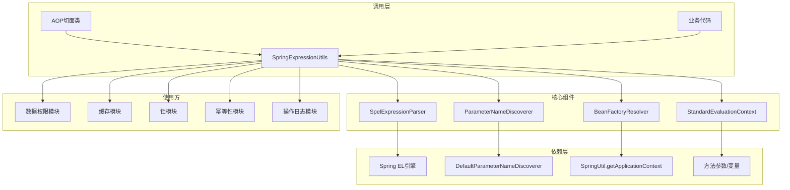
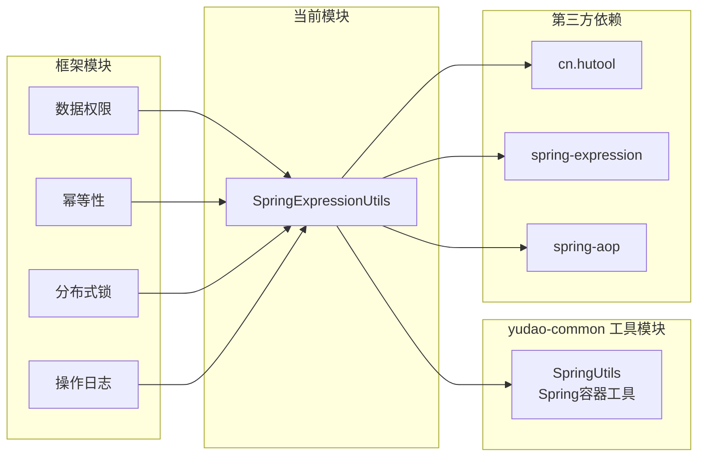
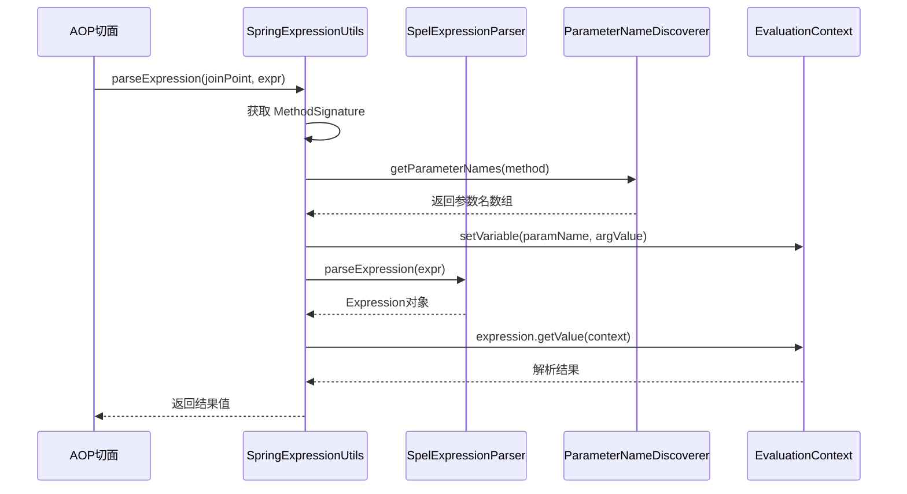
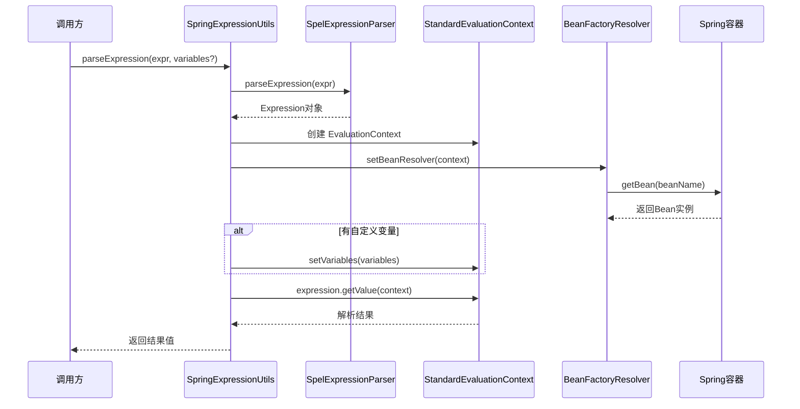

# Spring EL 表达式工具模块 (SpringExpressionUtils)

## 概述

`SpringExpressionUtils` 是位于 `yudao-common` 框架中的一个核心工具类，用于解析和执行 **Spring Expression Language (SpEL)** 表达式。它提供了两种上下文的表达式解析能力：

1. **AOP 切面上下文** — 从 `JoinPoint` 中提取方法参数，构建 EvaluationContext，解析 SpEL 表达式
2. **Spring Bean 工厂上下文** — 结合 Spring 容器中的 Bean，支持在表达式中引用 Bean，并支持自定义变量

该工具类在整个系统中被广泛用于：
- 数据权限注解（`@DataPermission`）中条件表达式的动态解析
- 缓存注解（`@Cacheable` 等）中 Key 的 SpEL 表达式解析
- 分布式锁（`@Lock4j`）中 Key 的动态生成
- 幂等性注解中参数的动态提取
- 操作日志模块中方法调用结果的动态记录

---

## 架构设计



## 模块依赖关系



## 核心 API 说明

### 1. 从 AOP 切面解析表达式

#### `parseExpression(JoinPoint joinPoint, String expressionString)`

从切面中解析单个 SpEL 表达式的结果。

- **参数**：
  - `joinPoint`：AOP 连接点，用于获取方法签名和参数
  - `expressionString`：SpEL 表达式字符串
- **返回值**：表达式解析结果（Object）
- **工作原理**：通过 `JoinPoint` 获取被拦截方法的参数名和参数值，构建 `EvaluationContext`，然后执行表达式求值

**使用示例**（数据权限场景）：
```java
// 假设方法签名为：void getPage(String name, Integer pageNo)
// 表达式为：#name
// 则返回 joinPoint 中 name 参数的实际值
Object value = SpringExpressionUtils.parseExpression(joinPoint, "#name");
```

#### `parseExpressions(JoinPoint joinPoint, List<String> expressionStrings)`

从切面中批量解析多个 SpEL 表达式。

- **参数**：
  - `joinPoint`：AOP 连接点
  - `expressionStrings`：SpEL 表达式列表
- **返回值**：`Map<String, Object>`，key 为表达式字符串，value 为解析结果
- **应用场景**：当注解中包含多个 SpEL 表达式需要同时解析时使用

---

### 2. 从 Spring Bean 工厂解析表达式

#### `parseExpression(String expressionString)`

从 Spring 容器上下文中解析 SpEL 表达式，支持在表达式中引用 Bean。

- **参数**：`expressionString` — SpEL 表达式
- **返回值**：表达式解析结果
- **特点**：通过 `BeanFactoryResolver` 让 SpEL 能够访问 Spring 容器中的 Bean

**使用示例**：
```java
// 表达式可以直接调用 Spring Bean 的方法
String result = (String) SpringExpressionUtils.parseExpression(
    "@stringUtils.upperCase('hello')"
);
```

#### `parseExpression(String expressionString, Map<String, Object> variables)`

带自定义变量的表达式解析。

- **参数**：
  - `expressionString`：SpEL 表达式
  - `variables`：自定义变量 Map
- **返回值**：表达式解析结果
- **应用场景**：当需要额外注入上下文变量时使用

**使用示例**：
```java
Map<String, Object> vars = new HashMap<>();
vars.put("userId", 123L);
String result = (String) SpringExpressionUtils.parseExpression(
    "#userId + ' - ' + @userService.getUserName(#userId)", 
    vars
);
```

---

## 数据流分析

### AOP 上下文解析流程



### Bean 工厂上下文解析流程



## 与兄弟模块的关系

| 兄弟模块 | 关系说明 |
|---------|---------|
| [SpringUtils](spring_utils.md) | SpringExpressionUtils 依赖 SpringUtils 来获取 `ApplicationContext`，用于 `BeanFactoryResolver` 的初始化 |
| [CollectionUtils](collection_utils.md) | 内部使用 `CollUtil` 进行集合判空 |
| [BeanUtils](bean_utils.md) | 无直接依赖，但常配合使用于 AOP 场景的对象属性拷贝 |

## 在框架中的典型应用

### 1. 数据权限模块（`@DataPermission`）

数据权限注解通过 SpEL 表达式动态控制是否启用数据权限过滤：

```java
@DataPermission(enable = false)
// 或带条件：
@DataPermission(enable = "#loginUser.id != 1")
```

当表达式结果为 `true` 时禁用数据权限。`SpringExpressionUtils` 在此负责解析 `#loginUser` 等上下文变量。

### 2. 幂等性模块（`@Idempotent`）

幂等性注解使用 SpEL 表达式定义唯一标识 Key：

```java
@Idempotent(key = "#reqDTO.orderId")
```

### 3. 分布式锁模块（`@Lock4j`）

锁注解使用 SpEL 表达式定义锁的 Key：

```java
@Lock4j(key = "#reqDTO.id")
```

### 4. 操作日志模块

操作日志记录时，通过 SpEL 表达式提取方法返回值中的字段：

```java
// 伪代码示意
@OperateLog(content = "修改了订单 #{#result.orderNo}")
```

## 与 Spring 原生 SpEL 支持的关系

| 特性 | SpringExpressionUtils | Spring 原生 (如 @Cacheable) |
|------|----------------------|---------------------------|
| 解析器 | 共享的 `SpelExpressionParser` 单例 | 框架内部创建 |
| 参数发现 | `DefaultParameterNameDiscoverer` | 同样使用 |
| Bean 引用 | 通过 `BeanFactoryResolver` | 框架自动处理 |
| 自定义上下文 | 手动构建 `StandardEvaluationContext` | 由框架拦截器构建 |
| 适用场景 | 自定义 AOP 注解、非 Spring 管理上下文 | 内置注解 |

`SpringExpressionUtils` 填补了 Spring 原生 SpEL 支持在**自定义 AOP 注解**和**非标准上下文**中的空白，使开发者可以在自己的切面或业务代码中方便地复用 SpEL 的强大能力。

## 配置与扩展

当前工具类无需任何配置即可使用，其核心组件均为静态初始化：

```java
// 单例解析器，线程安全
private static final ExpressionParser EXPRESSION_PARSER = new SpelExpressionParser();

// 参数名发现器，支持 JDK 8+ 的 -parameters 编译选项
private static final ParameterNameDiscoverer PARAMETER_NAME_DISCOVERER = 
    new DefaultParameterNameDiscoverer();
```

> **注意**：为了使 `ParameterNameDiscoverer` 正确获取参数名称，需要在编译时添加 `-parameters` 参数（Spring Boot Maven 插件默认启用）。

---

## 性能考虑

1. **解析器复用**：`SpelExpressionParser` 是线程安全的，工具类采用单例模式复用，避免重复创建
2. **上下文轻量**：`StandardEvaluationContext` 每次调用时新建，不会产生缓存污染
3. **表达式缓存**：SpEL 框架内部会对解析后的 `Expression` 进行缓存（`SpelExpressionParser` 内部使用 `SpelCompiler`），同字符串表达式仅解析一次
4. **适用场景建议**：适合低频到中等频率的表达式解析调用，高频场景建议增加外部缓存层

## 相关文档

- [SpringUtils 模块文档](spring_utils.md) — Spring 容器工具类
- [数据权限模块文档]（待创建）— 数据权限的完整实现
- [Spring 官方 SpEL 文档](https://docs.spring.io/spring-framework/docs/current/reference/html/core.html#expressions)
