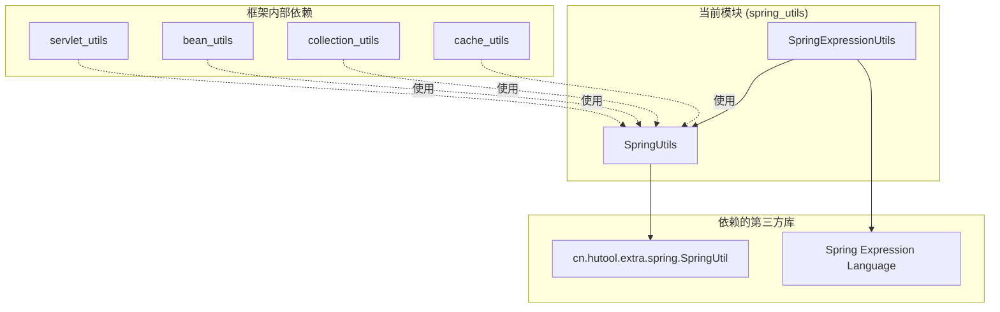
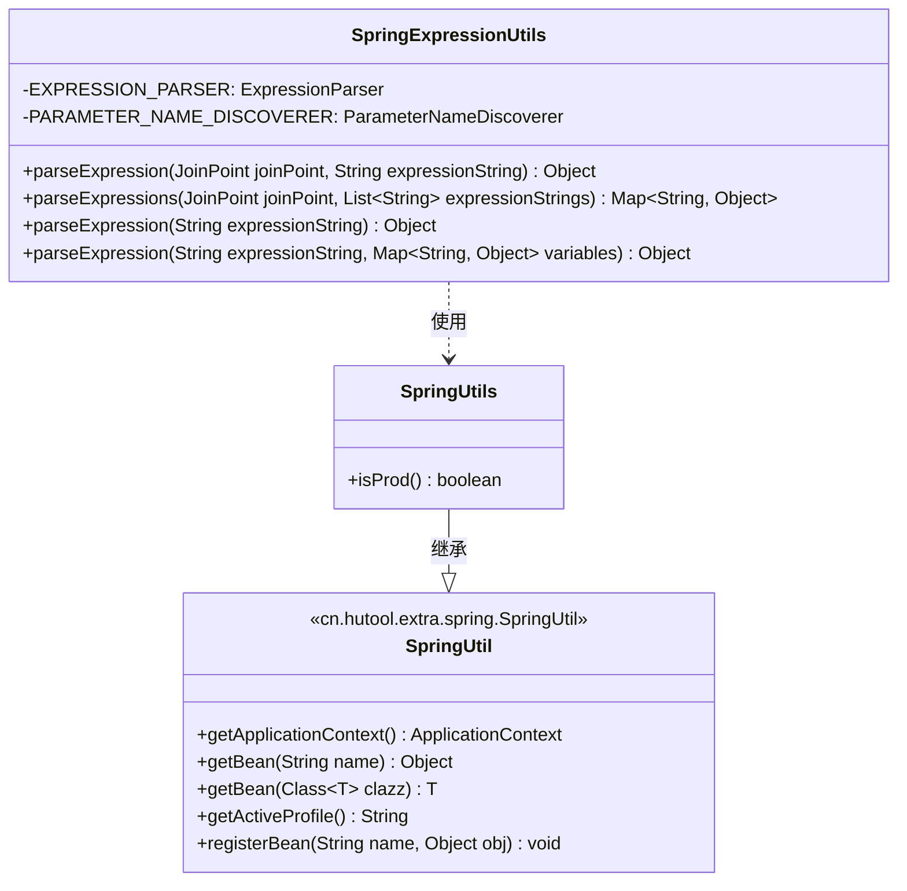
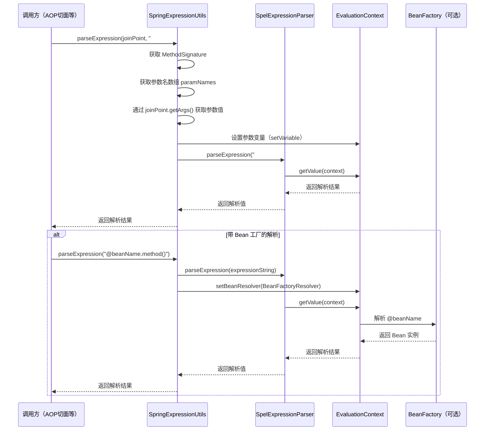

# Spring 工具模块 (spring_utils)

## 概述

`spring_utils` 模块提供了一系列与 Spring 框架紧密相关的工具类，旨在简化 Spring 应用开发中的常见操作。该模块主要包括两个核心工具类：`SpringUtils` 和 `SpringExpressionUtils`，分别用于 Spring 环境检测和 Spring EL 表达式解析。

通过该模块，开发者可以方便地获取当前 Spring 运行环境信息，以及在运行时解析 SpEL（Spring Expression Language）表达式，广泛应用于 AOP 切面处理、条件判断、动态配置等场景。

---

## 核心组件

### 1. SpringUtils

#### 类信息
- **包路径**：`cn.iocoder.yudao.framework.common.util.spring.SpringUtils`
- **继承关系**：继承自 `cn.hutool.extra.spring.SpringUtil`（Hutool 提供的 Spring 工具封装）
- **职责**：提供 Spring 环境相关的工具方法

#### 方法说明

| 方法 | 返回类型 | 说明 |
|------|----------|------|
| `isProd()` | `boolean` | 判断当前 Spring 环境是否为生产环境（`prod`） |

#### 实现原理

`SpringUtils` 继承自 Hutool 的 `SpringUtil`，后者封装了 Spring 应用上下文（`ApplicationContext`）的获取、Bean 的获取等常用操作。`SpringUtils`在此基础上扩展了 `isProd()` 方法：

```java
public static boolean isProd() {
    String activeProfile = getActiveProfile();
    return Objects.equals("prod", activeProfile);
}
```

该方法通过调用 `SpringUtil.getActiveProfile()` 获取当前激活的 Spring Profile，然后判断是否等于 `"prod"`（生产环境标识）。

#### 继承自 Hutool SpringUtil 的常用方法

`SpringUtils` 继承了 `SpringUtil` 的所有静态方法，无需额外引用 Hutool 即可使用，主要包括：

| 方法 | 说明 |
|------|------|
| `getApplicationContext()` | 获取 Spring 应用上下文 |
| `getBean(String name)` | 根据名称获取 Bean |
| `getBean(Class<T> clazz)` | 根据类型获取 Bean |
| `getBean(String name, Class<T> clazz)` | 根据名称和类型获取 Bean |
| `getActiveProfile()` | 获取当前激活的 Profile |
| `setApplicationContext(ApplicationContext context)` | 设置应用上下文（通常由 Spring 自动注入） |
| `registerBean(String name, Object obj)` | 动态注册 Bean |

---

### 2. SpringExpressionUtils

#### 类信息
- **包路径**：`cn.iocoder.yudao.framework.common.util.spring.SpringExpressionUtils`
- **职责**：提供 Spring EL（SpEL）表达式的解析工具方法

#### 方法说明

| 方法 | 返回类型 | 说明 |
|------|----------|------|
| `parseExpression(JoinPoint joinPoint, String expressionString)` | `Object` | 从 AOP 切面中解析单个 EL 表达式 |
| `parseExpressions(JoinPoint joinPoint, List<String> expressionStrings)` | `Map<String, Object>` | 从 AOP 切面中批量解析 EL 表达式 |
| `parseExpression(String expressionString)` | `Object` | 从 Bean 工厂解析 EL 表达式（无附加变量） |
| `parseExpression(String expressionString, Map<String, Object> variables)` | `Object` | 从 Bean 工厂解析 EL 表达式（带附加变量） |

#### 实现原理

1. **带 JoinPoint 的解析**：
   - 通过 `MethodSignature` 获取被拦截方法的参数名和参数值
   - 使用 Spring 的 `ParameterNameDiscoverer` 获取方法形参名
   - 将参数名和参数值设置到 `StandardEvaluationContext` 上下文中
   - 使用 `SpelExpressionParser` 解析表达式并返回结果

2. **带 Bean 工厂的解析**：
   - 通过 `BeanFactoryResolver` 设置 Bean 解析器，使表达式可以引用 Spring 容器中的 Bean
   - 支持传入自定义变量（`variables` 参数）
   - 使用 `SpelExpressionParser` 解析表达式

#### 使用示例

**在 AOP 切面中解析方法参数**：
```java
// 假设拦截的方法为：public void updateUser(Long id, String name)
// 表达式 "#id" 将会解析为 id 参数的值
Object idValue = SpringExpressionUtils.parseExpression(joinPoint, "#id");
```

**批量解析多个表达式**：
```java
List<String> expressions = Arrays.asList("#id", "#name");
Map<String, Object> result = SpringExpressionUtils.parseExpressions(joinPoint, expressions);
// result.get("#id") 获取 id 参数值
// result.get("#name") 获取 name 参数值
```

**从 Spring 容器解析 Bean 属性**：
```java
// 在表达式中通过 @beanName 引用 Spring Bean
Object value = SpringExpressionUtils.parseExpression("@userService.getCurrentUser().name");
```

**带自定义变量的解析**：
```java
Map<String, Object> variables = new HashMap<>();
variables.put("userId", 123L);
Object result = SpringExpressionUtils.parseExpression("#userId", variables);
```

---

## 架构与模块关系

### 模块依赖关系



### 模块类图



---

## 数据流与组件交互

### SpringExpressionUtils 解析流程



### SpringUtils 环境判断流程

```mermaid
flowchart LR
    A[应用启动] --> B[Spring 设置 ActiveProfile]
    B --> C{SpringUtils.isProd()}
    C -->|activeProfile == "prod"| D[返回 true]
    C -->|activeProfile != "prod"| E[返回 false]
    
    subgraph "使用场景"
        F[条件化配置]
        G[日志级别控制]
        H[功能开关]
    end
    
    D --> F
    D --> G
    D --> H
    E --> F
    E --> G
    E --> H
```

---

## 与其他模块的关系

`spring_utils` 模块作为框架的基础工具模块，被框架内多个模块所依赖：

| 模块 | 依赖关系 | 说明 |
|------|----------|------|
| [servlet_utils](servlet_utils.md) | 使用 `SpringUtils` | 获取 Web 应用上下文和 Bean |
| [bean_utils](bean_utils.md) | 使用 `SpringUtils` | 获取 Spring 管理的 Bean 实例 |
| [collection_utils](collection_utils.md) | 使用 `SpringUtils` | 间接依赖（通过其他工具类） |
| [cache_utils](cache_utils.md) | 使用 `SpringUtils` | 获取缓存相关的 Bean |
| 数据权限模块（datapermission） | 使用 `SpringExpressionUtils` | 解析权限表达式 |
| 多租户模块（tenant）| 使用 `SpringUtils` | 获取 Tenant 上下文相关 Bean |
| BPM 工作流模块 | 使用 `SpringExpressionUtils` | 解析流程表达式 |

---

## 最佳实践

### 1. 生产环境判断

```java
// 在配置类中根据环境决定是否启用某些功能
@Configuration
public class CustomConfiguration {
    
    @Bean
    @ConditionalOnExpression("T(cn.iocoder.yudao.framework.common.util.spring.SpringUtils).isProd()")
    public SomeProdOnlyBean someProdOnlyBean() {
        return new SomeProdOnlyBean();
    }
}
```

### 2. 在 AOP 中动态获取方法参数

```java
@Around("@annotation(customLog)")
public Object around(ProceedingJoinPoint joinPoint, CustomLog customLog) throws Throwable {
    // 解析 EL 表达式获取参数值
    Object paramValue = SpringExpressionUtils.parseExpression(
        joinPoint, customLog.expression());
    // ... 业务处理
    return joinPoint.proceed();
}
```

### 3. 动态引用 Spring Bean

```java
// 在无法注入 Bean 的地方使用
UserService userService = SpringUtils.getBean(UserService.class);
User currentUser = userService.getCurrentUser();
```

---

## 注意事项

1. **线程安全**：`SpringUtils` 和 `SpringExpressionUtils` 均为无状态工具类，所有方法均为静态方法，线程安全。
2. **依赖要求**：使用 `SpringUtils` 前需确保 Spring 应用上下文已初始化（通常在 Spring 容器启动完成后）。
3. **表达式安全**：在使用 `SpringExpressionUtils.parseExpression()` 时，应注意表达式字符串的来源，避免 SpEL 注入风险。
4. **Profile 约定**：`isProd()` 方法默认将 `"prod"` 作为生产环境标识，如果项目使用不同的 Profile 命名规范，需调整比较逻辑。
