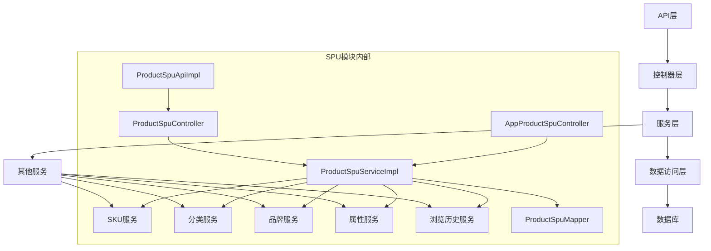
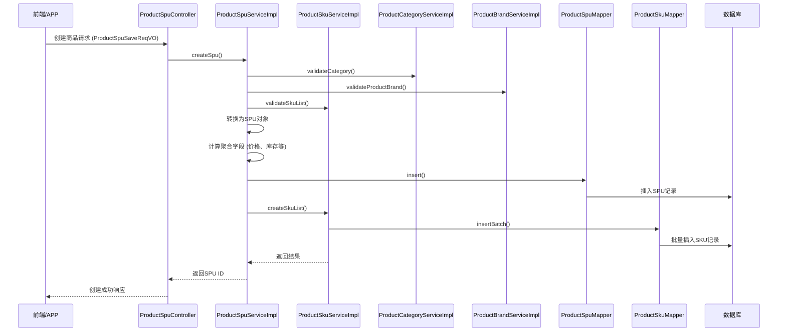
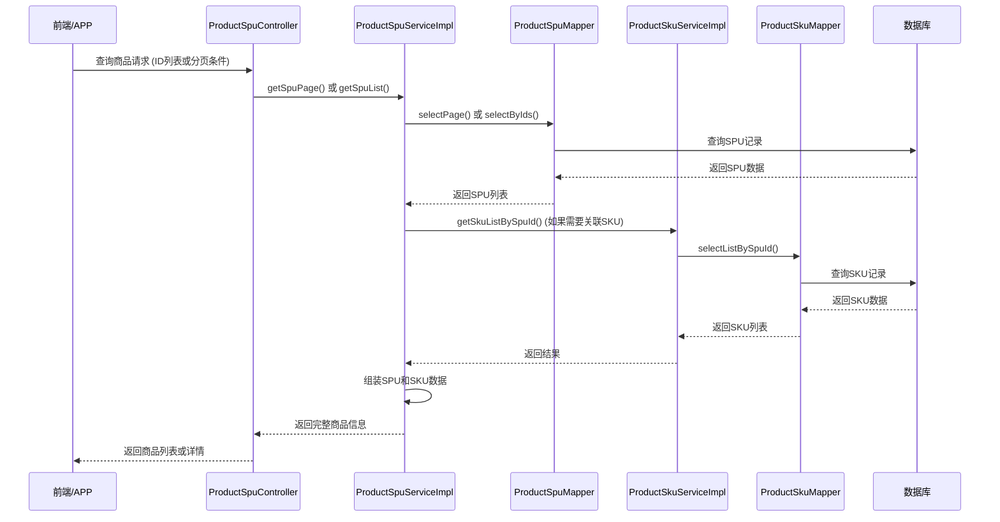
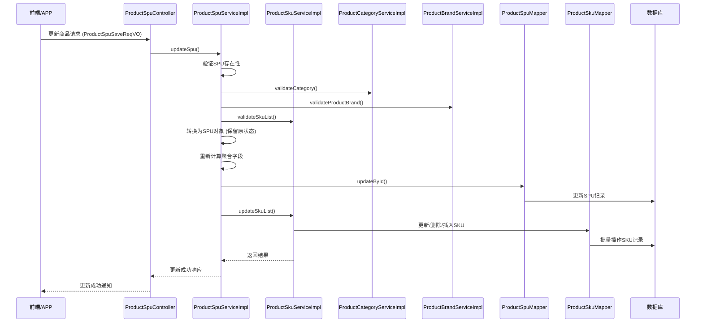
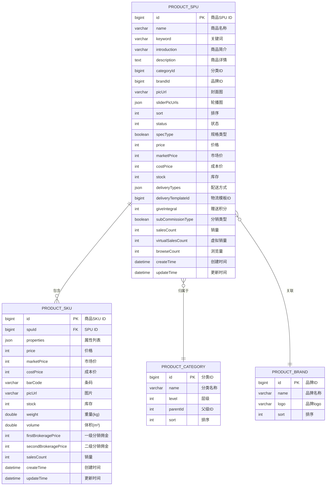

# SPU 模块文档

## 模块概述

SPU（Standard Product Unit，标准产品单元）模块是商城系统的核心模块之一，负责管理商品的基本信息、规格属性、价格、库存等核心数据。SPU 代表一类具有共同特性的商品集合，而 SKU（Stock Keeping Unit，库存量单位）则是 SPU 下的具体商品变体。

在 Yudao 商城系统中，SPU 模块提供了完整的商品生命周期管理功能，包括商品的创建、更新、删除、查询、状态管理以及与 SKU、分类、品牌等关联模块的交互。

## 核心功能

1. **商品管理**：支持商品的创建、更新、删除、查询等基本操作
2. **规格管理**：管理商品的规格属性（如颜色、尺寸等）及其对应的 SKU
3. **价格管理**：维护商品的售价、市场价、成本价等价格信息
4. **库存管理**：实时跟踪和更新商品库存状态
5. **状态管理**：支持商品的上架、下架、删除等状态切换
6. **关联查询**：提供与分类、品牌、SKU 等关联数据的查询功能
7. **统计功能**：维护商品的销量、浏览量等统计信息
8. **分页查询**：支持复杂条件下的分页查询功能
9. **批量操作**：支持商品的批量导入、导出、状态更新等操作

## 架构设计

SPU 模块遵循分层架构设计，主要包括以下几个层次：

### 架构概览



### 分层说明

#### 1. API 层（对外接口）
- `ProductSpuApiImpl`：提供 RPC 接口，供其他模块调用
- `AppProductSpuController`：提供 APP 端接口
- `ProductSpuController`：提供管理后台端接口

#### 2. 控制器层（Controller）
- 负责接收 HTTP 请求，进行参数校验和业务路由
- 包含管理后台控制器和 APP 控制器

#### 3. 服务层（Service）
- `ProductSpuServiceImpl`：实现业务逻辑，处理商品的创建、更新、删除等核心操作
- 与 SKU 服务、分类服务、品牌服务等协同工作

#### 4. 数据访问层（DAO/Mapper）
- `ProductSpuMapper`：MyBatis mapper，负责与数据库交互
- `ProductSkuMapper`：SKU 数据访问

#### 5. 数据对象层（DO/DTO/VO）
- `ProductSpuDO`：数据库持久化对象
- `ProductSkuDO`：SKU 数据库持久化对象
- `ProductSpuRespDTO`：API 响应数据传输对象
- 各种 VO（View Object）：用于前端交互的数据对象

#### 6. 转换层（Convert）
- `ProductSpuConvert`：负责 DO、DTO、VO 之间的转换
- 使用 MapStruct 实现高效的对象映射

#### 7. 枚举和常量
- `ProductSpuStatusEnum`：商品状态枚举
- `ProductConstants`：商品相关常量

## 与其他模块的关系

SPU 模块是商城系统的核心模块，与多个其他模块存在紧密的关联关系：

1. **与 SKU 模块**：SPU 是 SKU 的父级概念，一个 SPU 可以对应多个 SKU（不同规格的同类商品）
2. **与分类模块**：商品需要归属到特定的分类下
3. **与品牌模块**：商品关联特定的品牌
4. **与属性模块**：商品规格依赖于属性和属性值的定义
5. **与促销模块**：商品可以参与各种促销活动（满减、折扣、秒杀等）
6. **与交易模块**：商品是交易的核心对象，用于生成订单
7. **与统计模块**：商品的销量、浏览量等数据用于统计分析
8. **与收藏模块**：用户可以收藏喜欢的商品
9. **与浏览历史模块**：记录用户的商品浏览行为

## 详细组件说明

### 数据模型

#### ProductSpuDO (数据库对象)
- **基本信息**：id、name、keyword、introduction、description
- **分类关联**：categoryId（关联 ProductCategoryDO）
- **品牌关联**：brandId（关联 ProductBrandDO）
- **媒体资源**：picUrl（封面图）、sliderPicUrls（轮播图）
- **排序和状态**：sort、status（上架/下架/回收站等）
- **SKU 相关字段**：specType（单规格/多规格）、price、marketPrice、costPrice、stock（这些字段值是从关联的 SKU 中聚合得出的）
- **物流信息**：deliveryTypes（配送方式）、deliveryTemplateId（物流模板）
- **营销信息**：giveIntegral（赠送积分）
- **分销信息**：subCommissionType（分销类型）
- **统计信息**：salesCount（销量）、virtualSalesCount（虚拟销量）、browseCount（浏览量）

#### ProductSkuDO (SKU 数据库对象)
- **基本信息**：id、spuId（关联 SPU）、barCode（条码）、picUrl、weight、volume
- **价格信息**：price、marketPrice、costPrice
- **库存信息**：stock
- **分销信息**：firstBrokeragePrice、secondBrokeragePrice
- **规格属性**：properties（JSON 格式的属性列表，每个属性包含 propertyId、propertyName、valueId、valueName）
- **统计信息**：salesCount

### 核心业务逻辑

#### 商品创建流程
1. 接收创建请求（ProductSpuSaveReqVO）
2. 校验分类和品牌是否合法
3. 校验 SKU 列表的有效性（包括属性唯一性、规格一致性等）
4. 将请求转换为 ProductSpuDO 对象
5. 基于 SKU 信息初始化 SPU 的聚合字段（价格、库存等）
6. 保存 SPU 到数据库
7. 保存关联的 SKU 列表
8. 返回创建的 SPU ID

#### 商品更新流程
1. 接收更新请求
2. 校验 SPU 是否存在
3. 校验分类和品牌是否合法
4. 校验 SKU 列表的有效性
5. 将请求转换为 ProductSpuDO 对象（保留原状态）
6. 基于 SKU 信息更新 SPU 的聚合字段
7. 更新 SPU 记录
8. 批量更新关联的 SKU 列表

#### 商品删除流程（逻辑删除）
1. 校验 SPU 是否存在
2. 校验商品状态是否为回收站（只有回收站中的商品才能被真正删除）
3. 删除 SPU 记录
4. 删除关联的 SKU 记录

#### 商品查询功能
- 根据 ID 查询单个商品
- 根据 ID 列表批量查询商品
- 根据状态查询商品列表
- 支持分页查询（包含复杂过滤条件）
- 提供 Tab 统计功能（在售、库存、售罄、预警、回收站等不同状态的商品数量）

### 关键设计点

1. **聚合字段设计**：SPU 中的价格、库存等字段是从关联的 SKU 中聚合计算得出的，这样可以避免冗余且保证数据一致性
2. **规格验证**：在创建和更新商品时，会严格验证 SKU 的规格属性，确保属性不重复、属性值数量一致、SKU 不重复等
3. **级联操作**：对 SPU 的操作会自动级联到关联的 SKU（如删除 SPU 时会删除所有关联的 SKU）
4. **状态管理**：商品状态包括上架、下架、删除、回收站等，只有回收站状态的商品才能被真正删除
5. **浏览量统计**：提供更新浏览量的接口，并在 APP 端查询商品详情时自动增加浏览量
6. **虚拟销量**：支持设置虚拟销量，用于初始化商品的销量展示
7. **分类层级校验**：确保商品只能放置在指定层级的分类下（如只能放在叶子分类）

## 接口说明

### 后台管理接口（ProductSpuController）

| 接口 | 方法 | 路径 | 描述 |
|------|------|------|------|
| 创建商品 | POST | /product/spu/create | 创建新的商品 SPU |
| 更新商品 | PUT | /product/spu/update | 更新现有商品 SPU |
| 更新状态 | PUT | /product/spu/update-status | 更新商品状态（上架/下架等） |
| 删除商品 | DELETE | /product/spu/delete | 删除商品（逻辑删除到回收站） |
| 获取详情 | GET | /product/spu/get-detail | 根据 ID 获取商品详情（包含 SKU） |
| 获取简易列表 | GET | /product/spu/list-all-simple | 获取所有上架商品的简易列表 |
| 获取详情列表 | GET | /product/spu/list | 根据 ID 列表获取商品详情列表 |
| 分页查询 | GET | /product/spu/page | 分页查询商品列表 |
| Tab 统计 | GET | /product/spu/get-count | 获取不同状态下的商品数量统计 |
| 导出Excel | GET | /product/spu/export-excel | 导出商品列表到 Excel 文件 |

### APP 接口（AppProductSpuController）

| 接口 | 方法 | 路径 | 描述 |
|------|------|------|------|
| 根据 ID 列表查询 | GET | /product/spu/list-by-ids | 根据 ID 列表查询商品（用于购物车等场景） |
| 分页查询 | GET | /product/spu/page | 分页查询商品（支持分类过滤） |
| 获取详情 | GET | /product/spu/get-detail | 根据 ID 获取商品详情（会增加浏览量并记录浏览历史） |

### RPC 接口（ProductSpuApiImpl）

| 接口 | 方法 | 描述 |
|------|------|------|
| 根据 ID 列表获取 | getSpuList | 根据 ID 列表获取商品列表（供其他模块调用） |
| 验证 ID 列表 | validateSpuList | 验证 ID 列表对应的商品是否存在且状态正常 |
| 根据单个 ID 获取 | getSpu | 根据单个 ID 获取商品信息 |

## 数据流说明

### 商品创建数据流
```
前端请求 -> ProductSpuController -> ProductSpuService 
    -> 参数校验 -> SKU服务验证 -> SPU对象转换 
    -> 聚合字段计算 -> ProductSpuMapper插入 
    -> SKU服务批量插入 -> 返回结果
```

### 商品查询数据流
```
前端请求 -> ProductSpuController -> ProductSpuService 
    -> ProductSpuMapper查询 -> 结果转换 
    -> (可选) 关联SKU查询 -> 返回结果
```

### 商品更新数据流
```
前端请求 -> ProductSpuController -> ProductSpuService 
    -> 存在性校验 -> 参数校验 -> SKU服务验证 
    -> SPU对象转换 -> 聚合字段重新计算 
    -> ProductSpuMapper更新 -> SKU服务批量更新 -> 返回结果
```

## 与其他模块的交互

### 与 SKU 模块的交互
- SPU 服务依赖 SKU 服务进行 SKU 的创建、更新、删除和查询
- SPU 的价格、库存等聚合字段需要从 SKU 中计算得出
- 删除 SPU 时需要级联删除所有关联的 SKU

### 与分类模块的交互
- 创建/更新商品时需要验证分类是否存在且层级正确
- 查询商品时可以根据分类进行过滤
- 提供根据分类 ID 获取商品数量的功能

### 与品牌模块的交互
- 创建/更新商品时需要验证品牌是否存在
- 商品详情中会包含品牌信息（通过品牌服务获取）

### 与属性模块的交互
- SKU 的规格属性依赖于属性和属性值的定义
- 创建/更新 SKU 时需要验证属性和属性值的存在性

### 与促销模块的交互
- 商品可以参与各种促销活动（如满减、折扣、秒杀等）
- 促销活动会根据商品的价格、库存等信息进行计算

### 与交易模块的交互
- 订单创建时需要验证商品是否存在、是否上架、库存是否充足
- 订单中的商品快照会包含 SPU 和 SKU 的关键信息

### 与统计模块的交互
- 商品的销量、浏览量等数据会被统计模块用于生成各种报表
- 统计模块提供商品销售趋势、热门商品等分析功能

## 数据流示例

### 商品创建数据流


### 商品查询数据流


### 商品更新数据流


## 性能考虑

1. **聚合字段实时计算**：SPU 中的价格、库存等字段是在创建/更新时实时计算的，避免了额外的统计开销
2. **批量操作优化**：支持批量创建、更新、删除操作，减少数据库交互次数
3. **分页查询优化**：使用 MyBatis 的分页插件进行高效的分页查询
4. **缓存策略**：建议对经常查询的商品信息（如热门商品、推荐商品）进行缓存
5. **索引优化**：数据库表上应该为经常查询的字段（如 status、categoryId、createTime）建立适当的索引

## 安全考虑

1. **权限控制**：所有接口都需要相应的权限才能访问（如 product:spu:create、product:spu:update 等）
2. **参数校验**：所有输入参数都会进行非空、格式、范围等校验
3. **数据验证**：在创建和更新时会验证关联数据的合法性（如分类、品牌是否存在）
4. **防止越权访问**：在查询、更新、删除操作中都会先验证资源的存在性和状态
5. **事务管理**：关键操作（如创建、更新、删除）都使用事务确保数据一致性

## 数据库结构



## 异常处理

模块定义了多种业务异常情况，包括但不限于：
- SPU_NOT_EXISTS：商品不存在
- SPU_NOT_ENABLE：商品未上架
- SPU_NOT_RECYCLE：商品不在回收站（无法删除）
- SPU_SAVE_FAIL_CATEGORY_LEVEL_ERROR：商品分类层级错误
- SKU_NOT_EXISTS：SKU 不存在
- SKU_PROPERTIES_DUPLICATED：SKU 属性重复
- SPU_ATTR_NUMBERS_MUST_BE_EQUALS：SKU 属性数量必须相等
- SPU_SKU_NOT_DUPLICATE：SKU 不能重复
- SKU_STOCK_NOT_ENOUGH：SKU 库存不足

## 典型使用场景

1. **商品管理后台**：运营人员通过后台界面创建、编辑、上架/下架商品
2. **商品展示页**：前端根据分类或搜索条件展示商品列表
3. **商品详情页**：用户点击商品查看详细信息（包括规格、价格、库存等）
4. **购物车结算**：系统验证购物车中的商品是否有效、库存是否充足
5. **订单生成**：创建订单时需要获取商品的详细信息生成订单商品快照
6. **库存预警**：当商品库存低于阈值时触发库存预警通知
7. **商品导入导出**：支持 Excel 格式的商品批量导入和导出
8. **商品搜索**：根据关键词、分类、价格区间等条件搜索商品
9. **商品推荐**：根据销量、浏览量等统计信息进行商品推荐
10. **移动端商城**：APP 端展示商品列表和详情，支持分类浏览和搜索

## 最佳实践

1. **数据一致性**：确保 SPU 和 SKU 的数据始终保持一致，特别是价格和库存等聚合字段
2. **错误处理**：在所有业务操作中都要进行充分的错误检查和异常处理
3. **日志记录**：关键操作（如创建、更新、删除）应该记录详细的日志便于问题追踪
4. **事务边界**：明确定义事务的范围，确保相关操作要么全部成功，要么全部回滚
5. **性能监控**：监控关键接口的响应时间，特别是分页查询和列表查询接口
6. **缓存策略**：对于经常读取但很少修改的数据（如商品基本信息）考虑使用缓存
7. **批量操作**：在处理大量数据时优先使用批量操作接口以提高性能
8. **安全审计**：敏感操作（如删除商品）应该进行安全审计日志记录

## 依赖关系

SPU 模块主要依赖以下其他模块或服务：
- SKU 服务（ProductSkuService）：用于管理商品规格
- 分类服务（ProductCategoryService）：用于验证和获取分类信息
- 品牌服务（ProductBrandService）：用于验证和获取品牌信息
- 属性服务（ProductPropertyService）：用于验证属性和属性值
- 属性值服务（ProductPropertyValueService）：用于验证属性值
- 浏览历史服务（ProductBrowseHistoryService）：用于记录商品浏览历史（APP 端）

## 未来改进方向

1. **引入缓存**：为经常查询的商品信息引入 Redis 缓存，减少数据库压力
2. **异步处理**：将某些非实时操作（如库存更新通知、统计数据更新）改为异步处理
3. **搜索优化**：引入 Elasticsearch 等搜索引擎来支持更复杂的商品搜索功能
4. **多语言支持**：为商品名称、描述等字段添加多语言支持
5. **商品审核流程**：引入商品审核机制，新增或修改的商品需要审核后才能上架
6. **商品版本管理**：引入商品版本概念，支持商品信息的历史追踪和回滚
7. **批量导入优化**：改进 Excel 导入功能，支持更复杂的数据验证和错误报告
8. **商品关联关系**：支持商品之间的关联关系（如交叉销售、捆绑销售等）