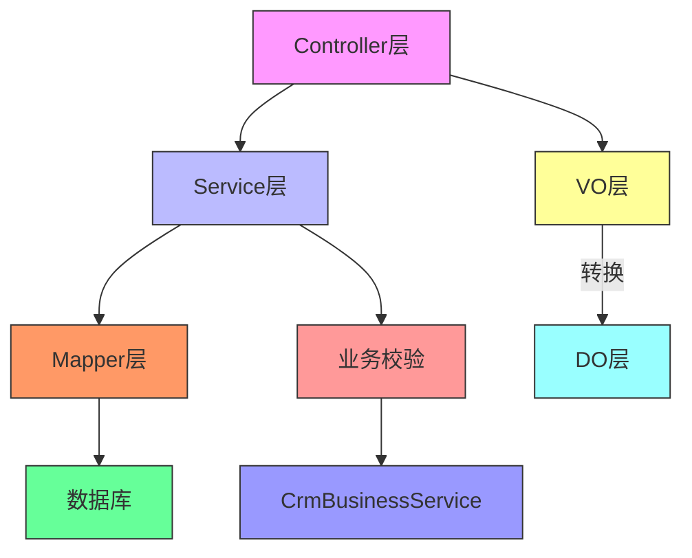
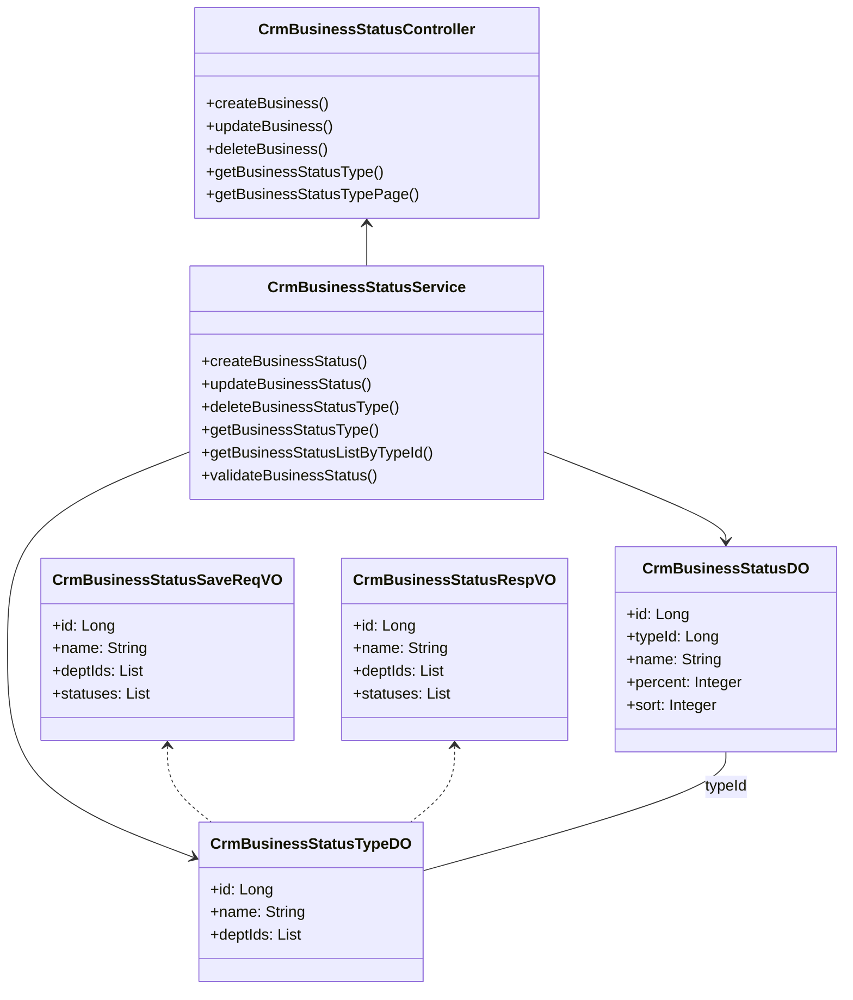
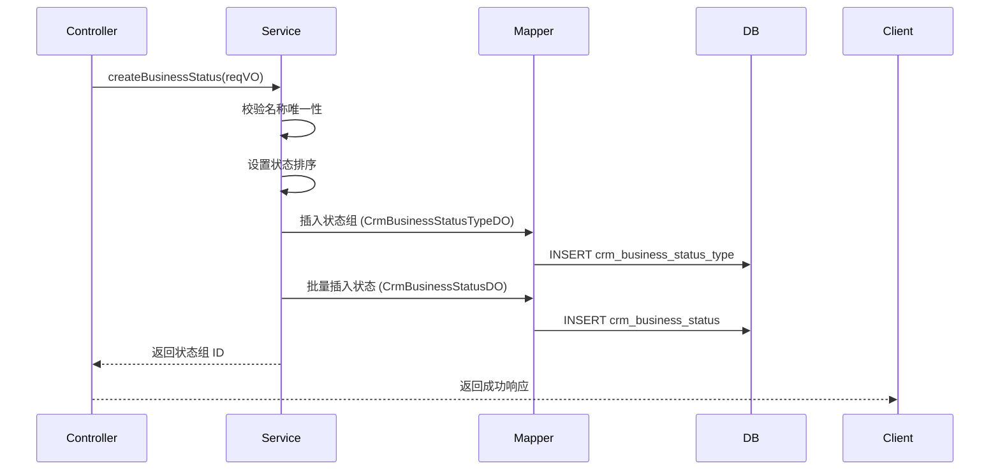
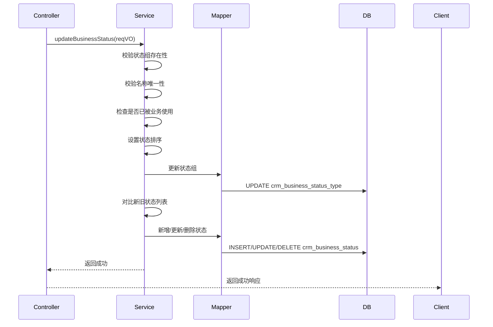
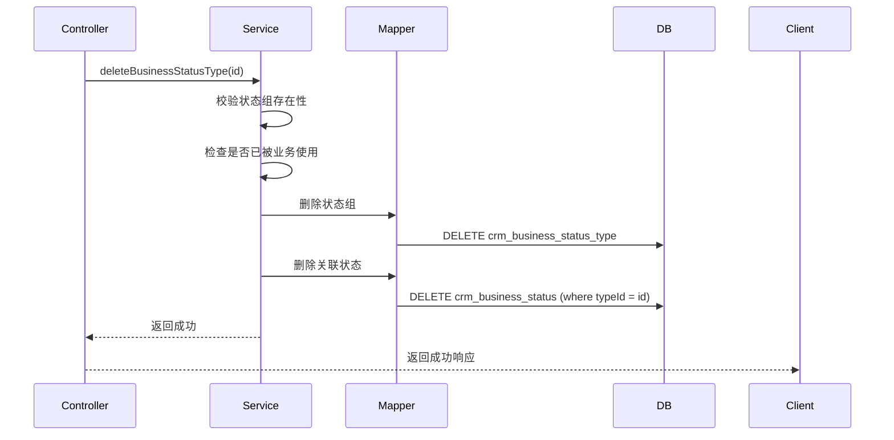

# 商机状态模块 (Business Status Module)

## 1. 模块概述

商机状态模块是 CRM 系统中的核心功能模块之一，用于管理销售过程中不同阶段的**商机状态组**及其**具体状态**。该模块支持为不同部门配置差异化的销售流程，通过定义状态名称、赢单率等属性，帮助企业规范销售流程、预测销售业绩。

### 核心功能
- **状态组管理**：创建、修改、删除商机状态组（如"售前阶段"、"售中阶段"等）
- **状态配置**：为每个状态组配置具体的销售状态（如"初步接触"、"方案报价"、"谈判中"等），并设置赢单率和排序
- **部门关联**：将状态组与特定部门关联，实现部门级的销售流程差异化配置
- **状态校验**：在创建/更新时校验状态组名称唯一性，防止重复；在删除时校验是否已被使用

### 模块定位
```
CRM 模块
└── 业务管理 (Business)
    └── 商机状态 (Business Status)  ← 本模块
        ├── 状态组 (Status Type)
        └── 状态 (Status)
```

## 2. 架构设计

### 2.1 整体架构

商机状态模块采用标准的分层架构，遵循 CRUD 操作规范，与 CRM 业务模块紧密集成。



### 2.2 组件关系



## 3. 核心组件说明

### 3.1 视图对象 (VO)

#### 3.1.1 CrmBusinessStatusRespVO

**描述**：商机状态响应 VO，用于前端展示状态组及其包含的状态列表。

**字段说明**：

| 字段名 | 类型 | 描述 | 示例值 |
|--------|------|------|--------|
| id | Long | 状态组编号 | 2934 |
| name | String | 状态组名字 | 李四 |
| deptIds | List<Long> | 使用的部门编号 | [1, 2, 3] |
| deptNames | List<String> | 使用的部门名称 | ["销售部", "市场部"] |
| creator | String | 创建人 | admin |
| createTime | LocalDateTime | 创建时间 | 2024-01-01 10:00:00 |
| statuses | List<Status> | 状态集合 | - |

**内部类 Status**：

| 字段名 | 类型 | 描述 | 示例值 |
|--------|------|------|--------|
| id | Long | 状态编号 | 23899 |
| name | String | 状态名 | 王五 |
| percent | BigDecimal | 赢单率 | 50 |
| sort | Integer | 排序 | 1 |

#### 3.1.2 CrmBusinessStatusSaveReqVO

**描述**：商机状态保存/更新请求 VO，用于前端提交状态组及状态的创建或更新数据。

**字段说明**：

| 字段名 | 类型 | 描述 | 校验规则 | 示例值 |
|--------|------|------|----------|--------|
| id | Long | 主键 | - | 2934 |
| name | String | 状态类型名 | @NotEmpty | 李四 |
| deptIds | List<Long> | 使用的部门编号 | - | [1, 2, 3] |
| statuses | List<Status> | 商机状态集合 | @NotEmpty, @Valid | - |

**内部类 Status**：

| 字段名 | 类型 | 描述 | 校验规则 | 示例值 |
|--------|------|------|----------|--------|
| id | Long | 状态编号 | - | 23899 |
| name | String | 状态名 | @NotEmpty | 王五 |
| percent | BigDecimal | 赢单率 | @NotNull | 50 |
| sort | Integer | 排序 | hidden | 1 |

### 3.2 数据对象 (DO)

#### 3.2.1 CrmBusinessStatusTypeDO

**描述**：商机状态组数据对象，对应数据库表 `crm_business_status_type`。

**字段说明**：

| 字段名 | 类型 | 描述 | 关联关系 |
|--------|------|------|----------|
| id | Long | 主键 | - |
| name | String | 状态类型名 | - |
| deptIds | List<Long> | 使用的部门编号 | 使用 LongListTypeHandler 存储 |

#### 3.2.2 CrmBusinessStatusDO

**描述**：商机状态数据对象，对应数据库表 `crm_business_status`。

**字段说明**：

| 字段名 | 类型 | 描述 | 关联关系 |
|--------|------|------|----------|
| id | Long | 主键 | - |
| typeId | Long | 状态类型编号 | 关联 CrmBusinessStatusTypeDO.id |
| name | String | 状态名 | - |
| percent | Integer | 赢单率，百分比 | - |
| sort | Integer | 排序 | - |

### 3.3 服务层 (Service)

#### 3.3.1 CrmBusinessStatusService

**描述**：商机状态服务接口，定义了状态组及状态的所有业务操作。

**核心方法**：

| 方法名 | 描述 | 事务 | 返回值 |
|--------|------|------|--------|
| createBusinessStatus | 创建新的商机状态组及状态 | @Transactional | 状态组 ID |
| updateBusinessStatus | 更新现有商机状态组及状态 | @Transactional | - |
| deleteBusinessStatusType | 删除商机状态组（含关联状态） | @Transactional | - |
| getBusinessStatusType | 获取指定 ID 的状态组 | - | CrmBusinessStatusTypeDO |
| getBusinessStatusTypePage | 分页查询状态组 | - | PageResult |
| getBusinessStatusListByTypeId | 获取指定状态组下的所有状态 | - | List<CrmBusinessStatusDO> |
| validateBusinessStatus | 校验状态是否存在（类型+状态ID） | - | CrmBusinessStatusDO |

#### 3.3.2 CrmBusinessStatusServiceImpl

**描述**：商机状态服务实现类，包含核心业务逻辑。

**关键逻辑**：

1. **创建流程**：
   - 校验状态组名称唯一性
   - 自动设置状态的排序（从 0 开始递增）
   - 插入状态组记录
   - 批量插入状态记录（设置 typeId）

2. **更新流程**：
   - 校验状态组存在性
   - 校验状态组名称唯一性
   - 检查是否已被业务使用（已使用则禁止更新）
   - 自动设置状态的排序
   - 更新状态组记录
   - 对比新旧状态列表，执行增删改操作

3. **删除流程**：
   - 校验状态组存在性
   - 检查是否已被业务使用（已使用则禁止删除）
   - 删除状态组记录
   - 删除关联的状态记录

### 3.4 数据访问层 (Mapper)

包含两个 Mapper 接口：
- `CrmBusinessStatusTypeMapper`：状态组的数据访问
- `CrmBusinessStatusMapper`：状态的数据访问

支持的操作包括：
- 单条插入/更新/删除
- 批量插入
- 按类型 ID 查询状态列表
- 分页查询
- 按 ID 集合查询

## 4. 数据流程

### 4.1 创建商机状态组



### 4.2 更新商机状态组



### 4.3 删除商机状态组



## 5. 与其他模块的集成

### 5.1 与 CRM 业务模块集成

`CrmBusinessStatusService` 被 `CrmBusinessService` 依赖，用于：
- 在构建商机详情时，获取状态组名称和状态名称
- 校验商机状态的有效性（状态组 + 状态）
- 统计各状态组的商机数量（用于防止删除/更新已使用的状态组）

### 5.2 与权限系统集成

通过 `@PreAuthorize("@ss.hasPermission('crm:business-status:create')")` 等注解，实现基于角色的权限控制，确保只有授权用户才能操作商机状态。

### 5.3 与操作日志系统集成

通过操作日志切面，记录状态组的创建、更新、删除操作，便于审计和追溯。

## 6. 配置说明

### 6.1 数据库表结构

**crm_business_status_type**（状态组表）：

| 字段名 | 类型 | 描述 |
|--------|------|------|
| id | BIGINT | 主键 |
| name | VARCHAR | 状态组名称 |
| dept_ids | VARCHAR | 部门编号列表（JSON 格式） |
| create_time | DATETIME | 创建时间 |
| update_time | DATETIME | 更新时间 |

**crm_business_status**（状态表）：

| 字段名 | 类型 | 描述 |
|--------|------|------|
| id | BIGINT | 主键 |
| type_id | BIGINT | 状态组 ID（外键） |
| name | VARCHAR | 状态名称 |
| percent | INT | 赢单率（百分比） |
| sort | INT | 排序 |
| create_time | DATETIME | 创建时间 |
| update_time | DATETIME | 更新时间 |

### 6.2 类型处理器

- **LongListTypeHandler**：用于将 `List<Long>` 类型的 `deptIds` 字段序列化为字符串存储到数据库。

## 7. 异常处理

模块定义了以下常量异常信息：

| 常量名 | 含义 |
|--------|------|
| BUSINESS_STATUS_TYPE_NOT_EXISTS | 状态组不存在 |
| BUSINESS_STATUS_TYPE_NAME_EXISTS | 状态组名称已存在 |
| BUSINESS_STATUS_UPDATE_FAIL_USED | 状态组已被使用，无法更新 |
| BUSINESS_STATUS_DELETE_FAIL_USED | 状态组已被使用，无法删除 |
| BUSINESS_STATUS_NOT_EXISTS | 状态不存在 |

## 8. 使用示例

### 8.1 创建状态组

```json
POST /crm/business-status/create
{
  "name": "售前阶段",
  "deptIds": [1, 2],
  "statuses": [
    {
      "name": "初步接触",
      "percent": 10,
      "sort": 0
    },
    {
      "name": "需求分析",
      "percent": 30,
      "sort": 1
    },
    {
      "name": "方案报价",
      "percent": 50,
      "sort": 2
    }
  ]
}
```

### 8.2 获取状态组列表

```json
GET /crm/business-status/list
```

响应：
```json
{
  "code": 0,
  "message": "成功",
  "data": [
    {
      "id": 1,
      "name": "售前阶段",
      "deptIds": [1, 2],
      "statuses": [
        {
          "id": 1,
          "name": "初步接触",
          "percent": 10,
          "sort": 0
        }
      ]
    }
  ]
}
```

## 9. 总结

商机状态模块是 CRM 系统中用于管理销售流程状态的核心组件，通过状态组和状态的灵活配置，支持企业自定义销售流程。模块设计遵循分层架构原则，职责清晰，与业务模块紧密集成，提供了完整的 CRUD 操作和校验机制，确保数据的一致性和完整性。
