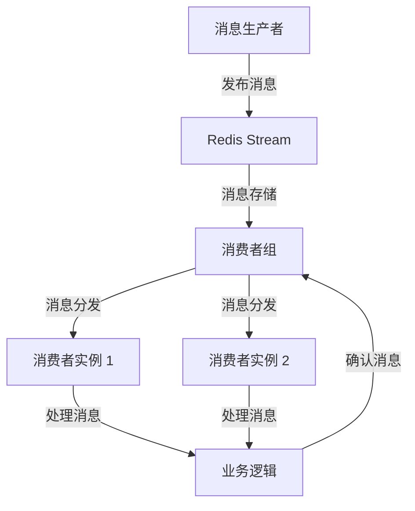

# Stream 模块文档

## 模块概述

Stream 模块是 Yudao Framework 中用于处理 Redis Stream 消息的核心模块。它提供了一种高效、可扩展的方式来处理实时消息流，适用于需要消息队列和流处理的场景。

### 主要功能

- **消息发布与订阅**：基于 Redis Stream 的发布/订阅机制，实现高效的消息传递。
- **消息持久化**：Redis Stream 自动持久化消息，确保消息不会丢失。
- **消费者组管理**：支持消费者组，实现消息的负载均衡和并行处理。
- **消息追踪**：支持消息的追踪和确认机制，确保消息被正确处理。
- **灵活的消息格式**：支持自定义消息格式，适应不同的业务需求。

### 适用场景

- **实时数据处理**：如日志收集、事件驱动架构中的事件处理。
- **任务分发**：将任务分发给多个工作线程或服务实例。
- **消息队列**：替代传统的消息队列，如 RabbitMQ 或 Kafka，用于轻量级消息传递。
- **流处理**：处理实时数据流，如用户行为分析、监控数据处理。

## 架构设计

### 模块结构

```
stream/
├── core/                          # 核心组件
│   ├── message/                   # 消息基础类
│   │   ├── AbstractRedisMessage.java  # Redis 消息抽象类
│   │   └── RedisMessage.java      # Redis 消息接口
│   ├── stream/                    # Stream 相关组件
│   │   ├── AbstractRedisStreamMessage.java  # Stream 消息抽象类
│   │   ├── RedisStreamConsumer.java         # Stream 消费者
│   │   ├── RedisStreamProducer.java         # Stream 生产者
│   │   └── RedisStreamListener.java         # Stream 监听器
│   └── config/                    # 配置类
│       └── RedisStreamProperties.java       # Stream 配置属性
├── service/                       # 业务服务
│   ├── message/                   # 消息服务
│   │   ├── MessageService.java    # 消息服务接口
│   │   └── MessageServiceImpl.java         # 消息服务实现
│   └── consumer/                  # 消费者服务
│       ├── ConsumerService.java   # 消费者服务接口
│       └── ConsumerServiceImpl.java       # 消费者服务实现
└── api/                           # API 层
    ├── controller/                # 控制器
    │   ├── StreamController.java  # Stream 控制器
    │   └── MessageController.java # 消息控制器
    └── dto/                       # 数据传输对象
        ├── StreamMessageDTO.java  # Stream 消息 DTO
        └── ConsumerGroupDTO.java  # 消费者组 DTO
```

### 核心组件

#### AbstractRedisStreamMessage

```java
package cn.iocoder.yudao.framework.mq.redis.core.stream;

import cn.iocoder.yudao.framework.mq.redis.core.message.AbstractRedisMessage;
import com.fasterxml.jackson.annotation.JsonIgnore;

/**
 * Redis Stream Message 抽象类
 *
 * @author 芋道源码
 */
public abstract class AbstractRedisStreamMessage extends AbstractRedisMessage {

    /**
     * 获得 Redis Stream Key，默认使用类名
     *
     * @return Channel
     */
    @JsonIgnore // 避免序列化
    public String getStreamKey() {
        return getClass().getSimpleName();
    }

}
```

**功能说明：**
- 继承自 `AbstractRedisMessage`，提供消息的基本序列化和反序列化功能。
- 定义了 `getStreamKey()` 方法，用于获取 Redis Stream 的键名，默认使用类名。
- 使用 `@JsonIgnore` 注解避免 `getStreamKey()` 方法在序列化时被包含在消息体中。

#### RedisStreamProducer

**功能说明：**
- 负责向 Redis Stream 发布消息。
- 支持消息的同步和异步发布。
- 支持消息的自定义键名和消费者组。

#### RedisStreamConsumer

**功能说明：**
- 负责从 Redis Stream 消费消息。
- 支持消费者组，实现消息的负载均衡和并行处理。
- 支持消息的手动确认和自动确认。

#### RedisStreamListener

**功能说明：**
- 负责监听 Redis Stream 中的消息。
- 支持消息的过滤和转发。
- 支持消费者组的动态管理。

### 消息流处理流程



1. **消息生产者** 向 **Redis Stream** 发布消息。
2. **Redis Stream** 存储消息并将其分发给消费者组中的各个消费者实例。
3. **消费者实例** 处理消息并向 **Redis Stream** 确认消息已被处理。
4. **Redis Stream** 根据确认信息，将已处理的消息标记为已消费。

## API 说明

### 消息发布 API

**接口地址：** `/api/stream/message/publish`

**请求方法：** `POST`

**请求参数：**

```json
{
  "streamKey": "String",  // Stream 键名
  "message": "Object"     // 消息内容
}
```

**响应参数：**

```json
{
  "success": "Boolean",  // 是否成功
  "message": "String"     // 响应消息
}
```

**示例：**

```bash
curl -X POST http://localhost:8080/api/stream/message/publish \
  -H "Content-Type: application/json" \
  -d '{
    "streamKey": "TestStream",
    "message": {
      "content": "Hello, Redis Stream!"
    }
  }'
```

### 消费者组管理 API

**接口地址：** `/api/stream/consumer-group`

**请求方法：** `POST`

**请求参数：**

```json
{
  "groupName": "String",  // 消费者组名称
  "streamKey": "String"   // Stream 键名
}
```

**响应参数：**

```json
{
  "success": "Boolean",  // 是否成功
  "message": "String"     // 响应消息
}
```

**示例：**

```bash
curl -X POST http://localhost:8080/api/stream/consumer-group \
  -H "Content-Type: application/json" \
  -d '{
    "groupName": "TestGroup",
    "streamKey": "TestStream"
  }'
```

## 配置说明

### Redis Stream 配置

在 `application.yml` 或 `application.properties` 中配置 Redis Stream 的相关参数：

```yaml
redis:
  stream:
    enabled: true  # 是否启用 Redis Stream
    maxLen: 1000   # Stream 中消息的最大长度
    consumer:
      concurrency: 10  # 消费者并发数
```

### 消费者配置

在 Spring Boot 的配置文件中配置消费者的相关参数：

```yaml
stream:
  consumers:
    - name: "TestConsumer"
      streamKey: "TestStream"
      groupName: "TestGroup"
      concurrency: 5
```

## 使用示例

### 1. 定义消息类

```java
package com.example.stream.message;

import cn.iocoder.yudao.framework.mq.redis.core.stream.AbstractRedisStreamMessage;

public class TestStreamMessage extends AbstractRedisStreamMessage {

    private String content;

    public TestStreamMessage() {
    }

    public TestStreamMessage(String content) {
        this.content = content;
    }

    public String getContent() {
        return content;
    }

    public void setContent(String content) {
        this.content = content;
    }
}
```

### 2. 发布消息

```java
package com.example.stream.service;

import cn.iocoder.yudao.framework.mq.redis.core.stream.RedisStreamProducer;
import com.example.stream.message.TestStreamMessage;
import org.springframework.stereotype.Service;

@Service
public class MessageService {

    private final RedisStreamProducer redisStreamProducer;

    public MessageService(RedisStreamProducer redisStreamProducer) {
        this.redisStreamProducer = redisStreamProducer;
    }

    public void publishMessage(String content) {
        TestStreamMessage message = new TestStreamMessage(content);
        redisStreamProducer.send(message);
    }
}
```

### 3. 定义消费者

```java
package com.example.stream.consumer;

import cn.iocoder.yudao.framework.mq.redis.core.stream.RedisStreamListener;
import com.example.stream.message.TestStreamMessage;
import org.springframework.stereotype.Component;

@Component
public class TestStreamListener extends RedisStreamListener<TestStreamMessage> {

    @Override
    public void onMessage(TestStreamMessage message) {
        System.out.println("Received message: " + message.getContent());
        // 处理消息逻辑
    }
}
```

### 4. 启动消费者组

```java
package com.example.stream.config;

import cn.iocoder.yudao.framework.mq.redis.core.stream.RedisStreamConsumer;
import com.example.stream.consumer.TestStreamListener;
import org.springframework.context.annotation.Bean;
import org.springframework.context.annotation.Configuration;

@Configuration
public class StreamConfig {

    @Bean
    public RedisStreamConsumer<TestStreamMessage> testStreamConsumer(TestStreamListener listener) {
        return RedisStreamConsumer.of("TestGroup", listener);
    }
}
```

## 最佳实践

### 1. 消息幂等性

为了确保消息被重复消费时不会导致数据不一致，建议在消费者端实现消息幂等性。可以通过以下方式实现：

- **消息去重**：在消息中添加唯一标识符（如 `messageId`），并在消费者端记录已处理的 `messageId`。
- **数据库唯一约束**：在数据库中添加唯一约束，确保相同的消息不会被重复插入。

### 2. 消费者负载均衡

- **消费者组**：使用消费者组来实现消费者之间的负载均衡。
- **并发消费**：根据消费者的处理能力，合理设置并发数，避免消费者过载。

### 3. 消息确认机制

- **手动确认**：在消息处理完成后，手动确认消息已被处理。
- **自动确认**：如果消息处理逻辑简单且可靠，可以使用自动确认机制。

### 4. 异常处理

- **重试机制**：对于处理失败的消息，可以实现重试机制，确保消息最终被处理。
- **死信队列**：对于长时间无法处理的消息，可以将其转移到死信队列，进行后续处理或人工介入。

### 5. 监控与日志

- **监控指标**：监控消息的发布、消费、确认等关键指标，确保系统的健康运行。
- **日志记录**：记录消息的处理日志，便于问题排查和性能优化。

## 与其他模块的集成

### 与 Redis 模块集成

Stream 模块依赖于 Redis 模块提供的 Redis 连接和配置。确保在项目中正确配置了 Redis 模块，并启用了 Redis Stream 功能。

### 与消息队列模块集成

Stream 模块可以与其他消息队列模块（如 RabbitMQ、Kafka）结合使用，实现混合消息处理架构。例如，可以使用 Kafka 处理高吞吐量的消息，而使用 Redis Stream 处理实时性要求较高的消息。

### 与业务模块集成

Stream 模块可以与各个业务模块集成，实现业务逻辑的解耦和异步处理。例如：

- **订单模块**：订单创建后，通过 Stream 模块异步发送订单确认邮件。
- **库存模块**：库存变动后，通过 Stream 模块异步更新库存缓存。
- **支付模块**：支付成功后，通过 Stream 模块异步处理支付回调逻辑。

## 常见问题与解决方案

### 1. 消息丢失

**问题描述：** 消息在发布后未被消费者接收。

**可能原因：**
- 消费者未正确订阅 Stream。
- 消费者组未正确配置。
- Redis Stream 中的消息已被自动清理。

**解决方案：**
- 检查消费者的订阅配置，确保消费者正确订阅了 Stream。
- 检查消费者组的配置，确保消费者组已正确创建并绑定到 Stream。
- 调整 Redis Stream 的 `maxLen` 参数，确保消息不会被自动清理。

### 2. 消息重复消费

**问题描述：** 同一条消息被多次消费。

**可能原因：**
- 消费者未正确确认消息。
- 消费者处理逻辑异常，导致消息未被正确处理。

**解决方案：**
- 检查消费者的消息确认逻辑，确保消息被正确确认。
- 在消费者处理逻辑中添加异常处理，确保消息处理的幂等性。
- 实现消息去重机制，避免重复消费。

### 3. 消费者性能问题

**问题描述：** 消费者处理消息的速度较慢，导致消息积压。

**可能原因：**
- 消费者的并发数设置过低。
- 消费者的处理逻辑过于复杂。
- Redis Stream 的性能瓶颈。

**解决方案：**
- 增加消费者的并发数，提高消息处理能力。
- 优化消费者的处理逻辑，简化业务逻辑。
- 检查 Redis 的性能指标，确保 Redis 服务器资源充足。

### 4. 消费者组管理问题

**问题描述：** 消费者组的创建、删除或成员管理出现问题。

**可能原因：**
- 消费者组的配置错误。
- Redis Stream 的权限问题。
- 消费者组的成员未正确注册。

**解决方案：**
- 检查消费者组的配置，确保配置正确。
- 检查 Redis 的权限设置，确保用户有权限管理消费者组。
- 检查消费者的注册逻辑，确保消费者正确注册到消费者组。

## 总结

Stream 模块为 Yudao Framework 提供了一个高效、可扩展的消息流处理方案。通过 Redis Stream 的强大功能，它可以满足各种实时消息处理需求，并与其他模块无缝集成。在使用过程中，建议遵循最佳实践，确保系统的稳定性和可靠性。

如需更多详细信息，请参考 [Redis Stream 官方文档](https://redis.io/docs/data-types/streams/) 和 [Yudao Framework 文档](https://doc.iocoder.cn)。
