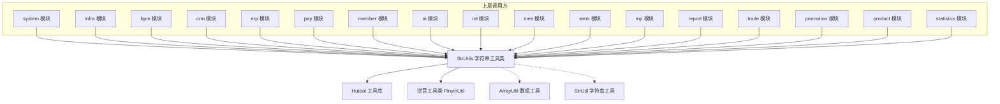
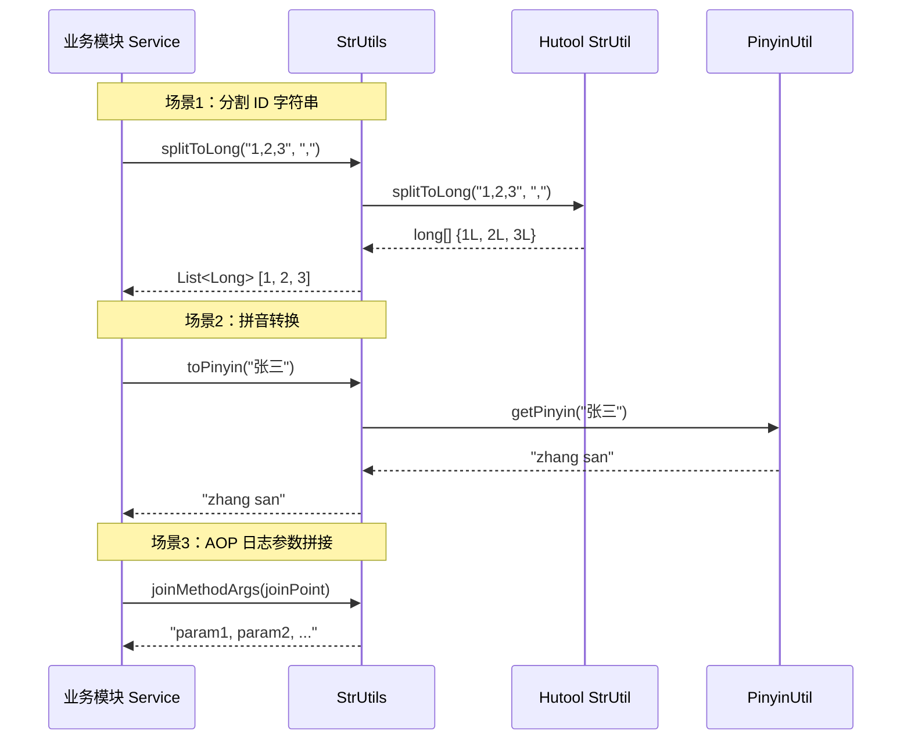

# 字符串工具模块 (String Utils)

## 概述

字符串工具模块位于 `yudao-framework/yudao-common/src/main/java/cn/iocoder/yudao/framework/common/util/string/` 路径下，核心组件为 `StrUtils` 类。该类基于 Hutool 工具库进行封装，提供了一系列常用的字符串操作工具方法，包括字符串截断、前缀匹配、分割转换、拼音转换、参数拼接等功能。

该模块是整个 Yudao 框架的基础工具模块之一，被几乎所有业务模块（如 system、infra、bpm、crm、erp、pay、member、ai、iot、mes、wms 等）广泛使用。

## 架构位置

StrUtils 位于框架的公共工具层，依赖关系如下：



## 核心功能

### 1. 字符串截断（`maxLength`）

截断字符串至指定最大长度，截断后自动补充 `...`。

```java
public static String maxLength(CharSequence str, int maxLength)
```

- 内部调用 `StrUtil.maxLength(str, maxLength - 3)`，预留 3 个字符用于填充 `...`
- 用于在 UI 显示、日志记录等场景下限制字符串长度

### 2. 前缀匹配（`startWithAny`）

检查给定字符串是否以指定集合中的**任意一个**字符串开头。

```java
public static boolean startWithAny(String str, Collection<String> prefixes)
```

- 忽略大小写匹配
- 如果字符串为空或前缀集合为空，返回 `false`
- 常用于路径匹配、协议检测等场景

### 3. 分割转换为数值集合

提供多种将字符串按分隔符分割并转换为数值集合的方法：

| 方法 | 返回值 | 说明 |
|------|--------|------|
| `splitToLong(String, CharSequence)` | `List<Long>` | 按指定分隔符分割为 Long 列表 |
| `splitToLongSet(String)` | `Set<Long>` | 按逗号分割为 Long 集合 |
| `splitToLongSet(String, CharSequence)` | `Set<Long>` | 按指定分隔符分割为 Long 集合 |
| `splitToInteger(String, CharSequence)` | `List<Integer>` | 按指定分隔符分割为 Integer 列表 |

- 内部使用 `StrUtil.splitToLong/splitToInt` 进行解析
- 常用于处理逗号分隔的 ID 字符串、配置值等

### 4. 移除包含指定字符串的行（`removeLineContains`）

移除字符串中所有包含指定内容的行。

```java
public static String removeLineContains(String content, String sequence)
```

- 按 `\n` 分割行，过滤掉包含 `sequence` 的行后重新拼接
- 适用于日志过滤、敏感信息清理等场景

### 5. 拼音转换（`toPinyin`）

将中文字符串转换为拼音，字之间以空格分隔。

```java
public static String toPinyin(String str)
```

- 示例：`"老张"` → `"lao zhang"`，`"ZhangSan"` → `"zhangsan"`
- 英文/数字/符号原样返回，空值返回 `null`
- **注意**：底层依赖 `PinyinUtil`，需要业务模块自行引入拼音引擎依赖（如 pinyin4j、TinyPinyin、Bopomofo4j）
- 用于拼音搜索、首字母索引等场景

### 6. 拼接方法参数（`joinMethodArgs`）

拼接 AOP 连接点中的方法参数，自动排除无法序列化的对象。

```java
public static String joinMethodArgs(JoinPoint joinPoint)
```

- 排除类型：`javax.servlet.*`、`jakarta.servlet.*`、`org.springframework.web.*`（如 `ServletRequest`、`ServletResponse`、`MultipartFile`）
- 多用于操作日志、API 日志切面中记录方法调用参数

## 依赖关系

### 直接依赖

```mermaid
graph LR
    StrUtils[StrUtils] --> hutool-core[Hutool Core]
    StrUtils[StrUtils] --> hutool-extra[Hutool Extra&#40;PinyinUtil&#41;]
    StrUtils[StrUtils] --> aspectj[AspectJ JoinPoint]
```



### 与同级工具模块的关系

StrUtils 与框架中其他工具模块协同工作，共同构成框架的工具层：

| 模块 | 路径 | 主要功能 | 关联说明 |
|------|------|----------|----------|
| [collection](collection.md) | `util/collection/` | ArrayUtils、CollectionUtils、MapUtils、SetUtils | `splitToLong` 等方法的返回值依赖集合工具类 |
| [object](object.md) | `util/object/` | BeanUtils、ObjectUtils、PageUtils | 参数拼接与对象操作配合使用 |
| [validation](validation.md) | `util/validation/` | ValidationUtils | 字符串验证常与字符串处理配合 |
| [number](number.md) | `util/number/` | NumberUtils、MoneyUtils | 数值转换的场景互补 |
| [date](date.md) | `util/date/` | DateUtils、LocalDateTimeUtils | 日期格式化与字符串处理结合 |
| [http](http.md) | `util/http/` | HttpUtils | 参数拼接用于 HTTP 请求日志 |
| [io](io.md) | `util/io/` | IoUtils、FileUtils | 文件路径处理与字符串工具配合 |
| [servlet](servlet.md) | `util/servlet/` | ServletUtils | `joinMethodArgs` 排除 Servlet 对象 |

## 数据流

### 典型调用流程



## 使用示例

### 分割逗号分隔的 ID

```java
// 将 "1,2,3" 转换为 List<Long>
List<Long> ids = StrUtils.splitToLong("1,2,3", ",");
// 结果: [1, 2, 3]

// 将 "1,2,3" 转换为 Set<Long>
Set<Long> idSet = StrUtils.splitToLongSet("1,2,3");
// 结果: [1, 2, 3]
```

### 拼音搜索

```java
// 用于搜索场景
String pinyin = StrUtils.toPinyin("张三");
// 结果: "zhang san"

// 配合搜索条件使用
if (keyword.equals(pinyin) || keyword.contains(pinyin)) {
    // 匹配逻辑
}
```

### AOP 日志记录

```java
@Around("@annotation(operateLog)")
public Object around(ProceedingJoinPoint joinPoint, OperateLog operateLog) {
    // 记录方法参数
    String args = StrUtils.joinMethodArgs(joinPoint);
    // ... 日志记录逻辑
}
```

## 常见问题

### 1. `toPinyin` 方法运行时抛出 `NoClassDefFoundError`

**原因**：`PinyinUtil` 需要依赖具体的拼音引擎实现（如 pinyin4j、TinyPinyin、Bopomofo4j），但项目中未引入。

**解决方案**：在需要使用拼音功能的业务模块中，添加任意一个拼音引擎依赖：

```xml
<!-- pinyin4j -->
<dependency>
    <groupId>com.belerweb</groupId>
    <artifactId>pinyin4j</artifactId>
    <version>2.5.1</version>
</dependency>
```

### 2. `maxLength` 截断后字符串比预期短

**原因**：内部预留了 3 个字符用于 `...`，因此实际有效长度比传入的 `maxLength` 少 3。

```java
StrUtils.maxLength("这是一个很长的字符串", 10); // 实际截断为 7 个字符 + ...
```

## 版本历史

| 版本 | 日期 | 变更内容 |
|------|------|----------|
| 1.0 | - | 初始版本，包含 `maxLength`、`startWithAny`、`splitToLong`、`splitToInteger`、`removeLineContains` |
| 1.1 | - | 新增 `toPinyin`、`joinMethodArgs` 方法 |
| 1.2 | - | 新增 `splitToLongSet` 方法重载 |
