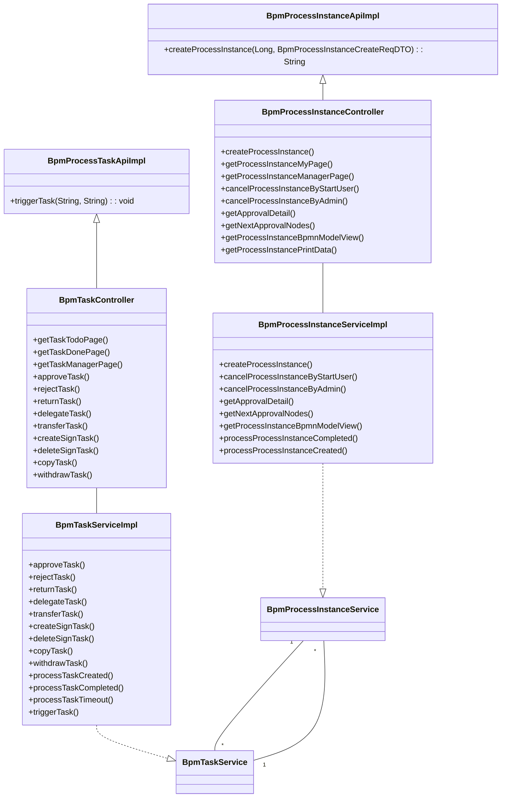
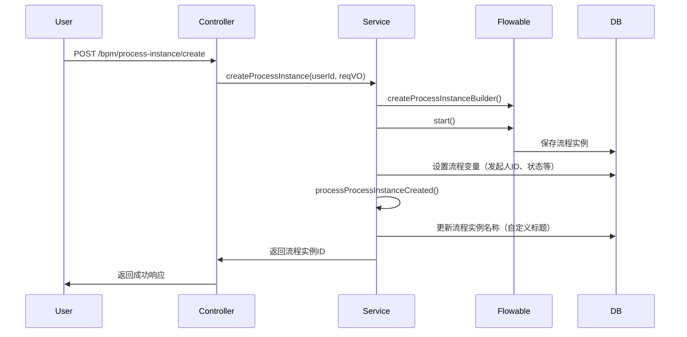
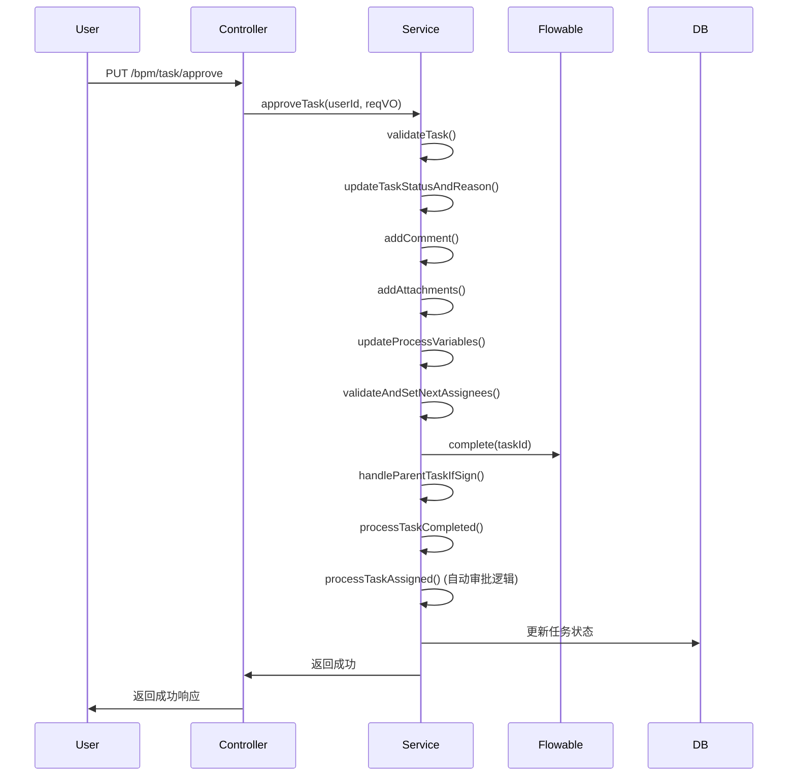
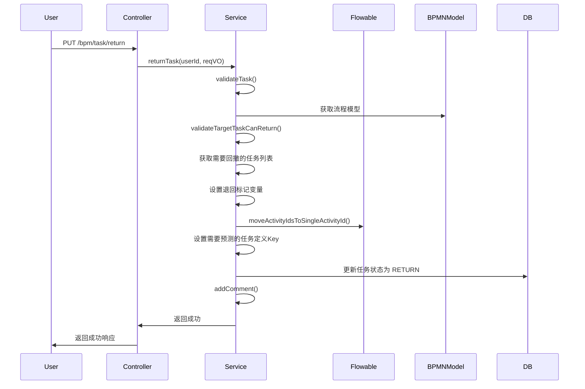

# 任务模块 (Task Module) 文档

## 1. 模块概述

任务模块是 BPM（业务流程管理）子系统的核心组件，主要负责**流程实例**和**流程任务**的全生命周期管理。该模块基于 Flowable 工作流引擎，提供了流程发起、审批、退回、委派、加签、抄送等完整的业务流程处理能力。

### 核心功能

- **流程实例管理**：创建、查询、取消、审批详情查看、BPMN 模型视图展示
- **流程任务管理**：待办/已办任务查询、任务审批、任务退回、任务委派、任务转派、任务加签/减签、任务抄送、任务撤回
- **API 服务层**：为外部系统提供标准化的 API 接口，支持微服务架构下的远程调用

## 2. 架构概览

任务模块采用经典的分层架构设计，各层职责清晰：

```
┌─────────────────────────────────────────────────────────┐
│                    API 层 (BpmProcessInstanceApi/BpmTaskApi)  │
│  ┌─────────────────────────────────────────────────────┐  │
│  │  面向外部调用的 API 接口，仅做参数校验和转发        │  │
│  └─────────────────────────────────────────────────────┘  │
└─────────────────────────────────────────────────────────┘
                    ↓
┌─────────────────────────────────────────────────────────┐
│                    Controller 层                         │
│  ┌─────────────────────────────────────────────────────┐  │
│  │  Web 请求处理，负责请求参数绑定、响应封装            │  │
│  │  (BpmProcessInstanceController, BpmTaskController)  │  │
│  └─────────────────────────────────────────────────────┘  │
└─────────────────────────────────────────────────────────┘
                    ↓
┌─────────────────────────────────────────────────────────┐
│                    Service 层                            │
│  ┌─────────────────────────────────────────────────────┐  │
│  │  核心业务逻辑处理，包含事务管理、事件监听等          │  │
│  │  (BpmProcessInstanceServiceImpl, BpmTaskServiceImpl)│  │
│  └─────────────────────────────────────────────────────┘  │
└─────────────────────────────────────────────────────────┘
                    ↓
┌─────────────────────────────────────────────────────────┐
│                    Flowable 引擎层                      │
│  ┌─────────────────────────────────────────────────────┐  │
│  │  RuntimeService, TaskService, HistoryService 等     │  │
│  │  Flowable 提供的原生工作流操作接口                  │  │
│  └─────────────────────────────────────────────────────┘  │
└─────────────────────────────────────────────────────────┘
```

### 组件关系图



## 3. 核心组件说明

### 3.1 API 层

API 层提供面向外部调用的标准化接口，主要用于微服务架构下的远程调用。

#### BpmProcessInstanceApiImpl

- **文件**: `yudao-module-bpm/src/main/java/cn/iocoder/yudao/module/bpm/api/task/BpmProcessInstanceApiImpl.java`
- **职责**: 流程实例 API 实现类，仅负责参数校验和转发，不处理业务逻辑
- **核心方法**:
  - `createProcessInstance(Long userId, BpmProcessInstanceCreateReqDTO reqDTO)`: 创建流程实例

#### BpmProcessTaskApiImpl

- **文件**: `yudao-module-bpm/src/main/java/cn/iocoder/yudao/module/bpm/api/task/BpmProcessTaskApiImpl.java`
- **职责**: 流程任务 API 实现类
- **核心方法**:
  - `triggerTask(String processInstanceId, String taskDefineKey)`: 触发流程任务执行（用于 ReceiveTask 节点）

### 3.2 Controller 层

Controller 层负责处理 Web 请求，将请求参数转换为业务对象，调用 Service 层处理业务，最后将结果封装为响应返回。

#### BpmProcessInstanceController

- **文件**: `yudao-module-bpm/src/main/java/cn/iocoder/yudao/module/bpm/controller/admin/task/BpmProcessInstanceController.java`
- **路径**: `/bpm/process-instance`
- **核心功能**:
  - 流程实例分页查询（我的流程、管理流程）
  - 流程实例详情获取
  - 流程实例取消（发起人取消、管理员取消）
  - 审批详情查看
  - 下一个审批节点预测
  - BPMN 模型视图展示
  - 打印数据获取

#### BpmTaskController

- **文件**: `yudao-module-bpm/src/main/java/cn/iocoder/yudao/module/bpm/controller/admin/task/BpmTaskController.java`
- **路径**: `/bpm/task`
- **核心功能**:
  - 待办/已办/全部任务分页查询
  - 按流程实例 ID 查询任务列表
  - 任务审批（approve、reject）
  - 任务退回（return）
  - 任务委派（delegate）
  - 任务转派（transfer）
  - 任务加签（createSign）
  - 任务减签（deleteSign）
  - 任务抄送（copy）
  - 任务撤回（withdraw）
  - 按父任务 ID 查询子任务列表

### 3.3 Service 层

Service 层是业务逻辑的核心所在，包含了复杂的工作流操作、事件处理、状态管理等。

#### BpmProcessInstanceServiceImpl

- **文件**: `yudao-module-bpm/src/main/java/cn/iocoder/yudao/module/bpm/service/task/BpmProcessInstanceServiceImpl.java`
- **核心职责**:
  - **流程实例创建**: 初始化流程实例，设置流程变量，生成流程 ID
  - **流程实例取消**: 支持发起人和管理员两种取消方式，处理子流程取消
  - **审批详情**: 拼接已完成的审批节点、进行中的审批节点、预测的未来节点
  - **BPMN 模型视图**: 可视化展示流程实例的执行进度
  - **事件处理**: 流程实例创建/完成时的后置通知、消息发送

关键方法说明：
- `createProcessInstance()`: 创建流程实例，支持自定义流程 ID 规则和流程名称模板
- `getApprovalDetail()`: 获取审批详情，包含已办、待办、预测节点信息
- `getNextApprovalNodes()`: 获取下一个可执行的审批节点
- `processProcessInstanceCompleted()`: 流程完成事件处理，更新状态、发送通知
- `processProcessInstanceCreated()`: 流程创建事件处理，设置自定义标题、前置通知

#### BpmTaskServiceImpl

- **文件**: `yudao-module-bpm/src/main/java/cn/iocoder/yudao/module/bpm/service/task/BpmTaskServiceImpl.java`
- **核心职责**:
  - **任务查询**: 待办、已办、全部任务的分页查询
  - **任务操作**: 审批、退回、委派、转派、加签、减签、抄送、撤回
  - **任务事件**: 任务创建、取消、分配、完成时的处理
  - **超时处理**: 任务超时自动审批/拒绝
  - **触发任务**: 触发 ReceiveTask 节点执行

关键方法说明：
- `approveTask()`: 审批任务，处理加签、委派等特殊情况
- `rejectTask()`: 拒绝任务，支持驳回到指定节点或结束流程
- `returnTask()`: 退回任务到指定节点，处理回退预测
- `delegateTask()`: 任务委派，将任务临时转交给他人
- `transferTask()`: 任务转派，永久转移审批责任
- `createSignTask()`: 加签任务，向前/向后加签
- `deleteSignTask()`: 减签任务，取消已加的签
- `triggerTask()`: 触发 ReceiveTask 节点，用于 HTTP 回调和延迟定时器

## 4. 核心业务流程

### 4.1 流程发起流程



### 4.2 任务审批流程



### 4.3 任务退回流程



## 5. 特殊功能说明

### 5.1 加签/减签功能

**加签**：在当前审批节点前或后增加额外的审批人，用于多人会签或补充审批。

- **向前加签**：当前审批人发起加签，子任务完成后，父任务继续审批
- **向后加签**：当前审批人发起加签，子任务完成后，父任务自动完成

**减签**：取消已加的签，回收子任务。

### 5.2 自动审批功能

当任务节点配置了自动审批策略时，系统会自动处理：
- **发起人自动跳过**：发起人与审批人一致时自动通过
- **部门负责人自动审批**：提交人自动转交给部门负责人
- **空审批人自动处理**：根据配置自动通过或拒绝

### 5.3 超时处理

任务可配置超时策略，支持：
- **自动提醒**：超时前发送提醒消息
- **自动通过**：超时后自动审批通过
- **自动拒绝**：超时后自动审批拒绝

### 5.4 预测节点功能

在审批详情页面，系统可以预测未来将要执行的节点，基于：
- 当前流程变量
- BPMN 模型结构
- 历史操作记录

## 6. 相关模块依赖

任务模块与多个模块存在依赖关系：

| 模块 | 依赖说明 |
|------|----------|
| **BPM 定义模块** | 获取流程定义、BPMN 模型、流程表达式等信息 |
| **表单模块** | 获取表单字段权限、表单配置 |
| **消息模块** | 发送审批通知、任务分配通知 |
| **用户模块** | 获取用户信息、部门信息 |
| **权限模块** | 权限校验、数据权限控制 |
| **评论模块** | 添加审批评论、操作日志 |
| **附件模块** | 任务附件管理 |

## 7. 数据模型

### 7.1 核心实体

- **ProcessInstance**: 流程实例，代表一次流程执行
- **Task**: 任务，流程中的待办节点
- **HistoricTaskInstance**: 历史任务实例，已完成的任务
- **HistoricProcessInstance**: 历史流程实例，已完成的流程
- **HistoricActivityInstance**: 历史活动实例，流程中的活动执行记录

### 7.2 状态枚举

**流程实例状态**:
- `NOT_START`: 未启动
- `RUNNING`: 运行中
- `APPROVE`: 审批通过
- `REJECT`: 审批拒绝
- `CANCEL`: 已取消

**任务状态**:
- `NOT_START`: 未开始
- `RUNNING`: 运行中
- `APPROVE`: 已审批
- `REJECT`: 已拒绝
- `RETURN`: 已退回
- `CANCEL`: 已取消
- `WAIT`: 等待（加签状态）
- `APPROVING`: 审批中（后加签状态）
- `SKIP`: 跳过

## 8. API 接口说明

### 8.1 流程实例 API (BpmProcessInstanceApi)

| 方法 | 描述 | 参数 | 返回值 |
|------|------|------|--------|
| `createProcessInstance` | 创建流程实例 | userId, reqDTO | 流程实例 ID |

### 8.2 流程任务 API (BpmProcessTaskApi)

| 方法 | 描述 | 参数 | 返回值 |
|------|------|------|--------|
| `triggerTask` | 触发流程任务执行 | processInstanceId, taskDefineKey | void |

### 8.3 Controller 接口

#### BpmProcessInstanceController

| HTTP 方法 | 路径 | 描述 |
|-----------|------|------|
| GET | `/bpm/process-instance/my-page` | 我的流程分页 |
| GET | `/bpm/process-instance/manager-page` | 管理流程分页 |
| POST | `/bpm/process-instance/create` | 创建流程实例 |
| GET | `/bpm/process-instance/get` | 获取流程实例详情 |
| DELETE | `/bpm/process-instance/cancel-by-start-user` | 发起人取消流程 |
| DELETE | `/bpm/process-instance/cancel-by-admin` | 管理员取消流程 |
| GET | `/bpm/process-instance/get-approval-detail` | 获取审批详情 |
| GET | `/bpm/process-instance/get-next-approval-nodes` | 获取下一个审批节点 |
| GET | `/bpm/process-instance/get-bpmn-model-view` | 获取 BPMN 模型视图 |
| GET | `/bpm/process-instance/get-print-data` | 获取打印数据 |

#### BpmTaskController

| HTTP 方法 | 路径 | 描述 |
|-----------|------|------|
| GET | `/bpm/task/todo-page` | 待办任务分页 |
| GET | `/bpm/task/done-page` | 已办任务分页 |
| GET | `/bpm/task/manager-page` | 全部任务分页 |
| GET | `/bpm/task/list-by-process-instance-id` | 按流程实例 ID 查询任务 |
| PUT | `/bpm/task/approve` | 审批任务 |
| PUT | `/bpm/task/reject` | 拒绝任务 |
| GET | `/bpm/task/list-by-return` | 获取可退回节点 |
| PUT | `/bpm/task/return` | 退回任务 |
| PUT | `/bpm/task/delegate` | 委派任务 |
| PUT | `/bpm/task/transfer` | 转派任务 |
| PUT | `/bpm/task/create-sign` | 加签任务 |
| DELETE | `/bpm/task/delete-sign` | 减签任务 |
| PUT | `/bpm/task/copy` | 抄送任务 |
| PUT | `/bpm/task/withdraw` | 撤回任务 |
| GET | `/bpm/task/list-by-parent-task-id` | 按父任务 ID 查询子任务 |

## 9. 总结

任务模块是 BPM 系统的核心，提供了完整的工作流处理能力。通过清晰的架构设计和丰富的功能模块，支持了从流程发起、任务审批到流程结束的完整业务闭环。模块内部通过 Service 层封装了复杂的业务逻辑，通过 API 层提供了标准化的外部接口，通过 Controller 层处理 Web 请求，形成了良好的分层架构。
