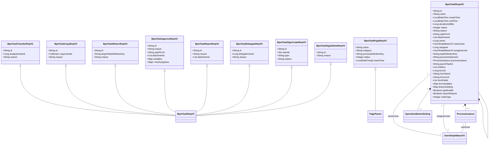
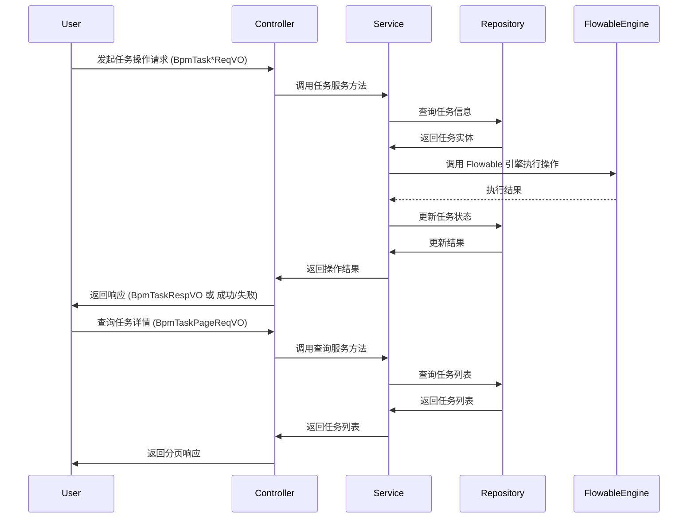

# Task3 模块文档 - BPM 任务管理 VO

## 1. 模块概述

Task3 模块是 BPM（业务流程管理）系统中的任务管理核心模块，主要负责处理流程任务的各种操作请求和响应数据对象（VO）。该模块提供了完整的任务操作接口，包括任务转办、抄送、退回、通过、拒绝、加签、减签、委派等操作，以及任务的分页查询和任务详情展示。

## 2. 架构设计

### 2.1 模块定位

```
┌─────────────────────────────────────────────────────────────┐
│                      BPM 模块                               │
│  ┌─────────────────────────────────────────────────────┐   │
│  │                   Task 管理模块 (task3)             │   │
│  │  ┌─────────────────────────────────────────────┐   │   │
│  │  │  任务操作请求 VO (Request VO)              │   │   │
│  │  │  - BpmTaskTransferReqVO (转办)            │   │   │
│  │  │  - BpmTaskCopyReqVO (抄送)              │   │   │
│  │  │  - BpmTaskReturnReqVO (退回)            │   │   │
│  │  │  - BpmTaskApproveReqVO (通过)           │   │   │
│  │  │  - BpmTaskRejectReqVO (拒绝)            │   │   │
│  │  │  - BpmTaskDelegateReqVO (委派)          │   │   │
│  │  │  - BpmTaskSignCreateReqVO (加签)        │   │   │
│  │  │  - BpmTaskSignDeleteReqVO (减签)        │   │   │
│  │  │  - BpmTaskPageReqVO (分页查询)          │   │   │
│  │  └─────────────────────────────────────────────┘   │   │
│  │  ┌─────────────────────────────────────────────┐   │   │
│  │  │  任务响应 VO (Response VO)                 │   │   │
│  │  │  - BpmTaskRespVO (任务详情)               │   │   │
│  │  └─────────────────────────────────────────────┘   │   │
│  └─────────────────────────────────────────────────────┘   │
└─────────────────────────────────────────────────────────────┘
```

### 2.2 组件关系图



## 3. API 说明

### 3.1 任务操作请求 VO

#### 3.1.1 BpmTaskTransferReqVO - 任务转办请求

**描述**：用于将当前任务转交给其他用户处理。

| 字段 | 类型 | 必填 | 描述 | 示例 |
|------|------|------|------|------|
| id | String | 是 | 任务编号 | "1024" |
| assigneeUserId | Long | 是 | 新审批人的用户编号 | 2048 |
| reason | String | 是 | 转办原因 | "做不了决定，需要你先帮忙瞅瞅" |

#### 3.1.2 BpmTaskCopyReqVO - 任务抄送请求

**描述**：用于将任务抄送给其他用户，不影响当前任务的审批流程。

| 字段 | 类型 | 必填 | 描述 | 示例 |
|------|------|------|------|------|
| id | String | 是 | 任务编号 | "1024" |
| copyUserIds | Collection<Long> | 是 | 抄送的用户编号数组 | [1, 2] |
| reason | String | 否 | 抄送意见 | "帮忙看看！" |

#### 3.1.3 BpmTaskReturnReqVO - 任务退回请求

**描述**：用于将任务退回到指定节点。

| 字段 | 类型 | 必填 | 描述 | 示例 |
|------|------|------|------|------|
| id | String | 是 | 任务编号 | "1024" |
| targetTaskDefinitionKey | String | 是 | 退回到的任务 Key | "1" |
| reason | String | 是 | 退回意见 | "我就是想驳回" |

#### 3.1.4 BpmTaskApproveReqVO - 任务通过请求

**描述**：用于审批通过当前任务，支持动态表单变量和下一个节点审批人设置。

| 字段 | 类型 | 必填 | 描述 | 示例 |
|------|------|------|------|------|
| id | String | 是 | 任务编号 | "1024" |
| reason | String | 否 | 审批意见 | "不错不错！" |
| signPicUrl | String | 否 | 签名图片 URL | "https://www.iocoder.cn/sign.png" |
| attachments | List<String> | 否 | 附件列表 | ["https://test.yudao.iocoder.cn/20260609/test.txt"] |
| variables | Map<String, Object> | 是 | 变量实例（动态表单） | {} |
| nextAssignees | Map<String, List<Long>> | 否 | 下一个节点审批人 | {"nodeId": [1, 2]} |

#### 3.1.5 BpmTaskRejectReqVO - 任务拒绝请求

**描述**：用于拒绝当前任务。

| 字段 | 类型 | 必填 | 描述 | 示例 |
|------|------|------|------|------|
| id | String | 是 | 任务编号 | "1024" |
| reason | String | 是 | 审批意见 | "不错不错！" |
| attachments | List<String> | 否 | 附件列表 | ["https://test.yudao.iocoder.cn/20260609/test.txt"] |

#### 3.1.6 BpmTaskDelegateReqVO - 任务委派请求

**描述**：用于将当前任务委派给其他用户处理。

| 字段 | 类型 | 必填 | 描述 | 示例 |
|------|------|------|------|------|
| id | String | 是 | 任务编号 | "1024" |
| delegateUserId | Long | 是 | 被委派人 ID | 1 |
| reason | String | 是 | 委派原因 | "做不了决定，需要你先帮忙瞅瞅" |

#### 3.1.7 BpmTaskSignCreateReqVO - 任务加签请求

**描述**：用于为当前任务添加额外的审批人（加签）。

| 字段 | 类型 | 必填 | 描述 | 示例 |
|------|------|------|------|------|
| id | String | 是 | 需要加签的任务编号 | "1" |
| userIds | Set<Long> | 是 | 加签的用户编号 | 888 |
| type | String | 是 | 加签类型（before/after） | "before" |
| reason | String | 是 | 加签原因 | "需要加签" |

#### 3.1.8 BpmTaskSignDeleteReqVO - 任务减签请求

**描述**：用于删除之前添加的加签任务（减签）。

| 字段 | 类型 | 必填 | 描述 | 示例 |
|------|------|------|------|------|
| id | String | 是 | 被减签的任务编号 | "1" |
| reason | String | 是 | 加签原因 | "需要减签" |

#### 3.1.9 BpmTaskPageReqVO - 任务分页查询请求

**描述**：用于查询任务列表，支持分页和多种筛选条件。

| 字段 | 类型 | 必填 | 描述 | 示例 |
|------|------|------|------|------|
| name | String | 否 | 流程任务名 | "芋道" |
| category | String | 否 | 流程分类 | "1" |
| processDefinitionKey | String | 否 | 流程定义的标识（精准匹配） | "2048" |
| status | Integer | 否 | 审批状态（仅【已办】使用） | 1 |
| createTime | LocalDateTime[] | 否 | 创建时间范围 | [2024-01-01, 2024-12-31] |

### 3.2 任务响应 VO

#### 3.2.1 BpmTaskRespVO - 任务详情响应

**描述**：返回任务的完整详细信息，包含任务基本信息、关联的流程实例、表单信息、操作按钮设置等。

**嵌套结构**：

1. **ProcessInstance** - 流程实例信息
   - id: 流程实例编号
   - name: 流程实例名称
   - createTime: 提交时间
   - processDefinitionId: 流程定义的编号
   - summary: 流程摘要（只有流程表单才有）
   - startUser: 发起人的用户信息

2. **OperationButtonSetting** - 操作按钮设置
   - displayName: 显示名称
   - enable: 是否启用

**主字段说明**：

| 字段 | 类型 | 描述 | 示例 |
|------|------|------|------|
| id | String | 任务编号 | "1024" |
| name | String | 任务名字 | "芋道" |
| createTime | LocalDateTime | 创建时间 | 2024-01-01 10:00:00 |
| endTime | LocalDateTime | 结束时间 | 2024-01-01 11:00:00 |
| durationInMillis | Long | 持续时间（毫秒） | 1000 |
| status | Integer | 任务状态（参见 BpmTaskStatusEnum） | 2 |
| reason | String | 审批理由 | "不错不错！" |
| signPicUrl | String | 签名图片 URL | "https://www.iocoder.cn/sign.png" |
| attachments | List<String> | 附件列表 | ["https://test.yudao.iocoder.cn/20260609/test.txt"] |
| owner | Long | 任务负责人编号（不返回） | 2048 |
| ownerUser | UserSimpleBaseVO | 负责人的用户信息 | {} |
| assignee | Long | 任务分配人编号（不返回） | 2048 |
| assigneeUser | UserSimpleBaseVO | 审核的用户信息 | {} |
| taskDefinitionKey | String | 任务定义的标识 | "Activity_one" |
| processInstanceId | String | 所属流程实例编号 | "8888" |
| processInstance | ProcessInstance | 所属流程实例 | {} |
| parentTaskId | String | 父任务编号 | "1024" |
| children | List<BpmTaskRespVO> | 子任务列表（由加签生成） | [] |
| formId | Long | 表单编号 | 1024 |
| formName | String | 表单名字 | "请假表单" |
| formConf | String | 表单的配置，JSON 字符串 | "{}" |
| formFields | List<String> | 表单项的数组 | ["name", "reason"] |
| formVariables | Map<String, Object> | 提交的表单值 | {} |
| buttonsSetting | Map<Integer, OperationButtonSetting> | 操作按钮设置值 | {} |
| signEnable | Boolean | 是否需要签名 | false |
| reasonRequire | Boolean | 是否填写审批意见 | false |
| nodeType | Integer | 节点类型（参见 BpmSimpleModelNodeTypeEnum） | 10 |

## 4. 数据流图



## 5. 模块依赖关系

Task3 模块依赖于以下核心模块：

| 依赖模块 | 依赖组件 | 用途 |
|----------|----------|------|
| BPM 核心模块 | BpmTaskServiceImpl | 任务业务逻辑处理 |
| BPM 核心模块 | BpmTaskEventListener | 任务事件监听 |
| 系统模块 | UserSimpleBaseVO | 用户信息展示 |
| 系统模块 | BpmTaskStatusEnum | 任务状态枚举 |
| 系统模块 | BpmSimpleModelNodeTypeEnum | 节点类型枚举 |
| Flowable 引擎 | TaskEntity | 任务实体数据 |

## 6. 使用示例

### 6.1 任务通过示例

```json
{
  "id": "1024",
  "reason": "审批通过",
  "signPicUrl": "https://example.com/sign.png",
  "attachments": ["https://example.com/file1.pdf"],
  "variables": {
    "amount": 10000,
    "currency": "CNY"
  },
  "nextAssignees": {
    "parallelGateway1": [1001, 1002]
  }
}
```

### 6.2 任务转办示例

```json
{
  "id": "1024",
  "assigneeUserId": 2048,
  "reason": "业务繁忙，转交处理"
}
```

### 6.3 任务加签示例

```json
{
  "id": "1024",
  "userIdSet": [1005, 1006],
  "type": "before",
  "reason": "需要技术部门审核"
}
```

### 6.4 任务查询示例

```json
{
  "name": "请假审批",
  "category": "HR",
  "processDefinitionKey": "leave-process",
  "status": 1,
  "createTime": ["2024-01-01 00:00:00", "2024-01-31 23:59:59"],
  "currentPage": 1,
  "pageSize": 10
}
```

## 7. 注意事项

1. **任务状态**：BpmTaskRespVO 中的 status 字段需要参考 BpmTaskStatusEnum 枚举值。
2. **节点类型**：nodeType 字段需要参考 BpmSimpleModelNodeTypeEnum 枚举值。
3. **动态表单**：BpmTaskApproveReqVO 中的 variables 字段用于处理动态表单数据。
4. **并行网关**：nextAssignees 字段支持为并行网关后的不同节点指定不同的审批人。
5. **加签/减签**：加签会生成子任务，子任务完成后主任务才能继续；减签是删除已添加的加签任务。
6. **权限控制**：所有任务操作都需要进行权限验证，确保用户有权限操作该任务。

## 8. 相关文档

- [BPM 模块核心文档](bpm-core.md)
- [Flowable 引擎集成文档](flowable-integration.md)
- [系统用户模块文档](system-user.md)
- [表单配置文档](form-configuration.md)
