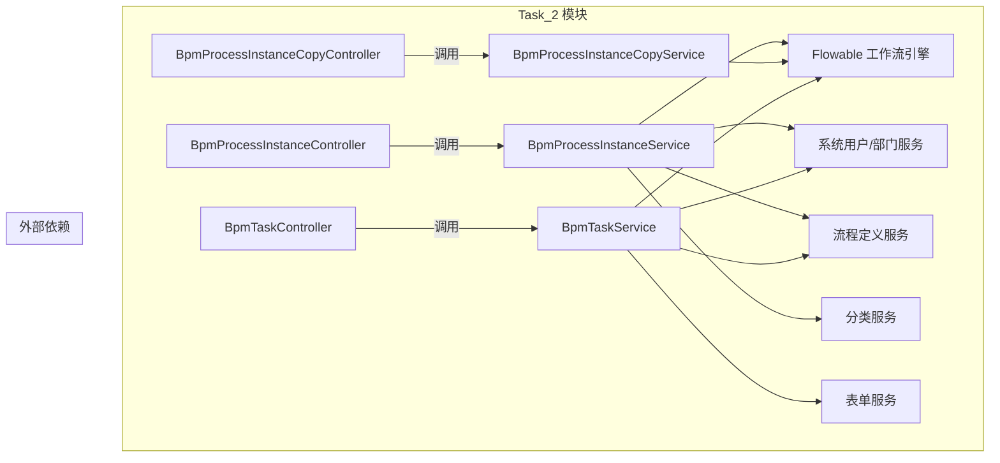

# Task_2 模块文档（流程实例与任务管理）

## 1. 模块概述

**Task_2** 是 BPM（业务流程管理）模块中的核心子模块，主要负责**流程实例（Process Instance）**和**流程任务（Task）**的管理功能。该模块提供了对 Flowable 工作流引擎的封装，支持用户发起、跟踪、审批和管理业务流程。

### 主要功能
- **流程实例管理**：创建、查询、取消、查看审批详情、获取 BPMN 模型视图等
- **任务管理**：待办/已办任务列表、任务审批、拒绝、退回、委派、转派、加签、减签、抄送、撤回等
- **流程实例抄送**：为流程实例添加抄送人，便于相关人员了解流程进度

### 模块定位
Task_2 模块位于 BPM 模块的控制层（controller），直接对外提供 RESTful API，供前端页面调用。它依赖于 BPM 模块的服务层（service）、数据访问层（dao）以及系统模块的用户、部门等基础服务。

---

## 2. 架构概览

---

## 3. 子模块文档

本模块包含两个主要子功能，详见以下详细文档：

- **[流程实例管理](task_2_process_instance.md)**：涵盖流程实例的创建、查询、取消、审批详情等操作
- **[流程任务管理](task_2_task.md)**：涵盖任务的待办/已办列表、审批、退回、委派、转派、加签、减签等操作

---

## 4. 组件说明

### 4.1 控制器（Controllers）

| 类名 | 路径 | 职责 |
|------|------|------|
| `BpmProcessInstanceController` | `/bpm/process-instance/*` | 流程实例的核心操作接口，包括我的实例、管理实例、创建、取消、审批详情、BPMN 视图等 |
| `BpmProcessInstanceCopyController` | `/bpm/process-instance/copy/*` | 流程实例抄送相关操作，如查询抄送列表 |
| `BpmTaskController` | `/bpm/task/*` | 流程任务的操作接口，包括待办/已办/全部任务列表，以及审批、拒绝、退回、委派、转派、加签、减签、抄送、撤回等 |

### 4.2 请求/响应对象（VO/DTO）

各控制器使用了一系列的 VO（View Object）来封装请求参数和响应数据，例如：

- **流程实例相关**：`BpmProcessInstancePageReqVO`, `BpmProcessInstanceCreateReqVO`, `BpmProcessInstanceCancelReqVO`, `BpmApprovalDetailReqVO`, `BpmProcessInstanceCopyPageReqVO` 等
- **任务相关**：`BpmTaskPageReqVO`, `BpmTaskApproveReqVO`, `BpmTaskRejectReqVO`, `BpmTaskReturnReqVO`, `BpmTaskDelegateReqVO`, `BpmTaskTransferReqVO`, `BpmTaskSignCreateReqVO`, `BpmTaskSignDeleteReqVO`, `BpmTaskCopyReqVO` 等

这些 VO 定义了前端向后端传递的数据结构，以及后端返回给前端的格式。

### 4.3 转换器（Converters）

模块中使用了转换器将内部数据对象（DO/VO）转换为前端展示的 VO，例如：
- `BpmProcessInstanceConvert.INSTANCE`：用于构建流程实例的响应对象
- `BpmTaskConvert.INSTANCE`：用于构建任务响应对象

### 4.4 服务层（Services）

控制器调用服务层业务逻辑：
- `BpmProcessInstanceService`：处理流程实例相关的业务逻辑
- `BpmProcessInstanceCopyService`：处理流程实例抄送的逻辑
- `BpmTaskService`：处理任务相关的业务逻辑

服务层又进一步调用 Flowable 引擎 API 以及与数据库交互。

---

## 5. 与其他模块的集成

Task_2 模块与以下模块紧密协作：

- **系统模块（system）**：通过 `AdminUserApi` 和 `DeptApi` 获取用户和部门信息，用于权限控制和数据显示。
- **流程定义模块（definition）**：通过 `BpmProcessDefinitionService` 获取流程定义信息，用于展示流程结构和变量。
- **表单模块（form）**：通过 `BpmFormService` 获取表单配置，用于在任务页面渲染表单。
- **缓存模块（redis）**：部分数据可能通过 Redis 缓存提升性能（具体实现见 `RedisKeyConstants`）。

---

## 6. 安全控制

所有接口均通过 Spring Security 的 `@PreAuthorize` 注解进行权限校验，例如：
- `@ss.hasPermission('bpm:process-instance:query')`：查询流程实例权限
- `@ss.hasPermission('bpm:process-instance:cancel')`：取消流程实例权限
- `@ss.hasPermission('bpm:task:update')`：更新任务（审批、退回等）权限

权限字符串由系统模块的权限中心统一管理。

---

## 7. 使用示例

### 7.1 获取我的流程实例分页

**请求**：`GET /bpm/process-instance/my-page`  
**参数**：`BpmProcessInstancePageReqVO`（包含分页信息等）  
**响应**：`CommonResult<PageResult<BpmProcessInstanceRespVO>>`

### 7.2 审批任务

**请求**：`PUT /bpm/task/approve`  
**参数**：`BpmTaskApproveReqVO`（taskId, 可选的变量等）  
**响应**：`CommonResult<Boolean>`

---

## 8. 后续扩展

- 可考虑增加流程实例的导出功能
- 可增加任务的重分配、抢单等高级功能
- 可与消息通知模块集成，在任务状态变更时发送通知

---

*注：本文档仅概括 Task_2 模块的整体架构和功能细节，具体每个子类的实现细节请参考对应的子模块文档。*
